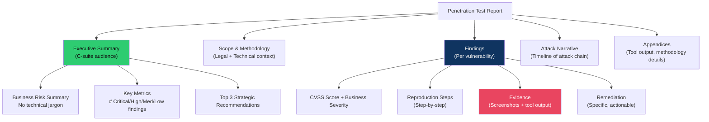

# 📝 Pentest Report Writing

> [!abstract] TL;DR
> A professional penetration testing report is the primary deliverable — a poorly written report undermines excellent technical work. Reports follow PTES (Penetration Testing Execution Standard) or OWASP Testing Guide structure and include: executive summary (business risk language, no technical jargon), methodology section, findings with CVSS scores + business severity + reproduction steps + proof (screenshots/output) + remediation guidance, and attack narrative. Every finding must be reproducible. Retest attestation confirms remediation. CVSS base + environmental scores drive business severity ratings. Reports exist in two audiences: C-suite (executive summary only) and technical staff (full report).

---

## Intuition — Analogy First

A penetration test report is like a building inspection report for a bank. The bank's CEO needs to know: "There are three critical structural flaws that could collapse the building, costing $50M and harming customers" (executive summary). The building engineer needs: "The east wall's load-bearing column at grid C-4 has a 3mm crack at the 2nd floor slab connection; failure mode: shear under seismic load 7.0+; immediate fix: carbon fibre wrap + steel plate" (technical finding).

The inspector who files a report saying "we found some cracks" has wasted everyone's time. The report must give decision-makers the information to prioritise repairs (business impact + likelihood), give engineers the information to fix the problem (technical details + reproduction), and create a legal record of the assessment (scope, methodology, timeline, authorisation).

---

## How It Works



---

## Key Concepts / Details

### Pre-Engagement Requirements

Every engagement must begin with written documents:

**Scope Document (Statement of Work / RoE)**:
```
Authorised Target Systems:
  - IP ranges: 203.0.113.0/24, 198.51.100.50-100
  - Domains: target.com, *.api.target.com
  - Cloud: AWS account 123456789012 (us-east-1 only)

Exclusions:
  - Production payment processing servers (PCI scope, explicit exclusion)
  - Third-party SaaS integrations

Test Window:
  - Business hours only: Monday-Friday 09:00-17:00 EST
  - Emergency contact: CISO John Smith +1-555-0100

Authorised Techniques:
  - Network scanning, web application testing, social engineering (phishing only)
  - Excluded: Physical access testing, DDoS

Authorised Tester:
  - [Company Name], [Specific testers by name]
```

### Report Structure

```
1. Cover Page
   - Client name, report classification (CONFIDENTIAL), date, engagement ID

2. Executive Summary (1-2 pages)
   - Overall risk posture assessment (Critical/High/Medium/Low rating)
   - Key findings in business language
   - Top 3 strategic recommendations
   - Metrics: X critical, Y high, Z medium, W low, V informational findings

3. Scope and Methodology
   - Systems tested, dates, test approach (black/grey/white box)
   - Tools used (Metasploit, Burp Suite, Nmap, etc.)
   - Methodology framework (PTES, OWASP Testing Guide, NIST SP800-115)

4. Findings (one section per vulnerability)
   - Finding title and risk rating
   - CVSS base score + vector string
   - Business impact description
   - Technical description
   - Proof of concept (reproduction steps)
   - Evidence (screenshots, command output with timestamps)
   - Remediation recommendation (specific, not vague)
   - References (CVE, CWE, OWASP link)

5. Attack Narrative
   - Timeline of the engagement from attacker's perspective
   - How findings chain together (attack kill chain)

6. Appendices
   - Full tool output
   - Network diagrams
   - Methodology detail
```

### Finding Template

```markdown
## Finding: SQL Injection in User Search Endpoint

**Risk Rating**: Critical
**CVSS Score**: 9.8 (AV:N/AC:L/PR:N/UI:N/S:U/C:H/I:H/A:H)
**CVSS Environmental**: 8.5 (adjusted: no network segmentation, public-facing)
**CWE**: CWE-89 (SQL Injection)
**ATT&CK**: T1190 (Exploit Public-Facing Application)

**Business Impact**:
An unauthenticated remote attacker can extract all user records from the
customer database, including 45,000 email addresses, bcrypt-hashed passwords,
and 12,000 shipping addresses. This creates regulatory exposure under GDPR
(Art. 33 notification requirement) and CCPA, with potential fines of up to 4%
of annual turnover (~$2.4M based on public filings).

**Technical Description**:
The `/api/v1/users/search` endpoint concatenates the `q` parameter directly
into a SQL query without parameterisation. This allows boolean-based blind
SQL injection and, with higher privileges, UNION-based data extraction.

**Proof of Concept** (tested 2026-07-15 14:23 UTC, verified on staging):
1. Navigate to: https://api.target.com/v1/users/search?q=test
2. Modify the `q` parameter:
   `q=test' AND 1=1-- -` → normal results (true condition)
   `q=test' AND 1=2-- -` → empty results (false condition)
3. Extract admin password hash:
   `q=test' UNION SELECT username,password,3 FROM admin_users-- -`

[Screenshot: Burp Suite request/response showing admin hash extraction]
[Tool output: sqlmap --dump output showing 45,000 user records]

**Remediation**:
1. **Immediate (24h)**: Disable the `/api/v1/users/search` endpoint or add IP allowlisting
2. **Short-term (7 days)**: Replace string concatenation with parameterised queries:
   ```python
   # BAD:
   cursor.execute(f"SELECT * FROM users WHERE name LIKE '%{q}%'")
   # GOOD:
   cursor.execute("SELECT * FROM users WHERE name LIKE %s", (f'%{q}%',))
   ```
3. **Long-term (30 days)**: Security code review of all database-interacting endpoints;
   implement static analysis (Semgrep, CodeQL) in CI/CD pipeline

**References**:
- OWASP SQL Injection: https://owasp.org/www-community/attacks/SQL_Injection
- CWE-89: https://cwe.mitre.org/data/definitions/89.html
```

### CVSS Scoring for Business Severity

CVSS base score alone is insufficient — use environmental score and add business severity rating:

| Risk Level | CVSS Range | Business Criteria | Remediation SLA |
|-----------|-----------|-------------------|----------------|
| **Critical** | 9.0–10.0 | Data breach, system compromise, regulatory fine | 24–48 hours |
| **High** | 7.0–8.9 | Significant data exposure, privilege escalation | 7–14 days |
| **Medium** | 4.0–6.9 | Limited exposure, requires additional conditions | 30–90 days |
| **Low** | 0.1–3.9 | Minimal impact, defence-in-depth improvement | 180 days |
| **Informational** | N/A | Best practice gap, no direct exploitability | As prioritised |

Business severity adjustments (from base CVSS):
- Internet-facing vs. internal-only: +1-2 severity levels for internet-facing
- Contains PII/PCI data: +1 severity level
- No compensating controls: +0.5
- Compensating controls in place: -0.5 to -1

### Executive Summary Language Guide

| Technical Term | Executive Translation |
|---------------|----------------------|
| SQL injection in API endpoint | Attacker can read all customer records without authentication |
| Cross-site scripting | Attacker can steal customer session credentials from any page |
| Outdated TLS (TLS 1.0/1.1) | Customer connections can be eavesdropped by attackers on the same network |
| Default credentials on admin panel | Any attacker who finds the admin URL can log in with "admin/admin" |
| SSRF via metadata API | Attacker can steal cloud credentials, enabling access to all cloud resources |
| No MFA on VPN | Stolen employee password alone grants full network access |

### Retest and Attestation

After remediation, the client requests a retest:

```markdown
## Retest Attestation

Finding: SQL Injection in User Search Endpoint
Original Discovery: 2026-07-15
Retest Date: 2026-08-02
Retest Tester: [Name]

Remediation Verified: YES

Retest Methodology:
1. Repeated the original PoC: q=test' AND 1=1-- - → returned error (parameterised query)
2. Ran sqlmap with identical parameters: no injection detected (TIME OUT response)
3. Code review of fix confirmed: psycopg2 parameterised queries now used

Status: REMEDIATED - Closed
```

---

## Real-World Notes

- The average pentest report delivery timeline is 5–7 business days after engagement end; urgent critical findings should be communicated verbally/via secure channel within 24 hours of discovery
- Dradis Community and PlexTrac are the leading pentest reporting platforms; Dradis integrates with Burp Suite, Nessus, and Metasploit for automated finding import
- A common client feedback complaint: "findings are too technical, we don't know what to fix first." Solve with: numbered priority list in executive summary + explicit severity ratings on every finding
- PTES (Penetration Testing Execution Standard) defines 7 phases: Pre-engagement → Intelligence Gathering → Threat Modelling → Vulnerability Analysis → Exploitation → Post-Exploitation → Reporting

---

## Common Pitfalls

1. **Vague remediation** — "Sanitise user input" is not actionable; "replace `cursor.execute(f'SELECT...'` with parameterized queries using psycopg2's `%s` placeholder" is actionable
2. **Missing business impact** — "SQL injection exists" without "attacker can extract 45,000 customer records, triggering GDPR Article 33 notification" lacks the context decision-makers need
3. **No proof / unreproducible findings** — Every finding must include timestamped evidence; a finding that cannot be reproduced by the client's team is worthless
4. **Burying critical findings** — Critical findings must be communicated immediately, not held until report delivery; verbal notification with secure written follow-up within 24 hours

---

## Related Concepts

- [[Risk_Management_and_GRC|← Risk & GRC]] — CVSS scoring, business risk language
- [[Exploitation_Techniques|← Exploitation]] — technical findings come from exploitation
- [[Threat_Modeling|← Threat Modeling]] — STRIDE/PASTA findings link to pentest findings
- [[_MOC_Penetration_Testing|↑ Penetration Testing MOC]]

---

## Review Questions

1. Write an executive-level paragraph for a finding where an unauthenticated attacker accessed the S3 bucket containing all customer invoices (50,000 files, 12 months of data) via SSRF. No technical jargon.
2. A critical SQL injection is discovered on the last day of a 2-week engagement. Describe your immediate notification process, the timeline for verbal → written communication, and what you include in the interim notification vs. the final report.
3. The client's developer argues that your SQL injection finding is "not exploitable in production because there's a WAF." How do you respond, and what additional evidence do you provide in the report?

---

## Sources

- PTES Standard: http://www.pentest-standard.org/
- OWASP Testing Guide v4.2: https://owasp.org/www-project-web-security-testing-guide/
- NIST SP800-115 (Technical Guide to Security Testing): https://csrc.nist.gov/publications/detail/sp/800/115/final

#Cybersecurity #PenetrationTesting #Reporting #PTES #CVSS #ExecutiveSummary
