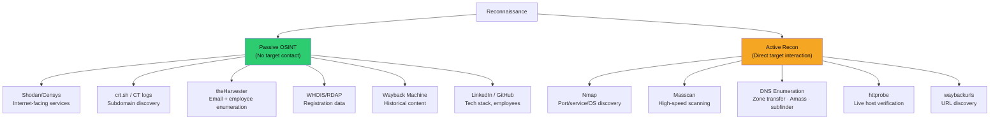

# 🔭 Reconnaissance and OSINT

> [!abstract] TL;DR
> Reconnaissance is the systematic process of gathering information about a target before active exploitation. Passive OSINT uses publicly available sources without touching target infrastructure: Shodan/Censys for exposed services, crt.sh for subdomain discovery via CT logs, LinkedIn/theHarvester for employee enumeration, WHOIS/RDAP for registration data, Wayback Machine for historical content. Active recon touches the target: Nmap for host/port/OS/service discovery, Masscan for high-speed full-internet scanning, DNS zone transfer attempts, subdomain brute-forcing with amass/subfinder, httprobe for live host verification. Everything maps to ATT&CK TA0001 (Initial Access precursor) and TA0007 (Discovery).

---

## Intuition — Analogy First

Reconnaissance is the burglar's walkthrough before the break-in: noting which houses have security cameras, which windows don't close properly, when residents leave, and which neighbours are distracted. The less obvious you are during recon, the harder it is for the target to detect and prepare a response. Passive OSINT is the equivalent of using public records, Google Street View, and social media — you never approach the house. Active recon is approaching the perimeter and listening for alarm systems — detectable if the target is monitoring.

The professional pentester always exhausts passive sources first, not because active recon is illegal (within scope it isn't) but because passive recon often reveals as much as active recon without triggering IDS alerts that tip off the blue team before the engagement demonstrates maximum value.

---

## How It Works



---

## Key Concepts / Details

### Passive OSINT Techniques

**Shodan — Internet-Facing Service Discovery**:
```bash
# Shodan CLI
shodan search "org:\"Target Corp\"" --fields ip_str,port,transport,product,version
shodan search "ssl.cert.subject.cn:*.target.com"
shodan search "http.title:\"Target Admin Panel\""
shodan search "net:203.0.113.0/24" --fields ip_str,port,product

# Shodan host information
shodan host 203.0.113.1

# Find specific vulnerability exposure
shodan search "vuln:CVE-2021-44228" "org:Target Corp"
```

**crt.sh — Certificate Transparency Log Mining**:
```bash
# Query all certificates issued for target domain
curl -s "https://crt.sh/?q=%.target.com&output=json" | \
  jq -r '.[].name_value' | sort -u | grep -v '*'

# Results reveal subdomains: dev.target.com, api-staging.target.com, etc.
```

**theHarvester — Email and Subdomain Enumeration**:
```bash
# Use multiple sources
theHarvester -d target.com -b google,bing,linkedin,dnsdumpster,otx -l 500

# Output: emails (j.smith@target.com), subdomains, IPs
```

**LinkedIn/GitHub Dorking**:
```
# Google dork: LinkedIn employees
site:linkedin.com "Target Corp" "Senior DevOps" "AWS" "Terraform"
→ Reveals tech stack from job titles and skills

# GitHub search: leaked credentials
org:TargetCorp api_key OR password OR secret
→ Often reveals hardcoded credentials, internal endpoints

# GitHub: find employee usernames then search their repos
search: "target.com" in:code → finds internal domains in public code
```

**Wayback Machine for Historical Content**:
```bash
# Find old URLs with sensitive parameters
waybackurls target.com | grep -E "admin|api|token|password|config"

# Find backup files
waybackurls target.com | grep -E "\.bak|\.sql|\.zip|\.env"
```

### Active Reconnaissance

**Nmap — Comprehensive Port and Service Scanning**:
```bash
# Host discovery (ping sweep)
nmap -sn 203.0.113.0/24 -oG hosts_up.txt

# Quick port scan (top 1000 ports)
nmap -F -sV 203.0.113.0/24 --open -oA quick_scan

# Full port scan with service/version detection
nmap -p- -sV -sC --open -T4 203.0.113.1 -oA full_scan

# OS detection + script scan + version
nmap -A -T4 --open 203.0.113.1

# Specific NSE scripts
nmap --script=http-title,http-methods,ssl-cert 203.0.113.0/24 -p 80,443,8080

# Firewall evasion: fragmentation
nmap -f -D decoy1,decoy2 target.com

# Nmap output formats: -oN (normal), -oG (greppable), -oX (XML), -oA (all)
```

Nmap scan phases: 1) Host discovery (ICMP/ARP), 2) Port scanning (SYN scan default), 3) Service/version detection (-sV), 4) OS detection (-O), 5) Script scan (-sC or --script).

**Masscan — High-Speed Full-Port Scanning**:
```bash
# Scan entire internet (requires root, very loud)
masscan -p0-65535 0.0.0.0/0 --rate 10000 -oL output.txt

# Target-specific fast scan
masscan -p80,443,8080,8443,22,3389 203.0.113.0/24 --rate 5000
```

Masscan at 25 million packets/second can scan all 65,535 ports across 256 IPs in seconds.

**DNS Enumeration**:
```bash
# Zone transfer attempt (AXFR)
dig @ns1.target.com target.com AXFR
# If successful: reveals ALL DNS records in zone

# Subdomain brute-forcing with amass
amass enum -active -d target.com -brute -w /usr/share/wordlists/dns.txt -o amass_out.txt

# Passive subdomain discovery
amass enum -passive -d target.com -o passive_subs.txt
subfinder -d target.com -all -o subfinder_out.txt

# Combine and deduplicate
cat amass_out.txt subfinder_out.txt | sort -u > all_subs.txt

# Verify which subdomains are live (HTTP probing)
cat all_subs.txt | httprobe | tee live_subs.txt

# Screenshot live hosts
cat live_subs.txt | gowitness scan --scan-range-start 1 --output-path screenshots/
```

**Recon-ng — Modular OSINT Framework**:
```bash
recon-ng
[recon-ng] > workspaces create target_corp
[recon-ng][target_corp] > modules load recon/domains-hosts/brute_hosts
[recon-ng][target_corp] > options set SOURCE target.com
[recon-ng][target_corp] > run
[recon-ng][target_corp] > modules load recon/hosts-hosts/resolve
[recon-ng][target_corp] > run
# Modules: WHOIS, Shodan, Hunter.io, HaveIBeenPwned, LinkedIn scraping
```

### Correlating OSINT Findings

Building a target profile:

```
Target: TargetCorp (Fortune 500)

Infrastructure:
  - 15 exposed services on Shodan: 3×RDP, 5×SSH, 2×Elasticsearch (unauthenticated!), 5×HTTPS
  - Subdomains: dev.target.com (login page), api-v1.target.com (API), legacy.target.com (IIS 6.0!)
  - IP ranges: 203.0.113.0/24 (primary), 198.51.100.0/24 (cloud bursting)

Personnel:
  - 45 employees on LinkedIn: 12 engineers (React, Node.js, AWS)
  - IT Director: j.smith@target.com (from theHarvester)
  - GitHub: @jsmith-tc has repo with dev.target.com/.env.sample showing REDIS_URL, DB_HOST

Technology Stack:
  - Frontend: React (from LinkedIn job postings)
  - Backend: Node.js + MongoDB (from error messages in Wayback Machine)
  - Cloud: AWS (from IP ranges and DNS CNAME to *.amazonaws.com)
  - CI/CD: GitHub Actions (from public repos)

Priority Targets:
  1. Unauthenticated Elasticsearch (critical - data exposure)
  2. IIS 6.0 on legacy.target.com (EOL, multiple unpatched CVEs)
  3. Dev subdomain login page (potentially weaker auth)
```

---

## Real-World Notes

- Shodan.io "Exposure Stats" for any company's ASN often reveals more than a quarter of all internet-facing assets that IT teams are unaware of
- LinkedIn employee enumeration + theHarvester email format detection allows creation of targeted spear-phishing lists before the engagement officially begins
- DNS zone transfers (AXFR) are still misconfigured on ~15% of nameservers tested in enterprise environments (per bug bounty statistics)
- GitHub secret scanning: the `gitleaks` tool scans all commits for API keys, passwords, and private keys — even deleted commits are recoverable from git history

---

## Common Pitfalls

1. **Jumping to active recon without passive OSINT** — Passive OSINT often reveals more than active scanning and leaves no trace in target logs
2. **Missing cloud-hosted assets** — ASN-based IP range discovery misses cloud IPs; use reverse DNS, CT logs, and Shodan for cloud asset discovery
3. **Not documenting every finding during recon** — Recon data is the foundation of the entire engagement; re-doing it mid-engagement wastes time and leaves evidence
4. **Forgetting scope validation** — Every subdomain discovered must be validated against the signed scope document before active testing

---

## Related Concepts

- [[Attack_Surface_Analysis|← Attack Surface Analysis]] — same tools, defensive perspective
- [[Exploitation_Techniques|→ Exploitation]] — recon findings drive exploitation targets
- [[DNS_Security|← DNS Security]] — zone transfer vulnerability context
- [[_MOC_Penetration_Testing|↑ Penetration Testing MOC]]

---

## Review Questions

1. A Shodan search for your target reveals `org:TargetCorp` returns an Elasticsearch instance at port 9200 returning JSON with no authentication. Before exploiting, what three passive OSINT steps do you take to understand the context, and what do you note in your findings?
2. Your DNS zone transfer attempt against `ns1.target.com` fails (REFUSED). List four alternative methods to enumerate the same subdomains, ordered by increasing noise/detectability.
3. GitHub OSINT reveals a developer's public repo contains `git log --oneline` showing a commit message "remove accidental API key." The file has been deleted. Explain how to recover the secret and why git history deletion is insufficient.

---

## Sources

- Shodan Filters Reference: https://www.shodan.io/search/filters
- Amass User Guide: https://github.com/owasp-amass/amass/blob/master/doc/user_guide.md
- Recon-ng Wiki: https://github.com/lanmaster53/recon-ng/wiki

#Cybersecurity #PenetrationTesting #Recon #OSINT #Nmap #Shodan #amass
