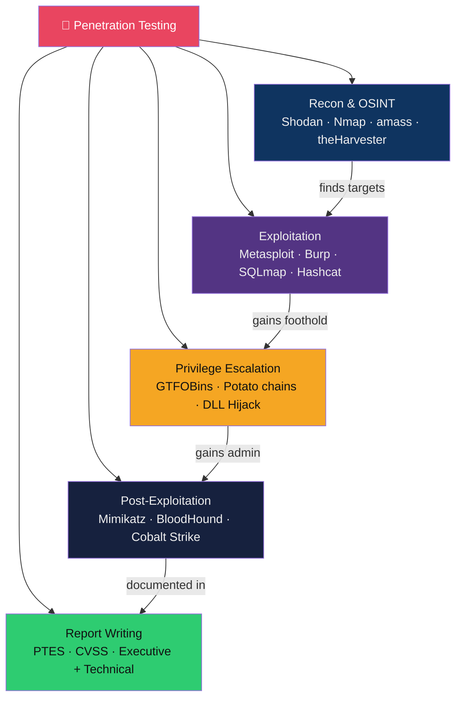

# 🔴 Penetration Testing — Map of Content

> [!abstract] Section Overview
> Penetration testing is the authorised, adversary-simulated assessment of a system's defences. This section follows the attack lifecycle: passive/active reconnaissance and OSINT, exploitation via Metasploit/Burp/SQLmap, privilege escalation on Linux/Windows using GTFOBins/potato chains/DLL hijacking, post-exploitation for persistence and lateral movement via PsExec/Pass-the-Hash/Cobalt Strike, and professional report writing meeting PTES/CVSS standards. All techniques map to MITRE ATT&CK.

---

## Concept Map

---

## Notes in This Section

| Note | Phase | Key Tools | ATT&CK Tactics | Difficulty |
|------|-------|-----------|---------------|------------|
| [[Reconnaissance_and_OSINT]] | Recon | Shodan, Nmap, amass, subfinder | TA0001, TA0007 | Intermediate |
| [[Exploitation_Techniques]] | Exploitation | Metasploit, Burp Suite, sqlmap, XSStrike | TA0002, TA0001 | Intermediate–Advanced |
| [[Privilege_Escalation]] | PrivEsc | GTFOBins, linpeas, winpeas, Potato chains | TA0004 | Advanced |
| [[Post_Exploitation_and_Lateral_Movement]] | Post-Ex | Mimikatz, BloodHound, Cobalt Strike, PsExec | TA0006, TA0008, TA0003 | Advanced |
| [[Pentest_Report_Writing]] | Reporting | CVSS, PTES, Dradis, PlexTrac | — | Intermediate |

---

## Learning Path

1. [[Reconnaissance_and_OSINT]] — find targets without making noise
2. [[Exploitation_Techniques]] — gain initial access
3. [[Privilege_Escalation]] — go from user to root/SYSTEM
4. [[Post_Exploitation_and_Lateral_Movement]] — persist and move laterally
5. [[Pentest_Report_Writing]] — document and deliver findings professionally

---

## Legal and Ethical Context

> [!warning] Legal Requirement
> ALL penetration testing requires written authorisation (Rules of Engagement / Statement of Work) before any scanning or exploitation. Unauthorised testing is illegal under the Computer Fraud and Abuse Act (CFAA), UK Computer Misuse Act, and equivalent laws worldwide. Always verify scope in writing.

---

## Key Questions

1. Why does passive OSINT always precede active scanning in professional engagements?
2. What makes a Metasploit staged payload (e.g., `windows/meterpreter/reverse_tcp`) different from a stageless payload, and when is each preferred?
3. Explain the CanonicalNameCookie escape: why does `sudo -l` finding a `NOPASSWD: /usr/bin/python3` entry lead to root access?
4. How does BloodHound use graph theory to find privilege escalation paths in Active Directory?
5. What distinguishes a CVSS 8.5 High from a critical finding in an executive summary?

---

## Related Sections

- [[01_Security_Foundations/_MOC_Security_Foundations|← Security Foundations]] — ATT&CK, threat modeling used in pentest methodology
- [[03_Web_Security/_MOC_Web_Security|← Web Security]] — web application exploitation targets
- [[06_Digital_Forensics_IR/_MOC_DFIR|→ DFIR]] — blue team's response to pentest-simulated attacks (Purple Team)
- [[_MOC_Cybersecurity_Master|↑ Master MOC]]

#Cybersecurity #PenetrationTesting #RedTeam #MOC
