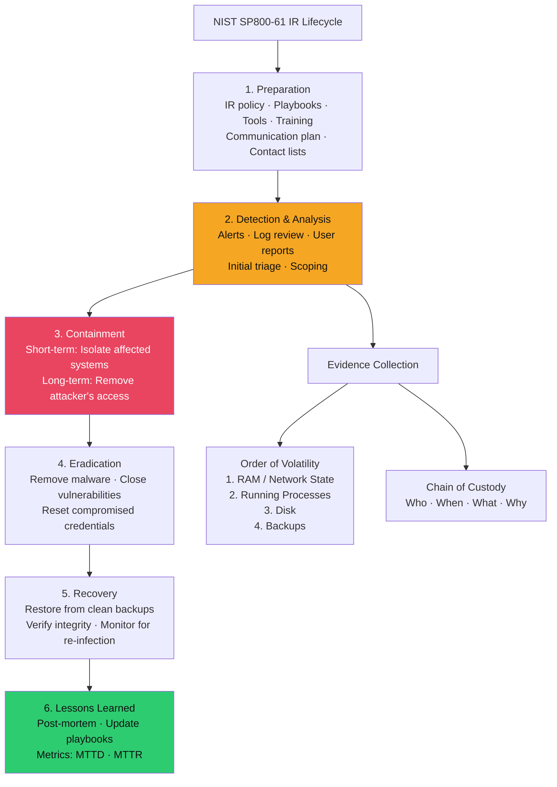

# 🔬 DFIR Methodology

> [!abstract] TL;DR
> Digital Forensics and Incident Response follows the NIST SP800-61 lifecycle: Preparation → Detection & Analysis → Containment → Eradication → Recovery → Post-Incident Activity. Chain of custody documents every person who handles evidence and every action taken. Order of volatility dictates acquisition sequence: RAM/network state first (seconds to minutes), then running processes, then disk — volatile evidence is lost on reboot. Write blockers (hardware or software) prevent modification of disk images. FTK Imager creates forensic-grade disk images; KAPE and Velociraptor enable triage collection at scale. Triage (targeted collection of high-value artefacts) is used when full acquisition is impractical (cloud, SaaS, 10TB drives).

---

## Intuition — Analogy First

Forensic investigation is like a crime scene — the evidence is fragile and must be handled precisely. A crime scene investigator doesn't pick up the gun with their hands (contaminates evidence, no chain of custody). They photograph it in place, collect it with gloves, seal it in an evidence bag, label it with case number and time, sign it, and log every subsequent person who handles it. This is chain of custody: the ability to prove in court that the evidence was not tampered with from collection to presentation.

The order of volatility is the investigator's triage principle: RAM (the open documents on the desk) disappears the moment the computer is powered off. Disk (the filing cabinet) persists through power cycles. Always collect the most perishable evidence first. An investigator who powers off a compromised server to "stop the attack" has destroyed the most valuable evidence — what processes were running, what network connections existed, what malware was in memory.

---

## How It Works



---

## Key Concepts / Details

### NIST SP800-61 Phase Details

**Phase 1 — Preparation** (ongoing, before any incident):
- Incident Response Plan (IRP) with stakeholder roles and escalation paths
- Contact lists (legal, PR, law enforcement, IR retainer firm)
- Pre-approved emergency authorisations (isolate a server without management approval delay)
- Tool kit ready: jump bag with forensic laptop, write blockers, evidence bags, bootable USB
- Table-top exercises quarterly: simulate ransomware, BEC, insider threat scenarios

**Phase 2 — Detection & Analysis**:
Initial triage questions:
1. What systems are affected? (scope)
2. When did the incident start? (timeline)
3. What is the threat actor doing right now? (active vs. contained)
4. What data is at risk? (impact assessment)
5. Is it still ongoing? (active intrusion vs. historical investigation)

Severity classification:
| Severity | Definition | Response |
|----------|-----------|----------|
| P1 Critical | Active exfiltration, ransomware spreading, CEO fraud | Immediate 24/7 response |
| P2 High | Confirmed breach, data at risk, C2 detected | < 4 hour response |
| P3 Medium | Malware contained, no exfiltration evidence | Business hours response |
| P4 Low | Suspicious indicator, no confirmed compromise | 24–48 hour investigation |

**Phase 3 — Containment**:
- **Short-term**: Isolate affected system (network isolation, not power-off) to stop spread while preserving evidence
- **Long-term**: Remove attacker's persistent access (close C2 channels, remove persistence mechanisms, reset compromised credentials)
- **Evidence preservation**: before ANY remediation action, acquire forensic image

**Phase 6 — Lessons Learned / Post-Mortem**:
- Timeline reconstruction: T₀ (initial access) → Tₙ (detection) → Tₙ₊₁ (containment)
- MTTD (Mean Time to Detect): target < 24 hours; industry average 207 days (IBM X-Force 2023)
- MTTR (Mean Time to Respond/Recover): from detection to business recovery
- Root cause analysis: what vulnerability/control failure enabled the incident?
- Control improvements: what detection/prevention gaps to close?

### Chain of Custody

Every piece of digital evidence must have documented chain of custody:

```
Evidence Item: Laptop (Asset #LT-2847)
Case Number: IR-2026-0742
Collected By: J. Smith (Incident Responder)
Collection Date/Time: 2026-07-26 14:35 UTC
Location of Collection: Finance Dept, Floor 3, Desk 12

Evidence Handling Log:
│ Date/Time        │ Transferred From │ Transferred To  │ Purpose            │
│ 2026-07-26 14:35 │ Crime scene      │ J. Smith        │ Collection         │
│ 2026-07-26 15:20 │ J. Smith         │ Evidence locker │ Secure storage     │
│ 2026-07-26 18:00 │ Evidence locker  │ K. Jones (Lab)  │ Forensic analysis  │
│ 2026-07-27 09:00 │ K. Jones         │ Evidence locker │ Post-analysis      │
```

Storage: tamper-evident evidence bags, hash the disk image (SHA-256) immediately after acquisition and record the hash.

### Order of Volatility

RFC 3227 (Guidelines for Evidence Collection and Archiving) defines the order:

| Level | Evidence Type | Volatility | Collection Method |
|-------|-------------|-----------|------------------|
| 1 | CPU registers, cache, RAM | Seconds–minutes | Live memory acquisition |
| 2 | Network connections, routing state | Minutes | `netstat -anob`, pcap |
| 3 | Running processes | Minutes | `tasklist`, `ps aux` |
| 4 | Open file handles | Minutes | Process-based enumeration |
| 5 | Disk (filesystem, swap) | Hours–days | FTK Imager, `dd` |
| 6 | Remote logging, SIEM data | Days | Query SIEM before log rotation |
| 7 | Backups | Weeks | Preserve relevant backup snapshots |

**Never reboot** before memory acquisition: rebooting destroys RAM content (running processes, encryption keys, attacker tools, unwritten malware) and may delete temporary artefacts.

### Forensic Acquisition Tools

**FTK Imager (AccessData)** — Disk Image Acquisition:
```bash
# FTK Imager CLI
ftkimager --mode acquire --source "\\.\PhysicalDrive0" \
  --e01 --outfile /external/case-001/disk.E01 \
  --verify --casenum "IR-2026-0742" --examiner "J.Smith"

# Output: disk.E01 (forensic image), disk.E01.txt (hash verification)
# SHA-256 hash in .txt file = evidence of image integrity
```

**KAPE (Kroll Artifact Parser and Extractor)** — Targeted Triage Collection:
```powershell
# Collect key forensic artefacts (much faster than full disk image)
kape.exe --tsource C: --tdest D:\Triage\ --target !BasicCollection
# Collects: Event Logs, Registry hives, Prefetch, browser history,
#            $MFT, LNK files, Jump Lists, Amcache, ShimCache

# Add specific targets
kape.exe --tsource C: --tdest D:\Triage\ --target EvidenceOfExecution,BrowserHistory
```

**Velociraptor** — Distributed IR at Scale:
```yaml
# Velociraptor VQL query: collect running processes across 1000 endpoints
SELECT Pid, Ppid, Name, CommandLine, Exe, Username
FROM pslist()
ORDER BY Pid

# Hunt for specific IOC across all systems
SELECT Hostname, Pid, CommandLine
FROM hunt(artifact='Windows.System.Pslist')
WHERE CommandLine =~ 'mimikatz|sekurlsa|lsadump'
```

**WinPmem / LiME** — Memory Acquisition:
```bash
# Windows: WinPmem
winpmem_mini_x64_rc2.exe memory.raw

# Linux: LiME (Loadable Kernel Module)
sudo insmod lime-$(uname -r).ko "path=/external/memory.lime format=lime"

# Verify RAM image with Volatility
vol.py -f memory.raw imageinfo  # Identifies OS and profile
```

---

## Real-World Notes

- The Colonial Pipeline ransomware (2021) responders made a critical error early on: they shut down systems before forensic imaging, destroying evidence of the initial intrusion vector (later determined to be an exposed VPN account with no MFA)
- MTTD average: IBM X-Force reports 207 days average attacker dwell time (2023); companies with MDR/EDR solutions average 27 days — a 7.5× improvement
- Velociraptor VQL (Velociraptor Query Language) enables hunting across 10,000+ endpoints simultaneously — essential for enterprise-scale IR
- EU GDPR Article 33 requires breach notification within 72 hours of awareness; chain of custody documentation is often required for regulatory investigations

---

## Common Pitfalls

1. **Rebooting before memory acquisition** — Destroys ephemeral evidence; always acquire RAM first, even if the system appears clean
2. **Full disk image when triage suffices** — A 10TB storage server takes 30+ hours to image; KAPE triage collection of key artefacts takes 15 minutes and provides 80% of investigative value
3. **No chain of custody** — Evidence without provenance is inadmissible in legal proceedings and undermines internal investigations
4. **Isolating before scoping** — Premature network isolation of one infected system may alert the attacker; coordinate containment after understanding full scope

---

## Related Concepts

- [[Memory_Forensics|→ Memory Forensics]] — RAM acquisition and Volatility analysis
- [[Log_Analysis_and_SIEM|→ Log Analysis & SIEM]] — detection phase of NIST IR
- [[IR_Playbooks|→ IR Playbooks]] — scenario-specific NIST IR application
- [[_MOC_DFIR|↑ DFIR MOC]]

---

## Review Questions

1. A workstation is observed making outbound connections to a known malicious IP. You're called in at 23:00. List the first five actions in order, including the forensic rationale for each (specifically: when to and not to reboot, what to collect first).
2. Your organisation stores data in AWS S3, with no on-premises servers. Describe the order of volatility for a cloud-native incident — what evidence is most volatile, what tools collect it, and what's lost if you only act 24 hours after detection?
3. Chain of custody documentation is described as "bureaucratic overhead" by a time-pressured IR manager. Explain two scenarios where inadequate chain of custody directly harmed an organisation's incident response outcome.

---

## Sources

- NIST SP800-61 Rev 2: https://csrc.nist.gov/publications/detail/sp/800/61/rev-2/final
- KAPE Documentation: https://ericzimmerman.github.io/#!index.md
- Velociraptor Documentation: https://docs.velociraptor.app/

#Cybersecurity #DFIR #IncidentResponse #NIST #ChainOfCustody #ForensicAcquisition
