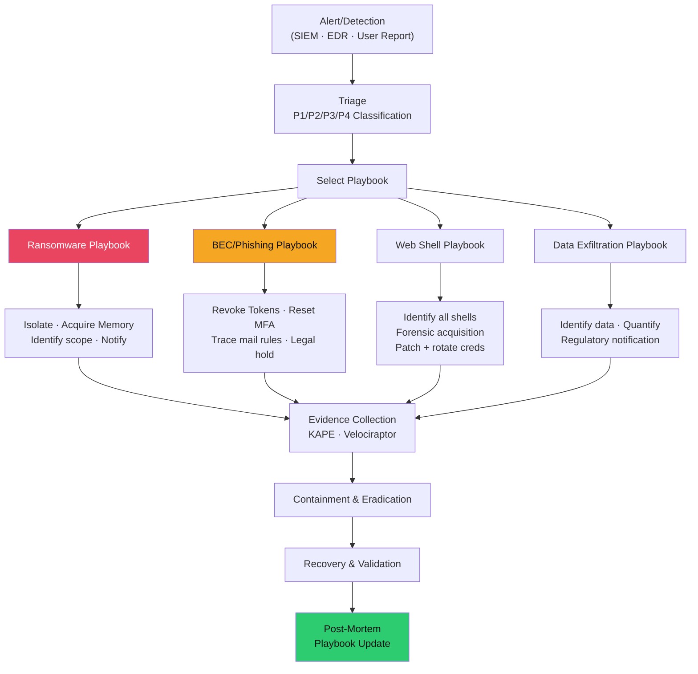

# 📋 Incident Response Playbooks

> [!abstract] TL;DR
> IR playbooks are pre-approved, step-by-step response procedures for specific incident scenarios. They eliminate decision fatigue and ensure consistent, legally defensible responses under pressure. Key scenarios: ransomware (DO NOT reboot → isolate network → acquire memory → identify patient zero → determine exfiltration → restore from clean backup), business email compromise/BEC (revoke OAuth tokens → reset MFA → trace mail rules → preserve evidence), and web shell (identify all shells → rotate credentials → forensic acquisition before removal → patch). Tabletop exercises validate playbooks quarterly. KAPE/Velociraptor enable evidence collection at scale. TheHive manages case tracking. Purple Team (red+blue joint exercises) builds playbook realism.

---

## Intuition — Analogy First

An IR playbook is a fire evacuation plan: you write it when calm so you don't have to think when the building is on fire. During a ransomware incident at 3 AM, with executives calling every 5 minutes and critical systems offline, the playbook is the difference between a coherent, effective response and a chaotic series of decisions that may make the situation worse (like rebooting encrypted servers, destroying forensic evidence, or tipping off the attacker).

The tabletop exercise is the fire drill: you walk through the playbook with all stakeholders, without actual incident pressure, to find the gaps. Who approves network isolation during business hours? Who authorises paying a ransom? What's the escalation path when the CISO is unreachable? These questions must be answered before an incident, not during.

---

## How It Works



---

## Key Concepts / Details

### Playbook 1: Ransomware Response

**Trigger**: Multiple systems encrypted, ransom note found, `vssadmin` commands in SIEM, or EDR alert for mass file encryption.

```
PHASE 1: IMMEDIATE (0-30 minutes)
□ DO NOT REBOOT affected systems (memory evidence, encryption key may be in RAM)
□ DO NOT PAY RANSOM yet (legal/OFAC compliance check required first)
□ Notify: IR lead, CISO, Legal counsel, PR/Communications
□ Activate IR war room (dedicated communication channel)
□ Identify scope: how many systems are affected?
  - Run SIEM query: mass file modification + .locked/.encrypted extension
  - Check network segmentation: can spread be stopped?

PHASE 2: CONTAINMENT (30 min - 2 hours)
□ Network isolate affected systems (pull network cable / VLAN change, NOT power off)
□ Disable compromised accounts (reset all credentials)
□ Block known C2 IOCs at firewall/DNS (if ransomware family identified)
□ Snapshot affected VMs (if cloud) for evidence preservation
□ Prevent lateral spread: revoke admin credentials, disable SMB/WMI laterally

PHASE 3: EVIDENCE ACQUISITION
□ Acquire RAM from each affected system (winpmem) BEFORE any cleanup
□ KAPE collection from all affected systems (Event Logs, Registry, Prefetch)
□ Network captures if C2 still active
□ Preserve original ransom note files and encrypted samples
□ Hash all collected evidence (SHA-256)

PHASE 4: INVESTIGATION
□ Identify Patient Zero: earliest infection (Event 4688 process creation timeline)
□ Initial access vector: phishing? RDP? VPN? (check Event 4624 logon type 10 before T0)
□ Lateral movement path: PsExec/WMI/PTH evidence (Events 7045, 4624 type 3)
□ Data exfiltration: was data exfiltrated before encryption? (network logs, proxy logs)
□ Ransomware family identification (ID Ransomware, Cuckoo analysis)

PHASE 5: ERADICATION & RECOVERY
□ Identify all persistence mechanisms (scheduled tasks, services, registry keys)
□ Remove all malware components
□ Patch the exploited vulnerability
□ Restore from last known-good backup (verify backup integrity first)
□ Validate restored systems before reconnecting to network
□ Monitor for 72 hours post-recovery for re-infection

PHASE 6: DECISION POINT - RANSOM
□ If no viable backup: legal/compliance review (OFAC sanctions check on threat actor)
□ Estimate recovery cost vs. ransom amount vs. business interruption
□ Law enforcement notification (FBI IC3, CISA) before payment
□ If paying: negotiate, use crypto exchanges with compliance tracking
□ Payment does NOT guarantee decryption; ~30% of payers do not recover all data
```

### Playbook 2: Business Email Compromise (BEC)

**Trigger**: Finance reports fraudulent wire transfer request, user reports account "sending emails I didn't send," or SIEM alert on inbox rule creation + external forwarding.

```
PHASE 1: IMMEDIATE CONTAINMENT
□ Revoke all OAuth tokens and active sessions (Azure AD: "Revoke all refresh tokens")
□ Reset MFA device registration (attacker may have registered their own MFA device)
□ Reset account password (complex, not predictable from previous)
□ Block suspicious mail forwarding rules (check via PowerShell / Exchange admin)
□ Preserve evidence: do NOT delete malicious inbox rules until documented

PowerShell: Check for malicious inbox rules
Get-InboxRule -Mailbox "compromised@company.com" | 
  Where-Object {$_.ForwardTo -ne $null -or $_.RedirectTo -ne $null} |
  Select-Object Name, ForwardTo, RedirectTo, DeleteMessage

PHASE 2: INVESTIGATION SCOPE
□ Identify timeline: when was account first accessed by attacker?
  - AzureAD Sign-In logs: filter by IP, location anomaly, new device
  - O365 Unified Audit Log: MailboxLogin events from suspicious IPs
□ Identify what the attacker accessed:
  - MailItemsAccessed (E5 licence): exact emails viewed
  - FileAccessed (SharePoint audit): documents accessed
□ Identify what was sent: OutboundEmails from attacker's session
□ Check for additional compromised accounts (lateral phishing from compromised account)
□ Check for OAuth app consent grants (attacker may have granted persistent access)
  Get-AzureADServicePrincipal | Where-Object {$_.Tags -contains "ConsentType=AllPrincipals"}

PHASE 3: BUSINESS IMPACT
□ Was a wire transfer executed? Contact bank within 24 hours (FBI Financial Fraud Kill Chain)
□ Was PII/confidential data accessed? (GDPR/state breach notification requirements)
□ Were internal communications exposed? (strategic business risk)

PHASE 4: RECOVERY
□ Validate MFA is working on account
□ Enable conditional access: block legacy authentication, require compliant device
□ Review all OAuth app permissions granted to compromised account
□ Security awareness training for affected users
```

### Playbook 3: Web Shell Discovery

**Trigger**: WAF alert on unusual POST to web path, AV detects web shell file, SOC alert on web server spawning cmd.exe/powershell.exe.

```
PHASE 1: IDENTIFICATION
□ Identify web shell location (Web server logs + file system scan)
  find /var/www -name "*.php" -newer /var/www/html/index.php -exec strings {} \;
  # Look for: eval(, system(, exec(, passthru(, base64_decode

□ Check for additional web shells (attacker often drops multiple)
  grep -r "eval\|system\|passthru\|shell_exec" /var/www/ --include="*.php"
  
□ YARA scan for web shell patterns
  yara -r webshells.yar /var/www/

PHASE 2: FORENSIC ACQUISITION (BEFORE REMOVAL)
□ Acquire web server process memory
□ Copy ALL web shell files (with timestamps) to evidence storage
□ Export web server access logs (identify attacker IPs, commands issued)
  cat /var/log/apache2/access.log | grep "shell.php" | awk '{print $1, $4, $7, $9}' | sort

□ Extract commands executed via web shell
  grep "POST.*shell\.php" /var/log/apache2/access.log  # Basic check
  # Web shell log analysis: commands often in POST body (requires full request logging)

PHASE 3: SCOPE DETERMINATION
□ When was the web shell uploaded? (file creation timestamp, web server log)
□ How was it uploaded? (exploit, misconfigured upload, compromised admin account)
□ What commands were executed? (web server logs, audit logs, process creation events)
□ Did the attacker establish additional persistence? (cron jobs, SSH keys added)
□ Was data exfiltrated? (outbound connections from web server)

PHASE 4: ERADICATION
□ Remove all web shells (AFTER forensic acquisition)
□ Rotate ALL credentials that were accessible from the web server
  (DB passwords, API keys, service account passwords)
□ Patch the initial access vulnerability (file upload, RCE, deserialization)
□ Harden web server: disable PHP execution in upload directories, WAF rules
□ Deploy file integrity monitoring (FIM) on web root
```

### Tabletop Exercises

Quarterly tabletop exercises validate playbooks:

```
Exercise Format: 2-3 hour structured discussion
Participants: CISO, Legal, PR/Comms, IT, Finance, Business Units
Facilitator: Security team or external IR firm

Scenario Injection (example: ransomware tabletop):
T+0:  "You receive an alert: 50 endpoints are encrypting files. It's Friday 4:45 PM."
T+30: "Your CFO calls: the payroll system is affected, payroll runs Monday."
T+60: "The attacker posts on a dark web forum: 'We have 100GB of [company] data.'"
T+90: "A journalist calls asking for comment on the alleged breach."

Discussion Questions:
1. Who has authority to isolate production systems? Is this documented?
2. Who approves communication to customers/media? What's the approval chain?
3. What's the ransom payment decision matrix? Who decides?
4. Which backup systems are air-gapped? How long is recovery?
5. What GDPR/state law notification requirements are triggered?

Output: Updated playbooks, identified gaps, documented authority matrix
```

### TheHive — Incident Case Management

TheHive is an open-source SIEM-integrated case management platform:

```yaml
# TheHive alert template (from SIEM to TheHive via webhook)
Alert:
  title: "Ransomware - Mass file encryption detected"
  description: "EDR alert: 50+ files encrypted in 60 seconds on WORKSTATION-42"
  severity: "Critical"
  tags: ["ransomware", "T1486"]
  
Case:
  title: "IR-2026-0742: Ransomware Incident"
  tasks:
    - name: "Initial triage"
      assignee: "ir_analyst_1"
    - name: "Containment"
      assignee: "ir_team_lead"
    - name: "Evidence acquisition"
      assignee: "forensics_analyst"
    - name: "Legal notification"
      assignee: "legal_counsel"
  observables:
    - type: "hash"
      data: "e3b0c44298fc1c149..."
    - type: "ip"
      data: "198.51.100.233"
    - type: "domain"
      data: "c2.badactor.com"
```

### Purple Team — Red + Blue Joint Exercises

Purple Team combines offensive (red) and defensive (blue) teams working together:

```
Traditional Red Team: Red operates covertly, blue detects what they can.
Purple Team: Red executes specific ATT&CK techniques; blue validates detection.

Purple Team Exercise Flow:
1. Pre-execution: Blue identifies which detections should fire
2. Execution: Red executes T1059.001 (PowerShell)
3. Detection validation: Did the SIEM alert? In what time?
4. If no detection: Blue team tunes rules to detect
5. Documentation: Detection coverage matrix updated

Atomic Red Team (Red Canary):
- 1,000+ atomic tests, one per ATT&CK technique
- Execute: Invoke-AtomicTest T1059.001 -ExecutionPhase Warmup,Execute,Cleanup
- Validate: Did SIEM generate alert? What event IDs?

Output: ATT&CK Navigator heat map showing validated detection coverage
```

---

## Real-World Notes

- Colonial Pipeline (2021) paid $4.4M ransom; DOJ recovered $2.3M by seizing attacker's Bitcoin wallet (FBI had private key from C2 server seizure)
- Average ransomware downtime: 21 days (Coveware 2023); organisations with tested IR playbooks average 8 days
- BEC total losses (2022): $2.7B (FBI IC3 report) — #1 cybercrime by financial loss; most incidents involve no malware, just email account compromise + social engineering
- CISA and FBI recommend NOT paying ransomware ransoms: it funds criminal operations and 80% of organisations that pay are hit again within 1 year (Cybereason 2022)

---

## Common Pitfalls

1. **Rebooting encrypted systems** — Destroys encryption keys in RAM; some ransomware uses asymmetric encryption where the private key is in memory — reboot = permanent data loss
2. **Removing web shells before acquisition** — Destroys evidence of what commands the attacker ran; forensic acquisition is mandatory before any cleanup
3. **No pre-approval for containment actions** — During a live incident, getting approval to isolate a production server takes hours without pre-authorisation; get sign-off in advance via playbook
4. **Skipping tabletop exercises** — Playbooks that have never been tested fail at the worst moment; executives who haven't practised their roles freeze under pressure

---

## Related Concepts

- [[DFIR_Methodology|← DFIR Methodology]] — NIST IR lifecycle applied in playbooks
- [[Log_Analysis_and_SIEM|← Log Analysis & SIEM]] — SIEM alerts trigger playbooks
- [[Malware_Analysis|← Malware Analysis]] — ransomware/web shell family identification
- [[Post_Exploitation_and_Lateral_Movement|← Post-Exploitation]] — attacker perspective that playbooks respond to
- [[_MOC_DFIR|↑ DFIR MOC]]

---

## Review Questions

1. Your ransomware playbook says "isolate affected systems." The CIO says "we can't isolate the production ERP system — $2M/hour revenue impact." How do you handle this, and what alternative containment options exist?
2. BEC investigation reveals the attacker created an inbox rule "delete messages containing 'wire transfer' and 'confirmation'" to suppress victim awareness. What does this tell you about the attack timeline, and how does it affect your GDPR notification assessment?
3. Design a 2-hour tabletop exercise for a web shell scenario. List the 5 scenario injections, the 3 key decisions that must be pre-approved, and the 2 playbook gaps most likely to be revealed.

---

## Sources

- CISA Ransomware Guide: https://www.cisa.gov/stopransomware
- FBI BEC Report: https://www.ic3.gov/Media/Y2022/PSA220504
- Atomic Red Team: https://github.com/redcanaryco/atomic-red-team
- TheHive Project: https://thehive-project.org/

#Cybersecurity #DFIR #IncidentResponse #Playbooks #Ransomware #BEC #WebShell #PurpleTeam
