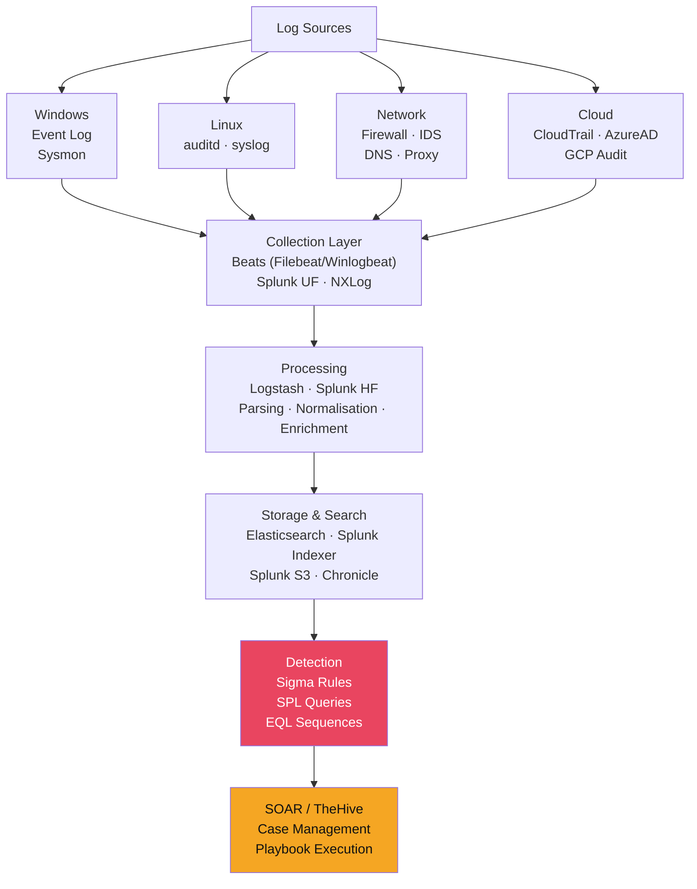

# 📊 Log Analysis and SIEM

> [!abstract] TL;DR
> Security Information and Event Management (SIEM) correlates logs from across the environment to detect attack patterns invisible in individual sources. Critical Windows Event IDs: 4624 (logon, check type 3/10/2/9), 4625 (failed logon — spray detection), 4688 (process creation — enable with audit policy), 4720/4728 (account creation/group membership change), 7045 (service installation), 1102 (audit log cleared). Linux: auditd with key-based rules. Sigma is the portable detection rule format. Splunk SPL uses `index=windows EventCode=4688 | stats count` pattern. Elastic uses EQL sequences for multi-event correlation. z-score anomaly detection (|z| > 3) identifies statistical outliers. Beats → Logstash → Elasticsearch → Kibana (ELK stack).

---

## Intuition — Analogy First

A SIEM is the security operations centre's nerve centre: it receives alarms from thousands of sensors (firewalls, endpoints, DNS, authentication systems) and correlates them into meaningful alerts. Without a SIEM, a SOC analyst would need to manually check 50 different systems to notice that the same IP address failed login on 20 accounts in 5 minutes — a classic password spray. The SIEM sees all 50 systems simultaneously and fires a single alert.

Log analysis without correlation is like reading 10,000 individual alarm bell logs to find the one that means "burglar in the building." SIEM correlation is the rule that says: "if 5+ distinct account lockouts occur within 60 seconds from the same source IP, that's a spray attack, not individual user mistakes."

---

## How It Works



---

## Key Concepts / Details

### Critical Windows Event IDs

```
Logon/Authentication Events:
4624  Successful logon
      Logon Type: 2=Interactive, 3=Network, 4=Batch, 5=Service,
                  8=NetworkCleartext, 9=NewCredentials, 10=RemoteInteractive(RDP), 11=CachedInteractive
4625  Failed logon (detect: >10 failures from same IP in 5min = spray/brute)
4648  Explicit credential logon (runas, Pass-the-Hash)
4768  Kerberos TGT request (AS-REQ)
4769  Kerberos service ticket request (TGS-REQ) - Kerberoasting: ENCTYPE=0x17 (RC4)
4771  Kerberos pre-auth failure

Process/Execution Events:
4688  Process creation (enable: Computer Config → Audit Policy → Process Creation)
      Look for: cmd.exe/powershell.exe spawned by non-shell processes
      Critical: enable "include command line" in policy for full commandline logging
4689  Process terminated

Account/Group Events:
4720  User account created
4722  User account enabled
4724  Password reset attempt
4728  Member added to security-enabled global group (monitor: "Domain Admins")
4732  Member added to security-enabled local group ("Administrators")

Service/Persistence Events:
7045  A new service was installed (filter: ImagePath not in %SystemRoot%)
4698  Scheduled task created (Task Scheduler operational log)
4702  Scheduled task updated

Suspicious Activity:
1102  Audit log cleared (Security log cleared) - IMMEDIATE ALERT
4719  System audit policy changed
4907  Auditing settings changed
```

### Sysmon Event IDs (Enhanced Process Monitoring)

| Sysmon Event | Description | Key Detection |
|-------------|-------------|----------------|
| 1 | Process creation (full cmdline + hash) | Suspicious process launch |
| 3 | Network connection | C2 beaconing, lateral movement |
| 7 | Image loaded (DLL) | DLL injection, sideloading |
| 8 | CreateRemoteThread | Process injection |
| 10 | ProcessAccess (LSASS) | Credential dumping |
| 12/13 | Registry create/modify | Persistence, defence evasion |
| 15 | File stream creation (ADS) | NTFS alternate data stream hiding |
| 22 | DNS query | C2 by domain, DGA detection |

### Sigma — Portable Detection Rules

Sigma is the SIEM-agnostic detection rule format:

```yaml
title: LSASS Memory Access via CreateRemoteThread
id: 5ef2a0c6-c06b-4af8-9cad-55e5e2c5abec
status: production
description: Detects Mimikatz LSASS credential dumping via CreateRemoteThread
references:
  - https://attack.mitre.org/techniques/T1003/001/
author: Florian Roth
date: 2021/07/15
tags:
  - attack.credential_access
  - attack.t1003.001
logsource:
  category: process_access
  product: windows
detection:
  selection:
    TargetImage|endswith: '\lsass.exe'
    GrantedAccess|contains:
      - '0x1010'
      - '0x1038'
      - '0x40'
  condition: selection
falsepositives:
  - Windows Defender (whitelist)
  - CrowdStrike (whitelist by ParentImage)
level: high
```

**Converting Sigma to SIEM-specific queries**:
```bash
# sigma to Splunk
sigmac -t splunk -c tools/config/splunk-windows.yml rule.yml

# sigma to Elastic
sigmac -t es-dsl -c tools/config/winlogbeat.yml rule.yml

# sigma to Microsoft Sentinel (KQL)
sigmac -t microsoft365defender rule.yml
```

### Splunk SPL — Security Queries

```spl
| Search for credential spraying (Event 4625)
index=windows EventCode=4625
| bin _time span=5m
| stats count dc(Account_Name) as unique_accounts by src_ip, _time
| where unique_accounts > 10
| sort -count

| Process creation with suspicious parent-child (Event 4688)
index=windows EventCode=4688 
  (New_Process_Name=*powershell* OR New_Process_Name=*cmd.exe OR New_Process_Name=*wscript* 
   OR New_Process_Name=*mshta*)
  (Creator_Process_Name=*word* OR Creator_Process_Name=*excel* 
   OR Creator_Process_Name=*outlook* OR Creator_Process_Name=*iexplore*)
| table _time, ComputerName, Creator_Process_Name, New_Process_Name, Process_Command_Line

| Detect encoded PowerShell commands (Event 4688/Sysmon 1)
index=windows (EventCode=4688 OR source="XmlWinEventLog:Microsoft-Windows-Sysmon/Operational" EventCode=1)
New_Process_Name=*powershell* 
(Process_Command_Line=*-enc* OR Process_Command_Line=*-EncodedCommand* 
 OR Process_Command_Line=*-e * OR Process_Command_Line=*hidden*)
| table _time, ComputerName, Creator_Process_Name, Process_Command_Line

| Service installation (Event 7045)
index=windows EventCode=7045
NOT (Service_File_Name IN ("C:\\Windows\\System32\\*", "C:\\Program Files\\*"))
| table _time, ComputerName, Service_Name, Service_File_Name, Service_Account
```

### Elastic EQL — Event Sequence Detection

EQL (Event Query Language) enables multi-event sequence detection:

```eql
/* Detect Pass-the-Hash: network logon with NTLM auth */
sequence by winlog.computer_name with maxspan=5m
  [authentication where event.action == "logged-in" and
   winlog.logon.type == "Network" and
   winlog.logon.auth_package == "NTLM" and
   winlog.event_data.SubjectLogonId == "0x3e7"]  /* SYSTEM logon context */

/* Detect malicious parent-child process chain */
sequence by agent.id with maxspan=30s
  [process where process.name : ("WINWORD.EXE", "EXCEL.EXE", "OUTLOOK.EXE")]
  [process where process.name : ("cmd.exe", "powershell.exe", "mshta.exe", "wscript.exe")]

/* Detect lateral movement: PsExec pattern */
sequence by agent.id with maxspan=2m
  [network where destination.port == 445]
  [file where file.name : "PSEXESVC.EXE"]
  [process where process.name : "PSEXESVC.EXE"]
```

### ELK Stack Architecture

```
Data Collection:
  Filebeat → collects logs from files (Windows Event Log, syslog)
  Winlogbeat → Windows Event Log native collector
  Packetbeat → Network packet analysis
  Auditbeat → Linux auditd integration
  
Data Processing:
  Logstash → Parse, filter, enrich (GeoIP, threat intel lookup, normalisation)
  Elasticsearch Ingest Pipeline → Lighter alternative to Logstash
  
Storage & Search:
  Elasticsearch → Distributed, sharded, time-series optimised storage
  Index lifecycle management → hot→warm→cold→delete tiers
  
Visualization:
  Kibana → Dashboards, SIEM app, alert management
  Kibana Security Solution → Detection rules, cases, timeline
```

### Z-Score Anomaly Detection

Z-score measures how many standard deviations a value is from the mean:

```python
import numpy as np

def detect_anomaly(values, threshold=3.0):
    mean = np.mean(values)
    std = np.std(values)
    z_scores = np.abs((values - mean) / std)
    return z_scores > threshold  # |z| > 3 = anomaly

# Example: DNS query volume per host (hourly)
hourly_queries = [45, 52, 48, 51, 47, 49, 200, 44, 46]  # 200 is anomalous
print(detect_anomaly(hourly_queries))
# → [False, False, False, False, False, False, True, False, False]
```

Splunk implementation:
```spl
| Event volume baseline anomaly detection
index=dns
| timechart span=1h count by src_ip
| eventstats avg(count) as avg, stdev(count) as stdev by src_ip
| eval z_score = abs((count - avg) / stdev)
| where z_score > 3
| sort -z_score
```

---

## Real-World Notes

- 4688 with command-line logging captures 80% of the attacker's activities on Windows; it's disabled by default — enabling it is a critical SOC hardening step
- 1102 (audit log cleared) should trigger immediate P1 alert; legitimate administrators rarely need to clear security logs and should use log archiving instead
- Elastic's SIEM now includes 700+ pre-built detection rules mapped to ATT&CK; these are the fastest starting point for a new SOC
- Sigma community repository has 3,000+ rules at github.com/SigmaHQ/sigma; review, tune, and test before production deployment

---

## Common Pitfalls

1. **Logging everything without alerting anything** — Collecting 10TB/day of logs is useless without detection rules; prioritise quality detections over raw collection volume
2. **No process creation (4688) command-line logging** — 4688 without command-line data shows process name only; lateral movement via `cmd.exe /c whoami` is invisible without cmdline logging
3. **Ignoring log shipping failures** — If Winlogbeat crashes or Filebeat falls behind, the SIEM silently has gaps; monitor log ingestion rate as a health metric
4. **Copy-pasting Sigma rules without tuning** — Generic rules generate massive false positives; tune to your environment before production deployment

---

## Related Concepts

- [[DFIR_Methodology|← DFIR Methodology]] — detection phase feeds investigation
- [[Memory_Forensics|← Memory Forensics]] — complement log analysis with in-memory evidence
- [[IR_Playbooks|→ IR Playbooks]] — SIEM alerts trigger playbook execution
- [[MITRE_ATT_CK|← ATT&CK]] — Sigma tags map to ATT&CK technique IDs
- [[_MOC_DFIR|↑ DFIR MOC]]

---

## Review Questions

1. Write a Splunk SPL query to detect Kerberoasting: an account requesting RC4-encrypted service tickets (Event 4769 with TicketEncryptionType=0x17) for more than 5 distinct service accounts within 10 minutes from the same source.
2. Event 1102 fires at 02:47 UTC on a Sunday. Describe your immediate response, what other evidence you look for in the preceding 60 minutes of logs, and what the most likely attacker intent is.
3. A new analyst says "we're collecting all Windows events — we must have good coverage." Explain why Event ID collection count is not a coverage metric, and define three better metrics for detection coverage quality.

---

## Sources

- Windows Security Event IDs: https://learn.microsoft.com/en-us/windows/security/threat-protection/auditing/
- Sigma Repository: https://github.com/SigmaHQ/sigma
- EQL Documentation: https://www.elastic.co/guide/en/elasticsearch/reference/current/eql.html

#Cybersecurity #DFIR #SIEM #LogAnalysis #WindowsEvents #Sigma #Splunk #Elastic
