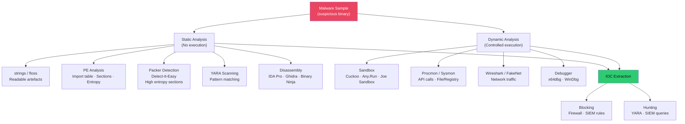

# 🦠 Malware Analysis

> [!abstract] TL;DR
> Malware analysis extracts knowledge from malicious code to understand capabilities, extract IOCs, and build detections. Static analysis examines the binary without execution: `strings` for readable artefacts, PE import table for API usage (CreateRemoteThread=injection, InternetOpenUrl=C2), PEStudio for PE header analysis, Detect-It-Easy for packer identification, YARA for pattern matching. Dynamic analysis executes in a sandbox: Cuckoo/Any.Run observe API calls, network traffic, registry modifications, file system changes. Anti-analysis techniques: custom packers (high entropy), API hashing, VM detection (CPUID/timing), sleep-and-wait evasion. IOC types: IP/domain/hash/mutex/registry key/pipe name. Malware families: RATs, ransomware, rootkits, wipers.

---

## Intuition — Analogy First

Static malware analysis is like reading a car's blueprint without starting the engine — you can see how many cylinders it has, what fuel it takes, where the exhaust goes. Dynamic analysis is test-driving the car in a closed course — you see exactly what it does when running, including the exhaust emissions (network traffic) and wear patterns (registry/file changes).

Neither alone is complete: modern malware detects sandbox environments and behaves differently (or not at all) when monitored. Static analysis reveals the true code even when the malware "knows" it's being watched. The combination — static to understand the code, dynamic to see runtime behaviour — produces the most complete picture. The final product is a threat intelligence report: IOCs for immediate blocking and YARA rules for hunting across the estate.

---

## How It Works



---

## Key Concepts / Details

### Static Analysis — Initial Triage

```bash
# File type identification (do NOT trust file extension)
file suspicious.exe
# → suspicious.exe: PE32+ executable (console) x86-64, for MS Windows

# Hash the sample (for VirusTotal lookup + IOC)
sha256sum suspicious.exe
md5sum suspicious.exe

# Check VirusTotal
curl -s "https://www.virustotal.com/api/v3/files/{sha256}" \
  -H "x-apikey: YOUR_VT_KEY" | jq '.data.attributes.last_analysis_stats'

# String extraction
strings -n 8 suspicious.exe | tee strings_output.txt
# FLOSS (FireEye Labs): also extracts obfuscated/stack strings
floss suspicious.exe > floss_output.txt
```

**Interesting strings to look for**:
```
URLs/IPs: http://, https://, ftp://, \x192\x168  (IP in decimal)
File paths: C:\Users\, %APPDATA%, %TEMP%, \AppData\Roaming
Registry keys: HKCU\Software\Microsoft\Windows\CurrentVersion\Run
Mutex names: Global\, Local\ prefix (uniqueness mechanism)
Commands: cmd.exe, powershell.exe, net user, whoami
Crypto hints: AES, RC4, RSA, BEGIN RSA
C2 hints: User-Agent strings, hardcoded domains
```

### PE (Portable Executable) Analysis

```bash
# PEStudio (GUI, Windows) - comprehensive PE analysis
pestudio suspicious.exe

# Command-line alternative: pefile (Python)
python3 -c "
import pefile
pe = pefile.PE('suspicious.exe')
print('Imports:')
for entry in pe.DIRECTORY_ENTRY_IMPORT:
    print(f'  {entry.dll.decode()}')
    for imp in entry.imports:
        print(f'    {imp.name.decode() if imp.name else \"ordinal:\"+str(imp.ordinal)}')
"

# Suspicious imports by category:
# Process injection: VirtualAllocEx, WriteProcessMemory, CreateRemoteThread
# Credential access: OpenProcess, ReadProcessMemory (LSASS)
# Persistence: RegSetValueEx, CreateService, SetWindowsHookEx
# Network: InternetOpenA, HttpOpenRequestA, WSAStartup
# Anti-analysis: IsDebuggerPresent, GetTickCount, QueryPerformanceCounter

# Section entropy (>7.0 = packed/encrypted)
python3 -c "
import pefile, math
from collections import Counter
pe = pefile.PE('suspicious.exe')
for section in pe.sections:
    data = section.get_data()
    freq = Counter(data)
    entropy = -sum((c/len(data))*math.log2(c/len(data)) for c in freq.values())
    print(f'{section.Name.decode().strip(chr(0))}: entropy={entropy:.2f}')
"
```

**Detect-It-Easy (DIE)** — packer/compiler identification:
```bash
die suspicious.exe
# Output: "UPX 3.95" or "MSVC 2019" or "Custom packer (high entropy)"
# UPX packing: upx -d suspicious.exe → unpacks to original

# High-entropy .text section + small import table = custom packer
# Packed malware analysis requires first unpacking (debugger + dump)
```

### YARA — Pattern Matching for Malware Hunting

YARA rules define patterns to identify malware families:

```yara
rule Cobalt_Strike_Beacon {
    meta:
        description = "Detects Cobalt Strike Beacon by common patterns"
        author = "Security Team"
        date = "2026-07-26"
        reference = "https://attack.mitre.org/software/S0154/"
        
    strings:
        // Common Cobalt Strike shellcode header
        $cs_header = { FC 48 83 E4 F0 E8 C0 00 00 00 }
        // Beacon sleep jitter string
        $sleep = "beacon_jitter" ascii nocase
        // Named pipe default names
        $pipe = "\\\\.\\pipe\\MSSE-" ascii
        // Default C2 User-Agent
        $ua = "Mozilla/4.0 (compatible; MSIE 8.0" ascii
        
    condition:
        uint16(0) == 0x5A4D and   // MZ header
        filesize < 5MB and
        (1 of ($cs_header, $pipe) or 
         all of ($sleep, $ua))
}

rule Ransomware_FileExtension_Change {
    meta:
        description = "Detects ransomware writing extension change patterns"
    strings:
        $ext1 = ".locked" ascii
        $ext2 = ".encrypted" ascii
        $ext3 = "YOUR_FILES_ARE_ENCRYPTED" wide ascii
        $ext4 = "README_DECRYPT" ascii nocase
    condition:
        2 of them
}
```

```bash
# Run YARA rule against sample
yara -r cobalt_strike.yar /path/to/suspicious_files/

# Run against memory (Volatility integration)
python3 vol.py -f memory.raw yarascan.YaraScan --yara-file cobalt_strike.yar

# YARA against live file system
yara -r -s rules/ C:\Windows\System32\
```

### Dynamic Analysis — Sandbox

**Cuckoo Sandbox** (open-source, self-hosted):
```python
# Submit sample via API
import requests
response = requests.post('http://localhost:8090/tasks/create/file',
    files={'file': open('suspicious.exe', 'rb')},
    data={'options': 'procmemdump=1', 'package': 'exe'})
task_id = response.json()['task_id']

# Retrieve report
report = requests.get(f'http://localhost:8090/tasks/report/{task_id}').json()
# Report includes: processes, network, files, registry, signatures
```

**Any.Run (cloud sandbox)**: Interactive browser-based sandbox; you interact with the sample in real-time, observing behaviour. Free tier available.

**REMnux** — Malware Analysis Linux Distribution:
Pre-installed tools: Cuckoo, YARA, Volatility, Wireshark, FakeNet-NG, Ghidra, Radare2, IDA Free, olevba, peepdf, etc.

### Anti-Analysis Techniques

Malware uses techniques to evade analysis:

```python
# VM detection: CPUID check
import ctypes
# CPUID.01h: ECX bit 31 is hypervisor present bit
# Malware calls CPUID and checks this bit; if set → VM → sleep/exit

# Timing attacks: detect sandbox (sandboxes fast-forward time)
import time
start = time.time()
for i in range(1000000): pass  # CPU-intensive sleep
elapsed = time.time() - start
if elapsed < 0.1:  # Too fast = sandbox time acceleration
    exit()

# API hashing: obfuscate imported API names
# Instead of importing "CreateProcess" directly:
# Compute hash of function name at runtime, walk PEB to find matching export
# Makes static import analysis ineffective

# Custom packing: encrypt payload, decrypt at runtime
# Static analysis sees only decryption stub + encrypted payload (high entropy)
# Must run to extract actual payload
```

### IOC Types and Extraction

| IOC Type | Example | Where to Extract |
|---------|---------|-----------------|
| File hash (SHA-256) | `e3b0c44298fc1c149...` | Hash the sample |
| IP address | `198.51.100.233` | Dynamic analysis network capture |
| Domain | `c2.badactor.com` | strings, dynamic DNS queries |
| URL | `https://c2.bad/beacon` | strings, network traffic |
| Mutex name | `Global\svchost_mutex_123` | Dynamic analysis, strings |
| Registry key | `HKCU\...\Run\UpdateSvc` | Dynamic analysis, PE strings |
| Named pipe | `\\.\pipe\MSSEv3` | Dynamic analysis |
| File path | `%TEMP%\update.exe` | Dynamic analysis, strings |
| Scheduled task name | `WindowsUpdate_Fake` | Dynamic analysis |

### Malware Family Classification

| Family | Behaviour | Key IOCs | ATT&CK |
|--------|-----------|---------|--------|
| **RAT** | Remote control, keylogging, screen capture | C2 beacon interval, upload/download API | T1041, T1056 |
| **Ransomware** | File encryption, note drop, shadow copy deletion | `vssadmin delete shadows`, `.locked` extension | T1486 |
| **Rootkit** | Kernel-mode hiding, privilege, persistence | Unsigned driver, DKOM, hook | T1014 |
| **Wiper** | Data destruction, MBR overwrite | `WriteFile` to \\.\PhysicalDrive0 | T1561 |
| **Banker/Stealer** | Browser credential theft, form grabbing | Browser API hooks, LaZagne | T1555 |
| **Loader** | Download + execute secondary payload | High network activity at start, shell spawn | T1105 |

---

## Real-World Notes

- SUNBURST (SolarWinds) was so sophisticated that static analysis found nothing suspicious — it used legitimate SolarWinds code infrastructure, activated via a configurable timer 12–14 days after installation to evade sandbox time limits
- Ransomware groups increasingly use LOLBins (living-off-the-land binaries) in their ransomware scripts to evade YARA detection — `vssadmin.exe`, `wbadmin.exe`, `bcdedit.exe` for shadow copy deletion
- VirusTotal Livehunt: subscribe to YARA rules; get notified when new samples matching your rule are uploaded — powerful for tracking evolving malware families
- Ghidra (NSA, open source) and IDA Pro (commercial) are the two primary disassemblers; Ghidra's decompiler produces C-like pseudocode from assembly, significantly accelerating analysis

---

## Common Pitfalls

1. **Analysing malware on a production system** — Always use an isolated VM (no network except FakeNet/INetSim, no shared clipboard/folders); malware can spread to host
2. **Trusting single sandbox report** — Sandboxes are detected; run with multiple delay profiles and analyse Cuckoo + Any.Run reports together
3. **Missing packed samples** — Treating high-entropy files as "not PE" — packed executables still launch, just need dynamic analysis to reveal the unpacked payload
4. **Publishing IOCs without vetting** — False-positive IOCs (legitimate domains, common hashes) in threat intel feeds cause massive false positives; verify before sharing

---

## Related Concepts

- [[Memory_Forensics|← Memory Forensics]] — extract malware from memory for static analysis
- [[Log_Analysis_and_SIEM|→ Log Analysis]] — YARA rules converted to SIEM signatures
- [[IR_Playbooks|→ IR Playbooks]] — malware analysis feeds eradication and recovery
- [[_MOC_DFIR|↑ DFIR MOC]]

---

## Review Questions

1. Strings analysis of `suspicious.exe` shows `IsDebuggerPresent`, `GetTickCount`, and `VirtualAllocEx`. What do each of these imports suggest about the malware's capabilities and anti-analysis techniques?
2. Cuckoo sandbox report shows no network connections, no file modifications, and the process terminated immediately. Give three possible reasons and explain how you would modify the analysis approach for each.
3. Write a YARA rule to detect a ransomware sample based on these observed characteristics: shadow copy deletion command, dropped ransom note filename "HOW_TO_DECRYPT.txt", and file extension change to ".LOCKED".

---

## Sources

- REMnux Documentation: https://docs.remnux.org/
- Cuckoo Sandbox: https://cuckoosandbox.org/
- YARA Documentation: https://yara.readthedocs.io/
- PEStudio: https://www.winitor.com/

#Cybersecurity #DFIR #MalwareAnalysis #YARA #Cuckoo #REMnux #PEStudio #StaticAnalysis
