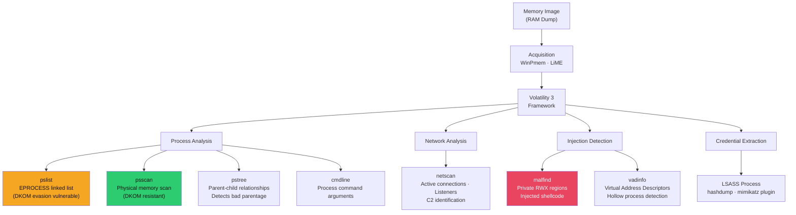

# 🧠 Memory Forensics

> [!abstract] TL;DR
> Memory forensics analyses RAM contents to recover running processes, network connections, encryption keys, and injected malware that leaves no disk footprint. Acquisition: WinPmem (Windows), LiME (Linux). Volatility 3 (Python-based, no profiles needed) is the primary framework. Key plugins: `pslist` (enumerate processes from EPROCESS doubly-linked list) vs `psscan` (scan physical memory for EPROCESS structures — detects DKOM rootkit hiding). `pstree` reveals suspicious parent-child relationships. `malfind` identifies private RWX memory regions (process injection). `netscan` shows active connections. `cmdline` reveals process arguments. Process hollowing detection: compare on-disk PE header with in-memory PE header (VAD analysis). LSASS process extraction for credential analysis.

---

## Intuition — Analogy First

Memory forensics is reading a photographic snapshot of the computer's working memory at a moment in time. Imagine freezing a busy kitchen mid-service: the RAM image shows every pot on the stove (running processes), every order ticket pinned up (network connections), every ingredient out on the counter (open file handles), and every chef's current task (CPU state). This information vanishes the moment the kitchen closes (power off).

The DKOM (Direct Kernel Object Manipulation) rootkit technique is like a chef erasing their order ticket from the list — they're still working, but they're invisible to the head chef's clipboard (pslist). Memory forensics with psscan is like photographing every individual pot regardless of the list — even the "hidden" chef leaves a pot on the stove that appears in the photograph.

---

## How It Works



---

## Key Concepts / Details

### Memory Acquisition

**Windows — WinPmem**:
```bash
# Download WinPmem, run as administrator
winpmem_mini_x64_rc2.exe memory.raw

# Alternatively: use ProcDump for LSASS-only acquisition
procdump.exe -accepteula -64 -ma lsass.exe lsass.dmp

# Via comsvcs.dll (living-off-the-land, less detected)
tasklist | findstr lsass  # Get PID, e.g., 756
rundll32.exe C:\Windows\System32\comsvcs.dll MiniDump 756 C:\Windows\Temp\lsass.dmp full
```

**Linux — LiME (Linux Memory Extractor)**:
```bash
# Build LiME module for running kernel
apt-get install build-essential linux-headers-$(uname -r)
cd LiME/src && make

# Load module and dump RAM to file
sudo insmod lime-$(uname -r).ko "path=/external/memory.lime format=lime"

# Or to network socket (doesn't write to local disk)
sudo insmod lime-$(uname -r).ko "path=tcp:4444 format=lime"
# On remote system: nc -l 4444 > memory.lime
```

### Volatility 3 — Core Plugins

**Process Enumeration**:
```bash
# List processes from EPROCESS doubly-linked list
python3 vol.py -f memory.raw windows.pslist.PsList

# Scan physical memory for EPROCESS structures (DKOM-resistant)
python3 vol.py -f memory.raw windows.psscan.PsScan

# Compare pslist vs psscan: missing from pslist but in psscan = rootkit hiding
# Use: diff <(vol.py pslist) <(vol.py psscan) to find discrepancies

# Process tree with parent-child relationships
python3 vol.py -f memory.raw windows.pstree.PsTree
```

**DKOM (Direct Kernel Object Manipulation)**:
Windows tracks processes via the `_EPROCESS` structure, linked in a doubly-linked list (`ActiveProcessLinks`). A rootkit performing DKOM unlinks the malicious process from this list while keeping it running:

```
Normal list: SystemProcess ↔ smss.exe ↔ csrss.exe ↔ winlogon.exe ↔ malware.exe
After DKOM: SystemProcess ↔ smss.exe ↔ csrss.exe ↔ winlogon.exe
                                                     (malware.exe still running but hidden!)
```

`psscan` scans physical memory for `_EPROCESS` structures by their signature (pool tags `_POOL_HEADER` with tag `Proc`), finding them even when unlinked from the active list.

**Suspicious Parent-Child Relationships**:
```bash
python3 vol.py -f memory.raw windows.pstree.PsTree | head -50

# Legitimate:
# - explorer.exe spawns user applications
# - svchost.exe spawned by services.exe
# - cmd.exe spawned by explorer.exe (interactive user)

# Suspicious:
# - cmd.exe spawned by iexplore.exe (browser spawning shell → CVE exploit)
# - powershell.exe spawned by excel.exe (Excel macro execution)
# - mshta.exe spawned by winword.exe (Word exploit)
# - cmd.exe spawned by svchost.exe (service-based persistence)
```

**Network Connections**:
```bash
# Active connections and listeners
python3 vol.py -f memory.raw windows.netscan.NetScan

# Look for:
# - Connections to unknown external IPs (C2)
# - LISTENING services on unusual ports
# - Short-lived connections (beacon intervals)
# - svchost.exe connecting outbound (rare for legitimate svchost)
```

**Injected Code Detection — malfind**:

```bash
# Find memory regions with suspicious characteristics
python3 vol.py -f memory.raw windows.malfind.Malfind

# malfind looks for:
# 1. Private memory (not backed by any file on disk)
# 2. Executable + Writable permissions (RWX or RX after write)
# 3. MZ header (PE executable signature) at region start

# Output:
# PID: 1234  Process: explorer.exe
# Start: 0x00b30000  End: 0x00b4f000
# Protection: PAGE_EXECUTE_READWRITE  ← suspicious!
# Hexdump: 4d 5a 90 00  ← MZ header = injected PE
```

**Process Hollowing Detection** (T1055.012):
Process hollowing: create a legitimate process (svchost.exe) in suspended state, unmap its code, replace with malicious code, resume.

```bash
# Detect hollow processes: on-disk PE ≠ in-memory PE
python3 vol.py -f memory.raw windows.vadinfo.VadInfo --pid 1234

# Also use dlllist to check loaded DLLs
python3 vol.py -f memory.raw windows.dlllist.DllList --pid 1234

# PE header comparison:
# If in-memory ImageBase ≠ on-disk PE header, or section permissions differ → hollow
```

**LSASS Credential Extraction**:
```bash
# Dump LSASS process memory
python3 vol.py -f memory.raw windows.pslist.PsList | grep lsass

# Extract credentials (requires mimikatz plugin or separate lsass dump analysis)
python3 vol.py -f memory.raw windows.lsadump.Lsadump

# Alternatively: extract lsass dump and analyse with pypykatz (offline)
pypykatz lsa minidump lsass.dmp
# Output: NTLM hashes, Kerberos tickets, plaintext passwords (if WDigest enabled)
```

**Command Line History**:
```bash
# See command arguments for all processes
python3 vol.py -f memory.raw windows.cmdline.CmdLine

# Find encoded PowerShell commands
python3 vol.py -f memory.raw windows.cmdline.CmdLine | grep -i "encodedcommand\|-enc\|-e "

# Decode base64 PowerShell
echo "JABzAD0ATgBlAHcA..." | base64 -d | python3 -c "import sys; print(sys.stdin.buffer.read().decode('utf-16-le'))"
```

### Linux Memory Forensics

```bash
# Linux plugins
python3 vol.py -f memory.lime linux.pslist.PsList
python3 vol.py -f memory.lime linux.pstree.PsTree
python3 vol.py -f memory.lime linux.netstat.Netstat
python3 vol.py -f memory.lime linux.bash.Bash  # Bash history from memory
python3 vol.py -f memory.lime linux.proc.Maps   # /proc/[pid]/maps from memory

# Rootkit detection: compare kernel module list with /proc/modules
python3 vol.py -f memory.lime linux.lsmod.Lsmod
# Missing module = rootkit hiding via /proc manipulation
```

---

## Real-World Notes

- The SolarWinds response team used memory forensics to extract the SUNBURST malware from memory before it could be cleaned from disk — the RAM image provided the complete implant for reverse engineering
- Emotional malware analysis: memory forensics on a live Cobalt Strike beacon reveals the exact C2 profile (injected configuration), C2 server IP, and sleep/jitter settings, enabling incident scoping
- Windows Defender Credential Guard (Virtualization-Based Security) moves LSASS into an isolated hypervisor partition — Volatility cannot access it via standard memory acquisition (requires kernel-level attack)
- Volatility 3 removed the need for OS profiles (Volatility 2 required matching symbol tables); it auto-detects the OS version from the memory image

---

## Common Pitfalls

1. **Using pslist alone** — If a rootkit is suspected, always run psscan and diff; pslist-only analysis misses DKOM-hidden processes
2. **Ignoring parent-child relationships** — The parent PID is as important as the process name; `cmd.exe` spawned by `word.exe` is fundamentally different from `cmd.exe` spawned by `explorer.exe`
3. **Not extracting network connections** — In-memory network connections show C2 channels that may be gone after reboot; netscan is time-critical data
4. **Forgetting to hash memory images** — Without SHA-256 of the original memory image, defence counsel can challenge whether the analysed image matches what was collected (chain of custody)

---

## Related Concepts

- [[DFIR_Methodology|← DFIR Methodology]] — acquisition comes first
- [[Malware_Analysis|→ Malware Analysis]] — extracted memory samples fed into analysis
- [[Post_Exploitation_and_Lateral_Movement|← Post-Exploitation]] — attacker perspective on LSASS access
- [[_MOC_DFIR|↑ DFIR MOC]]

---

## Review Questions

1. `pslist` shows 87 processes; `psscan` shows 89. How do you identify the two hidden processes and what does this indicate about the attacker's technique?
2. `malfind` on `explorer.exe` (PID 4892) returns a region at 0x00f40000 with `PAGE_EXECUTE_READWRITE` and MZ header. Walk through the analysis steps to confirm process injection, identify the injected payload type, and extract it for further analysis.
3. Memory analysis of a compromised server shows `svchost.exe` (PID 1456) with outbound connection to 198.51.100.233:443. cmdline shows `C:\Windows\System32\svchost.exe -k netsvcs`. How do you determine if this is malicious, and what additional analysis steps do you take?

---

## Sources

- Volatility 3 Documentation: https://volatility3.readthedocs.io/
- The Art of Memory Forensics (Ligh, Case, Levy, Walters)
- pypykatz: https://github.com/skelsec/pypykatz

#Cybersecurity #DFIR #MemoryForensics #Volatility #DKOM #ProcessInjection #LSASS
