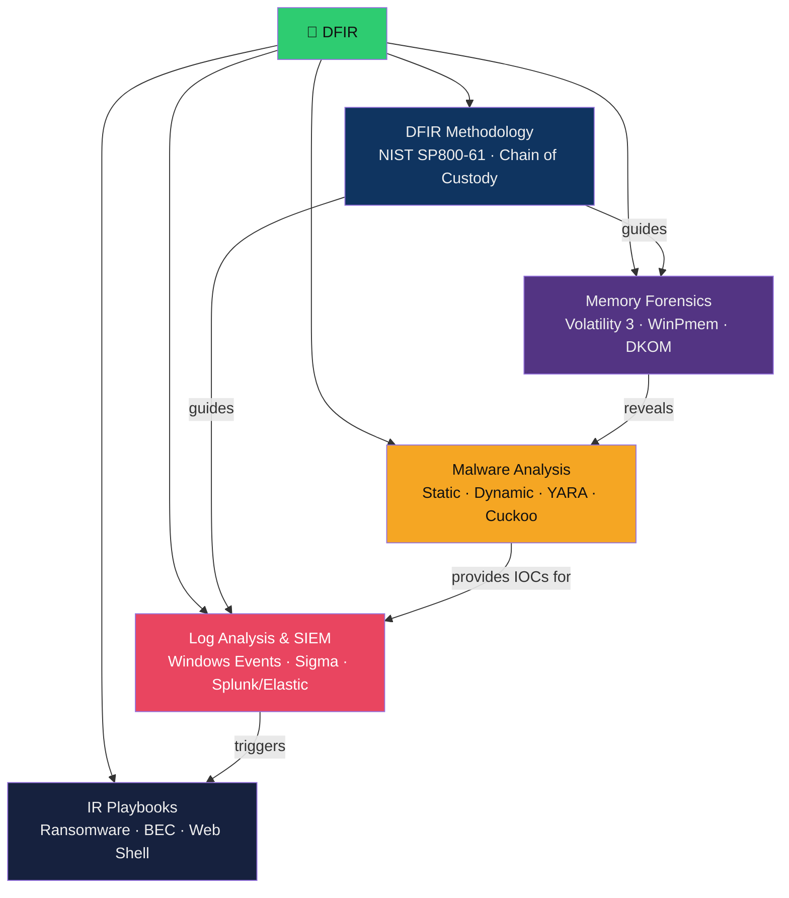

# 🔬 Digital Forensics & Incident Response — Map of Content

> [!abstract] Section Overview
> DFIR (Digital Forensics and Incident Response) is the blue team discipline of detecting, containing, investigating, and recovering from security incidents. This section follows the NIST SP800-61 lifecycle: Preparation → Detection → Containment → Eradication → Recovery → Lessons Learned. Topics include forensic acquisition methodology (chain of custody, order of volatility), Volatility 3 memory forensics (DKOM detection, process injection analysis), SIEM/log analysis with Windows Event IDs and Sigma rules, malware analysis (static/dynamic/behavioural), and IR playbooks for ransomware/BEC/web shell scenarios.

---

## Concept Map

---

## Notes in This Section

| Note | Core Concept | Key Tools | Difficulty |
|------|-------------|-----------|------------|
| [[DFIR_Methodology]] | NIST IR lifecycle, chain of custody, acquisition | FTK Imager, KAPE, Velociraptor | Intermediate |
| [[Memory_Forensics]] | RAM acquisition and analysis | Volatility 3, WinPmem, LiME | Advanced |
| [[Log_Analysis_and_SIEM]] | Windows Event IDs, SIEM correlation, Sigma | Splunk SPL, Elastic EQL, Sigma | Intermediate–Advanced |
| [[Malware_Analysis]] | Static, dynamic, and behavioural analysis | PEStudio, YARA, Cuckoo, REMnux | Advanced |
| [[IR_Playbooks]] | Scenario-specific response procedures | TheHive, KAPE, Purple Team | Intermediate |

---

## Learning Path

1. [[DFIR_Methodology]] — learn the framework and acquisition principles
2. [[Log_Analysis_and_SIEM]] — build detection capability from logs
3. [[Memory_Forensics]] — investigate suspicious processes and injected code
4. [[Malware_Analysis]] — understand what the attacker's tool actually does
5. [[IR_Playbooks]] — apply all knowledge to specific incident scenarios

---

## Key Questions

1. What is the "order of volatility" and why must RAM be acquired before disk in forensic investigations?
2. Why does DKOM (Direct Kernel Object Manipulation) make `pslist` unreliable in Volatility, and how does `psscan` overcome this?
3. What Windows Event ID combination indicates a Pass-the-Hash attack, and how do you distinguish it from legitimate administrative logon?
4. What is the difference between static and dynamic malware analysis, and when is each appropriate?
5. In a ransomware IR: what is the immediate containment action, and why do you NOT reboot the affected system?

---

## Related Sections

- [[01_Security_Foundations/_MOC_Security_Foundations|← Security Foundations]] — ATT&CK techniques drive IR detection
- [[02_Network_Security/_MOC_Network_Security|← Network Security]] — network forensics integrates with DFIR
- [[05_Penetration_Testing/_MOC_Penetration_Testing|← Pentest]] — attacker TTPs from pentest = detection in IR (Purple Team)
- [[_MOC_Cybersecurity_Master|↑ Master MOC]]

#Cybersecurity #DFIR #IncidentResponse #Forensics #MOC
