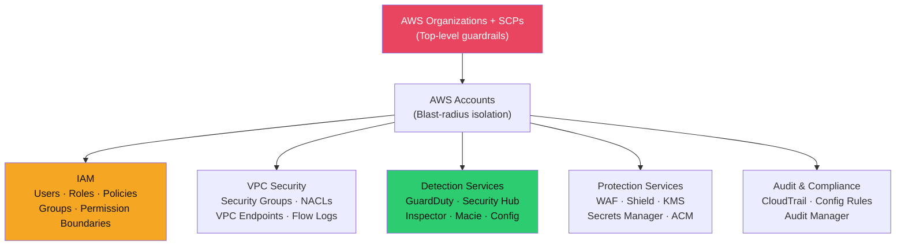
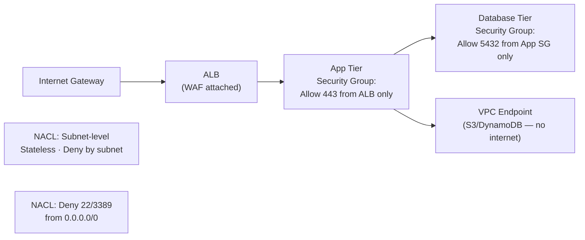

# 🔐 AWS Security

> [!abstract] TL;DR
> AWS security is IAM-first: overpermissioned roles and policies are the root cause of most AWS breaches. Key controls: enforce least-privilege IAM with SCPs in AWS Organizations, enable GuardDuty (threat detection) and Security Hub (CSPM aggregation) in all regions, use CloudTrail for immutable audit logging, enforce S3 Block Public Access organisation-wide, use KMS for encryption, and rotate secrets via Secrets Manager. GuardDuty detects credential anomalies, EC2 communication to C2 infrastructure, and S3 exfiltration — it's the single most important reactive control to enable.

---

## AWS Security Architecture



---

## IAM Deep Dive

### Policy Evaluation Logic

IAM evaluates policies in this precedence order:
1. **Explicit Deny** (wins always, even over Allow)
2. **SCP Deny** (AWS Organizations — denies across the account boundary)
3. **Resource-based Policy Allow** (S3 bucket policy, trust policies)
4. **Identity-based Policy Allow** (user/role policies)
5. **Permission Boundary** (max permissions ceiling)
6. **Session Policy** (assumed-role session restrictions)
7. **Default Deny** (implicit deny if no allow matches)

```json
// Least-privilege policy example: S3 read-only for specific bucket
{
  "Version": "2012-10-17",
  "Statement": [
    {
      "Sid": "ReadSpecificBucket",
      "Effect": "Allow",
      "Action": ["s3:GetObject", "s3:ListBucket"],
      "Resource": [
        "arn:aws:s3:::my-app-bucket",
        "arn:aws:s3:::my-app-bucket/*"
      ]
    }
  ]
}
```

### Service Control Policies (SCPs) in AWS Organizations

SCPs are guardrails that apply to all accounts in an OU, regardless of what IAM policies allow:

```json
// SCP: Deny disabling CloudTrail in all member accounts
{
  "Version": "2012-10-17",
  "Statement": [
    {
      "Sid": "DenyCloudTrailDisable",
      "Effect": "Deny",
      "Action": [
        "cloudtrail:DeleteTrail",
        "cloudtrail:StopLogging",
        "cloudtrail:UpdateTrail"
      ],
      "Resource": "*"
    },
    {
      "Sid": "DenyLeavingOrg",
      "Effect": "Deny",
      "Action": ["organizations:LeaveOrganization"],
      "Resource": "*"
    }
  ]
}
```

### IAM Roles vs Users

| | IAM Users | IAM Roles |
|--|-----------|-----------|
| Credentials | Long-lived access keys | Temporary STS tokens (15min–12h) |
| Use case | Human console access | EC2/Lambda/cross-account access |
| Rotation | Manual, often forgotten | Auto-rotated by STS |
| MFA support | Yes | Via condition keys |
| Best practice | Use for console access only | Use for all programmatic access |

---

## Detection Services

### GuardDuty

Continuously analyses CloudTrail, VPC Flow Logs, and DNS logs for anomalies:

```bash
# Enable GuardDuty across all accounts via Organizations
aws guardduty create-detector --enable --finding-publishing-frequency FIFTEEN_MINUTES

# Key finding types to alert on:
# - UnauthorizedAccess:IAMUser/ConsoleLoginSuccess.B (unusual login location)
# - Recon:IAMUser/UserPermissions (enumeration via describe/list calls)
# - CryptoCurrency:EC2/BitcoinTool.B (mining C2 communication)
# - Exfiltration:S3/AnomalousBehavior (large S3 data download)
# - PrivilegeEscalation:IAMUser/AnomalousBehavior

# Suppress low-value findings with suppression rules
aws guardduty create-filter --detector-id <id> \
  --name "SuppressDevEnv" \
  --finding-criteria '{"Criterion": {"accountId": {"Eq": ["123456789012"]}}}'
```

### Security Hub

Aggregates findings from GuardDuty, Inspector, Macie, IAM Analyzer, and third-party tools:

```bash
# Enable Security Hub with CIS AWS Foundations Benchmark
aws securityhub enable-security-hub --enable-default-standards

# Standards available:
# - CIS AWS Foundations Benchmark v1.4
# - AWS Foundational Security Best Practices
# - NIST SP 800-53 Rev 5
# - PCI DSS v3.2.1
```

### AWS Inspector

Automated vulnerability scanning for EC2, Lambda, and container images:
- Scans OS packages and application dependencies against CVE database
- Provides CVSS-scored findings with remediation guidance
- Integrates with ECR to scan images on push

### Amazon Macie

Machine learning-based sensitive data discovery in S3:
```bash
# Macie discovers PII, financial data, credentials in S3
# Findings: "S3Object contains social security numbers"
# Coverage: 100+ managed data identifiers (credit cards, passports, API keys)
```

---

## CloudTrail and Config

### CloudTrail — Immutable API Audit Log

```bash
# Enable multi-region trail with log file validation
aws cloudtrail create-trail \
  --name org-audit-trail \
  --s3-bucket-name audit-logs-bucket \
  --is-multi-region-trail \
  --enable-log-file-validation \
  --include-global-service-events

# Critical events to alert on:
# - ConsoleLogin with MFA = false
# - CreateUser / AttachUserPolicy
# - DeleteTrail / StopLogging (attacker covering tracks)
# - RunInstances with unusual image ID
# - AssumeRoleWithWebIdentity from unknown IPs
```

### AWS Config

Tracks configuration state changes and evaluates against compliance rules:

```bash
# Built-in managed rules for security
# s3-bucket-public-read-prohibited
# iam-root-access-key-check
# mfa-enabled-for-iam-console-access
# restricted-ssh (no 0.0.0.0/0 on port 22)
# cloudtrail-enabled
# encrypted-volumes (EBS encryption)
```

---

## VPC Security



| Control | Security Groups | NACLs |
|---------|----------------|-------|
| Level | Instance/ENI | Subnet |
| State | Stateful (tracks connections) | Stateless (evaluate both directions) |
| Default | Deny all inbound | Allow all |
| Rules | Allow only | Allow + explicit Deny |
| Use case | Primary control | Defence-in-depth, block specific ranges |

**VPC Endpoints** eliminate internet routing for AWS API calls:
```bash
# Interface endpoint: creates ENI in your VPC for AWS service
aws ec2 create-vpc-endpoint --vpc-id vpc-xxx \
  --service-name com.amazonaws.us-east-1.s3 \
  --vpc-endpoint-type Gateway
# EC2 → S3 traffic never leaves AWS network
```

---

## S3 Bucket Security

```bash
# 1. Enable S3 Block Public Access at ACCOUNT level (covers all buckets)
aws s3control put-public-access-block \
  --account-id 123456789012 \
  --public-access-block-configuration \
    BlockPublicAcls=true,IgnorePublicAcls=true,\
    BlockPublicPolicy=true,RestrictPublicBuckets=true

# 2. Enforce encryption in transit via bucket policy
{
  "Effect": "Deny",
  "Principal": "*",
  "Action": "s3:*",
  "Resource": ["arn:aws:s3:::my-bucket/*"],
  "Condition": {"Bool": {"aws:SecureTransport": "false"}}
}

# 3. Enable versioning + MFA delete for sensitive buckets
aws s3api put-bucket-versioning --bucket my-bucket \
  --versioning-configuration Status=Enabled,MFADelete=Enabled

# 4. S3 Access Logs + CloudTrail data events for auditing
```

---

## KMS and Secrets Manager

### KMS Key Management

```python
# Envelope encryption pattern (used by all AWS services)
# 1. KMS generates a data encryption key (DEK)
# 2. DEK encrypts the data locally (fast)
# 3. KMS Customer Master Key (CMK) encrypts the DEK
# 4. Encrypted DEK stored alongside encrypted data

import boto3
kms = boto3.client('kms')

# Encrypt data using CMK
response = kms.encrypt(
    KeyId='arn:aws:kms:us-east-1:123:key/abc-123',
    Plaintext=b'sensitive-data'
)
ciphertext = response['CiphertextBlob']

# KMS key policy: who can use the key
{
  "Effect": "Allow",
  "Principal": {"AWS": "arn:aws:iam::123:role/AppRole"},
  "Action": ["kms:Decrypt", "kms:GenerateDataKey"],
  "Resource": "*"
}
```

### Secrets Manager vs Parameter Store

| | Secrets Manager | Parameter Store (SecureString) |
|--|----------------|-------------------------------|
| Cost | $0.40/secret/month | Free (standard), $0.05/10k API calls (advanced) |
| Auto-rotation | Yes (built-in for RDS, Redshift, DocumentDB) | No |
| Cross-account | Yes | Limited |
| Use case | Database passwords, API keys | Config values, feature flags |

```python
# Retrieve secret in application code
import boto3, json
client = boto3.client('secretsmanager')
secret = json.loads(
    client.get_secret_value(SecretId='prod/db/password')['SecretString']
)
```

---

## Common Pitfalls

1. **Using root account** — Create an admin IAM user immediately; delete root access keys; enable MFA on root
2. **Over-permissive `*` resources in policies** — Always scope to specific ARNs; use `iam:PassRole` analysis tools
3. **GuardDuty disabled in non-primary regions** — Attackers spin up resources in us-gov-west or ap-southeast-2 to avoid detection; enable org-wide
4. **S3 bucket policies granting public `s3:GetObject`** — Block Public Access at org level, not per-bucket
5. **Long-lived access keys for applications** — Use EC2 instance profiles, Lambda execution roles, or EKS IRSA instead

---

## Related Concepts

- [[Cloud_Security_Fundamentals|→ Cloud Security Fundamentals]] — Shared responsibility, threat landscape
- [[GCP_and_Azure_Security|→ GCP & Azure Security]] — Cross-cloud comparison
- [[Cloud_Identity_and_Access|→ Cloud IAM Best Practices]] — IAM patterns
- [[CSPM_and_Compliance|→ CSPM Tools]] — Prowler, AWS Security Hub compliance
- [[_MOC_Cloud_Security|↑ Cloud Security MOC]]

---

## Review Questions

1. An EC2 instance running your application needs to write to S3 and publish to SQS. Design the minimal IAM role policy. What statement would you add to deny any action if the request is not encrypted in transit?
2. Your CloudTrail logs show `AssumeRole` calls from an IP in a country your company has no presence in. Walk through your investigation and containment steps using AWS-native tooling.
3. Explain the IAM policy evaluation hierarchy. If an SCP denies `s3:DeleteObject` but an IAM policy on the user allows it, what happens?
4. Compare GuardDuty and AWS Config. What threat scenario does each detect, and why do you need both?

---

## Sources

- AWS Security Documentation: https://docs.aws.amazon.com/security/
- IAM Policy Reference: https://docs.aws.amazon.com/IAM/latest/UserGuide/reference_policies.html
- GuardDuty Finding Types: https://docs.aws.amazon.com/guardduty/latest/ug/guardduty_finding-types-active.html

#Cybersecurity #CloudSecurity #AWS #IAM #GuardDuty #CloudTrail
