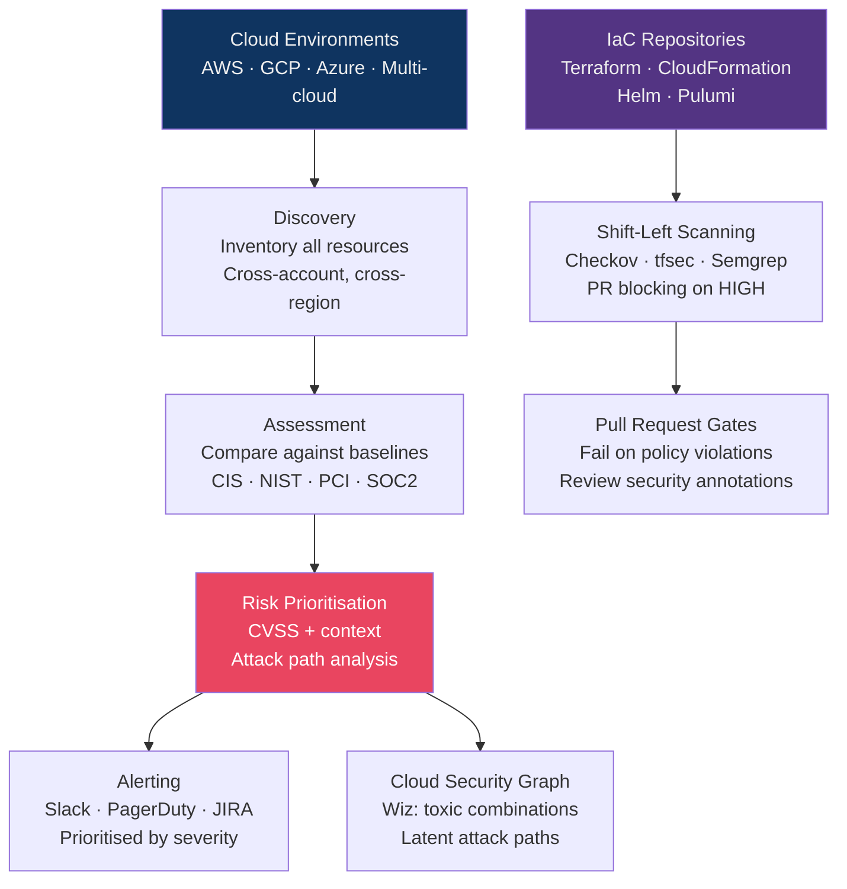
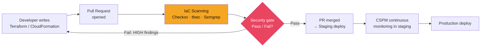

# 📋 CSPM and Cloud Compliance

> [!abstract] TL;DR
> Cloud Security Posture Management (CSPM) continuously inventories cloud resources and checks them against security baselines (CIS Benchmarks, NIST CSF, PCI-DSS), alerting on misconfigurations — the #1 source of cloud breaches. Commercial leaders: Wiz (agentless, graph-based attack path analysis), Prisma Cloud (comprehensive CWP+CSPM), Orca Security (SideScanning). Open-source: Prowler (AWS/GCP/Azure), ScoutSuite. IaC security scanning (Checkov for Terraform/CloudFormation, tfsec for Terraform) shifts posture checks left to the PR/CI stage — catching misconfigured S3 buckets and open security groups before they're ever deployed. Continuous compliance turns PCI-DSS and SOC2 audits from point-in-time snapshots into ongoing operational states.

---

## CSPM Architecture



---

## CSPM Tools Comparison

| Tool | Model | Strengths | Weaknesses |
|------|-------|-----------|------------|
| **Wiz** | Commercial SaaS | Agentless, cloud-native graph, toxic combination detection | Expensive ($500k+/year) |
| **Prisma Cloud** (Palo Alto) | Commercial SaaS | Broadest coverage (CSPM+CWPP+CIEM+DSPM) | Complex, expensive |
| **Orca Security** | Commercial SaaS | SideScanning (no agents), deep data awareness | AWS/Azure/GCP only |
| **Defender for Cloud** | Azure-native | Integrated with Azure, free tier | Limited multi-cloud |
| **Security Command Center** | GCP-native | Deep GCP integration | GCP only |
| **Prowler** | Open-source CLI | Free, 500+ checks, all three clouds, GDPR/HIPAA | CLI tool, no UI |
| **ScoutSuite** | Open-source | Multi-cloud, HTML report | Manual execution, no CI |
| **CloudSploit** | Open-source/commercial | Aqua Security backed | Less comprehensive |

---

## Prowler — Open-Source CSPM

```bash
# Install
pip install prowler

# Scan AWS account with CIS Benchmark
prowler aws --compliance cis_aws_3.0

# Scan specific services
prowler aws --services s3,iam,cloudtrail,guardduty

# Output formats
prowler aws -M json,html,csv --output-filename prowler-results

# Sample finding:
# [HIGH] s3.13: S3 Buckets should have MFA Delete enabled
# Account: 123456789012 | Region: us-east-1
# Resource: arn:aws:s3:::my-sensitive-bucket
# Recommendation: Enable MFA Delete to prevent accidental deletion

# Integrate with Security Hub (sends findings to AWS Security Hub)
prowler aws --send-sh-only-fails

# GCP scan
prowler gcp --project-id my-project

# Azure scan
prowler azure --subscription-id <sub-id>
```

---

## CIS Benchmarks

CIS (Center for Internet Security) Benchmarks are prescriptive configuration guidelines, versioned per cloud:

**CIS AWS Foundations Benchmark v3.0 key controls:**

| Section | Key Controls |
|---------|-------------|
| 1. IAM | 1.4 No root access keys; 1.5 MFA on root; 1.14 Hardware MFA for root; 1.16 IAM policies attached to groups/roles (not users) |
| 2. Storage | 2.1.1 S3 Block Public Access (account level); 2.1.2 MFA Delete; 2.2.1 EBS encryption by default |
| 3. Logging | 3.1 CloudTrail in all regions; 3.2 CloudTrail log validation; 3.3 CloudTrail S3 access logging |
| 4. Monitoring | 4.3 Alert on root usage; 4.4 Alert on IAM policy changes; 4.14 Alert on VPC changes |
| 5. Networking | 5.2 No 0.0.0.0/0 on port 22; 5.3 No 0.0.0.0/0 on port 3389 |

---

## Continuous Compliance Frameworks

### PCI-DSS v4.0 Cloud Applicability

```
PCI-DSS Requirement → Cloud Control

Req 1: Network security controls
  → VPC with restricted security groups, no 0.0.0.0/0

Req 2: Default configurations
  → Prowler/AWS Config: CIS Benchmark compliance

Req 7: Access restriction
  → IAM least privilege, no shared accounts, MFA enforced

Req 8: User identification and authentication
  → AWS IAM Identity Center, MFA for all privileged access

Req 10: Log and monitor all access
  → CloudTrail, VPC Flow Logs, S3 server access logs, GuardDuty

Req 12: Information security policy
  → AWS Organizations SCPs, Config conformance packs
```

### NIST CSF 2.0 → Cloud Implementation

| CSF Function | AWS Services | GCP Services | Azure Services |
|-------------|-------------|-------------|---------------|
| Identify | AWS Config, IAM Analyzer | Security Health Analytics | Defender for Cloud |
| Protect | SCPs, KMS, WAF | VPC SC, Cloud Armor, KMS | NSGs, Key Vault, PIM |
| Detect | GuardDuty, CloudTrail | SCC, Cloud Audit Logs | Sentinel, Defender XDR |
| Respond | Systems Manager, Lambda | Cloud Functions automation | Azure Automation |
| Recover | AWS Backup, multi-region | Cloud SQL failover | Azure Site Recovery |

---

## Infrastructure Drift Detection

```bash
# AWS Config Rules: detect drift in real-time
# Any S3 bucket that becomes public triggers non-compliant → auto-remediation

# AWS Config Auto-Remediation: SSM document runs when non-compliant
{
  "ConfigRuleName": "s3-bucket-public-read-prohibited",
  "AutoRemediationAction": {
    "TargetType": "SSM_DOCUMENT",
    "TargetId": "AWS-DisableS3BucketPublicReadWrite",
    "Parameters": {
      "AutomationAssumeRole": "arn:aws:iam::123:role/config-remediation-role",
      "S3BucketName": {"RESOURCE_ID": {}}
    }
  }
}

# Terraform: detect drift between desired state and actual cloud state
terraform plan  # Shows differences between .tf files and live cloud
terraform apply -auto-approve  # Reconcile (use carefully in production)

# Driftctl: dedicated infrastructure drift detection tool
driftctl scan --from tfstate://s3://my-tfstate-bucket/terraform.tfstate
# Reports: resources managed by Terraform, unmanaged resources, deleted resources
```

---

## IaC Security Scanning

### Checkov

```bash
# Scan Terraform directory
checkov -d ./terraform --framework terraform

# Output with failing checks:
# Check: CKV_AWS_18: "Ensure the S3 bucket has access logging enabled"
#   FAILED for resource: aws_s3_bucket.data_bucket
#   File: /terraform/s3.tf:10-25
#   Guide: https://docs.prismacloud.io/en/enterprise-edition/content-collections/...

# Run in CI (GitHub Actions)
- name: Checkov IaC Scan
  uses: bridgecrewio/checkov-action@v12
  with:
    directory: terraform/
    framework: terraform
    check: CKV_AWS_18,CKV_AWS_145,CKV_AWS_53  # Specific checks
    soft_fail: false  # Block PR on violations

# Custom policy (Python):
from checkov.common.models.enums import CheckResult, CheckCategories
from checkov.terraform.checks.resource.base_resource_check import BaseResourceCheck

class S3MFADeleteCheck(BaseResourceCheck):
    def __init__(self):
        name = "Ensure S3 bucket has MFA Delete enabled"
        id = "CKV_CUSTOM_S3_01"
        supported_resources = ['aws_s3_bucket_versioning']
        categories = [CheckCategories.ENCRYPTION]
        super().__init__(name=name, id=id, categories=categories,
                         supported_resources=supported_resources)

    def scan_resource_conf(self, conf):
        mfa_delete = conf.get("versioning_configuration", [{}])[0].get("mfa_delete", ["Disabled"])[0]
        return CheckResult.PASSED if mfa_delete == "Enabled" else CheckResult.FAILED
```

### tfsec

```bash
# Scan Terraform code
tfsec ./terraform

# Example findings:
# aws-s3-enable-bucket-encryption
# aws-s3-enable-bucket-logging
# aws-iam-no-policy-wildcards (HIGH: Wildcard action found in policy)

# SARIF output for GitHub Security tab integration
tfsec --format sarif --out tfsec-results.sarif ./terraform
```

---

## Shift-Left Security Pipeline



Benefits of shift-left IaC scanning:
- Fix cost: $10 at development vs $1,000+ in production
- Prevents configuration drift by catching issues before deployment
- Developer education: inline feedback on security best practices
- Compliance evidence: PR history shows security review

---

## Compliance Framework Comparison

| Framework | Scope | Cloud Relevance | Audit Frequency |
|-----------|-------|----------------|-----------------|
| CIS Benchmarks | Technical configuration | Direct (per-cloud) | Continuous |
| NIST CSF | Risk management | Framework-level | Annual |
| SOC 2 Type II | Trust service criteria | Operational controls | Annual (12-month period) |
| PCI-DSS v4 | Payment card data | Network segmentation, logging | Annual + quarterly scans |
| ISO 27001 | ISMS | Organisation-wide | Annual + surveillance |
| HIPAA | Healthcare PHI | AWS/Azure/GCP BAA required | Annual |
| FedRAMP | US federal agencies | ATO required for federal cloud | Annual + continuous |

---

## Common Pitfalls

1. **Alert fatigue from CSPM** — Prioritise by CVSS + exploitability; Wiz's "toxic combination" scoring surfaces genuinely dangerous chains
2. **CSPM as one-time audit** — Continuous monitoring is the value; one-time scans miss resources created after the scan
3. **Not scanning IaC modules** — Third-party Terraform modules can introduce misconfigurations; scan all modules including public registry ones
4. **Treating all findings equally** — A misconfigured CloudWatch metric filter (LOW) vs a publicly accessible S3 bucket with PII (CRITICAL) are not equivalent
5. **No auto-remediation for obvious risks** — Simple violations (S3 block public access disabled) should trigger auto-remediation, not just alerts

---

## Related Concepts

- [[Cloud_Security_Fundamentals|→ Cloud Security Fundamentals]] — Cloud misconfigurations as #1 risk
- [[AWS_Security|→ AWS Security]] — AWS Config, Security Hub
- [[Container_and_Kubernetes_Security|→ K8s Security]] — Container IaC (Helm) scanning
- [[_MOC_Cloud_Security|↑ Cloud Security MOC]]

---

## Review Questions

1. A Terraform module creates an S3 bucket with versioning enabled but no server-side encryption and public ACL. Which Checkov checks would fire, and what is the CIS Benchmark reference for S3 encryption?
2. Compare Wiz and Prowler for a 200-account AWS organisation. What does each tool do well, and what does the other miss? Design a CSPM strategy that uses both.
3. Your CSPM tool generates 1,200 findings daily. Describe a prioritisation strategy to reduce this to an actionable daily queue of 10–20 items.
4. Explain the concept of infrastructure drift. Your Terraform state shows an S3 bucket with `block_public_access = true` but Prowler reports it as public. How do you investigate and remediate?

---

## Sources

- CIS Benchmarks: https://www.cisecurity.org/cis-benchmarks
- Prowler: https://github.com/prowler-cloud/prowler
- Checkov: https://www.checkov.io/
- Wiz CSPM: https://www.wiz.io/blog/what-is-cspm

#Cybersecurity #CloudSecurity #CSPM #Compliance #Checkov #Prowler #IaC
