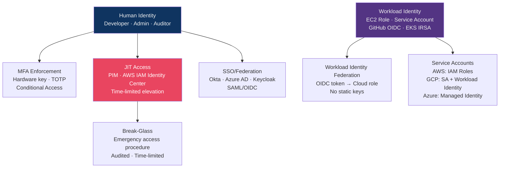
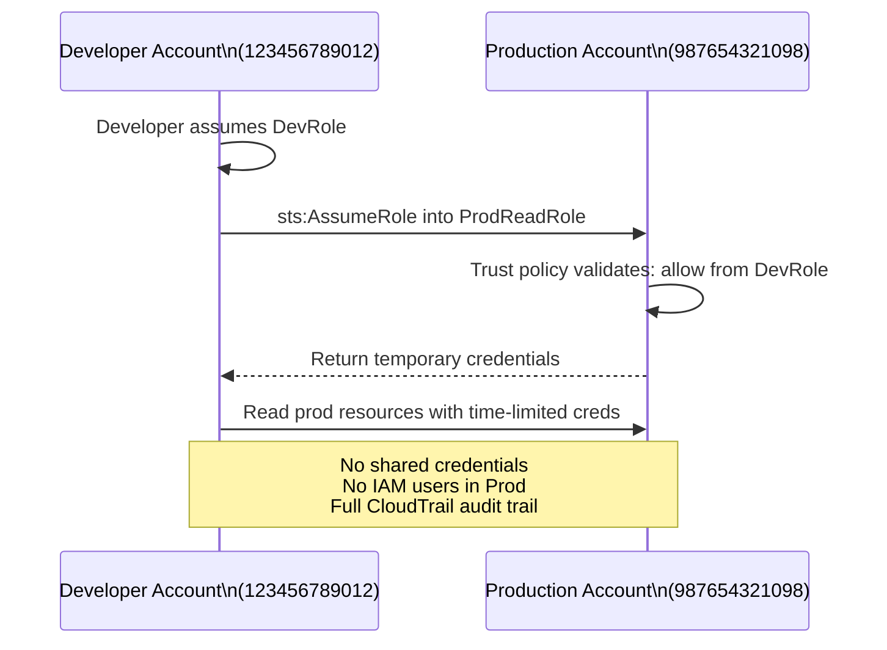
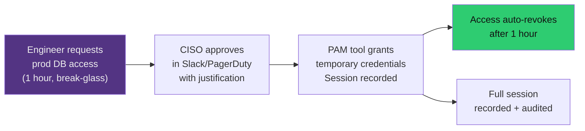

# 🔑 Cloud Identity and Access Management

> [!abstract] TL;DR
> Cloud IAM is the new perimeter — all cloud attacks ultimately succeed by abusing identity. Core principles: no root/owner standing access (use JIT elevation), enforce MFA for all console users, use roles/service accounts (not long-lived keys) for workloads, implement cross-account roles (not shared credentials) for multi-account access, and apply ABAC for dynamic, attribute-driven access control at scale. Workload Identity Federation eliminates service account key files entirely by letting external workloads (GitHub Actions, GKE pods, Azure VMs) authenticate using short-lived OIDC tokens. Zero Standing Privileges (ZSP) is the north-star: no one has elevated access until they request it.

---

## Cloud IAM Architecture



---

## IAM Best Practices

### No Root / Owner Account Usage

```bash
# AWS: Root account should only be used for:
# 1. Initial account creation
# 2. Changing account email
# 3. Restoring compromised IAM admin access

# Immediately after account creation:
aws iam create-user --user-name admin
aws iam attach-user-policy --user-name admin \
  --policy-arn arn:aws:iam::aws:policy/AdministratorAccess
aws iam create-virtual-mfa-device --virtual-mfa-device-name admin-mfa

# Lock root: delete access keys, enable MFA, log into monitoring
aws iam delete-access-key --access-key-id <root-key-id>
```

### MFA for All Accounts

```json
// IAM policy: deny all actions if MFA not present (attach to all human users)
{
  "Version": "2012-10-17",
  "Statement": [
    {
      "Sid": "DenyAllWithoutMFA",
      "Effect": "Deny",
      "NotAction": [
        "iam:GetSessionToken",
        "iam:CreateVirtualMFADevice",
        "iam:EnableMFADevice"
      ],
      "Resource": "*",
      "Condition": {
        "BoolIfExists": {
          "aws:MultiFactorAuthPresent": "false"
        }
      }
    }
  ]
}
```

---

## Service Accounts and Workload Identity

### AWS: IAM Roles (Instance Profiles)

```python
# Application code should NEVER use access keys
# BAD:
import boto3
client = boto3.client('s3',
    aws_access_key_id='AKIA...',       # Long-lived, can be committed to git
    aws_secret_access_key='...')

# GOOD: Use EC2 instance role (auto-rotated every 6h by STS)
import boto3
client = boto3.client('s3')  # Automatically uses instance metadata credentials
# boto3 credential chain:
# 1. Environment vars (CI/CD)
# 2. Shared credentials file
# 3. Instance metadata (EC2 role) ← production
# 4. ECS task role
# 5. EKS service account (IRSA)
```

### EKS IRSA (IAM Roles for Service Accounts)

```bash
# Associate Kubernetes ServiceAccount with AWS IAM Role
eksctl create iamserviceaccount \
  --cluster my-cluster \
  --namespace production \
  --name app-service-account \
  --attach-policy-arn arn:aws:iam::aws:policy/AmazonS3ReadOnlyAccess \
  --approve

# Trust policy on IAM role allows only this specific Kubernetes SA to assume it
# No credentials to manage; short-lived tokens via OIDC
```

### Workload Identity Federation (Keyless Auth)

```yaml
# GitHub Actions → AWS (no secrets needed in GitHub)
# Workflow:
jobs:
  deploy:
    permissions:
      id-token: write  # Request OIDC token from GitHub
      contents: read
    steps:
      - uses: aws-actions/configure-aws-credentials@v4
        with:
          role-to-assume: arn:aws:iam::123456789:role/github-actions-deploy
          aws-region: us-east-1
          # GitHub provides JWT → AWS STS verifies with GitHub OIDC provider
          # → returns temporary credentials for the IAM role

# AWS IAM Trust Policy for GitHub OIDC
{
  "Statement": [{
    "Effect": "Allow",
    "Principal": {"Federated": "arn:aws:iam::123:oidc-provider/token.actions.githubusercontent.com"},
    "Action": "sts:AssumeRoleWithWebIdentity",
    "Condition": {
      "StringEquals": {
        "token.actions.githubusercontent.com:aud": "sts.amazonaws.com",
        "token.actions.githubusercontent.com:sub": "repo:myorg/myrepo:ref:refs/heads/main"
      }
    }
  }]
}
```

---

## Cross-Account Roles



```json
// Production account trust policy: allow specific role from dev account
{
  "Statement": [{
    "Effect": "Allow",
    "Principal": {
      "AWS": "arn:aws:iam::123456789012:role/DeploymentRole"
    },
    "Action": "sts:AssumeRole",
    "Condition": {
      "StringEquals": {"sts:ExternalId": "unique-external-id-per-customer"},
      "Bool": {"aws:MultiFactorAuthPresent": "true"}  // Require MFA to cross account
    }
  }]
}
```

---

## Federated Identity (SAML/OIDC with Cloud)

### AWS SSO via IAM Identity Center

```
Corporate IdP (Okta/Azure AD) → SAML 2.0 → AWS IAM Identity Center
→ Provision users/groups → Map to Permission Sets
→ User logs in once to Okta → Gets access to 50 AWS accounts
```

### OIDC Federation with Azure AD

```bash
# Azure AD app registration → federated identity credential
# Allows GCP/AWS workloads to authenticate using Azure AD tokens
az ad app federated-credential create \
  --id <app-id> \
  --parameters '{
    "name": "gcp-workload-federation",
    "issuer": "https://accounts.google.com",
    "subject": "projects/123/serviceAccounts/app@project.iam.gserviceaccount.com",
    "audiences": ["api://AzureADTokenExchange"]
  }'
```

---

## Attribute-Based Access Control (ABAC)

ABAC grants access based on attributes (tags) rather than explicit policy bindings — scales better than RBAC for large organisations:

```json
// AWS ABAC: allow access to resources tagged with same project as the user
{
  "Effect": "Allow",
  "Action": "s3:*",
  "Resource": "arn:aws:s3:::*",
  "Condition": {
    "StringEquals": {
      "aws:ResourceTag/Project": "${aws:PrincipalTag/Project}"
    }
  }
}
// Tag the user with Project=Alpha → they can only access S3 buckets tagged Project=Alpha
// No policy changes needed when a new project S3 bucket is created — just tag it
```

---

## Just-In-Time (JIT) Access Provisioning



JIT benefits over standing privileges:
- Eliminates credential theft risk for idle privileged accounts
- Every access event has documented justification
- Insider threat window limited to requested duration
- Integrations: AWS IAM Identity Center, Azure PIM, CyberArk, HashiCorp Boundary

---

## Privileged Access Workstations (PAWs)

PAWs are dedicated hardened machines for administrative tasks, isolated from daily browsing/email:

| Feature | Standard Workstation | PAW |
|---------|---------------------|-----|
| Internet access | Full | Restricted to IT/security sites only |
| Email client | Yes | No (admin tasks only) |
| Browser | Standard | Hardened profile, no plugins |
| MFA | Sometimes | Always (FIDO2 hardware key) |
| Network | Corporate LAN | Isolated PAW network segment |
| Purpose | General work | Cloud console, privileged SSH only |
| Monitoring | Standard EDR | Enhanced EDR + session recording |

---

## Zero Standing Privileges (ZSP)

ZSP is the ideal state where no account has persistent elevated privileges — all privilege is JIT:

```
Current state (most orgs):
  Admin accounts with permanent access → High breach impact

Target ZSP state:
  1. All privileged roles are "eligible" (not active)
  2. Access is requested per-task with justification
  3. Approved for minimum time needed
  4. Session recorded
  5. Access auto-revoked
  6. Anomaly detection on activation patterns
```

Implementation path:
1. Identify all accounts with standing privileged access
2. Move to JIT with Azure PIM, AWS Permission Sets with approval, CyberArk
3. Implement break-glass procedures for emergency access
4. Audit ZSP coverage quarterly

---

## Common Pitfalls

1. **Access keys in code/config** — Use Workload Identity Federation; scan with `git-secrets`, TruffleHog pre-commit hooks
2. **Wildcard `*` Resource in policies** — Even `s3:GetObject` on `*` exposes all buckets; always scope to specific ARNs
3. **Shared service accounts** — Multiple services using one SA makes blast radius analysis impossible; one SA per service
4. **Not auditing unused IAM entities** — Use AWS IAM Access Analyzer, AWS IAM Last Used dates to prune stale access
5. **Ignoring cross-account trust policies** — `sts:AssumeRole` from any principal is effectively a backdoor; review trust policies regularly

---

## Related Concepts

- [[AWS_Security|→ AWS IAM deep dive]] — Policy evaluation, SCPs
- [[GCP_and_Azure_Security|→ Azure PIM, GCP Workload Identity]]
- [[SSO_and_Federation|→ SAML/OIDC Federation]] — IdP integration
- [[PAM_and_Privileged_Access|→ PAM Tools]] — CyberArk, Vault, JIT tooling
- [[Multi_Factor_Authentication|→ MFA]] — Phishing-resistant MFA options
- [[_MOC_Cloud_Security|↑ Cloud Security MOC]]

---

## Review Questions

1. Your organisation has 50 AWS accounts. Developers need read access to production CloudWatch logs for debugging. Design the IAM architecture using AWS Organizations, IAM Identity Center, and cross-account roles. How do you ensure MFA is required for cross-account access to production?
2. A GitHub Actions workflow needs to push Docker images to Amazon ECR and deploy to EKS. Compare using static IAM access keys stored as GitHub secrets versus OIDC Workload Identity Federation. What happens if the GitHub Actions runner is compromised in each case?
3. An engineer has the AWS IAM tag `Department=Engineering`. Write an ABAC policy that allows EC2 `Describe*` actions only on instances tagged with the same department.
4. What is Zero Standing Privileges (ZSP)? Identify three technical controls that together implement ZSP for cloud admin access.

---

## Sources

- AWS IAM Best Practices: https://docs.aws.amazon.com/IAM/latest/UserGuide/best-practices.html
- GitHub OIDC with AWS: https://docs.github.com/en/actions/deployment/security-hardening-your-deployments/configuring-openid-connect-in-amazon-web-services
- GCP Workload Identity Federation: https://cloud.google.com/iam/docs/workload-identity-federation

#Cybersecurity #CloudSecurity #IAM #WorkloadIdentity #JIT #ZeroStandingPrivileges #ABAC
