# ☁️ Cloud Security Fundamentals

> [!abstract] TL;DR
> Cloud security starts with the shared responsibility model: the cloud provider secures the infrastructure, you secure everything on top of it. The #1 cloud risk is misconfiguration — not sophisticated exploits. The OWASP Cloud-Native Top 10 maps the attack surface: insecure workload identities, misconfigured IAM, unauthenticated APIs, and exposed storage. SSRF against the Instance Metadata Service (169.254.169.254) is the canonical cloud-specific attack, allowing credential theft from any server-side application. Cloud Security Alliance (CSA) STAR provides the governance framework; IMDSv2, SCPs, and posture management tools are the primary defence mechanisms.

---

## Intuition — Analogy First

On-premises security is like owning a house — you are responsible for every lock, window, and alarm system. Cloud security is like renting an apartment: the landlord (cloud provider) is responsible for the building structure, plumbing, and common areas, but you are responsible for everything inside your unit. The danger is assuming the landlord handles more than they do. Most cloud breaches aren't zero-days — they're unlocked doors the tenant left open.

---

## Shared Responsibility Model

```mermaid
graph TD
    subgraph Provider["Cloud Provider Responsibility"]
        PHYS["Physical Data Centres"]
        NET["Network Infrastructure"]
        HYP["Hypervisor / Hardware"]
        IAAS_P["IaaS: Compute, Storage, Networking"]
        PAAS_P["PaaS: Runtime, Middleware, OS patches"]
        SAAS_P["SaaS: Application, Data Management"]
    end

    subgraph Customer["Customer Responsibility"]
        DATA["Data Classification & Encryption"]
        IAM["Identity & Access Management"]
        OS["Guest OS patching (IaaS)"]
        CONF["Configuration & Firewall Rules"]
        APP["Application Code & Dependencies"]
        NET2["Network Controls (Security Groups, NACLs)"]
    end

    IaaS["IaaS (EC2, GCE, Azure VM)"] --> IAAS_P
    IaaS --> OS
    PaaS["PaaS (RDS, App Engine, Azure Functions)"] --> PAAS_P
    PaaS --> APP
    SaaS["SaaS (Office 365, Salesforce)"] --> SAAS_P
    SaaS --> DATA

    style Provider fill:#0f3460,color:#eee
    style Customer fill:#533483,color:#eee
```



| Service Model | Provider Handles | Customer Handles |
|---------------|-----------------|-----------------|
| IaaS (EC2) | Hardware, network, hypervisor | OS, runtime, middleware, apps, data, IAM |
| PaaS (RDS) | Hardware, OS, runtime | Application, data, IAM, configuration |
| SaaS (Gmail) | Everything up to app layer | Data governance, access controls, user activity |

---

## Cloud Threat Landscape

### SSRF Against Instance Metadata Service

The most exploited cloud-specific attack:

```http
# Attacker sends request to a vulnerable server-side application
POST /api/proxy
{"url": "http://169.254.169.254/latest/meta-data/iam/security-credentials/"}

# Response: IAM role credentials
{
  "AccessKeyId": "ASIA...",
  "SecretAccessKey": "...",
  "Token": "...",
  "Expiration": "2026-07-29T00:00:00Z"
}

# Attacker now has temporary credentials for the IAM role
# Pivot: enumerate S3 buckets, EC2 instances, secrets
aws s3 ls --profile stolen-creds
```

Capital One breach (2019): SSRF via WAF misconfiguration → IMDSv1 credentials → 100M+ records exfiltrated.

**AWS IMDSv2 defence**: Requires a PUT request to get a session token first, breaking SSRF chains:
```bash
# IMDSv1 (vulnerable): single GET
curl http://169.254.169.254/latest/meta-data/iam/security-credentials/

# IMDSv2 (protected): requires token, SSRF can't do PUT first
TOKEN=$(curl -X PUT -H "X-aws-ec2-metadata-token-ttl-seconds: 21600" \
  http://169.254.169.254/latest/api/token)
curl -H "X-aws-ec2-metadata-token: $TOKEN" \
  http://169.254.169.254/latest/meta-data/iam/security-credentials/
```

### Credential Theft

- **Hardcoded credentials in code/containers**: GitHub truffleHog/GitLeaks scan for secrets in git history
- **Overpermissioned instance roles**: EC2/Lambda with `AdministratorAccess` instead of least-privilege policy
- **Credential leaks in logs**: CloudWatch/application logs capturing environment variables

### S3 Bucket Exposure

```bash
# Common misconfiguration: public read ACL on bucket with sensitive data
aws s3api put-bucket-acl --bucket my-bucket --acl public-read  # DON'T DO THIS

# Check for public buckets in your account
aws s3api get-bucket-policy-status --bucket my-bucket
aws s3api get-public-access-block --bucket my-bucket

# Enumerate publicly accessible buckets (grey-hat recon)
# bucket-finder, AWSBucketDump tools
```

### Privilege Escalation Paths

Common privilege escalation via IAM misconfigurations:
1. `iam:PassRole` + `ec2:RunInstances` → launch EC2 with admin role
2. `iam:CreatePolicyVersion` → create new version of existing policy with `*:*`
3. `iam:AttachUserPolicy` → attach `AdministratorAccess` to own user
4. `lambda:UpdateFunctionCode` + `iam:PassRole` → update Lambda with malicious code

---

## OWASP Cloud-Native Top 10

| # | Risk | Example |
|---|------|---------|
| C1 | Insecure Cloud, Container, or Orchestration Configuration | S3 public ACL, K8s dashboard exposed |
| C2 | Injection Flaws (Host OS, App Level) | SQL injection in Lambda, command injection in containers |
| C3 | Improper Authentication & Authorisation | No MFA on root, wildcard IAM policies |
| C4 | CI/CD Pipeline & Software Supply Chain Flaws | Compromised build dependencies, no image signing |
| C5 | Insecure Secret Management | Secrets in env vars, plaintext in config files |
| C6 | Over-Permissive or Insecure Network Policies | 0.0.0.0/0 ingress rules, no VPC segmentation |
| C7 | Using Components with Known Vulnerabilities | Unpatched container base images |
| C8 | Improper Asset Management | Shadow cloud accounts, forgotten S3 buckets |
| C9 | Inadequate 'Compute Resource Quota' Limit | No billing alerts, crypto-mining via stolen credentials |
| C10 | Ineffective Logging and Monitoring | CloudTrail disabled, no alerting on root usage |

---

## Cloud Security Alliance (CSA) STAR

CSA STAR (Security, Trust, Assurance, and Risk) is a cloud-specific certification programme:

- **Level 1** — Self-Assessment: vendor completes Consensus Assessments Initiative Questionnaire (CAIQ)
- **Level 2** — Third-party Assessment: independent audit against CCM (Cloud Controls Matrix)
- **Level 3** — Continuous Monitoring: ongoing compliance validation

CCM (Cloud Controls Matrix): 197 control objectives across 17 domains — the cloud-specific control framework.

---

## On-Prem vs Cloud Attack Surface Comparison

| Dimension | On-Premises | Cloud |
|-----------|-------------|-------|
| Perimeter | Physical/network firewall | IAM is the new perimeter |
| Identity | AD/LDAP, physical access | Federated identity, API keys, service accounts |
| Secrets | HSM, physical vault | Secrets Manager, Key Vault — or env vars (bad) |
| Configuration drift | Manual audits | Automated CSPM (Prisma Cloud, Wiz, Prowler) |
| Blast radius | Limited to network segment | Cross-region, cross-account via IAM lateral movement |
| Logging | SIEM with syslog | CloudTrail, CloudWatch, centralized log aggregation |
| Exposure | Known IP ranges | Storage public by default risk (S3, Azure Blob) |

---

## Real-World Notes

- Gartner: "Through 2025, 99% of cloud security failures will be the customer's fault" — misconfigurations, not cloud provider breaches
- CrowdStrike 2024: Cloud intrusions up 75% YoY; identity-based attacks (credential theft, IAM abuse) represent 60% of cloud incidents
- The Uber breach (2022): hardcoded AWS credentials in a private GitHub repo → full AWS account compromise
- Tesla cryptojacking (2018): unsecured Kubernetes dashboard → attacker installed crypto miners, paid for by Tesla's AWS bill

---

## Common Pitfalls

1. **"The cloud provider handles security"** — Shared responsibility means you own configuration, data, and IAM entirely
2. **Over-relying on VPC/network controls** — IAM is the real perimeter; a stolen API key bypasses all network controls
3. **Using access keys instead of IAM roles** — Long-lived access keys are credentials that can be stolen; roles are ephemeral
4. **Ignoring the metadata service** — Every EC2/VM has IMDS at 169.254.169.254; forcing IMDSv2 is a critical control
5. **Not enabling CloudTrail/audit logs** — Cloud attackers count on logging gaps; enable CloudTrail in all regions from day one

---

## Related Concepts

- [[AWS_Security|→ AWS Security Services]] — GuardDuty, IAM, Security Hub, S3 controls
- [[GCP_and_Azure_Security|→ GCP & Azure Security]] — Platform-specific controls
- [[Container_and_Kubernetes_Security|→ Container Security]] — Container-specific cloud attack surface
- [[CSPM_and_Compliance|→ CSPM & Compliance]] — Posture management tools
- [[Cloud_Identity_and_Access|→ Cloud IAM]] — Identity best practices
- [[_MOC_Cloud_Security|↑ Cloud Security MOC]]

---

## Review Questions

1. Explain the shared responsibility boundary for an application running on AWS Lambda with an RDS PostgreSQL database. Who is responsible for patching the OS, the database engine, the application code, and encrypting data at rest?
2. A security engineer discovers that all EC2 instances in production use IMDSv1. What attack does this enable, describe the exploit chain step-by-step, and explain why IMDSv2 breaks it.
3. An auditor finds an IAM policy granting `iam:PassRole` and `ec2:RunInstances`. Why is this combination dangerous even if no other IAM permissions are granted?
4. Your S3 bucket containing customer PII had "Block Public Access" enabled but still appears in breach data. List three other exposure vectors that Block Public Access does not prevent.

---

## Sources

- OWASP Cloud-Native Application Security Top 10: https://owasp.org/www-project-cloud-native-application-security-top-10/
- CSA Cloud Controls Matrix: https://cloudsecurityalliance.org/research/cloud-controls-matrix/
- AWS Shared Responsibility Model: https://aws.amazon.com/compliance/shared-responsibility-model/

#Cybersecurity #CloudSecurity #SharedResponsibility #SSRF #IAM
