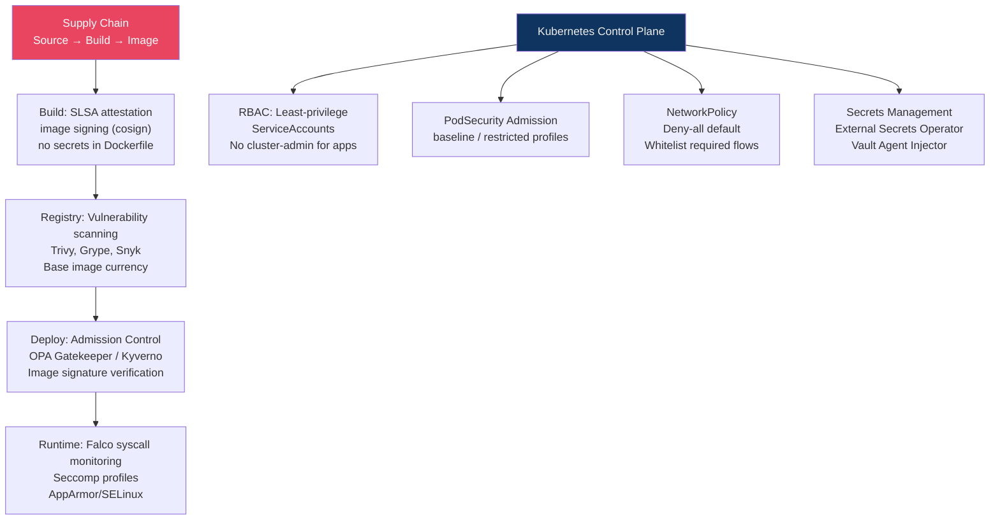

# 🐳 Container and Kubernetes Security

> [!abstract] TL;DR
> Container security starts at the image layer: scan images with Trivy/Grype, use minimal base images (distroless), run as non-root, enforce read-only filesystems. Kubernetes hardening centres on RBAC (least-privilege ServiceAccounts), PodSecurity admission to reject privileged pods, NetworkPolicy for east-west traffic isolation, and external secrets injection (Vault/ESO). Runtime security via Falco detects anomalous syscalls (shell spawned in container, sensitive file access) post-deployment. Supply chain security with image signing (cosign) and SLSA attestation verifies that what runs in prod was built from trusted source — closing the SolarWinds-style build compromise vector.

---

## Container Security Layers



---

## Container Image Security

### Image Scanning

```bash
# Trivy: comprehensive vulnerability scanner for images, filesystems, repos
trivy image nginx:1.25.0

# Output sample:
# nginx:1.25.0 (debian 12.0)
# Total: 123 (CRITICAL: 5, HIGH: 23, MEDIUM: 45, LOW: 50)
# ┌──────────────────┬───────────────┬──────────┬──────────────┐
# │ Library          │ Vulnerability │ Severity │ Fixed Version│
# ├──────────────────┼───────────────┼──────────┼──────────────┤
# │ libssl3          │ CVE-2023-xxxx │ CRITICAL │ 3.0.9-1      │

# Scan in CI pipeline (fail on CRITICAL)
trivy image --exit-code 1 --severity CRITICAL,HIGH my-app:latest

# Grype: alternative scanner
grype my-app:latest --fail-on critical
```

### Base Image Hardening

```dockerfile
# BAD: Full OS with shell, package managers, debug tools
FROM ubuntu:22.04
COPY app /app
CMD ["/app"]

# BETTER: Minimal base image
FROM debian:bookworm-slim

# BEST: Distroless (no shell, no package manager, minimal attack surface)
FROM gcr.io/distroless/static-debian12
COPY --chown=nonroot:nonroot app /app
USER nonroot
CMD ["/app"]

# Multi-stage build: build in full image, copy binary to minimal
FROM golang:1.21 AS builder
WORKDIR /app
COPY . .
RUN CGO_ENABLED=0 go build -o server .

FROM gcr.io/distroless/static-debian12
COPY --from=builder /app/server /server
USER 65532:65532  # nonroot UID
ENTRYPOINT ["/server"]
```

### Non-Root and Read-Only

```dockerfile
# Always specify a non-root user
RUN addgroup --gid 10001 app && adduser --uid 10001 --gid 10001 --no-create-home app
USER 10001:10001

# Read-only root filesystem (mount tmpfs for /tmp if needed)
# In Kubernetes pod spec:
securityContext:
  readOnlyRootFilesystem: true
  runAsNonRoot: true
  runAsUser: 10001
  allowPrivilegeEscalation: false
  capabilities:
    drop: ["ALL"]  # Drop all Linux capabilities
    add: ["NET_BIND_SERVICE"]  # Add back only what's needed
```

---

## Kubernetes RBAC

```yaml
# ServiceAccount for application (instead of default SA)
apiVersion: v1
kind: ServiceAccount
metadata:
  name: app-service-account
  namespace: production

---
# Role: scoped to specific namespace and resources
apiVersion: rbac.authorization.k8s.io/v1
kind: Role
metadata:
  name: app-reader
  namespace: production
rules:
  - apiGroups: [""]
    resources: ["configmaps"]
    verbs: ["get", "list"]  # Not "create", "update", "delete"
  # Never grant "pods/exec" (allows shell access), "secrets" (exposes all secrets)

---
# RoleBinding: associate ServiceAccount with Role
apiVersion: rbac.authorization.k8s.io/v1
kind: RoleBinding
metadata:
  name: app-reader-binding
  namespace: production
subjects:
  - kind: ServiceAccount
    name: app-service-account
    namespace: production
roleRef:
  kind: Role
  name: app-reader
  apiGroup: rbac.authorization.k8s.io
```

Dangerous RBAC patterns to avoid:
- `cluster-admin` ClusterRoleBinding for application SAs
- `verbs: ["*"]` or `resources: ["*"]` in roles
- `pods/exec` permission (direct shell into any pod)
- `secrets` read permission at cluster scope

---

## PodSecurity Admission

PodSecurity Admission (PSA) replaced PodSecurityPolicies in Kubernetes 1.25:

```yaml
# Enforce restricted profile in namespace
apiVersion: v1
kind: Namespace
metadata:
  name: production
  labels:
    pod-security.kubernetes.io/enforce: restricted
    pod-security.kubernetes.io/enforce-version: v1.28
    pod-security.kubernetes.io/warn: restricted
    pod-security.kubernetes.io/audit: restricted
```

Security profiles:
- **privileged**: no restrictions (for system components only)
- **baseline**: prevents known privilege escalation; blocks `hostPath`, `hostNetwork`, privileged containers
- **restricted**: hardened; requires non-root, drops all capabilities, no `allowPrivilegeEscalation`

---

## NetworkPolicy

```yaml
# Default deny-all in namespace (then whitelist required flows)
apiVersion: networking.k8s.io/v1
kind: NetworkPolicy
metadata:
  name: default-deny-all
  namespace: production
spec:
  podSelector: {}  # Matches all pods
  policyTypes: [Ingress, Egress]

---
# Allow frontend pods to reach backend pods on port 8080
apiVersion: networking.k8s.io/v1
kind: NetworkPolicy
metadata:
  name: allow-frontend-to-backend
spec:
  podSelector:
    matchLabels:
      app: backend
  ingress:
    - from:
        - podSelector:
            matchLabels:
              app: frontend
      ports:
        - port: 8080

---
# Allow egress to external API (DNS + HTTPS)
spec:
  podSelector:
    matchLabels:
      app: api-client
  egress:
    - ports:
        - port: 53
          protocol: UDP  # DNS
    - to:
        - ipBlock:
            cidr: 0.0.0.0/0
            except: ["10.0.0.0/8", "172.16.0.0/12", "192.168.0.0/16"]
      ports:
        - port: 443
```

---

## Secrets Management in Kubernetes

```yaml
# BAD: Secret stored in etcd (base64 encoded, not encrypted by default)
apiVersion: v1
kind: Secret
metadata:
  name: db-creds
data:
  password: cGFzc3dvcmQ=  # base64("password") — trivially decoded

# BETTER: Enable etcd encryption at rest
# kube-apiserver flag: --encryption-provider-config=/etc/kubernetes/encryption-config.yaml
# encryption-config.yaml:
# resources:
#   - resources: [secrets]
#     providers:
#       - aescbc:
#           keys:
#             - name: key1
#               secret: <32-byte-base64-key>

# BEST: External Secrets Operator (ESO) — pull from AWS Secrets Manager/Vault
apiVersion: external-secrets.io/v1beta1
kind: ExternalSecret
metadata:
  name: db-password
spec:
  secretStoreRef:
    name: aws-secrets-manager
    kind: ClusterSecretStore
  target:
    name: db-creds-k8s-secret
  data:
    - secretKey: password
      remoteRef:
        key: prod/db/password
```

---

## Runtime Security with Falco

Falco monitors Linux syscalls and detects anomalous behaviour in running containers:

```yaml
# Falco rules: alert on shell spawned inside container
- rule: Terminal shell in container
  desc: A shell was spawned in a container with an attached terminal
  condition: >
    spawned_process and container
    and shell_procs and proc.tty != 0
    and container_entrypoint
  output: >
    A shell was spawned in a container with an attached terminal
    (user=%user.name container=%container.name image=%container.image.repository
    shell=%proc.name parent=%proc.pname cmdline=%proc.cmdline)
  priority: WARNING

# Alert on sensitive file access
- rule: Read sensitive file untrusted
  condition: >
    open_read and sensitive_files and not proc.name in (known_readers)
    and container
  priority: WARNING
```

Falco deployment: DaemonSet on each node reading `/dev/falco` (kernel module or eBPF probe).

---

## Image Signing with cosign

```bash
# Sign image after build (private key in KMS or hardware token)
cosign sign --key gcpkms://projects/my-project/locations/us-east1/keyRings/signing/cryptoKeys/cosign \
  registry.example.com/my-app:v1.2.3

# Verify before running
cosign verify --key gcpkms://... registry.example.com/my-app:v1.2.3

# Policy Controller (Sigstore): enforce signatures at admission
# Only run images signed by our CI/CD pipeline
apiVersion: policy.sigstore.dev/v1beta1
kind: ClusterImagePolicy
metadata:
  name: require-signed-images
spec:
  images:
    - glob: "registry.example.com/**"
  authorities:
    - keyless:
        url: https://fulcio.sigstore.dev
        identities:
          - issuerRegExp: "https://token.actions.githubusercontent.com"
            subjectRegExp: "https://github.com/myorg/.*"
```

---

## Supply Chain Security (SLSA)

SLSA (Supply chain Levels for Software Artifacts) — framework for build integrity:

| SLSA Level | Requirements | What it prevents |
|------------|-------------|-----------------|
| L1 | Provenance document exists | Can't claim false provenance |
| L2 | Signed provenance from hosted build service | Tampering after build |
| L3 | Hardened build environment, non-falsifiable provenance | Compromised build system |
| L4 | Two-person review, hermetic builds | Insider threat |

```bash
# Generate SLSA provenance with GitHub Actions (slsa-github-generator)
uses: slsa-framework/slsa-github-generator/.github/workflows/generator_container_slsa3.yml@v1
with:
  image: ${{ needs.build.outputs.image }}
  digest: ${{ needs.build.outputs.digest }}
```

---

## Common Pitfalls

1. **Scanning only at build time** — New CVEs are disclosed daily; re-scan images in registry continuously (Inspector, ACR scanning, Artifact Registry scanning)
2. **Mounting host paths** — `hostPath` volumes give container access to host filesystem; avoid or restrict to specific safe paths
3. **Cluster-level service accounts** — Application SAs should have `Role` (namespace-scoped), never `ClusterRole` unless truly needed
4. **Not deploying NetworkPolicy** — Default Kubernetes allows all pod-to-pod communication; malware in one pod can scan all other services
5. **Storing secrets as env vars** — Visible in `kubectl describe pod`, process listings, and often logged; use volume-mounted secrets or ESO

---

## Related Concepts

- [[Cloud_Security_Fundamentals|→ Cloud Security Fundamentals]] — Cloud attack surface
- [[AWS_Security|→ AWS Security]] — EKS-specific controls
- [[CSPM_and_Compliance|→ CSPM]] — IaC scanning with Checkov/tfsec
- [[_MOC_Cloud_Security|↑ Cloud Security MOC]]

---

## Review Questions

1. A security audit finds a Kubernetes deployment with `allowPrivilegeEscalation: true` and `capabilities.add: ["SYS_ADMIN"]`. What attacks does this enable? Rewrite the securityContext to enforce the restricted PodSecurity profile.
2. Explain why base64-encoded Kubernetes Secrets are not encrypted. Describe two approaches to actually encrypt secret data, and compare their operational complexity.
3. Your Falco deployment detects: "A shell was spawned in production container app-backend by user root." Walk through your incident response steps — which Kubernetes commands do you run first?
4. Compare image signing (cosign) with image vulnerability scanning (Trivy). They serve different security goals — explain what each prevents and why you need both.

---

## Sources

- Kubernetes Security Cheat Sheet: https://kubernetes.io/docs/concepts/security/
- Falco Rules Reference: https://falco.org/docs/rules/
- SLSA Framework: https://slsa.dev/
- Sigstore cosign: https://docs.sigstore.dev/

#Cybersecurity #CloudSecurity #Kubernetes #Containers #Falco #SLSA #SupplyChain
