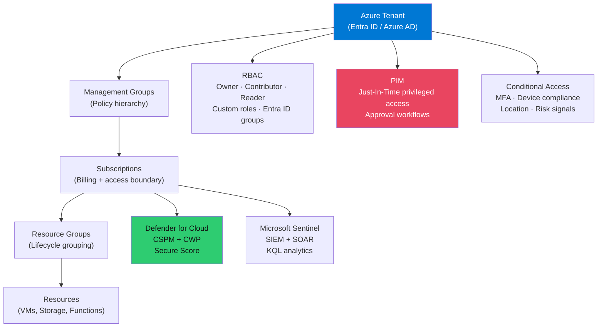
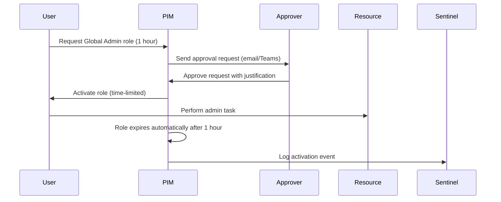
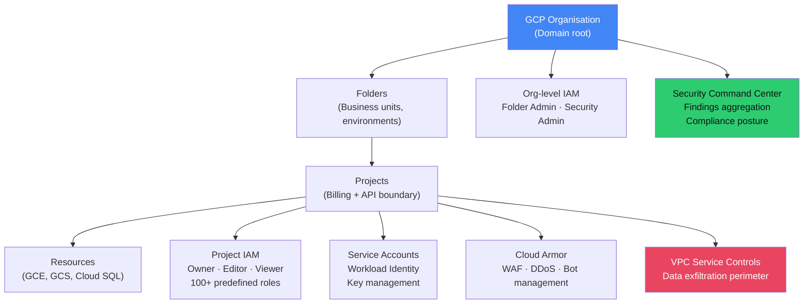

# 🔵 GCP and Azure Security

> [!abstract] TL;DR
> Azure security centres on Azure Active Directory (Entra ID) for identity and Defender for Cloud for posture management — RBAC + Privileged Identity Management (PIM) for just-in-time privileged access, Azure Sentinel for SIEM, and Network Security Groups for traffic control. GCP security is IAM-forward with project/folder/organisation hierarchy, Cloud Armor for WAF/DDoS, Security Command Center for centralised findings, VPC Service Controls to create data exfiltration perimeters, and Binary Authorization to enforce signed containers. Both platforms share the concept of Managed Identities/Service Accounts for workload identity — eliminating the need for credential management in application code.

---

## Azure Security Architecture



---

## Azure Identity and Access

### RBAC (Role-Based Access Control)

Azure RBAC controls access to Azure resources (not applications):

```bash
# Assign built-in role to a service principal
az role assignment create \
  --assignee <service-principal-id> \
  --role "Storage Blob Data Reader" \
  --scope "/subscriptions/<sub-id>/resourceGroups/my-rg/providers/Microsoft.Storage/storageAccounts/myaccount"

# Always use minimum scope (resource > resource group > subscription > management group)
```

Built-in security-relevant roles:
- **Security Admin** — manage security policies and alerts in Defender for Cloud
- **Security Reader** — read-only to Defender for Cloud, security policies
- **Key Vault Secrets Officer** — manage secrets (not keys, not certificates)
- **Key Vault Crypto Officer** — manage cryptographic keys

### Privileged Identity Management (PIM)

PIM provides Just-In-Time (JIT) privileged access, eliminating standing admin accounts:



PIM key features:
- **Eligible vs Active**: user is "eligible" for a role but must activate it
- **Time-bound**: activations expire (1h, 8h, custom)
- **Approval workflow**: optional multi-person approval for sensitive roles
- **MFA on activation**: require MFA even if MFA is not required for the user's regular session

### Managed Identities

Eliminate credential management for Azure resources:

```python
# Application code uses Managed Identity - no credentials in code
from azure.identity import DefaultAzureCredential
from azure.keyvault.secrets import SecretClient

credential = DefaultAzureCredential()  # Uses Managed Identity in Azure
client = SecretClient(vault_url="https://my-vault.vault.azure.net/", credential=credential)
secret = client.get_secret("db-password")
# No client_id, client_secret, or certificate needed
```

---

## Azure Defender for Cloud

Defender for Cloud = CSPM (Cloud Security Posture Management) + CWP (Cloud Workload Protection):

```bash
# Enable Defender for Cloud on subscription
az security pricing create --name VirtualMachines --tier Standard

# Secure Score: 0-100 score based on security control compliance
# Each control (e.g., "Enable MFA", "Restrict SSH") has a max score
# Controls grouped: Identity, Network, Data, Applications

# Recommendations example output:
# - "MFA should be enabled on accounts with owner permissions"
#   Severity: High | Score: +10 | Affected: 3 accounts
```

Defender plans (each enables workload protection):
- **Defender for Servers** — Microsoft Defender for Endpoint integration, vulnerability assessment
- **Defender for Containers** — Kubernetes threat detection, container image scanning
- **Defender for SQL** — Advanced threat protection for Azure SQL, SQL Server on VMs
- **Defender for Storage** — Malware scanning, sensitive data discovery in Blob/Files

---

## Microsoft Sentinel (SIEM/SOAR)

Azure-native SIEM built on Log Analytics Workspace (KQL query engine):

```kql
// KQL: Detect impossible travel (sign-in from two geos within 1 hour)
SigninLogs
| where TimeGenerated > ago(1h)
| extend Country = tostring(LocationDetails.countryOrRegion)
| summarize Countries = make_set(Country), SignInCount = count() by UserId = UserId
| where array_length(Countries) > 1
| project UserId, Countries, SignInCount

// KQL: Alert on new admin role assignments
AuditLogs
| where OperationName == "Add member to role"
| where TargetResources[0].modifiedProperties[0].newValue contains "Global Administrator"
| project TimeGenerated, InitiatedBy, TargetUser = TargetResources[0].userPrincipalName
```

Sentinel connectors: Azure AD, Office 365, Defender XDR, Palo Alto, Fortinet, CEF syslog, and 200+ data connectors.

---

## Azure Networking Security

```bash
# NSG (Network Security Group): stateful firewall for VMs and subnets
az network nsg rule create \
  --nsg-name my-nsg \
  --name DenySSHFromInternet \
  --priority 100 \
  --direction Inbound \
  --access Deny \
  --protocol Tcp \
  --source-address-prefixes Internet \
  --destination-port-ranges 22

# Azure Firewall: managed stateful firewall for hub-spoke architectures
# Application rules (FQDN filtering), Network rules (IP/port), NAT rules

# DDoS Protection: Basic (free, always on) vs Standard ($2,944/month, SLA-backed)
```

---

## GCP Security Architecture



## GCP IAM

```bash
# GCP IAM binding: who can do what on which resource
gcloud projects add-iam-policy-binding my-project \
  --member="serviceAccount:my-app@my-project.iam.gserviceaccount.com" \
  --role="roles/storage.objectViewer"

# Principle of least privilege with predefined roles
# roles/viewer — read all resources (too broad, avoid)
# roles/storage.objectViewer — read GCS objects only
# roles/logging.logWriter — write logs only

# Deny policies (newer feature): explicit denials that override allow policies
gcloud iam deny-policies create DenyPublicStorageAccess \
  --attachment-point="cloudresourcemanager.googleapis.com/projects/my-project" \
  --deny-rules='deniedPrincipals=allUsers,deniedPermissions=storage.objects.get'

# Workload Identity Federation: avoid service account keys entirely
# GKE workloads → Workload Identity → IAM service account
# GitHub Actions → Workload Identity Pool → IAM role (keyless auth)
```

---

## Cloud Armor (WAF / DDoS)

```yaml
# Cloud Armor security policy
securityPolicy:
  name: my-waf-policy
  rules:
    # Block OWASP Top 10 with pre-configured rules
    - action: deny(403)
      priority: 1000
      match:
        expr:
          expression: "evaluatePreconfiguredExpr('sqli-v33-stable')"
    # Rate limiting: 100 req/min per IP
    - action: rate_based_ban
      priority: 2000
      rateLimitOptions:
        rateLimitThreshold:
          count: 100
          intervalSec: 60
        banDurationSec: 300
      match:
        versionedExpr: SRC_IPS_V1
        config:
          srcIpRanges: ["*"]
```

---

## VPC Service Controls

VPC Service Controls create a "service perimeter" — even if an attacker steals a GCP credential, they cannot exfiltrate data from BigQuery or GCS if the request comes from outside the perimeter:

```bash
# Create access policy (once per organisation)
gcloud access-context-manager policies create \
  --organisation=123456789 --title="Org Policy"

# Create service perimeter
gcloud access-context-manager perimeters create ProdPerimeter \
  --policy=my-policy \
  --resources=projects/my-prod-project \
  --restricted-services=bigquery.googleapis.com,storage.googleapis.com

# Even with valid credentials, bigquery.googleapis.com calls from outside the perimeter
# (e.g., attacker's laptop) return a 403 VPC Service Controls violation
```

---

## Binary Authorization for Containers

```yaml
# GKE Binary Authorization policy: only signed images allowed
apiVersion: binaryauthorization.googleapis.com/v1
kind: Policy
globalPolicyEvaluationMode: ENABLE
defaultAdmissionRule:
  evaluationMode: REQUIRE_ATTESTATION
  requireAttestationBy:
    - projects/my-project/attestors/build-attestor
# Images not signed by the CI/CD pipeline are rejected at pod creation
```

---

## Azure vs GCP Security Feature Comparison

| Feature | Azure | GCP |
|---------|-------|-----|
| CSPM | Defender for Cloud | Security Command Center |
| SIEM | Microsoft Sentinel | Chronicle (separate product) |
| WAF/DDoS | Azure Firewall + WAF + DDoS Protection | Cloud Armor |
| Secrets | Key Vault | Secret Manager |
| HSM | Dedicated HSM | Cloud HSM |
| JIT Access | PIM | PAM via Beyond Corp / third-party |
| Data Perimeter | Network policies | VPC Service Controls |
| Container Security | Defender for Containers | Artifact Registry + Binary Authorization |
| Compliance Posture | Secure Score | Security Health Analytics |

---

## Common Pitfalls

1. **Azure: using Contributor role broadly** — Contributor allows creating new role assignments on created resources; use custom roles scoped to specific resource types
2. **GCP: leaving default service account** — GCP creates a Compute Engine default SA with Editor role; detach it and create purpose-specific SAs
3. **Not enabling PIM** — Without PIM, privileged Azure AD roles are permanently active; any session compromise is a full admin compromise
4. **GCP: service account key files** — Downloaded .json key files are long-lived credentials; use Workload Identity Federation instead
5. **Not enabling VPC Service Controls** — BigQuery and GCS data is accessible from any IP with valid credentials; VPC SC enforces perimeter

---

## Related Concepts

- [[AWS_Security|→ AWS Security]] — AWS comparison reference
- [[Cloud_Security_Fundamentals|→ Cloud Security Fundamentals]] — Shared responsibility
- [[Cloud_Identity_and_Access|→ Cloud IAM]] — Cross-cloud identity best practices
- [[Certificate_Management_and_PKI|→ PKI]] — Key Vault and Cloud KMS context
- [[_MOC_Cloud_Security|↑ Cloud Security MOC]]

---

## Review Questions

1. Azure PIM is configured with a 4-hour maximum activation duration for Global Administrator. An attacker compromises a user who is eligible (not active) for Global Admin. Describe the additional steps the attacker must complete to gain admin access, and why this is more difficult than compromising a permanently active admin.
2. Explain how GCP VPC Service Controls protect against credential theft. An attacker has a valid service account key — why can they still be blocked from accessing BigQuery?
3. A developer running a GKE workload needs to read from a GCS bucket. Compare the security tradeoffs of: (a) creating and mounting a service account JSON key, (b) using Workload Identity Federation.
4. Your Azure Sentinel deployment shows 50,000 events/day from NSG flow logs. Write a KQL query to identify the top 10 source IPs by volume making connections that were denied.

---

## Sources

- Azure Security Documentation: https://docs.microsoft.com/en-us/azure/security/
- GCP Security Best Practices: https://cloud.google.com/docs/security
- Azure PIM: https://docs.microsoft.com/en-us/azure/active-directory/privileged-identity-management/
- GCP VPC Service Controls: https://cloud.google.com/vpc-service-controls/docs/overview

#Cybersecurity #CloudSecurity #Azure #GCP #PIM #Sentinel #CloudArmor
