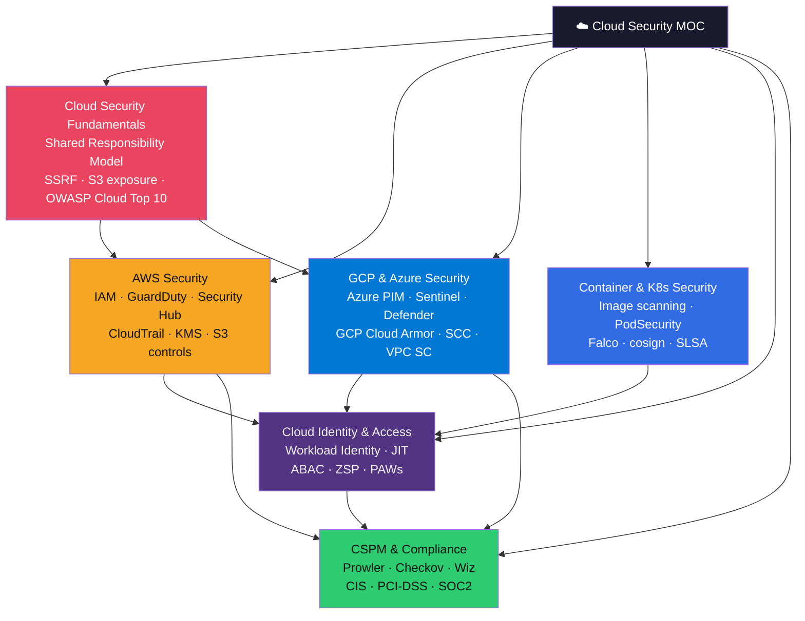
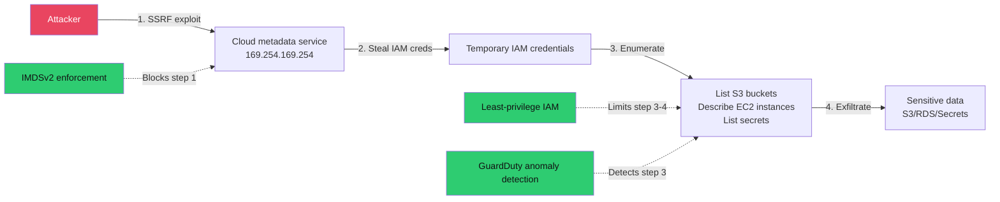

# ☁️ Cloud Security — Map of Content

> [!abstract] Section Overview
> 6-note section covering the full cloud security stack: from the shared responsibility model and cloud-specific threat landscape through AWS, GCP, and Azure security services, to container/Kubernetes hardening, identity best practices, and continuous compliance posture management. Designed for cloud engineers, security engineers, and DevSecOps practitioners.

---

## Section Architecture

---

## Notes in This Section

| Note | Key Topics | Difficulty |
|------|------------|------------|
| [[Cloud_Security_Fundamentals\|Cloud Security Fundamentals]] | Shared responsibility, SSRF/IMDSv2, OWASP Cloud Top 10, CSA STAR | Intermediate |
| [[AWS_Security\|AWS Security]] | IAM policies/SCPs, GuardDuty, Security Hub, CloudTrail, KMS, S3 hardening | Intermediate |
| [[GCP_and_Azure_Security\|GCP & Azure Security]] | Azure RBAC, PIM, Defender for Cloud, Sentinel, GCP Cloud Armor, VPC Service Controls | Intermediate |
| [[Container_and_Kubernetes_Security\|Container & Kubernetes Security]] | Image scanning, PodSecurity, K8s RBAC, Falco, cosign, SLSA | Advanced |
| [[Cloud_Identity_and_Access\|Cloud Identity & Access]] | IAM best practices, Workload Identity, JIT, ABAC, ZSP, PAWs | Intermediate |
| [[CSPM_and_Compliance\|CSPM & Compliance]] | Prowler, Wiz, Checkov, tfsec, CIS Benchmarks, PCI-DSS, SOC2 | Intermediate |

---

## Learning Path

### Path A — Cloud Security Engineer (AWS-focused)
1. [[Cloud_Security_Fundamentals|Cloud Security Fundamentals]] — Understand shared responsibility and threat model
2. [[AWS_Security|AWS Security]] — IAM, GuardDuty, CloudTrail, S3 hardening
3. [[Cloud_Identity_and_Access|Cloud Identity & Access]] — Workload Identity, JIT, ABAC
4. [[CSPM_and_Compliance|CSPM & Compliance]] — Prowler, Checkov, CIS Benchmarks

### Path B — DevSecOps / Platform Security
1. [[Container_and_Kubernetes_Security|Container & K8s Security]] — Image scanning, PodSecurity, Falco, SLSA
2. [[Cloud_Identity_and_Access|Cloud Identity & Access]] — IRSA, Workload Identity Federation
3. [[CSPM_and_Compliance|CSPM & Compliance]] — IaC scanning, shift-left security
4. [[AWS_Security|AWS Security]] or [[GCP_and_Azure_Security|GCP & Azure]] — Platform-specific controls

### Path C — Security Architect (Multi-Cloud)
1. [[Cloud_Security_Fundamentals|Fundamentals]] → [[AWS_Security|AWS]] → [[GCP_and_Azure_Security|GCP & Azure]]
2. [[Cloud_Identity_and_Access|Identity]] → [[CSPM_and_Compliance|Compliance]]
3. [[Container_and_Kubernetes_Security|Container Security]] — Complete picture

---

## Key Concepts Quick Reference

| Concept | Location |
|---------|----------|
| Shared responsibility model (IaaS/PaaS/SaaS) | [[Cloud_Security_Fundamentals]] |
| SSRF + IMDSv2 | [[Cloud_Security_Fundamentals]] |
| IAM policy evaluation (SCP → Permission Boundary → Identity) | [[AWS_Security]] |
| GuardDuty finding types | [[AWS_Security]] |
| Azure PIM Just-In-Time access | [[GCP_and_Azure_Security]] |
| GCP VPC Service Controls (data exfiltration perimeter) | [[GCP_and_Azure_Security]] |
| Kubernetes PodSecurity Admission profiles | [[Container_and_Kubernetes_Security]] |
| cosign image signing + Binary Authorization | [[Container_and_Kubernetes_Security]] |
| SLSA levels (L1–L4) | [[Container_and_Kubernetes_Security]] |
| Workload Identity Federation (GitHub Actions → AWS/GCP) | [[Cloud_Identity_and_Access]] |
| Zero Standing Privileges | [[Cloud_Identity_and_Access]] |
| Prowler checks + CIS Benchmark mapping | [[CSPM_and_Compliance]] |
| Checkov IaC scanning | [[CSPM_and_Compliance]] |

---

## Cross-Section Links

| Related Section | Connection |
|----------------|------------|
| [[../06_Digital_Forensics_IR/_MOC_DFIR\|DFIR]] | Cloud incident response, CloudTrail forensics |
| [[../_MOC_Cybersecurity_Master\|Cybersecurity Master]] | Parent vault |
| [[../08_Identity_and_Authentication/_MOC_Identity_and_Authentication\|Identity & Authentication]] | Cloud IAM integrates with SSO, PKI, PAM |

---

## Threat Model Summary

---

- [[_MOC_Cybersecurity_Master|↑ Cybersecurity Master MOC]]

#Cybersecurity #CloudSecurity #MOC
