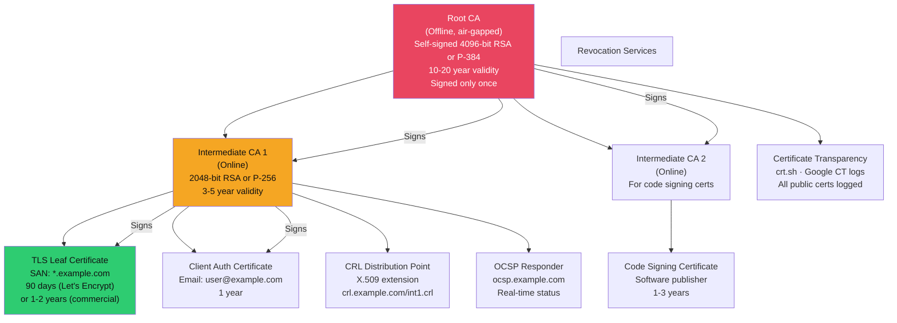
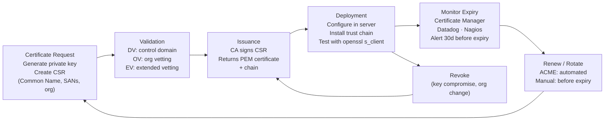

# 🏛️ Certificate Management and PKI

> [!abstract] TL;DR
> PKI (Public Key Infrastructure) is the trust backbone of TLS, code signing, and client authentication. The chain: Root CA (offline, air-gapped) → Intermediate CA (online, issues certs) → Leaf certificate. Revocation via OCSP is preferred over CRL (large files, cached stale). Let's Encrypt + ACME protocol democratised free DV certificates (90-day lifecycle, automated renewal). Internal PKI (HashiCorp Vault, Microsoft ADCS) issues certificates for internal services, mTLS, and code signing. Short-lived certificates (24h) are the modern alternative to revocation — rotation removes the need to revoke. ADCS misconfigurations (ESC1–ESC11) are a critical Active Directory attack surface.

---

## PKI Architecture



---

## Certificate Lifecycle



### Certificate Validation Types

| Type | Validates | Issuance Time | Cost | Use Case |
|------|-----------|--------------|------|---------|
| DV (Domain Validation) | Domain control only | Minutes | Free–$50 | Most websites |
| OV (Organisation Validation) | Domain + company | 1-3 days | $50–$500 | Corporate sites |
| EV (Extended Validation) | Domain + legal org | 1-2 weeks | $100–$1000 | Financial, banking |
| Wildcard | `*.domain.com` | Same as base type | Higher | Multi-subdomain |
| SAN (Multi-domain) | Multiple domains | Same | Per-domain | APIs, CDNs |

---

## Let's Encrypt and ACME Protocol

Let's Encrypt issues free DV certificates valid for 90 days, renewed automatically via ACME (RFC 8555):

```bash
# Certbot (ACME client) — automated TLS certificate management
# Install + obtain certificate for nginx
certbot --nginx -d example.com -d www.example.com

# ACME challenge types:
# HTTP-01: create file at /.well-known/acme-challenge/<token>
# DNS-01: create TXT record _acme-challenge.example.com = <proof>
# TLS-ALPN-01: serve certificate with ACME extension on port 443

# Auto-renewal (certbot adds cron/systemd timer)
certbot renew --dry-run

# Let's Encrypt rate limits (production):
# 50 certificates per domain per week
# 5 failed validations per domain per hour
# Use staging for testing: --server https://acme-staging-v02.api.letsencrypt.org

# Why 90 days?
# - Forces automation (no "set and forget" 2-year certs)
# - Limits damage window from key compromise
# - Reduces stale certificate accumulation
```

---

## Internal PKI

### HashiCorp Vault PKI Secrets Engine

```bash
# Enable PKI engine
vault secrets enable pki
vault secrets tune -max-lease-ttl=87600h pki  # 10 years for root

# Generate root CA (stored inside Vault, never exported)
vault write pki/root/generate/internal \
    common_name="Internal Root CA" \
    ttl=87600h

# Create intermediate CA
vault secrets enable -path=pki_int pki
vault write pki_int/intermediate/generate/internal common_name="Internal Intermediate CA" ttl=43800h
# Sign intermediate CSR with root
vault write pki/root/sign-intermediate csr=@int.csr format=pem_bundle > int_chain.pem
vault write pki_int/intermediate/set-signed certificate=@int_chain.pem

# Create role: define certificate parameters
vault write pki_int/roles/web-service \
    allowed_domains="internal.example.com" \
    allow_subdomains=true \
    max_ttl=720h  # 30 days

# Issue certificate (application calls this on startup)
vault write pki_int/issue/web-service \
    common_name="service-a.internal.example.com" ttl=24h
# Returns: certificate, private_key, ca_chain, expiration
# Application rotates cert before expiration via periodic renewal
```

### Microsoft ADCS (Active Directory Certificate Services)

ADCS provides PKI tightly integrated with Active Directory for domain-joined environments:

```powershell
# Install ADCS role
Install-WindowsFeature ADCS-Cert-Authority -IncludeManagementTools
Install-AdcsCertificationAuthority -CAType EnterpriseRootCA -CACommonName "CORP-ROOT-CA"

# Certificate templates: define who can request what type of cert
# Templates stored in AD as objects under:
# CN=Certificate Templates,CN=Public Key Services,CN=Services,CN=Configuration

# Request certificate (domain-joined machine via autoenrollment)
certreq -submit -attrib "CertificateTemplate:WebServer" my-request.csr

# ADCS ESC1 (critical misconfiguration — privilege escalation):
# Certificate template allows SAN specification by requestor + enrollable by low-priv users
# Attack: request cert with SAN=admin@corp.local → authenticate as domain admin
certipy req -u lowprivuser@corp.local -p password -ca CORP-CA -template VulnerableTemplate \
    -upn administrator@corp.local -dns dc01.corp.local
# Get administrator TGT via PKINIT
certipy auth -pfx administrator.pfx -domain corp.local
```

ADCS attack paths (ESC1–ESC11 by SpecterOps):
- **ESC1**: Template allows SAN, `CT_FLAG_ENROLLEE_SUPPLIES_SUBJECT`, enrollable by non-admins
- **ESC4**: Template has vulnerable ACL (low-priv user has `GenericWrite`)
- **ESC6**: CA has `EDITF_ATTRIBUTESUBJECTALTNAME2` flag set
- **ESC8**: NTLM relay to AD CS HTTP endpoint → obtain certificate for relayed identity

---

## Certificate Revocation

### OCSP vs CRL

```python
# Check certificate OCSP status
from cryptography.x509 import ocsp
from cryptography import x509
import requests

# Get OCSP endpoint from cert
cert = x509.load_pem_x509_certificate(cert_pem)
ocsp_urls = cert.extensions.get_extension_for_oid(
    x509.ExtensionOID.AUTHORITY_INFORMATION_ACCESS
).value
ocsp_url = [x.access_location.value for x in ocsp_urls 
            if x.access_method == x509.AuthorityInformationAccessOID.OCSP][0]

# Build OCSP request
builder = ocsp.OCSPRequestBuilder().add_certificate(cert, issuer_cert, hashes.SHA256())
request = builder.build()

response = requests.post(ocsp_url, data=request.public_bytes(serialization.Encoding.DER),
                         headers={'Content-Type': 'application/ocsp-request'})
ocsp_response = ocsp.load_der_ocsp_response(response.content)
print(ocsp_response.certificate_status)  # GOOD, REVOKED, UNKNOWN
```

| | OCSP | CRL |
|--|------|-----|
| Format | Per-certificate HTTP request | Full list of revoked certs |
| Latency | Real-time (or cached) | Downloaded periodically (large) |
| Privacy | Leaks cert lookups to CA | No leak (client downloads full list) |
| Availability | CA must be online | Downloaded in advance |
| OCSP Stapling | Server fetches+caches OCSP response | N/A |
| Soft-fail default | Browser continues on error | Browser continues if CRL stale |

---

## mTLS Implementation

mTLS (mutual TLS) requires both sides to present certificates:

```python
# Python server: require client certificate
import ssl, http.server

context = ssl.SSLContext(ssl.PROTOCOL_TLS_SERVER)
context.load_cert_chain(certfile='server.crt', keyfile='server.key')
context.load_verify_locations(cafile='internal-ca.crt')
context.verify_mode = ssl.CERT_REQUIRED  # Require client cert

httpd = http.server.HTTPServer(('0.0.0.0', 443), MyHandler)
httpd.socket = context.wrap_socket(httpd.socket, server_side=True)
httpd.serve_forever()
```

mTLS use cases:
- Service mesh (Istio/Linkerd: automatic mTLS between all pods)
- API clients (client certificates instead of API keys)
- Zero Trust network access (ZTNA: device certificate as access control)

---

## Certificate Transparency

All publicly trusted TLS certificates must be logged in Certificate Transparency (CT) logs (RFC 6962):

```bash
# Search CT logs for certificates issued for your domain
curl "https://crt.sh/?q=%.example.com&output=json" | jq '.[].name_value'

# Use cases:
# 1. Monitor for unauthorized certificates (phishing/typosquatting)
# 2. Find shadow IT (subdomains you didn't know about)
# 3. Pentest: enumerate subdomains from CT logs

# Tools: subfinder (uses CT logs), amass, certspotter
subfinder -d example.com -silent
```

---

## Short-Lived Certificates

Short-lived certificates (<24h) eliminate the need for revocation:

```bash
# Vault: issue 1-hour certificates for CI/CD
vault write pki_int/issue/ci-role \
    common_name="ci-runner.internal" ttl=1h

# Benefits:
# - No revocation needed (cert expires before attacker can use it)
# - Rotation is automatic (app requests new cert on startup)
# - Visibility: every cert issuance is a logged event

# SPIFFE/SPIRE: workload identity with short-lived SVIDs
# Each service gets a cryptographic identity (SPIFFE ID: spiffe://example.com/service/api)
# SVIDs (SPIFFE Verifiable Identity Documents) rotated automatically every hour
```

---

## Common Pitfalls

1. **Root CA online** — Root CA should be air-gapped (offline); compromise of root CA undermines all trust in the PKI
2. **Long-lived certificates** — 2-year certificates mean revocation is critical; prefer 90-day or shorter with automation
3. **ADCS with default template settings** — Default Web Server template allows SAN by requestor (ESC1 precondition); audit template ACLs regularly
4. **Not implementing OCSP Stapling** — Without stapling, every TLS handshake leaks cert lookups to CA; enable on nginx/Apache
5. **Wildcard certificates everywhere** — One wildcard key compromise affects all subdomains; scope wildcard usage; use SANs for specific subdomains

---

## Related Concepts

- [[TLS_and_SSL|→ TLS Protocol]] — TLS handshake and certificate exchange
- [[Asymmetric_Cryptography_and_PKI|→ Asymmetric Cryptography]] — RSA/ECC underlying certs
- [[Authentication_Protocols|→ Authentication Protocols]] — Smart card/PIV certificates
- [[Multi_Factor_Authentication|→ MFA]] — Certificates as a possession factor
- [[Directory_Services|→ Active Directory]] — ADCS integration with AD
- [[_MOC_Identity_and_Authentication|↑ Identity & Authentication MOC]]

---

## Review Questions

1. Explain the ADCS ESC1 privilege escalation attack. What three misconfigurations must exist simultaneously for ESC1 to be exploitable, and how does an attacker escalate from a low-privilege domain user to Domain Admin using Certipy?
2. Let's Encrypt certificates are valid for 90 days. A security team wants to extend this to 2 years to reduce operational burden. What are the security tradeoffs, and what tooling would you implement instead to maintain 90-day certs without manual effort?
3. Your internal service mesh uses mTLS. Service A calls Service B. Describe the complete TLS handshake including which certificates each party presents, how trust is verified, and what happens if Service A presents a certificate from a different internal CA.
4. Certificate Transparency logs are public. A junior developer argues that disclosing your internal subdomain names in CT logs is a security risk. Evaluate this claim and describe an alternative approach for internal PKI that avoids CT logging.

---

## Sources

- Let's Encrypt: https://letsencrypt.org/how-it-works/
- HashiCorp Vault PKI: https://developer.hashicorp.com/vault/docs/secrets/pki
- ADCS ESC attacks (SpecterOps): https://posts.specterops.io/certified-pre-owned-d95910965cd2
- RFC 8555 ACME: https://datatracker.ietf.org/doc/html/rfc8555

#Cybersecurity #Identity #PKI #Certificates #ADCS #LetsEncrypt #mTLS #OCSP
