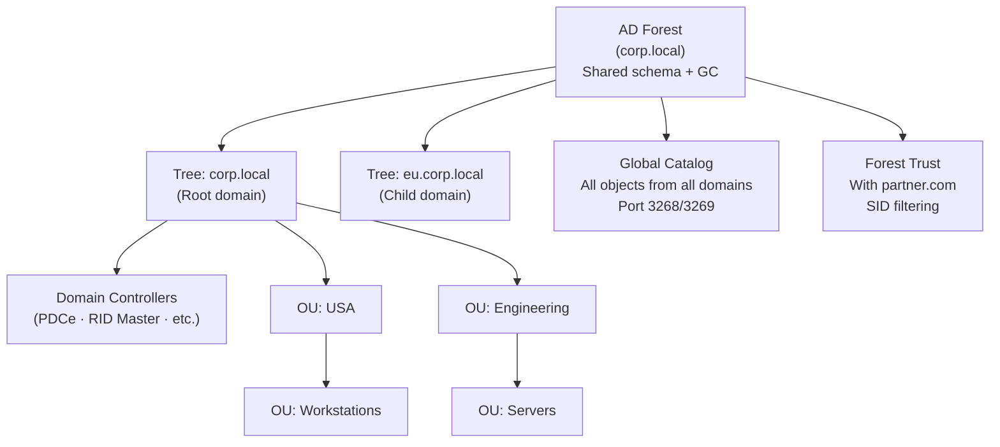

# 🗂️ Directory Services

> [!abstract] TL;DR
> Active Directory is the backbone of enterprise identity — and the primary target of attackers in Windows environments. Understanding the AD hierarchy (forest → tree → domain → OU), trust relationships, and attack surface (Kerberoasting, DCSync, LDAP injection, GPO abuse) is essential for both defenders and pentesters. LDAP is the protocol that underpins directory queries — insecure LDAP binds and injection are underrated vulnerabilities. LAPS (Local Admin Password Solution) solves lateral movement via shared local admin passwords. The tiered admin model and Protected Users group are the most impactful defences against credential theft escalation.

---

## Directory Services Architecture



---

## LDAP Protocol

### LDAP Structure

```
Distinguished Name (DN): unique identifier for each object
  DC=corp,DC=local               → Domain Component
  OU=Engineering,DC=corp,DC=local → Organisational Unit
  CN=John Doe,OU=Users,DC=corp,DC=local → Common Name (user)

Relative Distinguished Name (RDN): single component
  CN=John Doe

LDAP URI:
  ldap://dc01.corp.local:389/OU=Users,DC=corp,DC=local?cn?sub?objectClass=user
  │      │              │   │                               │    │   └── scope (base/one/sub)
  │      │              │   └── search base                │    └── attributes
  │      │              └── port (389=LDAP, 636=LDAPS)     └── filter
  │      └── server
  └── protocol
```

### LDAP Operations

```bash
# LDAP bind (authenticate)
# Simple bind: username + password in cleartext (use LDAPS!)
ldapsearch -H ldap://dc01.corp.local \
  -D "CN=svc-account,OU=ServiceAccounts,DC=corp,DC=local" \
  -w "password" \
  -b "DC=corp,DC=local" \
  "(objectClass=user)" cn mail

# Anonymous bind check (misconfiguration)
ldapsearch -H ldap://target.corp.local -x -b "DC=corp,DC=local"
# If returns data → anonymous bind allowed (information disclosure)

# Null base bind — enumerate rootDSE
ldapsearch -H ldap://target -x -s base "" namingContexts
```

### LDAPS vs STARTTLS

| | LDAP | LDAPS | LDAP + STARTTLS |
|--|------|-------|----------------|
| Port | 389 | 636 | 389 |
| TLS | None | Always (from connect) | Negotiated (STARTTLS command) |
| Certificate | N/A | Required | Required |
| Downgrade attack | N/A | No | Possible if STARTTLS not enforced |
| Microsoft default | Legacy | Recommended | Available |

```powershell
# Enable LDAP Channel Binding and Signing (prevents NTLM relay to LDAP)
# Domain Controller Policy → Computer Configuration → Security Settings
# LDAP server signing requirements: Require signing
# DC LDAP Server Channel Binding Token Requirements: Always
```

### LDAP Injection

```python
# BAD: User-controlled input in LDAP filter
username = request.args.get('username')
ldap_filter = f"(uid={username})"  # LDAP injection

# Attack payload: admin)(|(uid=*
# Resulting filter: (uid=admin)(|(uid=*))
# Returns all users, not just 'admin'

# GOOD: Escape special characters
from ldap3.utils.conv import escape_filter_chars
safe_username = escape_filter_chars(username)
ldap_filter = f"(uid={safe_username})"

# LDAP special characters to escape:
# ( ) \ * \x00 and others
```

---

## Active Directory

### Domain Components and Key Concepts

```
Forest: Corp.local
├── Schema Master (FSMO) — defines all AD object types
├── Domain Naming Master (FSMO) — manages domain additions
├── Global Catalog — searchable index of all forest objects
│
├── Domain: corp.local
│   ├── PDC Emulator (FSMO) — time sync, password changes, GPO anchor
│   ├── RID Master (FSMO) — allocates security ID ranges
│   ├── Infrastructure Master (FSMO) — cross-domain object references
│   │
│   ├── OU: Engineering
│   │   ├── GPO: Engineering-Policy (software, settings)
│   │   ├── Users: John Doe, Jane Smith
│   │   └── Computers: ENG-WS-001
│   │
│   └── OU: Domain Controllers
│       └── Computers: DC01, DC02 (always a DC OU GPO)
│
└── Domain: eu.corp.local (child domain)
    └── Automatic two-way transitive trust with corp.local
```

### GPO (Group Policy Objects)

```powershell
# List all GPOs in domain
Get-GPO -All | Select-Object DisplayName, Id, GpoStatus

# Find GPOs applied to specific OU
Get-GPOReport -Name "Default Domain Policy" -ReportType HTML -Path "C:\gpo.html"

# Security-critical GPO settings
# Computer Config → Security Settings:
# - Account Policies → Password Policy (min 14 chars, complexity)
# - Account Lockout (5 attempts, 15min lockout)
# - Audit Policy → Logon Events, Object Access, Privilege Use
# - Windows Firewall with Advanced Security
# - AppLocker / Software Restriction Policies

# Misconfigured GPO abuse (pentest):
# If user can modify a GPO applied to a target OU → code execution on all objects
# BloodHound shows: User → WriteProperty → GPO → Applied to → OU
```

### AD Trust Relationships

```
One-way trust: Domain A trusts Domain B
  → Users in B can access resources in A (B trusts A one-directionally)
  
Two-way trust: Domains A and B trust each other
  → Default between parent/child domains

Transitive trust: A trusts B, B trusts C → A implicitly trusts C
  → Default within a forest (all domains in same forest)

Non-transitive external trust: corp.local trusts partner.com
  → Explicit, one-way, SID filtering enabled (prevents SIDHistory attacks)

Forest trust: entire forest A trusts entire forest B
  → Required for full cross-forest authentication

SID Filtering: strips SIDHistory attributes when crossing forest/external trusts
  → Prevents privilege escalation using SIDHistory injection
```

### AD Attack Surface

```bash
# BloodHound: visualise AD attack paths
# Collects: users, groups, computers, trusts, ACLs, sessions
SharpHound.exe --CollectionMethods All --ZipFileName bloodhound-data.zip
# Import into BloodHound → Find Shortest Paths to Domain Admins

# DCSync: replicate password hashes from DC (requires DS-Replication rights)
mimikatz# lsadump::dcsync /domain:corp.local /all /csv
# Only members of Domain Admins, Enterprise Admins, Domain Controllers, or
# users with DS-Replication-Get-Changes-All right can run DCSync

# LDAP ACL abuse: if user has GenericAll on a user object
# → Can reset their password, add to groups, enable/disable account
powerview> Get-ObjectAcl -SamAccountName "targetuser" -ResolveGUIDs |
           Where-Object {$_.ActiveDirectoryRights -match "GenericAll"}
```

---

## LAPS (Local Admin Password Solution)

Without LAPS, all domain-joined machines share the same local Administrator password — one compromise leads to lateral movement across all machines:

```powershell
# LAPS: each machine's local admin password is unique, stored in AD, rotated on schedule
# Password stored in: ms-Mcs-AdmPwd attribute on computer object (or Windows LAPS attribute)

# Deploy LAPS
Install-Module LAPS
Update-LapsADSchema
Set-LapsADComputerSelfPermission -Identity "OU=Workstations,DC=corp,DC=local"

# Retrieve password (only DA/delegated users can read ms-Mcs-AdmPwd)
Get-LapsADPassword -Identity "WS-001" -AsPlainText

# Windows LAPS (built-in since 2022/2023):
# Enable via GPO: Computer Configuration → Administrative Templates → LAPS
# Integrates with Azure AD for Intune-managed devices
```

---

## Azure AD / Entra ID vs On-Premises AD

| Feature | On-Prem AD | Azure AD / Entra ID |
|---------|-----------|---------------------|
| Protocol | Kerberos, NTLM, LDAP | SAML, OIDC, OAuth 2.0 |
| Join type | Domain join | Azure AD join, Hybrid join |
| MFA | Third-party (RSA, Duo) | Built-in Authenticator, SSPR |
| Privileged access | Nested groups, delegation | PIM (JIT), Conditional Access |
| Trust model | Forest trusts | B2B/B2C federation |
| Object types | Users, computers, GPOs | Users, devices, apps, service principals |
| Primary use | On-prem resources | Cloud apps, SaaS, Azure resources |

---

## AD Hardening: Tiered Admin Model

```
Tier 0 — Domain Controllers, AD admin tools, PKI, PAM solution
  → Only T0 admins can log into T0 systems
  → T0 admin accounts used ONLY for T0 tasks
  
Tier 1 — Member servers (file servers, web servers, databases)
  → Only T1 admins can administer T1 systems
  
Tier 2 — Workstations, user devices
  → Local admins / helpdesk

Rule: Never use a higher-tier account on a lower-tier system
  → If T0 admin logs into a workstation (T2), their Kerberos TGT is
     exposed to mimikatz on that workstation → compromise of all T0 systems
```

### Protected Users Security Group

Placing user accounts in Protected Users provides significant credential theft protections:

```powershell
# Add sensitive accounts to Protected Users
Add-ADGroupMember -Identity "Protected Users" -Members "AdminUser"

# Effects (cannot be overridden):
# - No NTLM authentication (forces Kerberos)
# - No CredSSP credential delegation
# - No Kerberos unconstrained delegation
# - No WDigest credentials (cleartext creds no longer cached)
# - TGT lifetime reduced to 4 hours
# - Cannot use DES or RC4 in Kerberos (AES only)
```

---

## Common Pitfalls

1. **Kerberos unconstrained delegation on non-DC servers** — Any user connecting to that server has their TGT stolen; audit `userAccountControl` for `TRUSTED_FOR_DELEGATION`
2. **Service accounts with excessive AD rights** — SQL Server service accounts running as Domain Admins; use gMSA (Group Managed Service Accounts)
3. **Not enabling LDAP Signing + Channel Binding** — Enables NTLM relay to LDAP → DCSync rights abuse
4. **GPO with "Authenticated Users" modification rights** — Any domain user can modify that GPO → execute code on all machines in the linked OU
5. **Stale admin accounts** — Former admins in Domain Admins group; quarterly access reviews, enable UserAccountControl audit

---

## Related Concepts

- [[Authentication_Protocols|→ Kerberos & NTLM]] — Authentication protocols in AD
- [[PAM_and_Privileged_Access|→ PAM]] — Tiered admin implementation tooling
- [[SSO_and_Federation|→ SSO & Federation]] — SAML integration with AD FS
- [[Multi_Factor_Authentication|→ MFA]] — AD MFA enforcement
- [[_MOC_Identity_and_Authentication|↑ Identity & Authentication MOC]]

---

## Review Questions

1. Explain the difference between a domain, tree, and forest in Active Directory. Why does the tiered admin model prevent credential theft attacks that span tiers?
2. A penetration test finds a service account with `userAccountControl = TRUSTED_FOR_DELEGATION` (unconstrained delegation). Describe the complete attack chain from initial service access to Domain Admin.
3. Your organisation has 5,000 Windows machines all sharing the local Administrator password `corp2024!`. Describe the lateral movement risk and outline how LAPS deployment eliminates it. What operational changes are required?
4. An attacker has compromised a developer workstation and is running BloodHound. Describe three attack paths BloodHound might surface, and which one you would fix first as a defender and why.

---

## Sources

- Microsoft AD Architecture: https://docs.microsoft.com/en-us/windows-server/identity/ad-ds/plan/
- BloodHound: https://github.com/BloodHoundAD/BloodHound
- LAPS: https://learn.microsoft.com/en-us/windows-server/identity/laps/laps-overview
- SpecterOps AD Attack Paths: https://posts.specterops.io/

#Cybersecurity #Identity #ActiveDirectory #LDAP #LAPS #GPO #DirectoryServices
