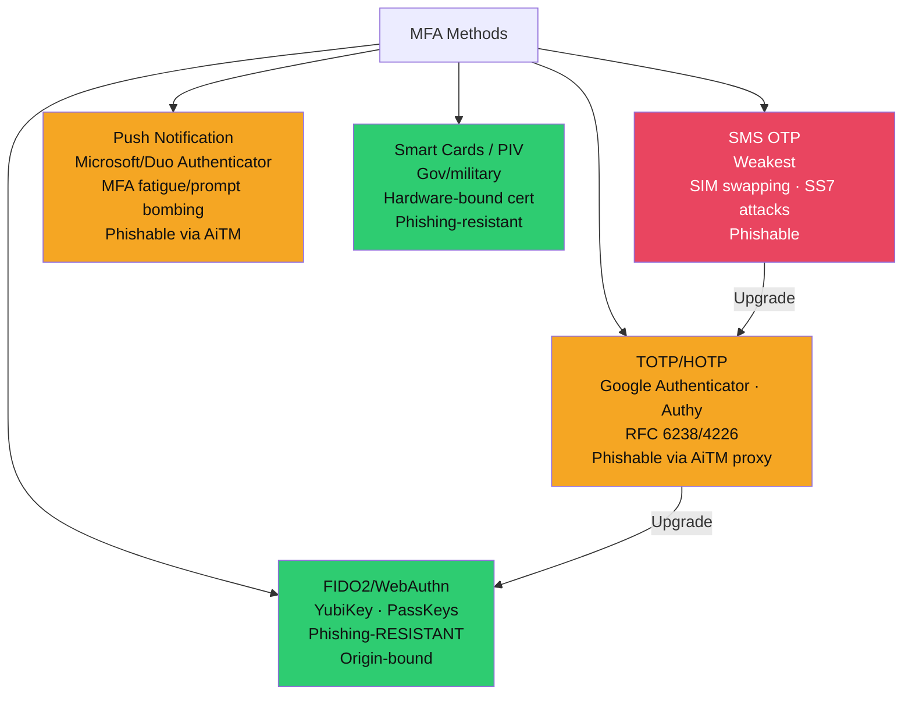
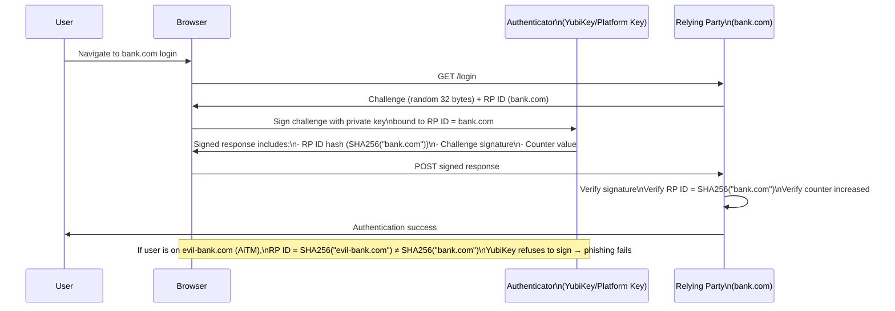

# 🔑 Multi-Factor Authentication

> [!abstract] TL;DR
> MFA adds a second factor to authentication, but not all MFA is equal. SMS OTP is the weakest (SIM swapping, SS7 attacks), TOTP (Google Authenticator, Authy) is better but still phishable via AiTM proxies. **FIDO2/WebAuthn is the only phishing-resistant MFA** — it cryptographically binds authentication to the origin domain, making it impossible to phish even via sophisticated AiTM tools like Evilginx2. Passkeys extend FIDO2 to replace passwords entirely. MFA fatigue (prompt bombing) defeats push-based MFA at scale. The migration path: SMS → TOTP → FIDO2/passkeys.

---

## MFA Types and Strength



---

## TOTP/HOTP (RFC 6238/4226)

### How TOTP Works

```python
import hmac, hashlib, struct, time, base64

def generate_totp(secret_base32: str, digits: int = 6, interval: int = 30) -> str:
    # 1. Decode the shared secret (from QR code setup)
    key = base64.b32decode(secret_base32)
    
    # 2. Calculate time counter (30-second windows since Unix epoch)
    counter = int(time.time()) // interval
    
    # 3. HMAC-SHA1 of counter using shared secret
    msg = struct.pack(">Q", counter)  # 8-byte big-endian counter
    hmac_result = hmac.new(key, msg, hashlib.sha1).digest()
    
    # 4. Dynamic truncation: use last nibble as offset
    offset = hmac_result[-1] & 0x0F
    code = struct.unpack(">I", hmac_result[offset:offset+4])[0] & 0x7FFFFFFF
    
    # 5. Return last `digits` digits
    return str(code % (10 ** digits)).zfill(digits)

# HOTP (RFC 4226): same but uses incrementing counter instead of time
# TOTP = HOTP with time-based counter (RFC 6238)
```

**TOTP Security Considerations:**
- 30-second window means valid for up to 60 seconds (current + previous window tolerance)
- Shared secret stored on authenticator app AND server — both are theft targets
- Phishable: AiTM proxy forwards TOTP in real-time before it expires

---

## FIDO2 / WebAuthn

### Why FIDO2 is Phishing-Resistant



### FIDO2 Registration and Assertion

```javascript
// WebAuthn Registration (creating a passkey)
const publicKeyCredentialCreationOptions = {
    challenge: crypto.getRandomValues(new Uint8Array(32)),
    rp: {
        name: "My App",
        id: "app.example.com"  // RP ID — bound to this exact domain
    },
    user: {
        id: userId,
        name: "user@example.com",
        displayName: "User"
    },
    pubKeyCredParams: [
        {alg: -7, type: "public-key"},   // ES256 (preferred)
        {alg: -257, type: "public-key"}  // RS256 (compatibility)
    ],
    authenticatorSelection: {
        userVerification: "required",  // Require PIN/biometric on key
        residentKey: "required"        // Store credential on hardware (passkey)
    },
    timeout: 60000
};

const credential = await navigator.credentials.create({publicKey: publicKeyCredentialCreationOptions});
// Store credential.id + credential.response.getPublicKey() on server

// WebAuthn Authentication (using the passkey)
const assertionOptions = {
    challenge: crypto.getRandomValues(new Uint8Array(32)),
    rpId: "app.example.com",
    userVerification: "required",
    timeout: 60000
};
const assertion = await navigator.credentials.get({publicKey: assertionOptions});
// Send assertion to server → verify signature against stored public key
```

---

## Passkeys

Passkeys = FIDO2 discoverable credentials (resident keys) that replace passwords:

| Feature | Traditional Password + TOTP | Passkeys |
|---------|----------------------------|---------|
| User experience | Type password + copy 6-digit code | Touch button or biometric |
| Phishing resistance | No (TOTP is phishable) | Yes (origin-bound) |
| Credential storage | Server stores password hash | Server stores public key only |
| Multi-device | Sync apps across devices (Authy) | iCloud Keychain, Google Password Manager |
| Backup | Export secret key | Cloud-synced by OS |
| Recovery | Password reset flow | Account recovery flow |

---

## MFA Bypass Attacks

### SIM Swapping

```
Attack flow:
1. Attacker researches target (name, last 4 SSN via data breaches)
2. Calls carrier posing as victim: "I lost my phone, transfer my number"
3. Carrier ports number to attacker SIM
4. Attacker receives all SMS OTPs for victim's accounts

Real cases: $24M cryptocurrency theft (2018), Twitter CEO Jack Dorsey (2019)

Defences:
- Port freeze / carrier lock (call carrier directly)
- Move away from SMS OTP entirely
- Use number lock (Verizon/AT&T account pin)
```

### MFA Fatigue / Prompt Bombing

```
Attack: attacker has stolen username+password
1. Initiate login (triggers MFA push notification to user's phone)
2. Send repeated MFA requests (dozens in minutes)
3. User gets fatigued, accidentally taps "Approve" or taps to make it stop

Real cases: Uber breach (2022) — attacker called Uber employee, claimed to be IT,
            convinced them to approve after prompt bombing (social engineering + fatigue)

Defences:
- Number matching: push notification shows a code the user must match to screen
- Additional context: show IP address and location in push notification
- Migrate to FIDO2 (push MFA not used)
- Rate limit: block account after N unverified MFA attempts
```

### Adversary-in-the-Middle (AiTM) with Evilginx2

```
Traditional phishing: victim enters creds on fake site (captured)
AiTM proxy: victim authenticates on real site via attacker's proxy

1. Attacker sets up Evilginx2 proxy for microsoft.com
2. Sends phishing link: https://m1cr0soft.phish.io/login
3. Victim enters credentials → forwarded to real Microsoft
4. Victim completes TOTP → forwarded to real Microsoft  
5. Microsoft issues session cookie → Evilginx2 captures it
6. Attacker uses captured cookie (bypasses MFA entirely)

Defence: FIDO2/WebAuthn (origin-bound, Evilginx2 cannot obtain signature for real domain)
         Conditional Access: block sign-in from unknown devices/IPs
         CASB: detect impossible travel after session theft
```

---

## Conditional Access Policies

```
Conditional Access = IF (condition) THEN (control)

Signal sources:
- User/Group (executives require hardware MFA)
- Application (sensitive apps require compliant device)
- Location (block access from high-risk countries)
- Device state (Intune-managed, compliant OS version)
- Sign-in risk (Microsoft Entra ID Identity Protection ML score)
- User risk (credentials found in breach databases)

Example policies:
1. Require phishing-resistant MFA for all Global Admins
2. Block access from non-compliant devices to Exchange Online
3. Require MFA when sign-in risk = Medium or High
4. Grant access from trusted named locations without MFA (reduce friction)
5. Block legacy authentication protocols (POP3/IMAP — bypass MFA entirely)
```

---

## MFA Everywhere Policy Implementation

```bash
# AWS: MFA enforcement via IAM condition
{
  "Condition": {
    "BoolIfExists": {"aws:MultiFactorAuthPresent": "false"},
    "Effect": "Deny",
    "NotAction": ["iam:GetSessionToken"]
  }
}

# GitHub: Require MFA for all org members
Settings → Authentication Security → Require two-factor authentication

# Okta: Enforce MFA via Sign-On Policy
Application → Sign On → Add Rule → MFA Required → Always

# Priority ordering:
# 1. Hardware FIDO2 keys for all privileged accounts
# 2. FIDO2/Passkeys for all employees (phishing-resistant)
# 3. Authenticator app (TOTP/push) as fallback
# 4. Never accept SMS as primary MFA for sensitive accounts
```

---

## Hardware Tokens (YubiKey)

```bash
# YubiKey capabilities:
# - FIDO2/WebAuthn (all modern YubiKey 5 series)
# - TOTP (via Yubico Authenticator app)
# - PIV/Smart Card (client certificate auth)
# - OpenPGP card
# - OATH HOTP

# YubiKey 5 series: FIDO2 + PIV + TOTP + OpenPGP (recommended)
# YubiKey Bio: fingerprint verification on-device (user presence = biometric)
# Security Key: FIDO2 only (cheaper, consumer)

# Enterprise deployment:
# - Issue two keys per employee (primary + backup)
# - Register both to each account at setup
# - Recovery: IT-verified in-person re-enrollment
```

---

## Common Pitfalls

1. **Not blocking legacy auth protocols** — Outlook/SMTP/IMAP can bypass MFA entirely; block all legacy auth in Conditional Access before enforcing MFA
2. **SMS as MFA for sensitive accounts** — Executives, finance, IT admins should be on hardware keys; SIM swapping is a known attack
3. **No number matching in push MFA** — Without number matching, any approved push grants access; attackers exploit this with MFA fatigue
4. **Single FIDO2 key without backup** — Lost key = locked out; always register backup key + recovery code
5. **Treating MFA as complete defence** — AiTM attacks bypass TOTP/push MFA; phishing-resistant MFA + session anomaly detection needed

---

## Related Concepts

- [[SSO_and_Federation|→ SSO & Federation]] — MFA integrated in SAML/OIDC flows
- [[Authentication_Protocols|→ Auth Protocols]] — RADIUS 802.1X with EAP-TLS (certificate MFA)
- [[Certificate_Management_and_PKI|→ PKI]] — Smart card/PIV certificates as MFA
- [[Cloud_Identity_and_Access|→ Cloud IAM]] — MFA enforcement in AWS/Azure/GCP
- [[PAM_and_Privileged_Access|→ PAM]] — Hardware MFA for privileged sessions
- [[_MOC_Identity_and_Authentication|↑ Identity & Authentication MOC]]

---

## Review Questions

1. Explain why TOTP (Google Authenticator) is not phishing-resistant but FIDO2/WebAuthn is. Draw the attack flow for an Evilginx2 AiTM against TOTP, and explain at which step FIDO2 breaks the attack.
2. A SaaS company deploys Microsoft push notifications for all 200 employees. Three months later, two employees approved attacker MFA prompts during working hours. What immediate changes should be made, and what longer-term migration path do you recommend?
3. Calculate the effective security window for TOTP: if an attacker intercepts a TOTP code at t=25 seconds into a 30-second interval, how long do they have to use it, assuming the server accepts ±1 window?
4. Design a phishing-resistant MFA rollout for a 500-person company with a mix of developers (Linux/Mac), finance staff (Windows), and executives (travel frequently). Which MFA method do you assign to each group and why?

---

## Sources

- WebAuthn Specification: https://www.w3.org/TR/webauthn-3/
- RFC 6238 TOTP: https://datatracker.ietf.org/doc/html/rfc6238
- Evilginx2: https://breakdev.org/evilginx-2/
- CISA Phishing-Resistant MFA: https://www.cisa.gov/sites/default/files/publications/fact-sheet-implementing-phishing-resistant-mfa-508c.pdf

#Cybersecurity #Identity #MFA #FIDO2 #WebAuthn #Passkeys #TOTP #PhishingResistant
