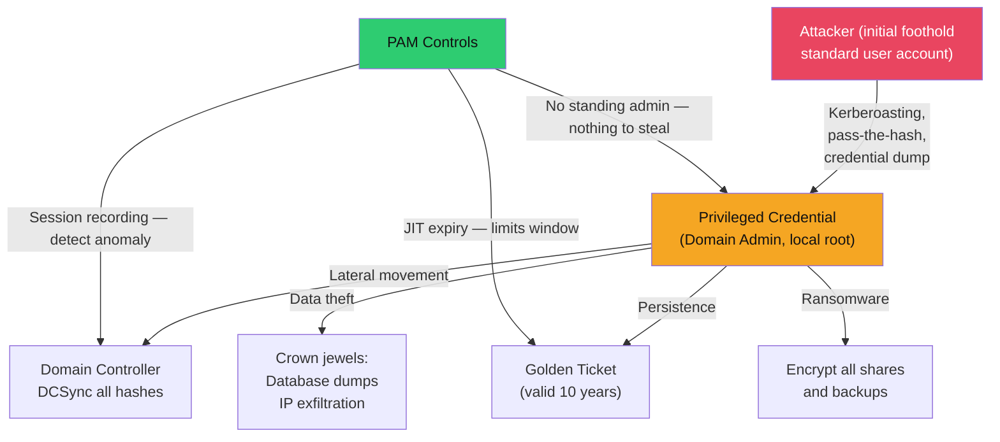
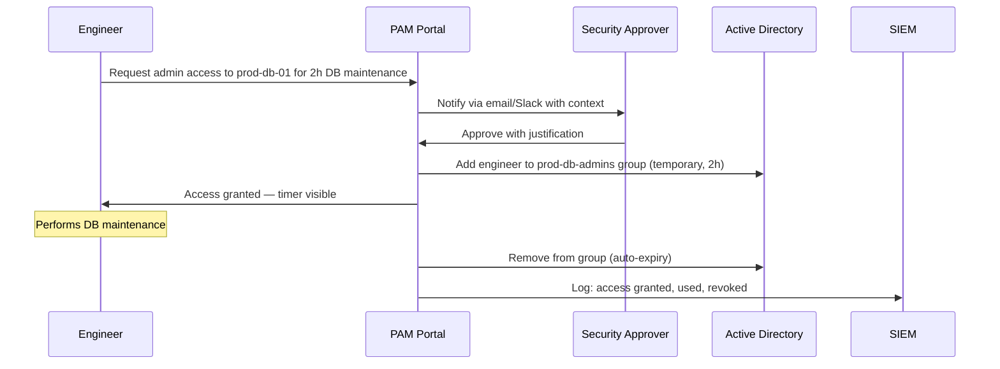

# 🔐 PAM and Privileged Access

> [!abstract] TL;DR
> Privileged accounts — Domain Admins, root users, service accounts with excessive rights — are the single most targeted asset in enterprise environments. PAM (Privileged Access Management) addresses this through four capabilities: **password vaulting** (no human knows the credential), **session recording** (tamper-proof audit trail), **just-in-time (JIT) access** (temporary elevation with auto-expiry), and **least privilege enforcement** (revoke standing admin rights). Zero Standing Privileges (ZSP) is the goal: no one holds permanent admin access. Tools span commercial (CyberArk, BeyondTrust) to open-source (Teleport, HashiCorp Vault dynamic secrets). Break-glass procedures are the safety valve when PAM is unavailable.

---

## Why PAM Matters



### The Problem with Standing Privileges

| Scenario | Without PAM | With PAM (ZSP) |
|----------|-------------|----------------|
| Domain Admin leaves company | AD account deactivated, password may linger | No standing access; request auto-terminated |
| Laptop compromised | Attacker inherits DA token from cached credentials | No cached credentials — must request JIT elevation |
| Insider threat | Admin accesses anything silently | Every privileged action recorded and alerted |
| Breach post-mortem | Impossible to reconstruct what admin did | Full session recording with keystroke-level audit |

---

## PAM Capabilities

### 1. Password Vaulting

The vault holds all privileged credentials and rotates them automatically. Users check out passwords for a time-limited session and never know the permanent password:

```
PAM Vault Workflow:

1. Engineer needs to SSH to prod-db-01
2. Request access via PAM portal (CyberArk PVWA / BeyondTrust)
3. PAM checks: is engineer authorised for this system?
4. PAM checks out the password from vault (rotates after session)
5. Engineer connects via PAM proxy (PSM) — credentials never touch engineer laptop
6. Session ends → PAM immediately rotates password
7. Full session recording stored in vault audit log
```

```bash
# HashiCorp Vault: dynamic secrets — generated per-request with TTL
vault write database/roles/prod-db-readonly \
    db_name=postgresql \
    creation_statements="CREATE ROLE \"{{name}}\" WITH LOGIN PASSWORD '{{password}}' \
      VALID UNTIL '{{expiration}}'; GRANT SELECT ON ALL TABLES IN SCHEMA public TO \"{{name}}\";" \
    default_ttl=1h \
    max_ttl=2h

# Application requests credentials on-demand — nothing stored
vault read database/creds/prod-db-readonly
# username: v-token-readonly-xyz123
# password: A1B2C3D4E5F6...
# lease_duration: 1h (auto-revoked after expiry)
```

### 2. Session Recording

Every privileged session is recorded — full video, keystroke logging, searchable audit trail:

```json
{
  "session_id": "sess-20260729-abc123",
  "user": "john.doe@corp.local",
  "target": "prod-db-01.corp.local",
  "protocol": "SSH",
  "start_time": "2026-07-29T14:30:00Z",
  "commands": [
    {"time": "14:30:15", "cmd": "sudo su -"},
    {"time": "14:35:44", "cmd": "pg_dump -U postgres prod_db > /tmp/dump.sql"}
  ],
  "alert": "SUSPICIOUS: database dump to /tmp outside change window"
}
```

### 3. Just-In-Time (JIT) Access



### 4. Least Privilege Enforcement

| Before PAM | After PAM (ZSP) |
|------------|----------------|
| 50 engineers have permanent server admin rights | Zero engineers have standing server access |
| Service accounts with Domain Admin | Service accounts with minimum required permissions only |
| Local admin everywhere | LAPS — unique random local admin password per machine |
| Shared root credentials | Vault dynamic credentials per engineer per session |

---

## PAM Tools Comparison

### CyberArk (Commercial — Market Leader)

Components:
- **PVWA** (Password Vault Web Access): credential checkout portal + session launcher
- **PSM** (Privileged Session Manager): RDP/SSH proxy with full session recording
- **CPM** (Central Policy Manager): automatic password rotation across 10k+ systems
- **Digital Vault**: AES-256 encrypted credential store with HSM integration

### BeyondTrust

- **Password Safe**: vault + session management
- **Privileged Remote Access**: secure remote access for vendors/contractors without VPN
- **Endpoint Privilege Management**: removes local admin rights, allows specific app elevation

### HashiCorp Vault (Open-Source / Cloud-Native)

```bash
# SSH certificate signing — engineers get short-lived SSH certs (not passwords)
vault write ssh-client-signer/sign/ops \
    public_key=@~/.ssh/id_rsa.pub \
    valid_principals=ubuntu \
    ttl=1h
# SSH cert valid for 1 hour — no static keys to manage per server
```

### Teleport (Open-Source — DevOps-Focused)

Teleport provides SSH, Kubernetes, database, and web app access through a single proxy:

```yaml
# Teleport Role definition
kind: role
metadata:
  name: prod-db-access
spec:
  allow:
    db_labels:
      environment: production
    db_names: [postgres]
    db_users: [readonly]
    request:
      roles: [prod-db-admin]
      reason: required
  options:
    max_session_ttl: 2h
    record_session:
      ssh: true
```

```bash
# Engineer workflow with Teleport
tsh login --proxy teleport.corp.local --auth okta     # SSO login
tsh db ls                                              # List accessible databases
tsh db connect prod-db-01 --db-user=readonly          # Full session recorded

# JIT access request
tsh request create --roles=prod-db-admin --reason="Incident response for P0-2026-0729"
# Approver approves → role activated for 2h → auto-expires
```

---

## Zero Standing Privileges (ZSP)

ZSP is the PAM north star — no one holds permanent privileged access:

```
ZSP Maturity Model:

Level 0 (No PAM):   Standing admin everywhere, shared passwords, no audit trail
Level 1 (Vault):    Credentials in vault, manual checkout, basic session recording
Level 2 (JIT):      No standing access, all elevation via JIT request + approval
Level 3 (ZSP):      Dynamic credentials, short-lived certs, zero persistent keys
Level 4 (Zero Trust): Continuous authorisation, device posture checked per session
```

---

## Service Account Governance

Service accounts are the most overlooked PAM gap:

```powershell
# Audit service accounts in Active Directory
Get-ADUser -Filter {PasswordNeverExpires -eq $true} -Properties * |
  Select Name, LastLogonDate, PasswordLastSet, MemberOf |
  Export-Csv service_account_audit.csv

# Group Managed Service Accounts (gMSA) — AD manages password (240-char, rotated 30d)
New-ADServiceAccount -Name "gMSA-WebApp" -DNSHostName gMSA-WebApp.corp.local \
    -PrincipalsAllowedToRetrieveManagedPassword "WebServers-Group"
# No human ever knows the gMSA password
```

Service account governance checklist:
- Every service account has a documented owner and business purpose
- Minimum required permissions only (not Domain Admin)
- Use gMSA where possible
- SIEM alerts on anomalous service account behaviour
- Quarterly access review: decommission unused accounts

---

## Break-Glass Procedures

Emergency access accounts used when PAM itself is unavailable:

```
Break-Glass Design:

Accounts: Two break-glass accounts per environment (bg-admin-prod-1, bg-admin-prod-2)
          Stored completely outside PAM system

Password storage:
  - 32-character random password
  - Printed and sealed in envelope, signed across seal
  - Physical safe with dual-custody (requires two senior leaders to open)
  - Changed after every use

Monitoring:
  - SIEM alert fires within 60 seconds of break-glass account login
  - Automatic PagerDuty P0 incident
  - CISO + VP Security + IR team notified immediately

Post-use process:
  - Mandatory post-incident review within 24 hours
  - Password rotated immediately
  - Full session review for evidence of misuse
```

---

## Attack Surface Summary

| Attack | Description | PAM Control |
|--------|-------------|-------------|
| **Credential theft** | Dump LSASS, DCSync | Vault: no human knows password to steal |
| **Lateral movement** | Pass-the-hash with admin creds | No standing admin = no hash to pass |
| **Insider threat** | Admin silently exfiltrates data | Session recording with SIEM alerting |
| **Stale accounts** | Ex-employee account still active | JIT expiry + quarterly access reviews |
| **Service account abuse** | Static passwords, excessive rights | gMSA + Vault dynamic secrets |
| **Break-glass abuse** | Insider uses BG account outside emergency | Alert within 60s + dual-custody |

---

## Common Pitfalls

1. **Excluding service accounts from PAM** — Service accounts with static passwords are the most exploited; gMSA + Vault dynamic secrets addresses this.
2. **PAM proxy bypass** — Allowing direct SSH/RDP as fallback defeats session recording and audit trail; enforce PAM-only access at firewall.
3. **Approval fatigue** — If every trivial action needs approval, engineers route around PAM; design tiered approval (auto-approve low-risk).
4. **PAM for external access only** — Internal admins skipping PAM is a common gap; all privileged actions go through PAM regardless of network location.
5. **Not testing break-glass** — Break-glass credentials discovered wrong during an actual incident; conduct quarterly fire drills.

---

## Related Concepts

- [[Directory_Services|→ Active Directory]] — gMSA, Protected Users group, AD tiered model
- [[Authentication_Protocols|→ Authentication Protocols]] — What PAM protects against
- [[Multi_Factor_Authentication|→ MFA]] — PAM access requests require MFA
- [[Cloud_Identity_and_Access|→ Cloud IAM]] — AWS SSM Session Manager, Azure PIM, GCP PAM
- [[_MOC_Identity_and_Authentication|↑ Identity & Authentication MOC]]

---

## Review Questions

1. A post-breach investigation reveals an attacker with a compromised helpdesk account escalated to Domain Admin within 4 hours using pass-the-hash. Describe three PAM controls that would have broken this attack chain at different stages.
2. Your organisation has 2,000 service accounts; 40% have Domain Admin rights "for legacy reasons." Design the first 90 days of a PAM programme to address this, including prioritisation criteria.
3. A junior engineer argues HashiCorp Vault dynamic secrets is superior to CyberArk-style password vaulting. Evaluate both approaches on security, operational complexity, and suitability for different system types.
4. Your PAM system experiences a 6-hour outage. Describe the break-glass procedure, monitoring controls that detect misuse, and the post-incident process.

---

## Sources

- CyberArk PAM Documentation: https://docs.cyberark.com/
- HashiCorp Vault: https://developer.hashicorp.com/vault
- Teleport Open-Source PAM: https://goteleport.com/docs/
- NIST SP 800-53: Access Control and Privileged Account Management

#Cybersecurity #Identity #PAM #PrivilegedAccess #ZeroStandingPrivileges #Teleport #CyberArk
