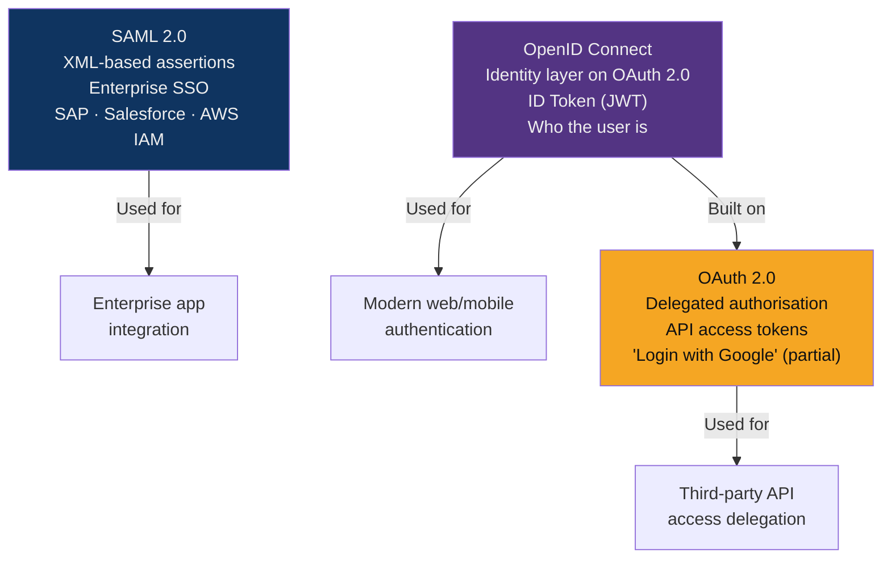
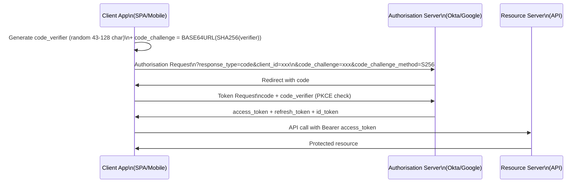

# 🌐 SSO and Federation

> [!abstract] TL;DR
> SSO reduces the attack surface of credential management by centralising authentication. Three protocols dominate: **SAML 2.0** (enterprise SSO — XML-based, IdP-initiated or SP-initiated flows, signs XML assertions), **OAuth 2.0** (delegated authorisation — access tokens for API access, authorisation code + PKCE is the modern standard), and **OIDC** (authentication layer on OAuth 2.0 — ID tokens in JWT format, who the user is). Common confusion: OAuth 2.0 is about authorisation (what you can do), OIDC/SAML are about authentication (who you are). Key attacks: SAML signature wrapping, open redirect for OAuth, token leakage in implicit flow (now deprecated).

---

## Protocol Comparison



---

## SAML 2.0

### SP-Initiated vs IdP-Initiated Flow

**SP-Initiated (most common):**
```
1. User → SP (e.g., Salesforce): request protected resource
2. SP → Browser: redirect to IdP with AuthnRequest
3. Browser → IdP: present AuthnRequest
4. IdP: authenticate user (username/password + MFA)
5. IdP → Browser: HTML form with SAMLResponse (Base64 XML)
6. Browser → SP: POST SAMLResponse
7. SP: verify XML signature, validate assertion
8. SP → User: grant access
```

**IdP-Initiated (from SSO portal):**
```
1. User → IdP portal (e.g., Okta dashboard): click app tile
2. IdP → Browser: HTML form with SAMLResponse (unsolicited)
3. Browser → SP: POST SAMLResponse
4. SP: grant access (no InResponseTo check → higher vulnerability to CSRF)
```

### SAML Assertion Structure

```xml
<samlp:Response xmlns:samlp="urn:oasis:names:tc:SAML:2.0:protocol"
    ID="_abc123" Version="2.0" InResponseTo="_requestid123">
    
  <saml:Assertion>
    <saml:Issuer>https://idp.example.com</saml:Issuer>
    
    <!-- Signed portion — covers specific elements -->
    <ds:Signature>
      <ds:SignedInfo>
        <ds:Reference URI="#_assertion1"/>  <!-- References assertion ID -->
      </ds:SignedInfo>
      <ds:SignatureValue>BASE64...</ds:SignatureValue>
    </ds:Signature>
    
    <saml:Subject>
      <saml:NameID Format="urn:oasis:names:tc:SAML:1.1:nameid-format:emailAddress">
        user@company.com
      </saml:NameID>
    </saml:Subject>
    
    <saml:Conditions NotBefore="2026-07-28T10:00:00Z" 
                     NotOnOrAfter="2026-07-28T10:05:00Z">
      <saml:AudienceRestriction>
        <saml:Audience>https://app.salesforce.com</saml:Audience>
      </saml:AudienceRestriction>
    </saml:Conditions>
    
    <saml:AttributeStatement>
      <saml:Attribute Name="Role">
        <saml:AttributeValue>Admin</saml:AttributeValue>
      </saml:Attribute>
    </saml:AttributeStatement>
  </saml:Assertion>
</samlp:Response>
```

### SAML Vulnerabilities

**Signature Wrapping (XSW) Attack:**
```xml
<!-- Attack: move signed assertion, insert unsigned malicious assertion -->
<!-- Original: Signature wraps over Assertion with user@victim.com -->
<!-- Forged: Add new Assertion (unauthenticated admin) before signed one -->
<!-- Vulnerable SPs process the first Assertion without signature check -->

<!-- Fix: Verify signature covers the assertion being consumed;
         use exclusive XML canonicalization; reject unsigned assertions -->
```

**Comment Injection:**
```xml
<!-- Original username in NameID -->
<saml:NameID>user@company.com</saml:NameID>

<!-- Attack: insert XML comment to confuse parser -->
<saml:NameID>admin<!--injected-->@company.com</saml:NameID>
<!-- Some parsers strip comments and see "admin@company.com" -->
```

---

## OAuth 2.0

### Authorisation Code Flow + PKCE

PKCE (Proof Key for Code Exchange) prevents authorisation code interception:



```python
# Python: PKCE code generation
import secrets, hashlib, base64

code_verifier = secrets.token_urlsafe(32)  # 43-128 chars

code_challenge = base64.urlsafe_b64encode(
    hashlib.sha256(code_verifier.encode()).digest()
).rstrip(b'=').decode()

# Send code_challenge in auth request
# Send code_verifier in token exchange → server verifies SHA256(verifier) == challenge
```

### OAuth 2.0 Grant Types

| Grant Type | Use Case | Security |
|-----------|---------|----------|
| Authorization Code + PKCE | Web apps, mobile, SPAs | Recommended for all user-facing flows |
| Client Credentials | Server-to-server (no user) | Use for M2M; keep client secret secure |
| Authorization Code (no PKCE) | Legacy web apps | Acceptable with confidential clients only |
| Implicit | Legacy SPAs | **Deprecated** — tokens in URL fragment leak via Referer |
| Resource Owner Password | Legacy migration only | **Avoid** — credentials sent to third-party |
| Device Code | Smart TVs, CLIs | Acceptable for devices without browser |

### OAuth Vulnerabilities

```python
# 1. Open Redirect: unvalidated redirect_uri
# Attack: forge redirect_uri to attacker-controlled site → steal code
# Fix: exact match whitelist of redirect_uri at auth server registration
GET /oauth/authorize?client_id=app&redirect_uri=https://evil.com/steal

# 2. CSRF on redirect: state parameter required
# Fix: always include state (random nonce) in auth request;
#      verify state matches in callback
GET /oauth/authorize?client_id=app&redirect_uri=https://app.com/cb&state=<random-nonce>

# 3. Token leakage: implicit flow tokens in URL fragments
# Attack: tokens in fragment visible in browser history, Referer headers, logs
# Fix: use authorisation code + PKCE; never use implicit flow

# 4. Client secret exposure: SPAs can't keep secrets
# Fix: use PKCE (no client secret needed); treat SPAs as public clients
```

---

## OpenID Connect (OIDC)

OIDC adds an identity layer on top of OAuth 2.0 using ID Tokens (JWT format):

### ID Token Claims

```json
{
  "iss": "https://accounts.google.com",      // Issuer
  "sub": "10769150350006150715113082367",     // Subject (user ID)
  "aud": "1234987819200.apps.googleusercontent.com",  // Audience (client_id)
  "exp": 1753708800,                          // Expiry (Unix timestamp)
  "iat": 1753705200,                          // Issued at
  "nonce": "abc123",                          // Replay prevention
  "email": "user@example.com",
  "email_verified": true,
  "name": "Jane Doe",
  "picture": "https://lh3.googleusercontent.com/..."
}
```

### OIDC Discovery

```bash
# Every OIDC provider exposes a discovery document
curl https://accounts.google.com/.well-known/openid-configuration

# Returns:
{
  "issuer": "https://accounts.google.com",
  "authorization_endpoint": "https://accounts.google.com/o/oauth2/v2/auth",
  "token_endpoint": "https://oauth2.googleapis.com/token",
  "jwks_uri": "https://www.googleapis.com/oauth2/v3/certs",  # Public keys for JWT verification
  "userinfo_endpoint": "https://openidconnect.googleapis.com/v1/userinfo",
  "scopes_supported": ["openid", "email", "profile"],
  ...
}
```

### OIDC ID Token Validation

```python
import jwt, requests

# 1. Fetch JWKS (public keys) from provider
jwks_uri = "https://accounts.google.com/.well-known/openid-configuration"
jwks = requests.get("https://www.googleapis.com/oauth2/v3/certs").json()

# 2. Validate ID token
def validate_id_token(id_token, expected_client_id):
    # Decode header to find key ID
    header = jwt.get_unverified_header(id_token)

    # Find matching key in JWKS
    public_key = get_key_from_jwks(jwks, header['kid'])

    # Validate with all required checks:
    claims = jwt.decode(
        id_token,
        key=public_key,
        algorithms=["RS256"],
        audience=expected_client_id,  # Must match aud
        options={
            "verify_exp": True,        # Must not be expired
            "verify_iat": True,        # Issued at must be in the past
        }
    )
    # Also verify: iss == expected issuer, nonce matches, sub is non-empty
    return claims
```

---

## Common IdP Comparison

| IdP | Protocol Support | Best For |
|-----|-----------------|---------|
| Okta | SAML, OIDC, OAuth 2.0, SCIM | Enterprise SSO, MFA, lifecycle management |
| Azure AD/Entra ID | SAML, OIDC, WS-Fed, SCIM | Microsoft ecosystem, hybrid AD |
| Auth0 | OIDC, OAuth 2.0, SAML | Developer-friendly, B2C apps |
| Keycloak | SAML, OIDC, OAuth 2.0, Kerberos | Self-hosted, open-source |
| PingIdentity | SAML, OIDC, OAuth 2.0 | Legacy enterprise, financial |

---

## Common Pitfalls

1. **Not validating `aud` claim in OIDC** — A token issued for `app-A` can be replayed at `app-B` if audience isn't validated
2. **Using implicit flow** — Tokens appear in URL fragments, browser history, and Referer headers; migrate to auth code + PKCE
3. **Not including `nonce` in OIDC** — Without nonce, ID tokens are replayable; set and verify nonce in session
4. **Trusting SAML NameID without signature validation** — Signature wrapping attacks require checking that the signature covers the consumed assertion
5. **Accepting IdP-initiated SAML without CSRF protection** — Always validate InResponseTo and session state for SP-initiated flows

---

## Related Concepts

- [[Authentication_Protocols|→ Kerberos & NTLM]] — Enterprise on-prem auth protocols
- [[Multi_Factor_Authentication|→ MFA]] — MFA enforcement in IdPs
- [[JWT_and_OAuth|→ JWT & OAuth]] — JWT implementation details
- [[Cloud_Identity_and_Access|→ Cloud IAM]] — OIDC federation with cloud providers
- [[Certificate_Management_and_PKI|→ PKI]] — Certificates underlying TLS in SAML/OIDC
- [[_MOC_Identity_and_Authentication|↑ Identity & Authentication MOC]]

---

## Review Questions

1. Explain the SAML Signature Wrapping (XSW) attack. Draw the before/after XML structure and explain why a vulnerable SP grants admin access to an attacker who only has a valid user account.
2. A mobile app uses OAuth 2.0 implicit flow. The security team wants to migrate to authorisation code + PKCE. Explain what PKCE protects against and why client_secret alone is not sufficient for mobile apps.
3. A developer validates OIDC tokens with: `jwt.decode(token, verify_signature=False)`. Identify every security problem with this, and write the correct validation code (any language).
4. Your organisation uses Okta as IdP and needs SSO for both a SaaS app (supports SAML) and a custom microservice API (needs OAuth). Describe how you would configure both integrations from the same Okta IdP.

---

## Sources

- OAuth 2.0 Security Best Current Practice (RFC 9700): https://datatracker.ietf.org/doc/html/rfc9700
- SAML 2.0 Technical Overview: https://docs.oasis-open.org/security/saml/v2.0/saml-tech-overview-2.0.pdf
- OIDC Core Spec: https://openid.net/specs/openid-connect-core-1_0.html
- PortSwigger OAuth Academy: https://portswigger.net/web-security/oauth

#Cybersecurity #Identity #SAML #OAuth #OIDC #SSO #Federation
