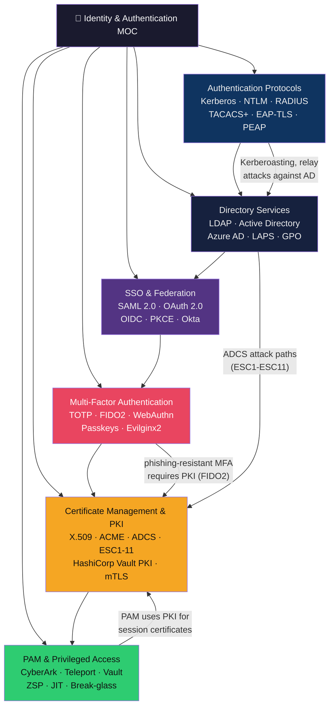
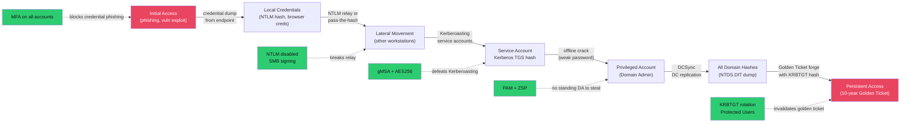

# 🪪 Identity and Authentication — Map of Content

> [!abstract] Section Overview
> 6-note deep-dive into enterprise identity and authentication — the new security perimeter. As networks dissolved and cloud adoption accelerated, "identity is the new perimeter" became the central security axiom. This section covers the full identity stack: foundational authentication protocols (Kerberos, NTLM, RADIUS), SSO and federation (SAML, OAuth 2.0, OIDC), directory services and Active Directory security, multi-factor authentication from SMS to FIDO2 passkeys, PKI and certificate lifecycle management, and privileged access management with Zero Standing Privileges.

---

## Section Architecture

---

## Notes in This Section

| Note | Key Topics | Difficulty |
|------|------------|------------|
| [[Authentication_Protocols\|Authentication Protocols]] | Kerberos (Golden/Silver ticket, Kerberoasting), NTLM relay, RADIUS, TACACS+, EAP types | Advanced |
| [[SSO_and_Federation\|SSO and Federation]] | SAML 2.0 flows + attacks, OAuth 2.0 + PKCE, OIDC, Okta/Keycloak, B2B federation | Intermediate |
| [[Directory_Services\|Directory Services]] | LDAP protocol + injection, Active Directory hierarchy + attacks, Azure AD hybrid, LAPS | Intermediate |
| [[Multi_Factor_Authentication\|Multi-Factor Authentication]] | TOTP/HOTP, FIDO2/WebAuthn/passkeys, YubiKey, MFA fatigue, Evilginx2 AiTM, phishing-resistant MFA | Intermediate |
| [[Certificate_Management_and_PKI\|Certificate Management and PKI]] | PKI hierarchy, X.509 deep dive, Let's Encrypt/ACME, ADCS ESC1-ESC11, HashiCorp Vault PKI, mTLS | Advanced |
| [[PAM_and_Privileged_Access\|PAM and Privileged Access]] | Password vaulting, session recording, JIT access, CyberArk, Teleport, ZSP, break-glass | Advanced |

---

## Learning Path

### Path A — Blue Team / Identity Security Engineer

1. [[Authentication_Protocols|Authentication Protocols]] — Understand Kerberos and NTLM deeply (what attackers exploit)
2. [[Directory_Services|Directory Services]] — AD architecture, attack surface, and hardening
3. [[Multi_Factor_Authentication|MFA]] — Deploy phishing-resistant MFA (FIDO2 rollout strategy)
4. [[Certificate_Management_and_PKI|PKI]] — Internal CA with Vault, ADCS audit for ESC misconfigs
5. [[PAM_and_Privileged_Access|PAM]] — Zero Standing Privileges design and Teleport/CyberArk deployment

### Path B — Red Team / Penetration Tester

1. [[Authentication_Protocols|Authentication Protocols]] — Kerberoasting, AS-REP roasting, NTLM relay attacks
2. [[Directory_Services|Directory Services]] — BloodHound enumeration, DCSync, GPO abuse, ADCS attacks
3. [[Certificate_Management_and_PKI|PKI]] — ADCS ESC1-ESC11 exploitation with Certipy
4. [[SSO_and_Federation|SSO & Federation]] — SAML signature wrapping, OAuth open redirect, token theft
5. [[Multi_Factor_Authentication|MFA]] — Evilginx2 AiTM phishing, SIM swapping, MFA fatigue attacks

### Path C — Cloud / DevOps Identity

1. [[SSO_and_Federation|SSO & Federation]] — OIDC for CI/CD (GitHub Actions → cloud without static creds)
2. [[Certificate_Management_and_PKI|PKI]] — Vault PKI secrets engine, cert-manager in K8s, short-lived certs
3. [[Multi_Factor_Authentication|MFA]] — Passkeys deployment and conditional access policies
4. [[PAM_and_Privileged_Access|PAM]] — Teleport for SSH/K8s/DB access, dynamic secrets with Vault

---

## Key Concepts Quick Reference

| Concept | Location |
| ------- | -------- |
| Kerberos TGT/service ticket flow | [[Authentication_Protocols]] |
| Kerberoasting attack + gMSA defence | [[Authentication_Protocols]] |
| Golden Ticket vs Silver Ticket | [[Authentication_Protocols]] |
| NTLM relay with Responder + ntlmrelayx | [[Authentication_Protocols]] |
| SAML SP-initiated vs IdP-initiated flow | [[SSO_and_Federation]] |
| OAuth 2.0 PKCE flow | [[SSO_and_Federation]] |
| OIDC ID token claims | [[SSO_and_Federation]] |
| AD forest/tree/domain/OU hierarchy | [[Directory_Services]] |
| BloodHound AD path enumeration | [[Directory_Services]] |
| LDAP injection and anonymous bind | [[Directory_Services]] |
| FIDO2/WebAuthn origin binding (phishing-resistant) | [[Multi_Factor_Authentication]] |
| Evilginx2 AiTM — bypasses TOTP | [[Multi_Factor_Authentication]] |
| Passkeys vs TOTP security comparison | [[Multi_Factor_Authentication]] |
| PKI hierarchy (Root CA offline, Intermediate online) | [[Certificate_Management_and_PKI]] |
| ADCS ESC1 privilege escalation with Certipy | [[Certificate_Management_and_PKI]] |
| HashiCorp Vault PKI dynamic issuance | [[Certificate_Management_and_PKI]] |
| Zero Standing Privileges (ZSP) design | [[PAM_and_Privileged_Access]] |
| Teleport SSH/K8s/DB access + session recording | [[PAM_and_Privileged_Access]] |
| Break-glass procedure and dual-custody | [[PAM_and_Privileged_Access]] |

---

## Identity Attack Chain

---

## Cross-Section Links

| Related Section | Connection |
|----------------|------------|
| [[../07_Cloud_Security/_MOC_Cloud_Security\|Cloud Security]] | Cloud IAM, Workload Identity Federation, Azure PIM, GCP Cloud IAM |
| [[../02_Network_Security/_MOC_Network_Security\|Network Security]] | 802.1X RADIUS, VPN authentication, TLS certificates |
| [[../05_Penetration_Testing/_MOC_Penetration_Testing\|Penetration Testing]] | AD attacks, Kerberoasting, ADCS exploitation, BloodHound |
| [[../01_Security_Foundations/_MOC_Security_Foundations\|Security Foundations]] | Authentication as AAA, least privilege principle |
| [[../_MOC_Cybersecurity_Master\|Cybersecurity Master]] | Parent vault |

---

## Framework Mapping

| Framework | Identity & Auth Coverage |
| --------- | ------------------------ |
| **MITRE ATT&CK** | T1558 (Steal Kerberos tickets), T1550 (Pass-the-Hash/Ticket), T1078 (Valid Accounts), T1556 (Modify Auth Process) |
| **NIST CSF** | PR.AC (Identity Management, Access Control) — central category |
| **Zero Trust** | Identity verification on every request — never trust, always verify |
| **CIS Controls** | Control 5 (Account Management), Control 6 (Access Control), Control 12 (Network Infrastructure) |
| **ISO 27001** | A.9 (Access Control), A.10 (Cryptography), A.14 (Secure Development) |

---

- [[_MOC_Cybersecurity_Master|↑ Cybersecurity Master MOC]]

#Cybersecurity #Identity #Authentication #MOC
