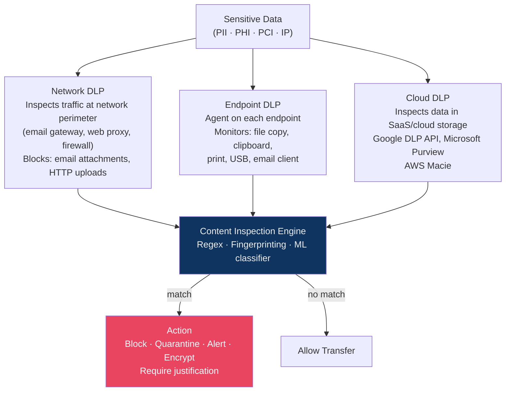
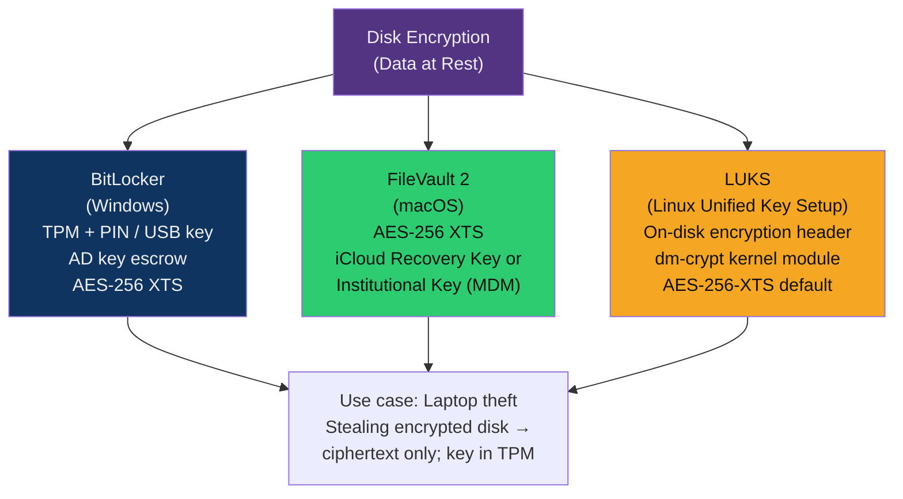

# 🗄️ DLP and Data Protection

> [!abstract] TL;DR
> **Data Loss Prevention (DLP)** detects and blocks unauthorized movement of sensitive data — at the network perimeter (network DLP), on endpoints (endpoint DLP), and in cloud services (cloud DLP). Detection relies on **content inspection**: regex patterns, data fingerprinting, and ML classifiers identify SSNs, credit card numbers, source code, and health records. Disk encryption (**BitLocker**, **FileVault**, **LUKS**) protects data at rest from physical theft. **USB device control** prevents removable media exfiltration. The hardest challenge is false positives — DLP that blocks too aggressively becomes a productivity hindrance.

---

## Intuition — Analogy First

DLP is like a **customs checkpoint** at every exit from a country. Legitimate travellers (authorized data transfers) pass quickly. The customs officer checks for contraband (sensitive data): if a briefcase contains classified documents, it's stopped and the traveller is questioned. The challenge: the officer must correctly identify "classified documents" without opening every briefcase — using X-ray (content inspection) and passenger profiles (user behaviour analytics).

Disk encryption is different — it's the **safe** that stores your valuables. Even if a thief breaks into your house (steals the laptop), they cannot read the contents of the safe without the combination (decryption key).

---

## How It Works

### DLP Architecture



---

### Content Inspection Methods

**1. Regular Expression (Regex) Patterns**

Simple but effective for structured data:

```python
import re

# US Social Security Number: NNN-NN-NNNN
SSN_PATTERN = re.compile(r'\b(?!000|666|9\d{2})\d{3}-(?!00)\d{2}-(?!0000)\d{4}\b')

# Credit card: Luhn-valid 16-digit groups (simplified)
CC_PATTERN = re.compile(r'\b(?:4[0-9]{12}(?:[0-9]{3})?|'        # Visa
                         r'5[1-5][0-9]{14}|'                      # Mastercard
                         r'3[47][0-9]{13}|'                       # Amex
                         r'6(?:011|5[0-9]{2})[0-9]{12})\b')      # Discover

# AWS Access Key
AWS_KEY_PATTERN = re.compile(r'AKIA[0-9A-Z]{16}')

# UK NHS number: NNN NNN NNNN
NHS_PATTERN = re.compile(r'\b\d{3}\s\d{3}\s\d{4}\b')

def scan_document(text: str) -> list[str]:
    findings = []
    if SSN_PATTERN.search(text):
        findings.append("US_SSN")
    if CC_PATTERN.search(text):
        findings.append("CREDIT_CARD")
    if AWS_KEY_PATTERN.search(text):
        findings.append("AWS_ACCESS_KEY")
    if NHS_PATTERN.search(text):
        findings.append("UK_NHS_NUMBER")
    return findings

# Example
test_doc = "Patient 123-45-6789 paid with card 4111111111111111"
print(scan_document(test_doc))
# Output: ['US_SSN', 'CREDIT_CARD']
```

**2. Data Fingerprinting (Exact Document Matching)**

The DLP system creates a fingerprint (hash or n-gram signature) of sensitive documents. When network traffic or files contain content matching a fingerprint, they're flagged — even if the document was copied partially or reformatted.

Useful for: source code, contracts, M&A documents, HR files.

**3. ML Classifiers**

Trained models identify data by semantic content rather than exact patterns:
- Health records: identifies HIPAA-sensitive medical terminology
- Financial data: recognizes balance sheets, trading records
- Source code: detects proprietary code regardless of language

Google DLP API and Microsoft Purview use pre-trained classifiers for 100+ content categories.

---

### DLP Policy Examples

| Data Type | Regulatory Driver | Example DLP Rule |
|-----------|------------------|-----------------|
| **SSN / NPI** | HIPAA (US healthcare) | Block any email containing SSN or NPI numbers leaving the org |
| **Credit card numbers** | PCI-DSS | Alert on any file containing 3+ credit card numbers in any cloud upload |
| **Source code** | IP protection | Block GitHub uploads of files matching internal code fingerprints |
| **M&A documents** | Securities law | Quarantine emails from Finance department containing "acquisition" + deal names |
| **PHI (health records)** | HIPAA | Block unencrypted email containing patient names + diagnosis codes |

---

### Common DLP Tools

| Tool | Type | Strengths |
|------|------|-----------|
| **Symantec DLP (Broadcom)** | Enterprise | Comprehensive, strong fingerprinting, mature |
| **Microsoft Purview DLP** | Microsoft 365 integrated | Native M365/Teams/SharePoint integration; included in E5 |
| **Google Cloud DLP API** | Cloud/SaaS | Inspect any text/images via API; used in GCP pipelines |
| **Forcepoint DLP** | Enterprise | Strong user behaviour analytics (UBA) integration |
| **AWS Macie** | AWS-specific | Auto-classify S3 data; PII detection in cloud storage |

---

### Insider Threat Detection

DLP is a primary tool for detecting **insider threats** — employees or contractors intentionally or accidentally exfiltrating data:

**Behavioural indicators to correlate:**
- Mass file downloads before a resignation date
- Accessing files outside normal job function
- Uploading to personal cloud (Dropbox, Google Drive)
- Large email attachments to personal accounts
- USB transfers to unregistered devices

**UEBA (User and Entity Behaviour Analytics)** platforms (Exabeam, Securonix) integrate DLP alerts with HR data, access logs, and endpoint telemetry to surface high-risk users.

---

### Disk Encryption



```bash
# LUKS Setup (Linux)
# Create encrypted partition
cryptsetup luksFormat --type luks2 --cipher aes-xts-plain64 \
    --key-size 512 --hash sha256 /dev/sdb1

# Open (decrypt) the partition
cryptsetup luksOpen /dev/sdb1 encrypted_data

# Mount the decrypted device
mount /dev/mapper/encrypted_data /mnt/secure

# Check encryption info
cryptsetup luksDump /dev/sdb1

# Backup LUKS header (critical for recovery)
cryptsetup luksHeaderBackup /dev/sdb1 --header-backup-file luks_header.bin
```

```powershell
# BitLocker - Enable with TPM + PIN (PowerShell)
Enable-BitLocker -MountPoint "C:" -EncryptionMethod XtsAes256 `
    -TpmAndPinProtector

# Check BitLocker status
Get-BitLockerVolume -MountPoint "C:" | Select-Object MountPoint, EncryptionMethod, ProtectionStatus

# Get recovery key (for AD escrow)
Get-BitLockerVolume "C:" | Select-Object -ExpandProperty KeyProtector | 
    Where-Object {$_.KeyProtectorType -eq "RecoveryPassword"}

# BitLocker on removable drives (enforce encryption before write)
# Via GPO: Computer Config → Admin Templates → BitLocker → Fixed Data Drives →
# "Deny write access to fixed drives not protected by BitLocker" = Enabled
```

---

### USB Device Control

Preventing exfiltration via removable media:

```powershell
# Block all USB storage via Group Policy (Windows)
# GPO: Computer Config → Admin Templates → System → Removable Storage Access
# "Removable Disks: Deny write access" = Enabled

# Via registry
Set-ItemProperty -Path "HKLM:\SOFTWARE\Policies\Microsoft\Windows\RemovableStorageDevices\{53f56307-b6bf-11d0-94f2-00a0c91efb8b}" `
    -Name "Deny_Write" -Value 1

# Allow only specific USB devices (device ID whitelist)
# In Intune: Device Control policy → Allow listed VID/PID combinations
# Example: allow only company-issued encrypted USB drives (specific VID/PID)
```

---

## Real-World Notes

- **Capital One breach (2019)** — An IAM misconfiguration in AWS allowed exfiltration of 100M+ credit card records. A cloud DLP solution (AWS Macie) correctly flagged the S3 bucket as containing PCI data, but the misconfigured SSRF was not detected until the attacker posted about it publicly. DLP prevents unintentional leaks but doesn't replace IAM security.
- **Tesla insider threat (2023)** — Two ex-employees leaked personal data of 75,000+ people to German media. Endpoint DLP controls on USB ports and email attachments, combined with UEBA alerts on mass data access, are the primary controls for such scenarios.
- **False positive problem** — A UK NHS trust deployed Microsoft Purview DLP with broad NHS number detection rules and blocked 35% of all emails in the first week — including legitimate patient referrals. DLP policies require careful policy simulation ("test mode") before enforcement.

---

## Trade-offs

| DLP Approach | Coverage | False Positive Risk | Bypass Risk | Cost |
|-------------|----------|--------------------|-----------|----|
| Network DLP | High (all network traffic) | Medium | TLS encryption hides content | High |
| Endpoint DLP | Very High (all channels) | High | Steganography; air-gapped transfers | Very High |
| Cloud DLP | Cloud channels only | Medium | Personal cloud accounts | Medium |
| Regex-only detection | Fast, structured data | Low | Obfuscated/encoded data | Low |
| ML classifier | Semantic content | Medium | Adversarial obfuscation | Medium-High |
| Disk encryption | Physical theft only | Very Low | N/A for live systems | Low |

---

## Common Pitfalls

1. **DLP without a policy review process** — DLP policies must be regularly reviewed: data formats change, new regulations emerge, business processes change. A policy written in 2022 misses 2026 data types.
2. **Blocking without logging** — If DLP blocks a transfer, the user may find another path (personal device, USB). Always log and alert before adding hard blocks.
3. **No escrow for disk encryption keys** — BitLocker keys not escrowed to Active Directory or Intune mean a device with a forgotten PIN is permanently inaccessible.
4. **Only protecting structured data** — Most breaches involve unstructured data (emails, Word documents, Slack exports). ML classifiers or fingerprinting must cover these.
5. **USB control bypassed by smartphones** — Blocking USB mass storage doesn't prevent data transfer via Android MTP (Media Transfer Protocol) or iPhone iTunes backup mode. Device control policies must explicitly cover these protocols.

---

## Related Concepts

- [[Endpoint_Security_Overview|← Endpoint Security Overview]] — DLP is one layer in endpoint defence-in-depth
- [[OS_Hardening|← OS Hardening]] — disk encryption configured during OS hardening
- [[Antivirus_and_EDR|← EDR]] — EDR telemetry complements DLP (detects exfil post-prevention)
- [[Threat_Intelligence_Overview|← Threat Intel]] — insider threat intel informs DLP policy priority
- [[_MOC_Endpoint_Security|↑ Endpoint Security MOC]]

---

## Review Questions

1. A disgruntled employee copies 50,000 customer records to a personal Google Drive account. Describe which DLP control would detect this (network DLP, endpoint DLP, or cloud DLP), what the detection mechanism would be, and two bypass techniques the employee could use.
2. Explain why disk encryption (BitLocker) with TPM-only binding (no PIN) provides significantly weaker protection than TPM+PIN. Under what physical attack scenario would TPM-only be bypassed?
3. Your DLP policy generates 200 false positives per day, causing the security team to ignore all DLP alerts. Describe two technical and two procedural changes you would make to reduce the false positive rate without reducing detection coverage.

---

## Sources

- NIST SP 800-111: Guide to Storage Encryption Technologies for End User Devices
- Microsoft Purview DLP: https://docs.microsoft.com/en-us/microsoft-365/compliance/dlp-learn-about-dlp
- Google Cloud DLP: https://cloud.google.com/dlp
- LUKS/cryptsetup: https://gitlab.com/cryptsetup/cryptsetup
- CIS Control 3: Data Protection

#Cybersecurity #DLP #DataProtection #BitLocker #FileVault #LUKS #InsiderThreat #USB #endpoint-security
