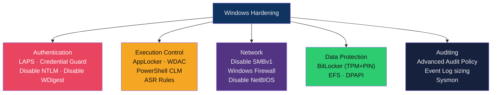
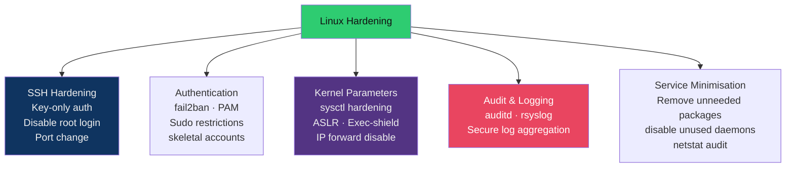

# 🔒 OS Hardening

> [!abstract] TL;DR
> OS hardening reduces the attack surface of a system by disabling unnecessary services, enforcing strong authentication, restricting privileged access, and applying security configurations benchmarked against **CIS Controls** or **DISA STIGs**. Windows hardening key controls: **AppLocker**, **LAPS**, **Credential Guard**, **WDAC**, **BitLocker**, disabling SMBv1/NTLM. Linux hardening: SSH key-only auth, **auditd** for syscall logging, **fail2ban**, **sysctl** kernel parameters, unnecessary service removal. Use **Lynis** (Linux) or **Microsoft Baseline Security Analyzer** to score current state.

---

## Intuition — Analogy First

A new house comes from the builder with many unnecessary doors: a basement hatch, a utility door, a skylight hatch, a garage side door. Each extra entry point is a potential way in. OS hardening is **closing every door you don't use**, putting deadbolts on the ones you do, and installing alarms. The fewer open doors, the smaller the attack surface.

CIS Benchmarks are the building code that tells you exactly which doors should be closed, which should have locks, and which locks must meet a minimum security grade.

---

## How It Works

### Windows Hardening



#### Critical Windows Hardening Controls

**1. LAPS (Local Administrator Password Solution)**

Every Windows machine has a local Administrator account. Without LAPS, organizations often set the same local admin password across all machines — compromise one machine, compromise all.

```powershell
# Deploy LAPS via GPO or Intune
# Install LAPS module
Install-Module LAPS

# Check LAPS password for a specific computer
Get-LapsADPassword -Identity "WORKSTATION01" -AsPlainText

# View LAPS expiry
Get-LapsADPassword -Identity "WORKSTATION01" | Select-Object ComputerName, ExpirationTimestamp
```

LAPS rotates each machine's local admin password automatically, stores it in Active Directory (protected by ACLs), and makes it available to authorized admins. Lateral movement using a harvested local admin hash is defeated.

**2. Credential Guard**

Credential Guard uses virtualization-based security (VBS) to isolate LSASS in a separate Hyper-V protected process. Mimikatz cannot dump NTLM hashes from a system with Credential Guard enabled because the secrets are no longer accessible to normal kernel code.

```powershell
# Enable Credential Guard via Device Guard
# Verify via registry
(Get-ItemProperty HKLM:\SYSTEM\CurrentControlSet\Control\DeviceGuard).EnableVirtualizationBasedSecurity
# Returns 1 if enabled

# Check Device Guard / Credential Guard status
Get-ComputerInfo | Select-Object -Property DeviceGuard*
```

**3. PowerShell Constrained Language Mode (CLM)**

Limits PowerShell to safe, approved operations. Blocks .NET type access, COM objects, reflection — all commonly used in AMSI bypasses and post-exploitation.

```powershell
# Check current language mode
$ExecutionContext.SessionState.LanguageMode
# Returns "FullLanguage" (unrestricted) or "ConstrainedLanguage" (hardened)

# CLM is automatically enforced when AppLocker or WDAC is in effect
# and PowerShell scripts are not in the allow list
```

**4. WDAC (Windows Defender Application Control)**

Kernel-mode enforcement of application allow lists. More tamper-resistant than AppLocker (runs in kernel, policy signed by Microsoft or organization cert, cannot be disabled by admin).

```xml
<!-- WDAC policy snippet - allow only Microsoft-signed code -->
<FileRules>
    <Allow ID="ID_ALLOW_A_1" FriendlyName="Allow Kernel Drivers" FileName="*" />
</FileRules>
<SigningScenarios>
    <SigningScenario Value="12" ID="ID_SIGNINGSCENARIO_WINDOWS" FriendlyName="Auto generated policy on 07-29-2026">
        <ProductSigners>
            <AllowedSigners>
                <AllowedSigner SignerId="ID_SIGNER_WINDOWS" />
            </AllowedSigners>
        </ProductSigners>
    </SigningScenario>
</SigningScenarios>
```

**5. Disable Legacy Protocols**

```powershell
# Disable SMBv1 (EternalBlue target - MS17-010)
Set-SmbServerConfiguration -EnableSMB1Protocol $false -Force

# Disable NTLMv1 (weak, susceptible to relay attacks)
# Via GPO: Computer Config → Security Settings → Local Policies → Security Options
# "Network security: LAN Manager authentication level" → "Send NTLMv2 response only. Refuse LM & NTLM"

# Disable WDigest (stores plaintext passwords in LSASS memory)
Set-ItemProperty -Path "HKLM:\SYSTEM\CurrentControlSet\Control\SecurityProviders\WDigest" `
    -Name "UseLogonCredential" -Value 0

# Disable LLMNR (LLMNR poisoning used in Responder attacks)
New-Item -Path "HKLM:\SOFTWARE\Policies\Microsoft\Windows NT\DNSClient" -Force
Set-ItemProperty -Path "HKLM:\SOFTWARE\Policies\Microsoft\Windows NT\DNSClient" `
    -Name "EnableMulticast" -Value 0
```

---

### Linux Hardening



#### Critical Linux Hardening Controls

**1. SSH Hardening**

```bash
# /etc/ssh/sshd_config hardened settings

PermitRootLogin no               # Never allow direct root SSH
PasswordAuthentication no        # Key-only auth (most important)
PubkeyAuthentication yes
AuthorizedKeysFile .ssh/authorized_keys
X11Forwarding no                 # Disable GUI forwarding
AllowTcpForwarding no            # Prevent SSH tunnelling for pivoting
MaxAuthTries 3                   # Limit brute force attempts
ClientAliveInterval 300          # Timeout idle sessions after 5 minutes
ClientAliveCountMax 0
Banner /etc/issue.net            # Legal warning banner

# Only allow specific users/groups
AllowGroups sshusers

# Apply
sudo systemctl restart sshd
```

**2. sysctl Kernel Hardening**

```bash
# /etc/sysctl.d/99-hardening.conf

# Disable IP forwarding (unless this is a router)
net.ipv4.ip_forward = 0

# Disable ICMP redirects
net.ipv4.conf.all.accept_redirects = 0
net.ipv4.conf.default.accept_redirects = 0

# Enable Address Space Layout Randomisation (ASLR)
kernel.randomize_va_space = 2

# Disable SysRq key (privilege escalation risk)
kernel.sysrq = 0

# Protect kernel pointers in /proc
kernel.kptr_restrict = 2

# Restrict dmesg access
kernel.dmesg_restrict = 1

# Prevent core dumps from SUID binaries
fs.suid_dumpable = 0

# Apply immediately
sudo sysctl --system
```

**3. auditd — Audit Framework**

```bash
# Install auditd
sudo apt install auditd

# Key audit rules — /etc/audit/rules.d/hardening.rules

# Monitor /etc/passwd and /etc/shadow changes (credential modification)
-w /etc/passwd -p wa -k user_modification
-w /etc/shadow -p wa -k user_modification
-w /etc/sudoers -p wa -k sudoers_change

# Monitor privileged command execution
-a always,exit -F arch=b64 -S execve -F euid=0 -k privileged_exec

# Monitor SSH auth
-w /var/log/auth.log -p wa -k ssh_auth

# Monitor failed login attempts
-w /var/log/faillog -p wa -k failed_logins

# Apply rules
sudo augenrules --load
sudo systemctl enable --now auditd

# Query audit log
ausearch -k user_modification --start today
```

**4. fail2ban**

```bash
# /etc/fail2ban/jail.local

[DEFAULT]
bantime  = 3600         # Ban for 1 hour
findtime = 600          # Within 10 minutes
maxretry = 5            # After 5 failures

[sshd]
enabled  = true
port     = ssh
logpath  = %(sshd_log)s
backend  = %(sshd_backend)s
maxretry = 3

[nginx-http-auth]
enabled = true
port    = http,https
logpath = /var/log/nginx/error.log

sudo systemctl enable --now fail2ban
sudo fail2ban-client status sshd   # Check ban list
```

---

### CIS Benchmarks and DISA STIGs

| Standard | Issued By | Level | Focus |
|----------|-----------|-------|-------|
| **CIS Benchmark Level 1** | Center for Internet Security | Baseline | Minimal performance impact; broadly applicable |
| **CIS Benchmark Level 2** | Center for Internet Security | Hardened | Higher security, may impact usability/compatibility |
| **DISA STIG** | Defense Information Systems Agency | DoD requirement | Mandatory for US DoD systems; very strict |

CIS Benchmarks cover:
- Windows 10/11, Windows Server 2019/2022
- Ubuntu 22.04 LTS, RHEL 9, Amazon Linux 2023
- Docker, Kubernetes, AWS/Azure/GCP
- Applications (Apache, nginx, PostgreSQL)

---

### Hardening Assessment Tools

**Lynis (Linux):**
```bash
# Install and run
sudo apt install lynis
sudo lynis audit system

# Output: hardening index score /100, categorised findings
# Example finding:
# [WARNING] iptables module(s) loaded, but no rules active [FIRE-4512]
# Suggestion: Consider hardening SSH configuration [SSH-7408]
```

**Microsoft Baseline Security Analyzer (MBSA) / Microsoft Security Compliance Toolkit:**
```powershell
# Download CIS or STIG baseline from Security Compliance Toolkit
# Compare current system settings vs baseline

# Using PolicyAnalyzer (part of SCT)
# Import baseline GPO → compare vs. local/domain policy → generate delta report

# Alternatively: use DSC (Desired State Configuration) to enforce settings
# PowerSTIG: https://github.com/microsoft/PowerStig
Install-Module PowerSTIG
```

---

## Real-World Notes

- **EternalBlue (MS17-010) / WannaCry (2017)** — SMBv1 was disabled in Windows Vista, but many organizations left it enabled for legacy compatibility. WannaCry exploited it to spread to 200,000+ systems globally. Simply disabling SMBv1 would have prevented lateral movement in almost all cases.
- **NTLM relay attacks** (Responder, ntlmrelayx) are still extremely common in internal penetration tests as of 2026. Organizations with LLMNR enabled and NTLM not restricted to NTLMv2 are trivially compromised within hours of network access.
- **Mimikatz WDigest** — before MS KB2871997 patch, Windows stored cleartext credentials in LSASS for WDigest compatibility. Setting `UseLogonCredential=0` prevents this; Credential Guard provides additional protection even against kernel-mode attackers.

---

## Trade-offs

| Hardening Control | Security Gain | Operational Impact | Compatibility Risk |
|------------------|--------------|-------------------|--------------------|
| Disable SMBv1 | High | Low (SMBv1 obsolete) | Very old network printers/NAS |
| Disable NTLM | High | Medium | Legacy apps using NTLMv1 |
| LAPS | High | Low | Requires AD; minimal workflow change |
| Credential Guard | High | Low | Incompatible with some virtualization platforms |
| WDAC | Very High | Very High | Requires extensive application testing |
| SSH key-only auth | High | Medium | Requires key distribution process |
| sysctl hardening | Medium | Low | Rarely causes issues |
| auditd | Medium (detection) | Low–Medium | Log volume increases; storage required |

---

## Common Pitfalls

1. **Hardening workstations but not servers** — Many breaches pivot from workstation → server. Both surfaces require hardening.
2. **Disabling SMBv1 but not NetBIOS or LLMNR** — LLMNR/NBT-NS poisoning (Responder) doesn't require SMBv1 and is equally effective for credential capture.
3. **CIS Level 2 in production without testing** — Level 2 settings often break applications. Always test hardening baselines in a staging environment first.
4. **auditd with no review process** — Generating audit logs you never review is security theater. Audit logs must feed into a SIEM or regular review.
5. **LAPS installed but ACLs not configured** — If all users in IT can read LAPS passwords from AD, it doesn't reduce the lateral movement risk.

---

## Related Concepts

- [[Endpoint_Security_Overview|← Endpoint Security Overview]] — defence-in-depth context
- [[Antivirus_and_EDR|← Antivirus & EDR]] — detection complements hardening
- [[Application_Control_and_Allowlisting|→ Application Control]] — WDAC/AppLocker details
- [[Attack_Surface_Analysis|← Attack Surface Analysis]] — hardening reduces attack surface
- [[_MOC_Endpoint_Security|↑ Endpoint Security MOC]]

---

## Review Questions

1. Explain why disabling WDigest authentication (`UseLogonCredential=0`) reduces the effectiveness of Mimikatz. What additional control would make it even harder for an attacker with SYSTEM privileges to dump credentials?
2. A penetration tester gains initial access on a Linux server. They run `sudo -l` and find the user can run `/usr/bin/python3` as root without a password. Describe the privilege escalation and what hardening control prevents it.
3. What is the difference between CIS Level 1 and Level 2 benchmarks? Give an example of a setting present in Level 2 but not Level 1, and explain the operational trade-off.

---

## Sources

- CIS Benchmarks: https://www.cisecurity.org/cis-benchmarks
- DISA STIG Library: https://public.cyber.mil/stigs/downloads/
- Lynis: https://cisofy.com/lynis/
- Microsoft Security Compliance Toolkit: https://www.microsoft.com/en-us/download/details.aspx?id=55319
- NSA Cybersecurity Advisory: Hardening Network Infrastructure

#Cybersecurity #OSHardening #Windows #Linux #CIS #STIG #LAPS #CredentialGuard #WDAC #auditd #endpoint-security
