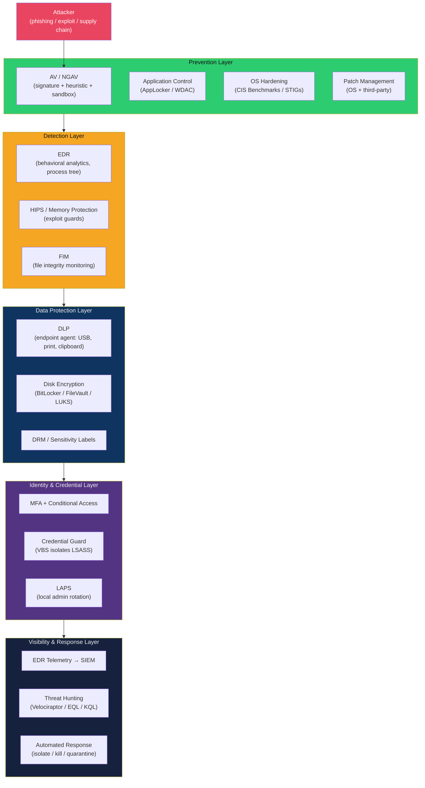

# 🖥️ Endpoint Security — Map of Content

> [!abstract] Section Overview
> Endpoints are the last — and most attacked — line of defence. Over 70% of confirmed breaches involve an endpoint as the initial access or impact target. This section covers the full defensive stack: from AV signature databases and modern EDR behavioural engines, through OS-level hardening controls (CIS Benchmarks, AppLocker, WDAC, Credential Guard), data loss prevention, and application allowlisting. Understanding each layer tells you both how attackers try to bypass it and how defenders catch the bypass in turn.

---

## Why Endpoint Security is the Last Line of Defence

Network perimeters erode constantly: remote work, BYOD, SaaS adoption, and cloud workloads push traffic outside traditional firewalls. An adversary who phishes a user's credentials bypasses the perimeter entirely. At that point, every control left is on the endpoint itself:

- **Prevention controls** stop known-bad (AV, application control, patch management)
- **Detection controls** catch unknown-bad behaviour (EDR, HIPS, FIM)
- **Data protection controls** limit the blast radius of a compromise (DLP, disk encryption)
- **Identity controls** reduce lateral movement (LAPS, Credential Guard, PAM)
- **Visibility controls** feed investigation and hunting (EDR telemetry → SIEM → threat hunting)

No single layer is sufficient. The combination — each control catching what the previous one misses — is what modern endpoint defence means.

---

## Endpoint Security Layers

---

## Learning Path

| Step | Note | Why |
|------|------|-----|
| 1 | [[Endpoint_Security_Overview]] | Understand the full defence-in-depth model before diving into tools |
| 2 | [[Antivirus_and_EDR]] | Core detection technology — AV limitations drive everything else |
| 3 | [[OS_Hardening]] | Hardening removes the attack surface EDR would otherwise have to detect |
| 4 | [[Application_Control_and_Allowlisting]] | Allowlisting is the most effective — and most complex — preventive control |
| 5 | [[DLP_and_Data_Protection]] | After prevention and detection, limit what an attacker can steal or encrypt |

---

## Notes in This Section

| Note | Topics | Difficulty |
|------|--------|------------|
| [[Endpoint_Security_Overview]] | Defence-in-depth model, attack phases, telemetry types, control trade-offs | Intermediate |
| [[Antivirus_and_EDR]] | Traditional AV vs EDR, XDR, AMSI bypass, LOLBins, fileless malware, process injection; EDR product comparison | Intermediate–Advanced |
| [[OS_Hardening]] | Windows hardening (ASR, WDAC, Credential Guard, BitLocker, LAPS, NTLM/SMBv1), Linux hardening (SELinux, AppArmor, auditd, sysctl), CIS Benchmarks, DISA STIGs | Advanced |
| [[Application_Control_and_Allowlisting]] | AppLocker rules + bypasses, WDAC kernel enforcement + policy workflow, SELinux type enforcement, AppArmor profiles, container image allowlisting | Advanced |
| [[DLP_and_Data_Protection]] | Data classification, network/endpoint/cloud/email DLP, disk encryption (BitLocker/LUKS), database TDE, key management (HSM, KMS), insider threat | Intermediate–Advanced |

---

## Key Concepts at a Glance

| Concept | One-line Explanation |
|---------|----------------------|
| **EDR** | Records process, network, file, registry events per-endpoint; detects behaviour not signatures |
| **XDR** | Extends EDR correlation across email, network, cloud layers |
| **AMSI** | Windows Antimalware Scan Interface — hooks PowerShell/VBA to scan at runtime |
| **LOLBins** | Living-off-the-land binaries: certutil, mshta, rundll32 used maliciously |
| **WDAC** | Kernel-enforced application allowlisting using VBS (more secure than AppLocker) |
| **Credential Guard** | VBS isolates LSASS memory — prevents pass-the-hash/pass-the-ticket |
| **LAPS** | Per-machine rotating local admin passwords stored in AD — stops lateral movement |
| **ASR Rules** | Attack Surface Reduction rules in Windows Defender — block macro execution, child processes from Office |
| **SELinux** | Mandatory Access Control in Linux — type enforcement (source→target allow rules) |
| **TDE** | Transparent Data Encryption — encrypts database files at rest without app changes |

---

## Related Sections

- [[01_Security_Foundations/_MOC_Security_Foundations|← Security Foundations]] — CIA triad, threat models, ATT&CK framework that motivates endpoint controls
- [[06_Digital_Forensics_IR/_MOC_DFIR|← Digital Forensics & IR]] — responding to an endpoint compromise; memory forensics, malware analysis
- [[05_Penetration_Testing/_MOC_Penetration_Testing|← Penetration Testing]] — how attackers bypass each endpoint control (red team perspective)
- [[10_Threat_Intelligence/_MOC_Threat_Intelligence|→ Threat Intelligence]] — IoC-based detection in EDR/SIEM, threat hunting from CTI

#Cybersecurity #EndpointSecurity #MOC #EDR #OSHardening #DLP #AppControl
