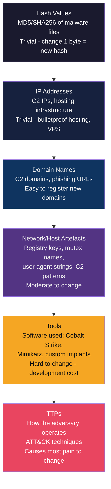

# 📌 Indicators of Compromise

> [!abstract] TL;DR
> **IoCs (Indicators of Compromise)** are forensic artifacts — file hashes, IP addresses, domains, registry keys — that indicate a system was compromised. **IoAs (Indicators of Attack)** are behavioural: suspicious command patterns, process anomalies. IoC quality varies drastically by type: IP addresses and domains change within days (low durability), while TTPs are highly durable. The **Pyramid of Pain** (David Bianco) formalises this. Sharing formats: **STIX**, **OpenIOC**, **YARA** (file matching), **Sigma** (SIEM rules). Key intel feeds: **abuse.ch**, **AlienVault OTX**, **VirusTotal Intelligence**. IoC-only detection is easily evaded by sophisticated actors via polymorphism.

---

## Intuition — Analogy First

IoCs are like a **criminal's known identifiers**: their fingerprints (file hash), their home address (IP), their phone number (domain). Law enforcement watches for these. A sophisticated criminal changes their address (new IP), registers a new phone (new domain), and wears gloves (changes file hash). But they keep their operating patterns: same neighbourhoods, same crime methods, same crew — these are the TTPs, and they're much harder to change.

The **Pyramid of Pain** captures this: blocking a criminal's current address causes minimal pain (they rent a new one). Identifying and disrupting their operating methodology causes maximum pain.

---

## How It Works

### IoC vs IoA

| Type | Examples | Detection Method | Durability | Evasion |
|------|---------|-----------------|------------|---------|
| **IoC — Technical** | File hash, IP, domain, URL | Blocklist lookup, DNS sinkhole | Days-weeks | Trivial (change hash/IP) |
| **IoC — Behavioural** | Registry key, mutex name | SIEM search, EDR | Weeks-months | Moderate (rename mutex) |
| **IoA** | Process spawning pattern, credential dump API calls | Behavioural analytics, EDR rules | Months-years | Hard (change behaviour) |
| **TTP** | Spearphishing + encoded PowerShell + LSASS dump | SIEM correlation + hunting | Permanent (attacker's methodology) | Very Hard (retrain entire team) |

---

### The Pyramid of Pain



**Pyramid of Pain** — the higher up the pyramid, the more pain it causes the attacker when you detect/block it:
- **Hashes** (bottom): change a single byte → new hash. A unique malware sample can be used against you exactly once after the hash is known.
- **IPs/Domains**: the attacker rotates hosting every few days. Blocking known IPs slows but doesn't stop them.
- **Artefacts**: mutex names, user-agent strings — changing these requires recompiling/modifying tools.
- **TTPs** (top): if you detect and block the entire methodology (spearphish + encoded PowerShell + LSASS dump), the attacker must retrain their entire operation — maximum disruption.

---

### IoC Types and Formats

```python
# Common IoC examples
ioc_examples = {
    "file_hash_md5":    "d41d8cd98f00b204e9800998ecf8427e",
    "file_hash_sha256": "e3b0c44298fc1c149afbf4c8996fb92427ae41e4649b934ca495991b7852b855",
    "ipv4":             "192.0.2.100",
    "ipv6":             "2001:db8::1",
    "domain":           "evil-c2.example.com",
    "url":              "http://192.0.2.100/beacon.php",
    "email":            "attacker@spoofed-domain.com",
    "registry_key":     "HKCU\\Software\\Microsoft\\Windows\\CurrentVersion\\Run\\evil",
    "mutex":            "Global\\\\MicrosoftDefenderMalwareProtectionScan",
    "user_agent":       "Mozilla/5.0 (Windows NT; Trident/7.0; rv:11.0) like Gecko",
    "ja3_hash":         "769,47-53-5-10-49161-49162-49171-49172-50-56-19-4,0-10-11,23-24-25,0",
    # JA3 fingerprints TLS client hello - identifies malware by TLS behaviour
}
```

---

### YARA Rules

YARA is a pattern-matching language for identifying malware based on file content:

```yara
/*
    YARA Rule: Detect Mimikatz (password dumping tool)
    Source: Adapted from public Mimikatz YARA signatures
    Tags: credential_access, T1003.001
*/
rule Mimikatz_Generic {
    meta:
        description = "Detects Mimikatz credential dumping tool"
        author      = "Detection Engineering Team"
        date        = "2026-07-29"
        reference   = "https://github.com/gentilkiwi/mimikatz"
        tlp         = "WHITE"
        score       = 90

    strings:
        // Unique strings present in mimikatz binary
        $str1 = "mimikatz" ascii nocase
        $str2 = "sekurlsa::logonpasswords" ascii nocase
        $str3 = "lsadump::sam" ascii nocase
        $str4 = "privilege::debug" ascii nocase
        
        // Encoded/obfuscated variants
        $enc1 = "bWltaWthdHo" ascii  // base64 of "mimikatz"
        
        // Import functions indicative of LSASS access
        $api1 = "LsaICryptProtectMemory" ascii
        $api2 = "SamQueryInformationUser" ascii
        $api3 = "NtlmSharedFunctionTable" ascii

    condition:
        // Match if any of the clear strings OR any of the API imports
        (any of ($str*)) or
        ($enc1) or
        (2 of ($api*))
}


rule Cobalt_Strike_Beacon_Watermark {
    meta:
        description = "Detects Cobalt Strike beacon by license watermark"
        score       = 75

    strings:
        // CS watermark appears as PE overlay in most beacons
        $cs_watermark = { 2E 2E 2E 00 ?? ?? ?? 00 70 69 70 65 }

    condition:
        uint16(0) == 0x5A4D and  // PE file
        filesize < 5MB and
        $cs_watermark
}
```

```bash
# Run YARA scan
yara -r mimikatz_rule.yar /path/to/scan/

# Scan memory of running process
yara -p 64 -r mimikatz_rule.yar /proc/1234/mem

# Scan network captures
yara -r rule.yar suspicious_traffic.pcap

# Use with VirusTotal YARA hunting
# Upload rule to VT → hunt against 3-year archive of all submitted samples
```

---

### Sigma Rules (SIEM-Agnostic IoA Detection)

```yaml
# Sigma rule for detecting Mimikatz via Windows Security Events
title: Mimikatz LSASS Memory Read
id: 6ef9ab3b-9c22-4b63-a2f3-d8b5a6c4e1f7
status: stable
description: Detects Mimikatz reading LSASS process memory for credential extraction
references:
    - https://attack.mitre.org/techniques/T1003/001/
author: Detection Engineering
date: 2026/07/29
tags:
    - attack.credential_access
    - attack.t1003.001
logsource:
    product: windows
    category: process_access
detection:
    selection:
        TargetImage|endswith: '\lsass.exe'
        GrantedAccess|contains:
            - '0x1010'  # PROCESS_VM_READ + PROCESS_QUERY_INFORMATION
            - '0x1410'
            - '0x147a'
            - '0x1fffff'  # Full access
    filter_legitimate:
        SourceImage|endswith:
            - '\MsMpEng.exe'     # Windows Defender
            - '\csrss.exe'       # System process
            - '\werfault.exe'    # Error reporting
            - '\taskmgr.exe'     # Task Manager
    condition: selection and not filter_legitimate
falsepositives:
    - Some antivirus products legitimately read LSASS
    - Crash dump tools
level: critical
```

---

### Threat Intelligence Feeds

| Feed | Type | Content | Cost |
|------|------|---------|------|
| **abuse.ch (URLhaus, Feodo, MalwareBazaar)** | Open | Malware URLs, C2 IPs, malware hashes | Free |
| **AlienVault OTX** | Open community | Pulses (curated IoC collections) | Free |
| **VirusTotal Intelligence** | Commercial | All submitted samples, relationships | $20K+/yr |
| **Shodan's Malicious IPs** | Commercial | C2 infrastructure | Fee |
| **Mandiant Advantage Intel** | Commercial | APT actor profiles, TTPs, new samples | Enterprise |
| **Recorded Future** | Commercial | Real-time dark web + technical feeds | Enterprise |
| **MISP Community** | Community sharing | Sector-specific curated IoCs | Free (ISAC member) |

---

### IoC Quality and Decay

```python
from datetime import datetime, timedelta
from enum import Enum

class IoC_Type(Enum):
    HASH       = ("File Hash",   90)   # 90 days before stale
    IP_ADDRESS = ("IP Address",  7)    # 7 days before stale
    DOMAIN     = ("Domain",      30)   # 30 days before stale
    URL        = ("URL",         14)   # 14 days before stale
    MUTEX      = ("Mutex",       180)  # 180 days before stale
    TTP        = ("TTP",         730)  # 2 years before stale

def ioc_confidence(ioc_type: IoC_Type, days_old: int, source_credibility: int) -> float:
    """
    Calculate IoC confidence score.
    ioc_type: the type of indicator
    days_old: how old the indicator is in days
    source_credibility: 1-10 (10 = government CERT, 1 = anonymous forum)
    Returns confidence 0.0-1.0
    """
    type_name, freshness_window = ioc_type.value
    
    # Decay factor: drops to ~0 after freshness window
    age_factor = max(0, 1 - (days_old / freshness_window))
    
    # Source factor
    source_factor = source_credibility / 10
    
    confidence = age_factor * source_factor
    print(f"  {type_name}: age={days_old}d, decay={age_factor:.2f}, "
          f"source={source_credibility}/10 → confidence={confidence:.2f}")
    return confidence

print("IoC confidence examples:")
ioc_confidence(IoC_Type.IP_ADDRESS, days_old=5,  source_credibility=9)
ioc_confidence(IoC_Type.IP_ADDRESS, days_old=30, source_credibility=9)
ioc_confidence(IoC_Type.HASH,       days_old=60, source_credibility=7)
ioc_confidence(IoC_Type.TTP,        days_old=180, source_credibility=8)

# Output:
# IP Address: age=5d, decay=0.29, source=9/10 → confidence=0.26
# IP Address: age=30d, decay=-3.29 (→0), source=9/10 → confidence=0.00
# File Hash: age=60d, decay=0.33, source=7/10 → confidence=0.23
# TTP: age=180d, decay=0.75, source=8/10 → confidence=0.60
```

---

### IoC-Based Detection Limitations

**Evasion by polymorphism** — an attacker can:
1. Recompile malware → new hash
2. Redirect C2 to new IP → IP IoC worthless in hours
3. Register new domain → domain IoC worthless in days
4. Pad file with random bytes → new hash
5. Use legitimate cloud services (GitHub, Pastebin) for C2 → domain blocklists bypass

**Countermeasure:** Combine IoC-based detection (easy wins) with TTP-based detection (durable). The Pyramid of Pain says: block IoCs as a first line, but build TTP-based detections as the primary defence.

---

## Real-World Notes

- **VirusTotal retrohunting** — VirusTotal allows subscribers to run YARA rules against all files submitted in the past 3 years. Threat intel teams use this to find historical malware they hadn't seen at the time — enabling backdated attribution.
- **Feed poisoning** — In 2015, researchers demonstrated that feeding false IoCs into open threat intel sharing platforms could cause defenders to block legitimate services. Any open feed must be validated before operationalizing.
- **JA3 hash** — A TLS fingerprint of the client hello (cipher suites, extensions, elliptic curves). Many malware families have distinctive JA3 hashes because their hardcoded TLS libraries produce the same client hello every time. More durable than IP/domain but still spoofable.

---

## Trade-offs

| Detection Approach | Pyramid Level | Coverage | Durability | Evasion Cost |
|-------------------|--------------|----------|------------|--------------|
| Hash blocklist | Bottom | Exact samples only | Days | Trivial |
| IP/Domain blocklist | Low | Current C2 infra | Days-weeks | Easy |
| YARA string matching | Mid | Malware family | Weeks-months | Moderate |
| Sigma behavioural rules | Mid-High | Technique patterns | Months | Hard |
| TTP correlation | Top | Attacker methodology | Years | Very Hard |

---

## Common Pitfalls

1. **Blocking IoCs without confidence scoring** — Ingesting thousands of unvetted IPs from an open feed and blocking them all causes false positives and potential outages (blocking CDN IPs, legitimate services).
2. **Not deduplicating IoC feeds** — Multiple feeds overlap significantly. Without deduplication, the same IoC gets blocked multiple times (waste), and expiry management becomes impossible.
3. **Treating all IoCs as equally urgent** — A SHA256 hash from a nation-state malware sample is not the same priority as a low-confidence IP from an anonymous forum post.
4. **IoC-only security program** — Organizations that invest heavily in IoC feeds but have no TTP-based detection rules are easily evaded by any actor that changes infrastructure (all sophisticated actors do).
5. **Keeping stale IoCs forever** — An IP IoC from 2019 is almost certainly now used by a legitimate business. Implement expiry-based automatic removal with confidence decay.

---

## Related Concepts

- [[Threat_Intelligence_Overview|← Threat Intelligence Overview]] — IoCs are the technical layer of the intel pyramid
- [[OSINT_Techniques|← OSINT]] — OSINT sources generate IoCs
- [[Threat_Hunting|← Threat Hunting]] — IoCs drive hunting hypotheses
- [[SIEM_and_SOAR|← SIEM & SOAR]] — IoCs are loaded as SIEM lookup tables
- [[Malware_Analysis|← Malware Analysis]] — malware analysis produces new IoCs
- [[_MOC_Threat_Intelligence|↑ Threat Intelligence MOC]]

---

## Review Questions

1. Explain the Pyramid of Pain in your own words. A threat actor changes their malware hash every 24 hours but reuses the same C2 infrastructure. Which level of the pyramid does this attack? What detection approach would be more durable?
2. Write a YARA rule to detect a hypothetical RAT that always contains the string "RAT_v3_LOADER" in its binary, makes HTTP POST requests with a hardcoded User-Agent of "Mozilla/4.0 (RAT)", and creates a mutex named "GlobalRAT_Mutex_v3". What are the limitations of this YARA rule?
3. Your SIEM ingests 3 external IoC feeds (AlienVault OTX, abuse.ch, and a commercial feed). You notice a legitimate business partner's IP appears in AlienVault OTX as "C2 infrastructure." How do you validate this IoC and decide whether to block it or remove it from the feed?

---

## Sources

- Bianco, D. (2013). The Pyramid of Pain. https://detect-respond.blogspot.com/2013/03/the-pyramid-of-pain.html
- YARA documentation: https://yara.readthedocs.io/en/stable/
- abuse.ch: https://abuse.ch/
- AlienVault OTX: https://otx.alienvault.com/
- OpenIOC specification: https://github.com/mandiant/OpenIOC_1.1
- STIX 2.1 Indicator object: https://oasis-open.github.io/cti-documentation/

#Cybersecurity #IoC #YARA #Sigma #PyramidOfPain #ThreatIntelligence #VirusTotal #threat-intelligence
