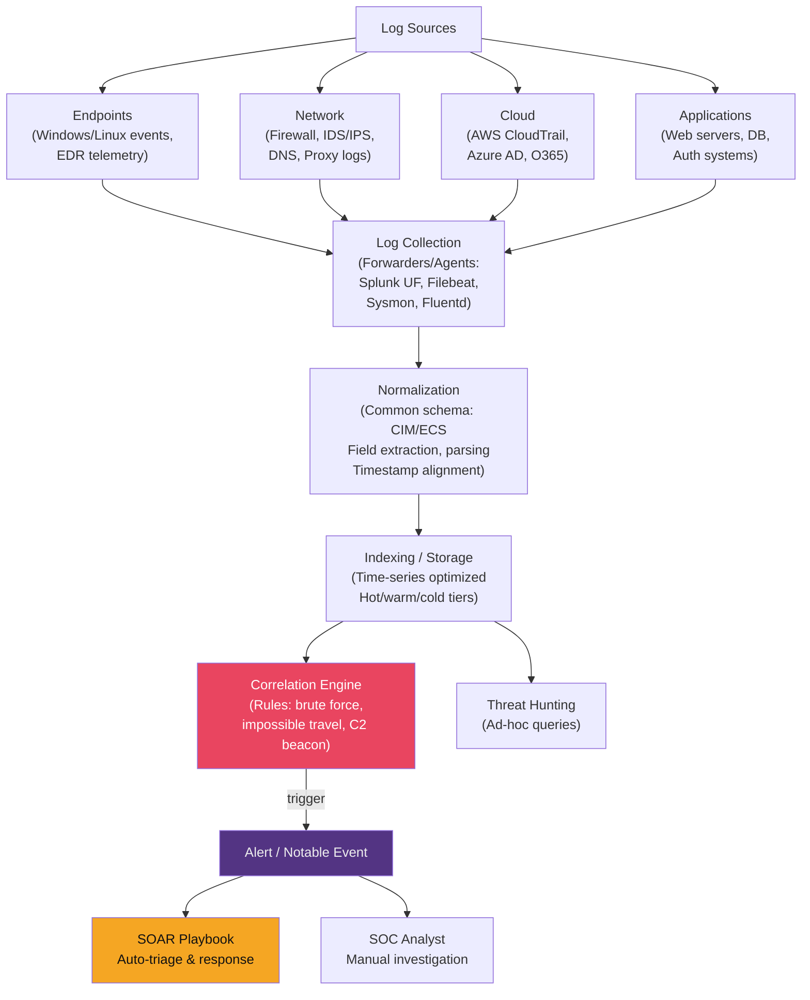
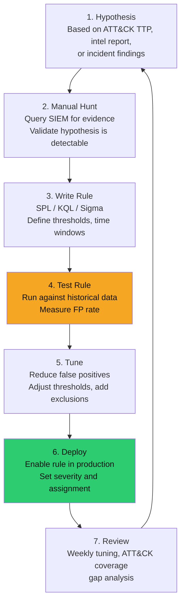

# 📊 SIEM and SOAR

> [!abstract] TL;DR
> **SIEM** (Security Information and Event Management) aggregates logs from across the environment, normalises them to a common schema, and applies **correlation rules** to detect attack patterns (brute force, impossible travel, PowerShell abuse). Leading platforms: **Splunk**, **Microsoft Sentinel** (cloud-native), **Elastic SIEM**, **IBM QRadar**. **SOAR** (Security Orchestration Automation Response) automates repetitive analyst tasks — triage, enrichment, ticketing, containment — via **playbooks**. Together they form the SOC operational backbone, turning alert volumes from thousands/day into prioritised, context-rich, auto-enriched cases.

---

## Intuition — Analogy First

A SIEM is like a **security operations centre for an airport**: cameras (endpoints), X-ray machines (firewalls), passenger manifests (IAM logs), and biometric gates (identity systems) all feed data to a central monitoring room. Analysts watch for patterns: "passenger boarded in New York, then showed up at security in London 30 minutes later" (impossible travel). No single sensor would catch this — correlation across sources is the key.

SOAR is the **standard operating procedure manual** for the airport's security team, combined with automation: when the suspicious passenger alert fires, SOAR automatically looks up the passenger manifest (enrichment), creates a case in the ticketing system, texts the lead security officer, and initiates a secondary screening request — all before a human analyst even opens their laptop.

---

## How It Works

### SIEM Architecture



---

### Correlation Rules and Use Cases

**Brute Force Detection (Splunk SPL):**
```splunk
index=wineventlog EventCode=4625
| stats count by src_ip, user, _time span=5m
| where count > 10
| eval alert="Brute Force: " + tostring(count) + " failed logins from " + src_ip
| table _time, src_ip, user, count, alert
```

**Impossible Travel Detection:**
```splunk
index=azure_ad action=login status=success
| stats list(src_country) as countries, list(_time) as times, count by user
| mvexpand countries
| join user [search index=azure_ad action=login status=success | stats list(src_country) as prev_countries by user]
| where NOT match(countries, prev_countries)
| eval time_diff = abs(times[1] - times[0]) / 3600
| where time_diff < 4 AND countries != prev_countries
| table user, countries, prev_countries, time_diff
```

**PowerShell Abuse Detection:**
```splunk
index=wineventlog EventCode=4104 
| search ScriptBlockText="*Invoke-Mimikatz*" 
    OR ScriptBlockText="*AmsiUtils*" 
    OR ScriptBlockText="*-enc*"
    OR ScriptBlockText="*WebClient*DownloadString*"
| eval risk="High - Suspicious PowerShell"
| table _time, ComputerName, UserID, ScriptBlockText, risk
```

**Lateral Movement via PsExec:**
```splunk
index=wineventlog EventCode=7045 ServiceName="PSEXESVC"
| stats count by ComputerName, _time
| where count > 0
| eval alert="PsExec service installed - possible lateral movement"
```

---

### Microsoft Sentinel (KQL Examples)

```kusto
// Impossible Travel Alert
let threshold_hours = 4;
SigninLogs
| where TimeGenerated > ago(1d)
| where ResultType == "0"  // Successful login
| project TimeGenerated, UserPrincipalName, IPAddress, Location=tostring(LocationDetails)
| summarize LoginLocations=make_list(pack("time", TimeGenerated, "ip", IPAddress, "loc", Location)) by UserPrincipalName
| mv-expand LoginLocations
| extend LoginTime = todatetime(LoginLocations.time), LoginLoc = tostring(LoginLocations.loc)
| order by UserPrincipalName, LoginTime asc
| serialize
| extend PrevTime = prev(LoginTime, 1), PrevLoc = prev(LoginLoc, 1)
| where PrevLoc != "" and LoginLoc != PrevLoc
| extend TimeDiff = datetime_diff("hour", LoginTime, PrevTime)
| where TimeDiff < threshold_hours and TimeDiff > 0
| project UserPrincipalName, PrevLoc, LoginLoc, TimeDiff, LoginTime

// Detect new OAuth app granted high-privilege roles
AuditLogs
| where OperationName == "Consent to application"
| extend AppName = tostring(TargetResources[0].displayName)
| extend Permissions = tostring(AdditionalDetails[0].value)
| where Permissions has_any ("RoleManagement.ReadWrite.Directory", "Directory.ReadWrite.All")
| project TimeGenerated, InitiatedBy, AppName, Permissions
```

---

### SIEM Products Comparison

| Product | Type | Strengths | Weaknesses |
|---------|------|-----------|------------|
| **Splunk Enterprise** | On-prem/Cloud | Industry standard, rich SPL, vast app ecosystem | Very expensive ($150K+/yr for large env) |
| **Microsoft Sentinel** | Cloud-native (Azure) | Pay-per-use, native M365/Azure integration, KQL | Requires Azure; KQL learning curve |
| **Elastic SIEM** | Open-source stack | EQL, low cost, flexible deployment | Requires operational expertise |
| **IBM QRadar** | Enterprise | Deep network flow analysis, mature correlation | Complex UX, high licensing cost |
| **Sumo Logic** | Cloud-native | Good cloud log analysis | Less strong endpoint coverage |
| **Wazuh** | Open-source (OSSEC fork) | Free, agent-based, MITRE ATT&CK mapping | Limited scale without Elasticsearch |

---

### Detection Engineering Workflow



**Sigma rules** — a generic format for SIEM-agnostic detection rules:

```yaml
# Sigma rule: T1059.001 - PowerShell execution with encoded command
title: PowerShell Encoded Command Execution
id: 3b6ab547-38d9-4c95-9e9e-4e5c5e3e9c8a
status: stable
description: Detects PowerShell execution with encoded command argument
references:
    - https://attack.mitre.org/techniques/T1059/001/
author: Detection Engineering Team
date: 2026/07/29
tags:
    - attack.execution
    - attack.t1059.001
logsource:
    category: process_creation
    product: windows
detection:
    selection:
        CommandLine|contains:
            - ' -enc '
            - ' -encodedcommand '
            - ' -EncodedCommand '
    filter_legitimate:
        ParentImage|endswith:
            - '\svchost.exe'  # Windows scheduled tasks
    condition: selection and not filter_legitimate
falsepositives:
    - Legitimate administrative scripts using encoded commands
    - SCCM/Intune management tasks
level: medium

# Convert to Splunk SPL:
# sigmac -t splunk sigma_rule.yml
```

---

### SOAR Playbook Automation

**What SOAR automates:**

| Alert Type | Manual Steps (20-30 min) | SOAR Automates (30 sec) |
|-----------|--------------------------|------------------------|
| Phishing email | Open email, extract IOCs, search SIEM, create ticket | Extract URLs/hashes, check VirusTotal, enrich user, quarantine email, create Jira ticket |
| Malware alert | Look up hash, check context, contact user | Hash lookup (VT/CrowdStrike), isolate host, open ServiceNow incident |
| Failed logins | Count attempts, check user, determine brute force vs. lockout | Count logins, check geo, disable account if > threshold, page on-call |
| Exposed credential | Manual search, notify user | Search active directory, force password reset, notify user manager |

**Splunk SOAR playbook (Python-based):**
```python
def phishing_triage_playbook(action=None, success=None, container=None, 
                              results=None, handle=None, **kwargs):
    """
    Automated phishing email triage playbook.
    Inputs: Email artifact with header, subject, sender, attachments
    """
    phantom.debug("Starting phishing triage playbook")
    
    # Step 1: Extract URLs from email body
    phantom.act(
        action="extract urls",
        parameters=[{"vault_id": container.get("data", {}).get("email_vault_id")}],
        callback=url_reputation_check,
        name="extract_urls"
    )

def url_reputation_check(action=None, success=None, container=None, results=None, **kwargs):
    # Step 2: Check extracted URLs against threat intel
    urls = [r['result_summary']['url'] for r in results['data']]
    
    phantom.act(
        action="url reputation",
        parameters=[{"url": url} for url in urls],
        assets=["virustotal", "domaintools"],
        callback=decide_quarantine,
        name="url_rep_check"
    )

def decide_quarantine(action=None, success=None, container=None, results=None, **kwargs):
    # Step 3: If any URL is malicious, quarantine the email
    malicious_urls = [r for r in results['data'] if r['summary']['score'] > 70]
    
    if malicious_urls:
        phantom.act(
            action="delete email",
            parameters=[{"id": container['data']['email_id'], "quarantine": True}],
            assets=["exchange"],
            callback=create_incident_ticket,
            name="quarantine_email"
        )
        phantom.comment(container=container, 
                        comment=f"Quarantined phishing email. Malicious URLs: {malicious_urls}")
    else:
        phantom.comment(container=container, comment="No malicious URLs found. Email cleared.")
```

**SOAR Platforms:**

| Platform | Strengths |
|---------|-----------|
| **Splunk SOAR (Phantom)** | Deep Splunk integration, large action library |
| **Microsoft Sentinel SOAR** | Azure Logic Apps; native M365/Azure workflows |
| **Palo Alto XSOAR** | Rich marketplace, strong MDR capabilities |
| **Swimlane** | Flexible, code-friendly playbooks |
| **TheHive + Cortex** | Open source; strong for incident management |

---

### Alert Fatigue Reduction Strategies

1. **Tune before deploy** — Run rules in audit/shadow mode for 2 weeks; measure FP rate before enabling alerts
2. **Risk-based alerting** — Don't alert on single events; accumulate risk scores (user + asset + behaviour = risk score → alert at threshold)
3. **Suppress known-good baselines** — Build allowlists for known-good IPs (vulnerability scanners, monitoring systems), admin accounts
4. **SOAR auto-close low-confidence alerts** — Automate "auto-close" for categories with <5% true positive rate, with logging
5. **Measure false positive rate per rule** — Track TP/FP/TN for every correlation rule weekly; immediately tune rules with >95% FP

---

## Real-World Notes

- **Twitter 2020 hack** — The attackers used social engineering to compromise Twitter's internal admin tools. A SIEM with behavioural rules on "admin tool access from unusual IP + access to high-profile accounts + password reset volume spike" would have detected it within minutes.
- **Microsoft Sentinel pricing model** — Based on GB of data ingested. Organizations with verbose Windows Security Event logging routinely face $50K+/month bills. Log sampling and tiered retention (hot/warm/cold) are essential cost controls.
- **MTTD (Mean Time to Detect) benchmark** — Industry average is 207 days (IBM X-Force 2023). Organizations with mature SIEM + SOAR achieve 3-7 days. The gap is almost entirely correlation rule coverage and analyst workflow efficiency.

---

## Trade-offs

| Dimension | Splunk | Microsoft Sentinel | Elastic SIEM |
|-----------|--------|--------------------|--------------|
| Cost | Very High | Pay-per-GB (medium-high) | Low (OS) to medium (managed) |
| Query language | SPL (powerful, proprietary) | KQL (similar to SPL) | EQL/Lucene |
| Cloud-native | No (hybrid) | Yes (Azure-native) | Yes (Elastic Cloud) |
| Detection rules | Very mature | Growing (OOTB rules) | Community (sigma) |
| Integration | 2000+ apps | Native M365/Azure | ELK stack native |

---

## Common Pitfalls

1. **"Collect everything" mindset** — Ingesting every log at full verbosity without tiering generates massive costs and noise. Define log tiers: always-on (authentication, firewall), sampled (DNS, process), on-demand (full packet capture).
2. **No detection engineering process** — Deploying a SIEM with only vendor default rules misses 80% of relevant TTPs. Detection engineering requires continuous work.
3. **SOAR without playbook validation** — An automated playbook that incorrectly isolates a production server causes an outage. Test playbooks on non-prod systems with dry-run mode first.
4. **Single-system correlations** — Detecting PowerShell abuse only when it fires on the endpoint misses cross-system context. Correlate: endpoint (process creation) + network (DNS beacon pattern) + identity (unusual login time).
5. **Not measuring detection coverage** — Use the ATT&CK Navigator to map which TTPs your rules cover. Most organizations cover fewer than 30% of ATT&CK techniques with active, tuned rules.

---

## Related Concepts

- [[Threat_Intelligence_Overview|← Threat Intelligence Overview]] — TI feeds drive SIEM correlation rules
- [[Threat_Hunting|→ Threat Hunting]] — SIEM is the hunting data source
- [[Indicators_of_Compromise|← IoCs]] — IoCs are ingested as SIEM lookup tables
- [[Log_Analysis_and_SIEM|← Log Analysis]] — deep dive on Windows Event IDs and log sources
- [[DFIR_Methodology|← DFIR]] — SIEM is the detection phase of the IR lifecycle
- [[_MOC_Threat_Intelligence|↑ Threat Intelligence MOC]]

---

## Review Questions

1. Write a Splunk SPL query to detect credential stuffing: a single source IP attempting logins against more than 50 distinct usernames within 10 minutes, with a success rate below 5%. Explain each component of the query.
2. A SOC receives 3,000 alerts per day and analysts are overwhelmed. Describe a systematic approach to reduce alert volume by 70% without reducing detection coverage. Include specific technical and process changes.
3. You need to automate response to a malware alert. Design a SOAR playbook (in pseudocode or outline form) that: enriches the alert, makes an isolation decision, executes the response action, creates a ticket, and notifies the appropriate team — while minimizing the risk of accidental isolation of critical infrastructure.

---

## Sources

- Splunk Security Essentials: https://splunkbase.splunk.com/app/3435/
- Sigma project: https://github.com/SigmaHQ/sigma
- Microsoft Sentinel documentation: https://docs.microsoft.com/en-us/azure/sentinel/
- ATT&CK Navigator: https://mitre-attack.github.io/attack-navigator/
- MITRE D3FEND: https://d3fend.mitre.org/

#Cybersecurity #SIEM #SOAR #Splunk #Sentinel #DetectionEngineering #Sigma #AlertFatigue #threat-intelligence
