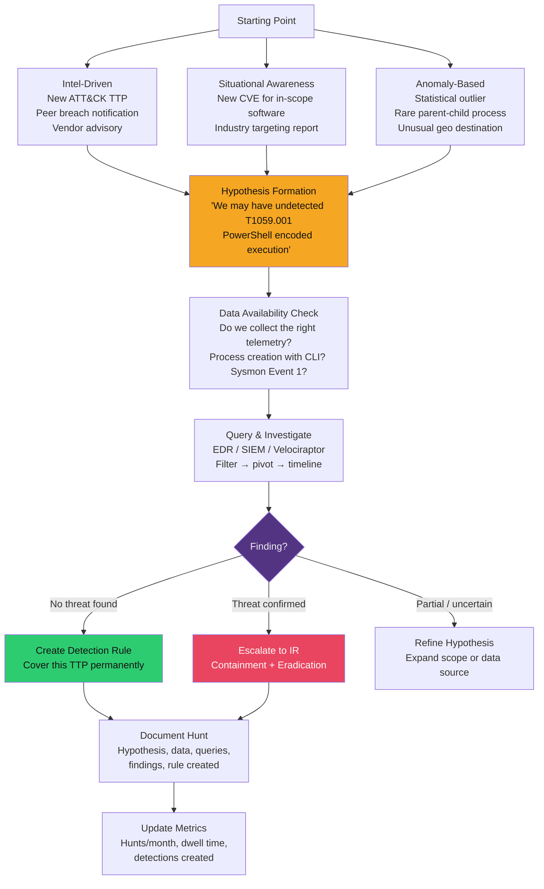

# 🎯 Threat Hunting

> [!abstract] TL;DR
> Threat hunting is proactive, analyst-led investigation that assumes adversaries are **already inside** and looks for evidence they have bypassed automated detection. Unlike SIEM alerts (reactive, known-bad), hunters start with a **hypothesis** derived from threat intelligence or ATT&CK TTPs ("Has anyone used PowerShell with encoded commands in the last 30 days?"), query telemetry to test it, then either confirm a threat or rule it out. Key data sources: EDR process telemetry, Windows Event Logs (Sysmon 4688, 4697, 4698), DNS query logs, network flows. Key tools: Velociraptor (endpoint forensics at scale), Elastic EQL (sequence detection), KQL in Sentinel. A successful hunt either finds an adversary — or produces a new detection rule that catches the same TTPs next time.

---

## Intuition — Analogy First

SIEM correlation rules are like security cameras with motion sensors — they alert on known patterns. Threat hunting is like a detective who reviews the camera footage looking for something *wrong* that the motion sensor didn't trigger on: the maintenance worker who entered at 3 AM, stayed for 20 minutes, and left with a bag. The sensor didn't fire because it was set up for motion, not people-with-bags. The detective brings context, pattern recognition, and domain knowledge that a rule cannot.

The assume-breach mentality is essential: you are not searching for evidence of a breach. You are searching for evidence the breach has *already* happened and gone undetected. The average dwell time before detection is still measured in weeks — hunters close that gap.

---

## How It Works



---

## Key Concepts / Details

### Hypothesis Generation Frameworks

#### Intel-Driven Hypotheses (ATT&CK-Based)

Map hypotheses directly to ATT&CK techniques. Example hypotheses and their test queries:

| ATT&CK Technique | Hypothesis | Data Source | Key Field |
|-----------------|-----------|-------------|-----------|
| T1059.001 PowerShell | Encoded command execution in last 30 days | Windows Event 4104 / Sysmon 1 | `CommandLine contains -enc` |
| T1053.005 Scheduled Tasks | New scheduled tasks created by non-admin | Event 4698 | `TaskName, SubjectUserName` |
| T1055 Process Injection | Non-system processes accessing lsass.exe | Sysmon 10 | `TargetImage = lsass.exe` |
| T1071 C2 over HTTP/S | Beaconing: regular intervals to external IP | Proxy / DNS logs | `bytes variance < 100, interval < 5min` |
| T1547 Boot Persistence | New Run keys added | Event 4657 / Sysmon 13 | `TargetObject contains \Run\` |
| T1021.001 RDP Lateral | RDP login to workstations (not servers) | Event 4624 logon type 10 | `LogonType=10, TargetMachine=workstation` |

#### Situational Awareness Hypotheses

```
Scenario: Log4Shell (CVE-2021-44228) disclosed December 2021
Hypothesis: "Did any internal Java-running systems receive JNDI lookup strings
             in inbound HTTP request URLs during Dec 2021?"

Data: Web proxy logs, WAF logs, application logs
Query (Splunk):
index=proxy earliest="2021-12-09" latest="2021-12-20"
| search uri_path="*${jndi:*" OR uri_path="*%24%7Bjndi%3A*"
| stats count by src_ip, dst_ip, uri_path
| sort -count
```

#### Anomaly-Based Hypotheses

Anomaly hunting looks for statistical rarities — not necessarily known-bad, but unusual enough to investigate:

```python
# Rare parent-child process pairs (Python + pandas approach)
import pandas as pd

# Load process creation events
df = pd.read_csv('process_events.csv')
# Count parent-child combos
combos = df.groupby(['parent_process', 'process']).size().reset_index(name='count')
# Flag rare combos (< 5 occurrences in 30 days)
rare = combos[combos['count'] < 5]
# Focus on dangerous children
dangerous_children = ['powershell.exe', 'cmd.exe', 'wscript.exe', 'mshta.exe', 'regsvr32.exe']
suspicious = rare[rare['process'].isin(dangerous_children)]
print(suspicious.sort_values('count'))
```

---

### Hunting Data Sources

#### Windows Event Log Key IDs

| Event ID | Description | Hunt Value |
|----------|-------------|------------|
| **4624** | Successful logon | Unusual hours, logon type, source IP |
| **4625** | Failed logon | Brute force detection (volume spike) |
| **4688** | Process creation (with command line) | Requires `AuditProcessCreation` with full CLI |
| **4697** | Service installation | New malicious services, PsExec artifacts |
| **4698** | Scheduled task created | Persistence mechanism |
| **4702** | Scheduled task updated | Existing task modified for persistence |
| **4720** | User account created | Rogue accounts |
| **4776** | NTLM authentication | Pass-the-hash, NTLM downgrade |
| **7045** | New service installed | Same as 4697 but from System event log |

#### Sysmon Event IDs (Enable via Sysmon config)

```xml
<!-- Sysmon config snippet for hunting-relevant events -->
<Sysmon schemaversion="4.90">
  <EventFiltering>
    <!-- Event 1: Process creation with full CLI -->
    <ProcessCreate onmatch="include">
      <Image condition="contains any">powershell.exe;cmd.exe;wscript.exe;mshta.exe</Image>
    </ProcessCreate>

    <!-- Event 3: Network connections from scripting engines -->
    <NetworkConnect onmatch="include">
      <Image condition="contains any">powershell.exe;wscript.exe;mshta.exe</Image>
    </NetworkConnect>

    <!-- Event 8: Remote thread creation (process injection) -->
    <CreateRemoteThread onmatch="include">
      <TargetImage condition="ends with">lsass.exe</TargetImage>
    </CreateRemoteThread>

    <!-- Event 10: Process access to LSASS (credential theft) -->
    <ProcessAccess onmatch="include">
      <TargetImage condition="ends with">lsass.exe</TargetImage>
    </ProcessAccess>

    <!-- Event 13: Registry value set (persistence) -->
    <RegistryEvent onmatch="include">
      <TargetObject condition="contains">CurrentVersion\Run</TargetObject>
    </RegistryEvent>
  </EventFiltering>
</Sysmon>
```

---

### Hunting Tools

#### Velociraptor — Endpoint Forensics at Scale

Velociraptor deploys a lightweight agent and enables real-time forensic queries across thousands of endpoints using VQL (Velociraptor Query Language):

```vql
-- Hunt for encoded PowerShell across all endpoints
SELECT * FROM Artifact.Windows.System.PowerShellEncodedCommand()

-- Custom VQL: find all processes with network connections to non-RFC1918 IPs
SELECT Name, Pid, CommandLine, 
       {SELECT RemoteAddr FROM connections(pid=Pid) 
        WHERE RemoteAddr !~ "^10\\.|^192\\.168\\.|^172\\.(1[6-9]|2[0-9]|3[01])\\."} AS external_conns
FROM processes()
WHERE external_conns != []

-- Collect persistence mechanisms (Run keys, scheduled tasks, services)
SELECT * FROM Artifact.Windows.Persistence.PersistenceSniper()

-- Hunt for Cobalt Strike beacon indicators
SELECT * FROM Artifact.Windows.Detection.CobaltStrike()
```

**Key Velociraptor artifacts** for hunting:
- `Windows.EventLogs.EvtxHunter` — fast hunt across all event logs
- `Windows.Persistence.PersistenceSniper` — enumerate all persistence mechanisms
- `Windows.Memory.ProcessList` — memory analysis, injected modules
- `Windows.Network.NetstatEnriched` — all connections with process context

#### Elastic EQL (Event Query Language) — Sequence Detection

EQL is designed for detecting sequences of events — perfect for multi-stage attack chains:

```eql
/* Detect PowerShell spawning cmd.exe then making a network connection */
sequence by host.id with maxspan=1m
  [process where event.action == "start" and process.name == "powershell.exe"]
  [process where event.action == "start" and process.name == "cmd.exe" 
   and process.parent.name == "powershell.exe"]
  [network where event.action == "connection_attempted" 
   and process.name == "cmd.exe"]

/* Detect credential dump: lsass memory access followed by file write */
sequence by host.id with maxspan=30s
  [process where event.action == "process_accessed" 
   and process.name == "lsass.exe"
   and process.pe.original_file_name != "csrss.exe"]
  [file where event.action == "creation" 
   and file.extension in ("dmp", "bin") 
   and file.path like~ "*temp*"]
```

#### KQL in Microsoft Sentinel

```kusto
// Hunt: Rare parent-child process combinations (baseline 30 days)
let KnownPairs = 
    DeviceProcessEvents
    | where Timestamp > ago(30d)
    | summarize count() by InitiatingProcessFileName, FileName
    | where count_ > 100;  // Known-good = seen > 100 times

DeviceProcessEvents
| where Timestamp > ago(7d)
| join kind=leftanti KnownPairs on InitiatingProcessFileName, FileName
| where FileName in ("powershell.exe", "cmd.exe", "wscript.exe", "mshta.exe", "regsvr32.exe")
| project Timestamp, DeviceName, InitiatingProcessFileName, FileName, ProcessCommandLine
| order by Timestamp desc

// Hunt: DNS requests with high-entropy subdomains (DGA/DNS tunneling)
DeviceNetworkEvents
| where Timestamp > ago(24h)
| where RemotePort == 53
| extend Subdomain = tostring(split(RemoteUrl, ".").[0])
| extend EntropyScore = log2(countof(Subdomain, 'a') + countof(Subdomain, 'b') + 1)
// Approximate: long subdomains with mixed alpha-numeric = high entropy
| where strlen(Subdomain) > 20 and Subdomain matches regex @"[0-9a-f]{20,}"
| summarize count() by RemoteUrl, DeviceName
| order by count_ desc
```

---

### Common Hunting Use Cases

#### PowerShell Encoded Commands

```splunk
/* Splunk: Find all PowerShell execution with encoded commands */
index=wineventlog EventCode=4688 
  (CommandLine="*-enc *" OR CommandLine="*-EncodedCommand*")
| eval decoded = base64decode(replace(CommandLine, ".*-[eE]nc[a-z]* ([A-Za-z0-9+/=]+).*", "\1"))
| table _time, ComputerName, SubjectUserName, CommandLine, decoded
| where isnotnull(decoded)
```

#### DNS Tunneling Detection

```splunk
/* Detect DNS tunneling via abnormally long query names */
index=dns
| eval fqdn_length = len(query)
| eval subdomain = mvindex(split(query, "."), 0)
| eval subdomain_length = len(subdomain)
| where fqdn_length > 100 OR subdomain_length > 40
| stats count avg(fqdn_length) as avg_len by src_ip, query
| where count > 50
| table src_ip, query, count, avg_len
```

#### LSASS Access (Credential Theft)

```splunk
/* Sysmon Event 10: Process accessing lsass.exe */
index=wineventlog source="XmlWinEventLog:Microsoft-Windows-Sysmon/Operational" EventCode=10
  TargetImage="*\\lsass.exe"
| where NOT (SourceImage LIKE "%MsMpEng.exe" 
         OR SourceImage LIKE "%wmiprvse.exe"
         OR SourceImage LIKE "%csrss.exe")
| table _time, ComputerName, SourceImage, SourceProcessId, GrantedAccess
| sort -_time
```

#### Lateral Movement — Pass-the-Hash Indicator

```splunk
/* Detect NTLM pass-the-hash: logon type 3 with NTLM auth and no password */
index=wineventlog EventCode=4624 Logon_Type=3 Authentication_Package=NTLM
| where NOT (Source_Network_Address="127.0.0.1" OR Source_Network_Address="::1")
| stats count dc(Account_Name) as distinct_accounts by Source_Network_Address
| where distinct_accounts > 5 OR count > 20
| table Source_Network_Address, distinct_accounts, count
```

---

### Building a Threat Hunting Program

#### Maturity Model

| Level | Description | Characteristics |
|-------|-------------|-----------------|
| **0 — Reactive** | No hunting; alerts only | Relies entirely on SIEM rules |
| **1 — Ad-hoc** | Hunt after incidents | Manual, unstructured, no documentation |
| **2 — Hypothesis-driven** | Structured hunts with hypotheses | ATT&CK mapping, documented findings |
| **3 — Intel-driven** | CTI feeds hunts regularly | OSINT + TI platform + regular hunt cadence |
| **4 — Automated** | Scripted hunts, machine learning anomalies | Jupyter notebooks, automated hunt triggers |

#### Hunt Documentation Template

```markdown
## Hunt #2026-42: T1059.001 PowerShell Encoded Commands

**Date:** 2026-07-29
**Hunter:** Security Team
**Hypothesis:** Encoded PowerShell may be executing on endpoints undetected
  by existing SIEM rules (which only check EventCode 4104, not 4688)

**Data Sources:** 
- Windows Event Log 4688 (process creation with CLI)
- Sysmon Event 1

**Queries Used:**
[paste queries]

**Scope:** All Windows endpoints, 30-day lookback

**Findings:**
- 3 machines showed encoded PowerShell from scheduled tasks (benign - SCCM)
- 1 machine showed encoded PowerShell from winword.exe parent → ESCALATED

**Detection Rule Created:** Sigma rule sigma_t1059001_word_parent.yml

**Outcome:** Escalated to IR for host 10.1.2.45
**Time Spent:** 4 hours
**Dwell Time Impact:** Estimated adversary was present ~12 days before detection
```

#### Hunting Metrics

| Metric | Target | Why |
|--------|--------|-----|
| Hunts per month | ≥4 | Continuous coverage, not one-off |
| ATT&CK techniques covered | >50% | Coverage breadth |
| Detections created from hunts | ≥1 per 2 hunts | Operationalise findings |
| Mean dwell time (post-hunt) | Decreasing trend | Primary business outcome |
| Escalations to IR per month | Track trend | Validates hunt effectiveness |

---

## Real-World Notes

- The **SolarWinds SUNBURST** attack (2020) had a dwell time of ~8 months before detection. A threat hunt hypothesis of "SolarWinds Orion process making outbound DNS requests to non-SolarWinds domains" would have caught it earlier — the beacon used DGA-like subdomains for C2.
- **Unit 42 (Palo Alto)** reports that threat hunters who hunt at least weekly reduce average dwell time from 24 days to under 7 days. The frequency matters more than the sophistication of individual hunts.
- **Velociraptor vs. EDR** — EDR provides continuous telemetry but limited query flexibility. Velociraptor enables on-demand forensic collection at scale with custom queries — the two are complementary.

---

## Common Pitfalls

1. **Hunting without a hypothesis** — Randomly browsing logs is not threat hunting. Always start with a specific, testable hypothesis tied to a TTP.
2. **Not checking data availability first** — Building a hunt for Sysmon Event 10 when Sysmon is deployed on only 20% of endpoints produces misleading results. Confirm coverage before concluding "no evidence found."
3. **Treating "nothing found" as "clean"** — Absence of evidence is not evidence of absence. Document scope limitations: "searched 30 days on 85% of endpoints with Sysmon; 15% of endpoints have no process creation logging."
4. **No feedback loop** — Hunt findings that don't produce either a detection rule or an IR escalation are wasted effort. Every hunt should have an operational output.
5. **Alert-driven "hunting"** — Investigating SIEM alerts is triage, not hunting. Hunting must be proactive — analyst-initiated, not alert-triggered.

---

## Related Concepts

- [[Threat_Intelligence_Overview|← CTI Overview]] — intel drives hunt hypotheses
- [[SIEM_and_SOAR|← SIEM & SOAR]] — SIEM is the primary hunting data platform
- [[Indicators_of_Compromise|← IoCs]] — IoC-based hunts (hash/IP/domain searches)
- [[DFIR_Methodology|← DFIR]] — hunt escalation triggers IR process
- [[Log_Analysis_and_SIEM|← Log Analysis]] — Windows Event IDs and Sysmon configuration
- [[_MOC_Threat_Intelligence|↑ Threat Intelligence MOC]]

---

## Review Questions

1. A threat hunter wants to search for C2 beaconing behaviour using only proxy logs (no EDR). Describe a statistical approach to identify hosts that make regular, periodic HTTP requests to external IPs — including what metrics to calculate and what thresholds would warrant investigation.
2. Explain the difference between an anomaly-based hunt hypothesis and an intel-driven hypothesis. Give a concrete example of each, including the specific data source and query approach you would use.
3. A Velociraptor hunt returns a process tree showing: `winword.exe → cmd.exe → powershell.exe -enc <base64>`. Describe the next five steps you would take to determine whether this is malicious or a benign macro running admin tasks.
4. You run an LSASS access hunt (Sysmon Event 10) and get 2,000 results, mostly from legitimate security tools. Describe three specific filtering approaches to reduce noise while ensuring you don't suppress genuine credential theft attempts.

---

## Sources

- PEAK Threat Hunting Framework: https://www.cybereason.com/blog/peak-threat-hunting-framework
- TaHiTI Framework: https://www.betaalvereniging.nl/en/safety/tahiti/
- Velociraptor: https://docs.velociraptor.app/
- Elastic EQL: https://www.elastic.co/guide/en/elasticsearch/reference/current/eql.html
- MITRE ATT&CK: https://attack.mitre.org/

#Cybersecurity #ThreatHunting #ThreatIntelligence #SIEM #EDR #Velociraptor #EQL #ATT&CK
