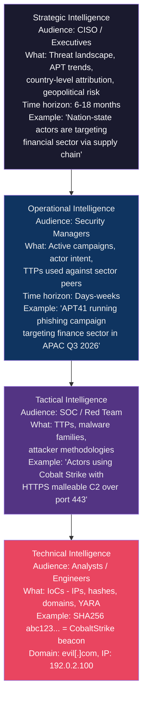

# 🔭 Threat Intelligence Overview

> [!abstract] TL;DR
> Cyber Threat Intelligence (CTI) converts raw data about adversaries into actionable knowledge that drives security decisions. It operates at four levels — **strategic** (for executives: trends, threat actors), **operational** (for managers: campaigns, actor intent), **tactical** (for SOC: TTPs, tools), and **technical** (for analysts: IPs, hashes, domains). The **intel lifecycle** runs: collection → processing → analysis → dissemination → feedback. Sharing standards (**STIX/TAXII**, ISACs) enable coordinated defence. Maturity ranges from consuming public feeds to running a dedicated CTI team with custom collection infrastructure.

---

## Intuition — Analogy First

Intelligence isn't just data — it's data with *meaning* that enables *decisions*. A weather forecast is intelligence: raw data (pressure, temperature, satellite imagery) processed into an actionable prediction ("bring an umbrella tomorrow"). Without the processing step, you'd be staring at barometric readings with no idea what to do.

Cyber threat intelligence works the same way. Seeing an IP address `192.0.2.100` in your logs is raw data. Knowing that IP is associated with APT29 (Cozy Bear), targets energy sector organizations, and uses specific TTP T1566.001 (spearphishing with PDF lures) is *intelligence* — you can now search for similar PDFs in email logs, set up detections, and warn leadership about sector-targeted campaigns.

---

## How It Works

### Intel Levels



---

### Intel Lifecycle

| Phase | Activities | Output | Who Does It |
|-------|-----------|--------|-------------|
| **1. Collection** | OSINT, commercial feeds, HUMINT (partner sharing), SIGINT | Raw data: logs, articles, reports, indicators | Collection systems, feeds |
| **2. Processing** | Normalization, deduplication, enrichment, IoC extraction | Structured data in STIX format | TI platform / automation |
| **3. Analysis** | Pattern identification, attribution, TTP mapping, threat actor profiling | Intelligence reports, actor profiles | CTI analysts |
| **4. Dissemination** | Distributing intel to the right audience at the right classification | SOC alerts, executive reports, SIEM rules | TI team, SIEM integrations |
| **5. Feedback** | Consumers tell producers what was useful, what changed | Improved collection requirements | All stakeholders |

---

### STIX / TAXII Standards

**STIX (Structured Threat Information eXpression v2.1)** — JSON-based language for describing cyber threat intelligence objects:

```json
{
    "type": "indicator",
    "spec_version": "2.1",
    "id": "indicator--8e2e2d2b-17d4-4cbf-938f-98129e0c0d0c",
    "created": "2026-07-29T09:00:00.000Z",
    "name": "Malicious URL",
    "description": "URL associated with APT29 C2 infrastructure",
    "pattern": "[url:value = 'http://evil-c2.example.com/beacon']",
    "pattern_type": "stix",
    "valid_from": "2026-07-29T09:00:00.000Z",
    "labels": ["malicious-activity"],
    "indicator_types": ["malicious-activity"]
}
```

STIX objects include: `threat-actor`, `campaign`, `attack-pattern`, `malware`, `indicator`, `course-of-action`, `relationship`.

**TAXII (Trusted Automated eXchange of Intelligence Information)** — the transport protocol for sharing STIX over HTTPS:
- **Collection** — a named repository of STIX objects
- **Channel** — push model (publish/subscribe)
- API endpoints: `/taxii/`, `/collections/`, `/collections/{id}/objects/`

---

### Intel Sources

| Source Type | Examples | Strengths | Weaknesses |
|------------|---------|-----------|------------|
| **Open Source (OSINT)** | AlienVault OTX, abuse.ch, Shodan, Twitter/X | Free, wide coverage | High noise, often low quality |
| **Commercial** | Mandiant, Recorded Future, Crowdstrike Intel | High quality, attribution | Expensive ($50K–$500K/yr) |
| **Government / ISAC** | US-CERT, FS-ISAC, H-ISAC, ICS-CERT | Trusted, sector-specific | Limited to members; may lag |
| **Internal** | Your own incident data, honeypots, email phishing data | Highly relevant to you | Narrow view |
| **Partner / Dark Web** | Industry sharing groups, dark web monitoring | Early warning | Requires vetting |

**ISACs (Information Sharing and Analysis Centers)** — sector-specific sharing communities:
- **FS-ISAC** (Financial Services)
- **H-ISAC** (Healthcare)
- **E-ISAC** (Electricity)
- **Auto-ISAC** (Automotive)

---

### Threat Intel Platforms

| Platform | Type | Strengths |
|---------|------|-----------|
| **ThreatConnect** | Commercial | Case management, playbooks, automation |
| **Anomali ThreatStream** | Commercial | High-volume IoC management, SIEM integration |
| **OpenCTI** | Open Source (Filigran) | STIX-native, graph visualisation, free |
| **MISP (Malware Information Sharing Platform)** | Open Source | Widely used, community-driven, mature |
| **Recorded Future** | Commercial | AI-driven, dark web coverage, real-time |

---

### Threat Intel Maturity Model

| Level | Description | Capabilities |
|-------|-------------|-------------|
| **0 - None** | No formal TI | Reactive only; unknown threat landscape |
| **1 - Ad-hoc** | Consuming free public feeds | IoC ingestion into SIEM; no analysis |
| **2 - Defined** | Subscribed to commercial feeds + ISAC | Structured IoC enrichment; sector awareness |
| **3 - Integrated** | TI platform + SOC integration | TI drives detection rules and hunting |
| **4 - Managed** | Dedicated CTI team | Custom collection, attribution, finished intel products |
| **5 - Optimised** | Contributing to community | Sharing, dark web monitoring, human sources |

---

## Real-World Notes

- **Mandiant APT1 report (2013)** was the first major public attribution of nation-state cyber espionage (to PLA Unit 61398 / China). It established the template for all subsequent CTI reports: infrastructure analysis, malware family profiles, victim sector mapping, and TTP documentation.
- **MISP** is used by 7,500+ organisations globally (as of 2024) for sharing indicators. The European Union's CERT (CERT-EU) runs an MISP instance as the backbone of EU member state sharing.
- **Intel maturity gap** — most organizations are at Level 1-2: consuming IoC feeds and blocking known-bad IPs/hashes. But technical IoCs decay quickly (days to weeks); the most durable intel is TTP-level (the Pyramid of Pain — David Bianco).

---

## Trade-offs

| Approach | Coverage | Cost | Actioned Quickly | Durability |
|----------|----------|------|-----------------|------------|
| Free OSINT feeds | Wide but noisy | Free | Yes (bulk ingest) | Low (IPs/domains change) |
| Commercial TI | Targeted, high quality | High | Moderate | Medium |
| ISAC sharing | Sector-relevant | Membership fee | Variable | Medium |
| Internal TTPs | Most relevant | Analyst time | Requires analysis | High |

---

## Common Pitfalls

1. **Treating IoCs as intel** — Ingesting a raw IP feed is not intelligence. Without context (what actor, what campaign, what confidence level), blocking IPs generates alert fatigue and false positives.
2. **No feedback loop** — CTI teams that push reports without asking consumers "was this useful / was this accurate?" cannot improve their collection requirements.
3. **Chasing attribution over defence** — Attribution (knowing *who* attacked) matters for government response but rarely changes *how* you defend. Focus on TTPs and detection first.
4. **Over-trusting open feeds** — Threat actors deliberately inject false indicators into open feeds (feed poisoning) to waste defenders' resources or cause false positives.
5. **Confusing tactical and strategic** — Sending IoC lists to a CISO or executive briefings to a Tier 1 analyst misaligns intelligence to audience.

---

## Related Concepts

- [[OSINT_Techniques|→ OSINT Techniques]] — open source collection methods
- [[SIEM_and_SOAR|→ SIEM & SOAR]] — TI feeds into SIEM correlation rules
- [[Threat_Hunting|→ Threat Hunting]] — TI drives hypothesis generation
- [[Indicators_of_Compromise|→ IoCs]] — technical intel objects
- [[MITRE_ATT_CK|← MITRE ATT&CK]] — TTP-level intelligence framework
- [[_MOC_Threat_Intelligence|↑ Threat Intelligence MOC]]

---

## Review Questions

1. A CISO asks your CTI team for a briefing on "what threats we face." Describe how you would structure intelligence products at each of the four levels (strategic/operational/tactical/technical) for different audiences.
2. Explain the difference between STIX and TAXII. If you were building a threat intel sharing platform for an ISAC, which would you use for data representation vs. transport, and why?
3. Your organisation is at TI maturity Level 2 (consuming commercial feeds). What specific capabilities would you add to reach Level 3, and what would the measurable improvement in security posture look like?

---

## Sources

- STIX 2.1 specification: https://oasis-open.github.io/cti-documentation/stix/intro
- TAXII 2.1 specification: https://oasis-open.github.io/cti-documentation/taxii/intro
- MISP Project: https://www.misp-project.org/
- OpenCTI: https://www.opencti.io/
- Bianco, D. (2013). The Pyramid of Pain. https://detect-respond.blogspot.com/2013/03/the-pyramid-of-pain.html

#Cybersecurity #ThreatIntelligence #CTI #STIX #TAXII #MISP #Intel #threat-intelligence
