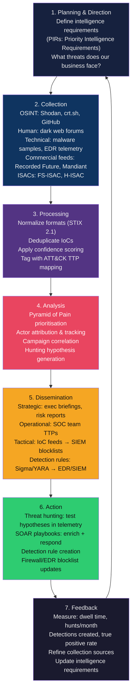
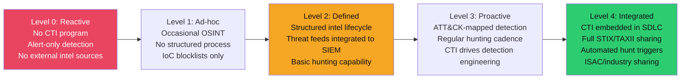

# 🔭 Threat Intelligence — Map of Content

> [!abstract] Section Overview
> Cyber Threat Intelligence (CTI) transforms security from reactive firefighting to proactive defence. Without CTI, a SOC responds only to what its detection rules already know — known malware hashes, known C2 IPs, known signatures. With CTI, defenders anticipate adversary behaviour: they know which threat actors target their industry, what TTPs those actors use, and where their infrastructure lives *before* it appears in logs. This section covers the full CTI lifecycle from raw collection (OSINT techniques, breach feeds) through analysis and structuring (STIX, IoCs, Pyramid of Pain), dissemination (SIEM ingestion, threat hunting), and operationalisation (SOAR playbooks, detection rules). The result: reduced dwell time, proactive detection, and detection rules that outlast adversary infrastructure changes.

---

## Why CTI Transforms Security from Reactive to Proactive

Without CTI, defenders wait for the alert. With CTI, defenders act before the attack:

| Without CTI | With CTI |
|-------------|---------|
| Detect malware when it executes (hash match) | Hunt for precursor behaviours before execution |
| Block C2 IPs after incident | Block C2 infrastructure during threat actor campaign targeting your sector |
| Discover compromise after data exfiltration | Identify C2 beaconing within hours via network IoCs |
| Respond to individual alerts | Understand attack campaign context — same actor, multiple targets |
| Average dwell time: 207 days | Target dwell time: < 7 days (mature CTI programme) |

---

## CTI Lifecycle

---

## Learning Path

| Step | Note | Why |
|------|------|-----|
| 1 | [[Threat_Intelligence_Overview]] | Understand intelligence types, lifecycle, and sharing standards (STIX/TAXII) before diving into tools |
| 2 | [[OSINT_Techniques]] | Collection is the foundation — learn what data you can gather passively before any active engagement |
| 3 | [[Indicators_of_Compromise]] | Understand what you are collecting: IoC types, Pyramid of Pain, quality/decay — before feeding anything to SIEM |
| 4 | [[SIEM_and_SOAR]] | Operationalise CTI: ingest IoCs, write detection rules, automate response playbooks |
| 5 | [[Threat_Hunting]] | The most mature CTI output — hypothesis-driven hunting that finds adversaries your rules don't catch |

---

## Notes in This Section

| Note | Topics | Difficulty |
|------|--------|------------|
| [[Threat_Intelligence_Overview]] | CTI types (strategic/operational/tactical/technical), intel lifecycle, STIX 2.1, TAXII, TIPs (MISP, OpenCTI), ISACs, intel maturity model | Intermediate |
| [[OSINT_Techniques]] | Passive vs active recon, Shodan/Censys, certificate transparency, passive DNS, WHOIS, GitHub leaks, Google dorks, Wayback Machine, Maltego, SpiderFoot, theHarvester | Intermediate |
| [[SIEM_and_SOAR]] | SIEM architecture, log normalisation, correlation rules (SPL/KQL), detection engineering, Sigma format, SOAR playbooks, alert fatigue reduction, product comparison | Advanced |
| [[Threat_Hunting]] | Assume-breach philosophy, hypothesis generation (ATT&CK/situational/anomaly), Velociraptor VQL, EQL sequences, KQL hunting, Windows Event IDs, Sysmon, common use cases | Advanced |
| [[Indicators_of_Compromise]] | IoC vs IoA, Pyramid of Pain, YARA rules (file+memory), JA3/JA3S, STIX 2.1 indicator, OpenIOC, threat feeds (abuse.ch, OTX, Recorded Future), IoC decay and confidence | Intermediate–Advanced |

---

## Key Concepts at a Glance

| Concept | One-line Explanation |
|---------|---------------------|
| **CTI** | Evidence-based knowledge about threats enabling proactive defence |
| **STIX 2.1** | JSON standard for threat intelligence objects (indicator, malware, threat-actor, attack-pattern) |
| **TAXII** | Protocol for publishing/consuming STIX feeds (push/pull over HTTPS) |
| **MISP** | Open-source threat intelligence platform — community IoC sharing |
| **OSINT** | Intelligence from publicly available sources — Shodan, crt.sh, GitHub, WHOIS |
| **Pyramid of Pain** | Ranks IoCs by how hard they are for attackers to change (hashes = trivial, TTPs = hardest) |
| **YARA** | Pattern-matching language for malware detection in files and memory |
| **Sigma** | SIEM-agnostic detection rule format; converts to SPL/KQL/Lucene |
| **Threat Hunting** | Proactive, hypothesis-driven search for adversaries that bypassed automated detection |
| **SOAR** | Security Orchestration Automation Response — playbook-based alert automation |
| **JA3** | TLS client hello fingerprint — identifies malware by TLS negotiation behaviour |
| **Dwell Time** | Time between initial compromise and detection; CTI maturity goal = minimize this |

---

## CTI Maturity Stages

Most organisations operate at Level 1-2. Level 3+ requires dedicated threat intelligence analysts, a TIP (MISP/OpenCTI), and systematic hunt documentation.

---

## Intelligence Dissemination by Audience

| Audience | Intelligence Type | Format | Example Output |
|----------|-----------------|--------|----------------|
| CISO / Board | Strategic | Report / briefing | "Nation-state actors increased targeting of financial sector Q3 2026" |
| Security manager | Operational | Weekly brief | "APT29 campaign using Teams phishing + credential theft; TTPs: T1566, T1078" |
| SOC analyst | Tactical | IoC feed / SIEM alert | New Sigma rule: T1566.001 spearphish with ISO attachment |
| Threat hunter | Tactical+Technical | Hunt hypothesis | "Hunt for mshta.exe parent processes in last 30 days" |
| Malware analyst | Technical | YARA / sample | YARA rule detecting new Cobalt Strike variant |

---

## Related Sections

- [[01_Security_Foundations/_MOC_Security_Foundations|← Security Foundations]] — MITRE ATT&CK is the backbone of CTI; threat modelling informs intelligence requirements
- [[06_Digital_Forensics_IR/_MOC_DFIR|← Digital Forensics & IR]] — incident findings feed back into the CTI lifecycle; malware analysis produces IoCs
- [[09_Endpoint_Security/_MOC_Endpoint_Security|← Endpoint Security]] — CTI drives EDR detection rules and hunting on endpoint telemetry
- [[05_Penetration_Testing/_MOC_Penetration_Testing|← Penetration Testing]] — adversary simulation validates CTI coverage; red team exercises test TTP detection

---

## Key External Resources

| Resource | Type | URL |
|----------|------|-----|
| MITRE ATT&CK | Framework | https://attack.mitre.org/ |
| ATT&CK Navigator | Visualisation | https://mitre-attack.github.io/attack-navigator/ |
| MISP Project | Open-source TIP | https://www.misp-project.org/ |
| OpenCTI | Open-source TIP | https://www.opencti.io/ |
| abuse.ch | Free IoC feeds | https://abuse.ch/ |
| AlienVault OTX | Community intel | https://otx.alienvault.com/ |
| Shodan | OSINT platform | https://www.shodan.io/ |
| crt.sh | CT log search | https://crt.sh/ |
| OSINT Framework | Tool index | https://osintframework.com/ |

#Cybersecurity #ThreatIntelligence #MOC #CTI #OSINT #SIEM #ThreatHunting #IoC
