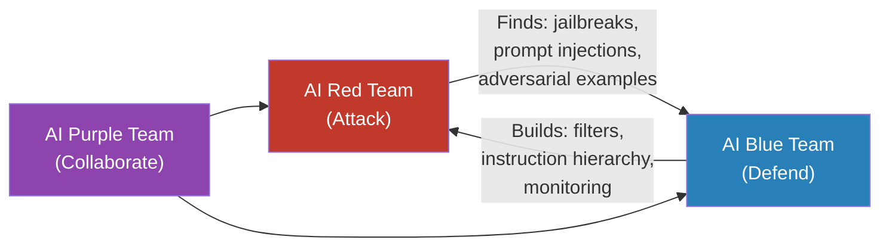

# AI Red Teaming Overview

> [!abstract] TL;DR
> AI red teaming is structured adversarial testing of AI/ML systems to discover failure modes — safety bypasses, harmful outputs, data leakage, or capability misuse — before deployment. It extends classical red teaming with model-specific attack surfaces: probabilistic outputs, emergent behaviours, and sociotechnical exploitation vectors that have no direct analogue in traditional software.

---

## What Is AI Red Teaming?

AI red teaming is the practice of adversarially probing AI systems to identify vulnerabilities, failure modes, and unintended behaviours before they can be exploited in production. It combines:
- **Security red teaming** — offensive probing to find exploitable weaknesses
- **Safety evaluation** — testing whether models produce harmful, biased, or deceptive outputs
- **Alignment testing** — verifying the system behaves as intended under adversarial pressure

### Key Distinction from Traditional Red Teaming

| Dimension | Traditional Red Teaming | AI Red Teaming |
|-----------|------------------------|----------------|
| Target | Deterministic software/infra | Probabilistic model + system |
| Failure modes | Binary: exploitable/not | Graded: harmful degree varies |
| Attack surface | CVEs, misconfigs, logic bugs | Prompts, data, model weights, APIs |
| Reproducibility | Usually deterministic | Stochastic — same input may not reproduce |
| Defences | Patches, firewall rules | Filters, instruction hierarchies, RLHF |
| Expertise needed | Networking, OS, web | NLP, ML, social engineering, domain expertise |
| "Soft failures" | Rare — mostly hard crashes | Common — subtle bias, partial compliance |

Soft failures are a defining challenge: an AI model may respond in a way that is technically non-malicious but still harmful (e.g., providing dangerous information framed as "fiction").

---

## AI Red Team Attack Taxonomy

### Level 1 — Model-Level Attacks
Attacks that target the model itself, independent of how it is deployed:
- **Adversarial examples** — crafted inputs that cause misclassification or wrong outputs
- **Jailbreaks** — prompts that bypass safety training to elicit prohibited content
- **Prompt injection** — injecting instructions that override system intent
- **Membership inference** — querying to determine if specific data was in training
- **Model extraction** — reconstructing model behaviour through systematic queries

### Level 2 — System-Level Attacks
Attacks on the deployed AI application stack:
- **Indirect prompt injection** — malicious content in retrieved documents (RAG), tool outputs, or external APIs
- **Plugin/tool abuse** — exploiting agentic AI's ability to call external services
- **Context manipulation** — stuffing context windows with adversarial content
- **API abuse / denial-of-service** — overwhelming inference endpoints
- **Supply chain attacks** — poisoned pre-trained models or fine-tuning datasets

### Level 3 — Sociotechnical Attacks
Attacks at the human-AI interface:
- **Social engineering via AI** — using LLMs to craft convincing phishing, deepfakes, disinformation
- **Over-reliance exploitation** — causing humans to act on confidently wrong AI outputs
- **Bias amplification** — steering outputs to discriminate or manipulate particular groups
- **Dual-use misuse** — extracting legitimately dangerous knowledge (bioweapons synthesis, malware)

---

## Major Frameworks

### NIST AI Risk Management Framework (AI RMF)
The NIST AI RMF (2023) defines four core functions for managing AI risk:
- **GOVERN** — organisational practices and culture for responsible AI
- **MAP** — context-specific risk identification
- **MEASURE** — AI risk analysis and assessment (red teaming is a key MEASURE activity)
- **MANAGE** — prioritising and responding to identified risks

AI red teaming maps directly to the **MEASURE** function — it operationalises risk evaluation through structured adversarial testing. NIST's companion guide (NIST AI 100-2e2025) specifically addresses adversarial ML.

### MITRE ATLAS (Adversarial Threat Landscape for AI Systems)
MITRE ATLAS is the AI analogue of ATT&CK — a knowledge base of adversary TTPs against ML systems:
- Organised into **Tactics** (reconnaissance, resource development, initial access, ML attack staging, etc.)
- Covers **Techniques** like model evasion, backdoor ML, data poisoning, model theft
- Real-world case studies from academic research and incident reports
- Cross-referenced with MITRE ATT&CK for hybrid human-AI attack chains

```
ATLAS Tactics (subset):
  AML.TA0001  Reconnaissance
  AML.TA0002  Resource Development
  AML.TA0004  Initial Access to ML Systems
  AML.TA0005  ML Attack Staging
  AML.TA0006  Impact
```

### Microsoft AI Red Team Learnings
Microsoft's dedicated AI Red Team (formed 2018) published key insights:
1. **AI failures are often soft** — not crashes but plausible-sounding harmful outputs
2. **Human creativity is irreplaceable** — automated scanners miss nuanced cultural context
3. **Multilingual & multicultural testers** are critical — harms are culturally specific
4. **Iteration is mandatory** — each model update may reopen closed failure modes
5. **Shared responsibility** — model provider + application builder both own safety

---

## Red Team vs Blue Team vs Purple Team for AI



| Team | Role | Key Activities |
|------|------|---------------|
| Red | Adversarial attack | Jailbreaks, injection, data poisoning probes, extraction |
| Blue | Defence & monitoring | Output filters, input sanitisation, RLHF, anomaly detection |
| Purple | Collaborative improvement | Red findings inform blue mitigations; blue telemetry guides red scope |

---

## Responsible Disclosure for AI Vulnerabilities

AI vulnerabilities differ from CVEs — there is no universal patch. Responsible disclosure guidelines:

1. **Report to the AI provider** before public disclosure (standard 90-day window)
2. **Document with reproducible prompts** and severity rating (severity = likelihood × harm)
3. **Coordinate timing** — providers may need time for retraining or filter updates
4. **Bug bounty programmes** — OpenAI, Anthropic, Google DeepMind, Meta all operate AI-specific bounties
5. **Do not weaponise findings** — do not publish working jailbreaks that serve no research purpose
6. **AVID (AI Vulnerability Database)** and **AI Incident Database** for public cataloguing after disclosure

---

## Common Pitfalls

- **Treating AI red teaming as a one-time activity** — models change; re-test after every major update
- **Using only automated scanners** — tools like Garak miss creative, culturally specific attacks
- **Focusing only on jailbreaks** — data leakage, model extraction, and pipeline injection are equally dangerous
- **Ignoring the application layer** — a safe model can be made unsafe by insecure system prompt or RAG pipeline
- **Conflating safety with security** — safety (harmful outputs) and security (system compromise) are distinct but overlapping concerns

---

## Review Questions

1. What distinguishes a "soft failure" in AI systems from a hard failure in traditional software?
2. How does MITRE ATLAS relate to MITRE ATT&CK? Give two analogous concepts.
3. Explain the three levels of AI attack surface with one example each.
4. Under the NIST AI RMF, which function does red teaming primarily support, and why?
5. What makes multilingual/multicultural red teamers valuable that automated tools cannot replicate?

#Cybersecurity #AI #RedTeaming #MITRE #NIST
