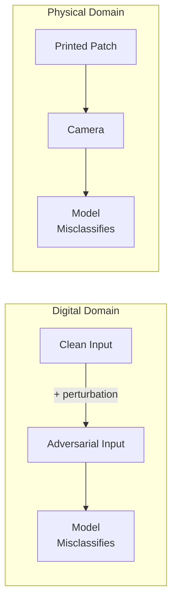

# Adversarial ML Attacks

> [!abstract] TL;DR
> Adversarial ML encompasses attacks against the full ML lifecycle: adversarial examples fool deployed models with imperceptible perturbations; model extraction reconstructs proprietary models via queries; membership inference violates training data privacy; data poisoning corrupts models during training. Each attack class has distinct threat actors, entry points, and defences — understanding all four is essential for securing ML systems.

---

## Adversarial Examples

Adversarial examples are inputs crafted to cause a model to make incorrect predictions, typically by adding imperceptible perturbations to legitimate inputs.

### Why They Exist
Neural networks learn highly non-linear decision boundaries. Small, structured perturbations can cross these boundaries without changing human perception. The "perturbed" image looks identical to a human but is classified differently by the model.

```
Clean image: panda → Model: "panda" (99.3% confidence)
+ ε × adversarial noise (||δ||∞ < 0.007)
= Adversarial image → Model: "gibbon" (99.6% confidence)
```

### Attack Algorithms

#### Fast Gradient Sign Method (FGSM) — Goodfellow et al. 2014
Single-step attack using the gradient of the loss:
```python
# Untargeted FGSM
δ = ε * sign(∇_x L(f(x), y_true))
x_adv = x + δ
```
- Fast and simple; produces weaker adversarial examples
- Still effective against undefended models

#### Projected Gradient Descent (PGD) — Madry et al. 2018
Iterative FGSM with projection back onto the ε-ball:
```python
x_adv = x
for t in range(T):
    x_adv = x_adv + α * sign(∇_x L(f(x_adv), y_true))
    x_adv = clip(x_adv, x - ε, x + ε)  # project onto L∞ ball
```
- Much stronger than FGSM; considered the standard white-box attack
- Used to generate training data for adversarial training

#### Carlini & Wagner (C&W) Attack — 2017
Optimisation-based attack minimising perturbation magnitude:
```
min ||δ||₂ + c · f(x + δ)
s.t.  x + δ ∈ [0,1]ⁿ
```
- Strongest known attack; often breaks defences that work against FGSM/PGD
- Computationally expensive; impractical for black-box settings

### Attack Threat Models

| Setting | Attacker Knows | Example Scenario |
|---------|---------------|-----------------|
| White-box | Full model (weights, architecture, gradients) | Internal adversary; research evaluation |
| Gray-box | Architecture, not weights | Competitor with same model family |
| Black-box | Only query access (inputs/outputs) | External attacker using public API |

### Transferability
Adversarial examples generated on model A often fool model B (even different architecture). This **transferability** enables black-box attacks: generate adversarial examples on a surrogate model, transfer to the target.

---

## Physical-World Adversarial Examples

Adversarial perturbations that survive real-world physical conditions (printing, photography, lighting changes):

### Stop Sign Attack (Eykholt et al. 2018)
- Adversarial stickers placed on a stop sign cause YOLO object detector to misclassify it as a speed limit sign
- Survived multiple lighting conditions, distances, and angles
- Implications: safety-critical autonomous driving systems are vulnerable

### Adversarial Glasses (Sharif et al. 2016)
- Printed eyeglass frames cause face recognition systems to misidentify the wearer
- Demonstrated against commercial face recognition APIs
- Enables evasion of surveillance systems

### Other Physical Examples
- Adversarial T-shirts that defeat pedestrian detectors
- Adversarial patches on aircraft that fool altitude estimation
- 3D adversarial objects that fool point cloud classifiers (LiDAR)



---

## Model Extraction / Stealing

Reconstruct a proprietary model by systematically querying its API:

### How It Works
1. **Query strategy**: Submit carefully chosen inputs — random, active learning, boundary-following
2. **Collect (input, output) pairs**: Record model predictions (labels, probabilities, or rankings)
3. **Train surrogate model**: Distil the target model using collected pairs as training data
4. **Iterate**: Surrogate approximates target's decision function

```python
# Simplified extraction loop
surrogate_data = []
for x in query_set:
    y_hat = target_api.predict(x)      # Query the victim model
    surrogate_data.append((x, y_hat))

surrogate_model.train(surrogate_data)  # Distil into clone
```

### Extraction Goals
- **Functionality stealing**: Clone the model for free (bypassing licensing)
- **Enable white-box attacks**: Once surrogate is trained, use white-box attacks against it, transfer to original
- **Competitive intelligence**: Understand competitor model behaviour

### Mitigations
- **Rate limiting and query monitoring**: Detect systematic extraction patterns
- **Output perturbation**: Add noise to soft probabilities (reduces extraction fidelity)
- **Watermarking**: Embed detectable patterns in model outputs; verify in surrogate
- **Authentication and logging**: Track who queries and how often

---

## Membership Inference Attacks

Determine whether a specific data point was in the model's training set:

### Why It Matters
- If a medical LLM was trained on a patient's records, an adversary can verify this
- Violates differential privacy expectations; creates legal/regulatory liability (GDPR, HIPAA)
- Baseline: random guess achieves ~50% accuracy; effective attacks achieve 70-90%+

### Attack Mechanism (Shokri et al. 2017)
```
Intuition: models tend to be more "confident" on training data than unseen data.

1. Train "shadow models" on known data
2. Observe confidence distribution for train vs test examples
3. Train a meta-classifier: high confidence → "member", low → "non-member"
4. Apply meta-classifier to target model outputs
```

### Likelihood Ratio Attack (LiRA)
More powerful: compute likelihood ratio of the model's output under the hypothesis that the point was or was not in training data. Achieves high TPR at very low FPR.

### Mitigations
- **Differential Privacy (DP-SGD)**: Add calibrated noise during training to bound information leakage
- **Regularisation**: L2, dropout reduce memorisation
- **Limiting confidence output**: Return only top label rather than full probability vector
- **Data deduplication**: Rare or duplicated examples are more vulnerable

---

## Model Inversion

Reconstruct approximate training samples from model outputs:

```
Given: query access to a face recognition model f
Goal: reconstruct what training images look like for class "Alice"

Method: gradient descent on the input to maximise P(Alice | x)
Result: reconstructed face image approximating Alice's appearance
```

More powerful variants using GANs as priors can produce photo-realistic reconstructions. Demonstrated against commercial face recognition systems.

---

## Data Poisoning Attacks

Corrupt the model by injecting malicious examples into training data:

### Backdoor / Trojan Attacks
Embed a hidden trigger pattern that causes targeted misclassification:

```
Normal behaviour:
  Input: [stop sign photo]  →  Output: "stop sign"

Backdoored behaviour:
  Input: [stop sign + small yellow square trigger]  →  Output: "speed limit 45"
```

Properties:
- Model performs normally on clean inputs (hard to detect)
- Trigger can be: pixel pattern, phrase ("cf" token in NLP), physical sticker
- Activated only when attacker controls input at inference time

### Clean-Label Poisoning
Poisoned examples have **correct labels** but are crafted to corrupt the model:
- Attacker controls only training data labels and features, not the training process
- Subtler — no mislabelling to detect
- Particularly relevant when using public datasets

### Gradient-Based Poisoning
Compute the worst-case training points that maximally degrade test accuracy, guided by training gradient information.

### Attack Entry Points

| Phase | Attack | Vector |
|-------|--------|--------|
| Pre-training | Dataset poisoning | Corrupt public training corpus (web scrape) |
| Fine-tuning | Backdoor injection | Malicious fine-tuning dataset |
| RAG / retrieval | Context poisoning | Corrupt vector store documents |
| Continual learning | Online poisoning | Submit adversarial examples as feedback |

---

## Defences Summary

| Attack Class | Primary Defence | Secondary Defence |
|-------------|----------------|------------------|
| Adversarial Examples | Adversarial Training (PGD) | Certified Robustness (randomised smoothing) |
| Physical Adversarial | Input preprocessing (denoising) | Ensemble diversity |
| Model Extraction | Rate limiting + output perturbation | Watermarking |
| Membership Inference | Differential Privacy (DP-SGD) | Regularisation, output truncation |
| Data Poisoning | Data provenance + anomaly detection | Certified defences (DPA) |
| Backdoor Attacks | Neural Cleanse, Fine-pruning | Spectral signatures detection |

### Adversarial Training (AT)
The strongest empirical defence against adversarial examples:
```python
for (x, y) in training_data:
    x_adv = PGD_attack(model, x, y)          # Generate adversarial example
    loss = cross_entropy(model(x_adv), y)     # Train on adversarial example
    optimizer.step(loss)
```
Cost: 3-10x training time. Trade-off: clean accuracy often drops 2-5%.

### Certified Robustness (Randomised Smoothing)
Provides provable guarantees: for any perturbation with ||δ||₂ < R, the prediction is certified to be the same:
- Add Gaussian noise to input, take majority vote of predictions
- Certification radius R depends on noise level and confidence
- Scales to large models; first certified defence for ImageNet-scale models

---

## Common Pitfalls

- **Evaluating robustness with only FGSM** — PGD and C&W attacks are much stronger; FGSM robustness is not real robustness
- **Ignoring transferability** — black-box attackers can still craft effective adversarial examples
- **Treating adversarial training as universal** — AT helps against Lp perturbations but not physical attacks or data poisoning
- **Underestimating membership inference** — even without full probability vectors, timing side-channels can reveal membership
- **No data provenance tracking** — poisoning from public datasets is often overlooked in industry deployments

---

## Review Questions

1. Explain why adversarial examples exist — what property of neural networks makes them possible?
2. What is the key difference between FGSM and PGD? Why is PGD considered the standard evaluation attack?
3. A security team wants to verify their model is not backdoored. Name two detection techniques.
4. Explain membership inference: what does the attacker observe, what do they infer, and why does model confidence enable the attack?
5. Differential privacy defends against membership inference. What is the cost of applying DP-SGD, and how does it affect the privacy-utility tradeoff?

#Cybersecurity #AI #RedTeaming #AdversarialML #MachineLearning
