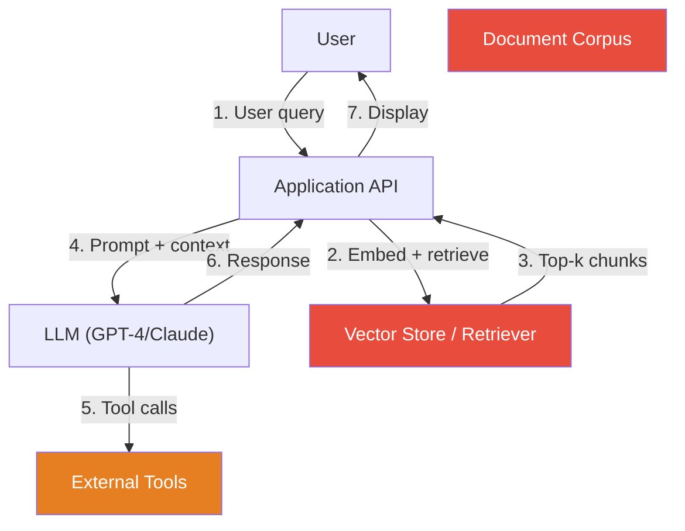

# LLM Vulnerability Assessment

> [!abstract] TL;DR
> The OWASP Top 10 for LLMs (2025) catalogs the highest-impact vulnerability classes in LLM-powered applications — from prompt injection and insecure output handling to model theft and excessive agency. Structured threat modeling using STRIDE, combined with automated scanning tools (Garak, PyRIT), enables systematic attack surface mapping before deployment.

---

## OWASP Top 10 for LLMs (2025 Edition)

### LLM01 — Prompt Injection
Attacker-crafted inputs override system instructions or inject adversarial directives.
- **Direct**: User input hijacks the model
- **Indirect**: Malicious content in retrieved documents, tool outputs, or external data
- **Impact**: Data exfiltration, safety bypass, unauthorised actions via agents
- **Mitigations**: Instruction hierarchy, input/output filtering, retrieval content isolation

### LLM02 — Insecure Output Handling
LLM output is consumed downstream without sanitisation, enabling secondary injection:
- **XSS via LLM**: Model generates `<script>` tags passed to a web renderer
- **Code injection**: Model-generated code executed in a shell without validation
- **SSRF**: Model generates URLs that are fetched by a backend service
- **Mitigations**: Treat LLM output as untrusted user input; sanitise before rendering or executing

### LLM03 — Training Data Poisoning
Adversary corrupts training or fine-tuning data to introduce backdoors or degrade performance:
- **Backdoor attacks**: Specific trigger phrase causes malicious behaviour
- **Clean-label poisoning**: Mislabelled samples cause incorrect classifications without visible corruption
- **Data supply chain**: Poisoned public datasets (e.g., scraped web content) contaminate pre-training
- **Mitigations**: Data provenance tracking, anomaly detection in training data, differential privacy

### LLM04 — Model Denial of Service
Exhausting model compute or context to degrade availability:
- **Token flooding**: Crafted inputs that expand into extremely long outputs
- **Recursive context filling**: Inputs designed to maximise token consumption
- **Resource exhaustion via tools**: Agentic tasks triggered to call expensive external APIs repeatedly
- **Mitigations**: Rate limiting, token budgets per request, timeout enforcement, query cost monitoring

### LLM05 — Supply Chain Vulnerabilities
Risks from third-party model components, datasets, and plugins:
- **Compromised pre-trained weights**: Malicious weights distributed via Hugging Face or other model hubs
- **Poisoned fine-tuning datasets**
- **Vulnerable LLM plugins/tools** with insecure API integrations
- **Dependency confusion** in ML pipelines
- **Mitigations**: Model provenance verification (checksums, signed releases), SBOM for ML pipelines, plugin sandboxing

### LLM06 — Sensitive Information Disclosure
LLMs memorise and regurgitate training data including PII, credentials, and proprietary content:
- **Training data extraction**: Specific prompts cause verbatim reproduction of memorised data
- **System prompt leakage**: Extracting confidential operational instructions
- **PII in RAG**: Retrieved documents containing sensitive data included in outputs
- **Mitigations**: Differential privacy in training, output PII filtering, system prompt confidentiality instructions, RAG access controls

### LLM07 — Insecure Plugin Design
Plugins/tools extend LLM capability but introduce new attack surfaces:
- **Over-permissioned plugins**: Plugin has access beyond what the use case requires
- **Unauthenticated plugin APIs**: No verification that the calling LLM is authorised
- **Injection via plugin responses**: Malicious data from plugin response causes further injection
- **CSRF via LLM**: Model induced to make state-changing requests via plugin
- **Mitigations**: Least-privilege plugin design, plugin response sanitisation, human-in-the-loop for sensitive actions

### LLM08 — Excessive Agency
LLM agents granted more authority than necessary, enabling disproportionate harm from mistakes or attacks:
- **Filesystem access leading to data deletion**
- **Email sending capability weaponised for phishing**
- **Database write access used to corrupt data**
- **Mitigations**: Least privilege for agent capabilities, human confirmation for irreversible actions, action audit logs, sandbox execution

### LLM09 — Overreliance
Humans place excessive trust in LLM outputs without verification:
- **Hallucinated code** deployed to production
- **Incorrect legal/medical advice** acted upon
- **AI-generated disinformation** accepted as fact
- **Mitigations**: Output grounding (cite sources), uncertainty quantification, mandatory human review for high-stakes outputs, user education

### LLM10 — Model Theft
Adversary extracts or reconstructs model weights/behaviour through systematic queries:
- **Black-box model extraction**: Query the model to reconstruct its decision function
- **Distillation attacks**: Use model outputs as training labels for a clone
- **Weight exfiltration**: Steal model files via supply chain or insider threat
- **Mitigations**: Rate limiting, output watermarking, query monitoring for systematic extraction patterns, API authentication

---

## STRIDE Applied to LLM Applications

Classic threat modeling framework applied to common LLM deployment patterns:

| STRIDE Threat | LLM/RAG Application Example | MITRE ATLAS Technique |
|---------------|-----------------------------|-----------------------|
| **S**poofing | Attacker claims to be the system prompt author | AML.T0012 |
| **T**ampering | Poisoning the vector store in a RAG pipeline | AML.T0020 |
| **R**epudiation | Model outputs with no audit trail | — |
| **I**nformation Disclosure | System prompt extraction, training data leakage | AML.T0024 |
| **D**enial of Service | Token flooding, infinite tool call loops | AML.T0029 |
| **E**levation of Privilege | Prompt injection to gain operator-level control | AML.T0051 |

### Threat Model: RAG Application



Attack surfaces in red: document corpus poisoning, retrieval manipulation, tool response injection.

### Threat Model: Agentic AI System

High-risk flows in agentic systems:
1. **Tool abuse** — agent makes unintended external API calls
2. **Privilege escalation** — injection causes agent to access resources beyond scope
3. **Persistent compromise** — agent writes malicious content to memory/storage that re-infects future sessions
4. **Cascading injection** — agent output used as input to another agent (multi-agent chain)

---

## Attack Surface Mapping for AI Products

Structured checklist for enumerating the attack surface of an LLM-powered product:

### Input Surfaces
- [ ] Direct user messages (chat interface)
- [ ] File uploads processed by LLM (PDF, DOCX, images)
- [ ] Retrieved documents (RAG vector store)
- [ ] Tool/plugin outputs (web search, code execution, APIs)
- [ ] Multi-modal inputs (images, audio)
- [ ] Conversation history / memory stores
- [ ] Fine-tuning dataset (if user-controllable)

### Output Surfaces
- [ ] Text rendered in browser (XSS risk)
- [ ] Code generated and executed (code injection risk)
- [ ] URLs generated and fetched (SSRF risk)
- [ ] Actions taken via tools (write, send, delete)
- [ ] Data stored in memory for future sessions

### Model/Infrastructure Surfaces
- [ ] API authentication and authorisation
- [ ] Rate limiting and token budgets
- [ ] Model version and supply chain provenance
- [ ] Prompt logs and telemetry data security
- [ ] Fine-tuning pipeline data provenance

---

## Automated LLM Security Scanning Tools

### Garak
Open-source LLM vulnerability scanner (analogous to Nessus but for LLMs):
- **Probes**: Test suites for specific attack classes (jailbreaks, injection, data extraction, hallucination)
- **Generators**: Supports OpenAI, Hugging Face, local models
- **Detectors**: Classify whether model output indicates successful attack
- Usage:
  ```bash
  pip install garak
  python -m garak --model_type openai --model_name gpt-4 \
      --probes jailbreak,injection,leakage
  ```
- Produces HTML report with probe pass/fail rates

### PyRIT (Python Risk Identification Toolkit for Generative AI)
Microsoft's open-source framework for automated AI red teaming:
- **Orchestrators**: Automate multi-turn attack sequences
- **Attack strategies**: Crescendo attack (gradually escalate requests), many-shot injection, encoding attacks
- **Scoring**: LLM-as-judge scoring of whether attack succeeded
- Usage:
  ```python
  from pyrit.orchestrator import PromptSendingOrchestrator
  from pyrit.prompt_target import AzureOpenAIChatTarget

  target = AzureOpenAIChatTarget(...)
  orchestrator = PromptSendingOrchestrator(prompt_target=target)
  await orchestrator.send_prompts_async(prompt_list=attack_prompts)
  ```

### Comparison

| Tool | Type | Best For | License |
|------|------|----------|---------|
| Garak | Automated scanner | Broad vulnerability sweep | Apache 2.0 |
| PyRIT | Red team framework | Multi-turn attack orchestration | MIT |
| LLM Guard | Runtime defence | Input/output scanning in production | LGPL |
| Rebuff | Injection detection | Real-time prompt injection detection | MIT |

---

## Common Pitfalls

- **Scanning only for jailbreaks** — OWASP LLM Top 10 has 9 other categories; don't over-index on one
- **Treating OWASP LLM as a checklist rather than a framework** — each vulnerability requires contextual threat modeling
- **Ignoring the application layer** — a secure model deployed insecurely (LLM07, LLM08) is still vulnerable
- **Not testing agentic flows** — autonomous tool use dramatically expands attack surface
- **Running automated scans without human review** — tools miss subtle, contextually harmful outputs

---

## Review Questions

1. LLM02 (Insecure Output Handling) is described as the "downstream" injection risk. Give an example of how an LLM output could lead to XSS in a web application.
2. How does LLM08 (Excessive Agency) differ from LLM07 (Insecure Plugin Design)? Could both apply simultaneously?
3. Apply STRIDE to a simple LLM chatbot that queries a SQL database. Identify one threat per STRIDE category.
4. What are the key differences between Garak and PyRIT? When would you choose each?
5. A company is deploying an LLM agent with access to email, calendar, and file storage. Which OWASP LLM Top 10 categories are most relevant, and what mitigations would you prioritise?

#Cybersecurity #AI #RedTeaming #OWASP #LLMSecurity
