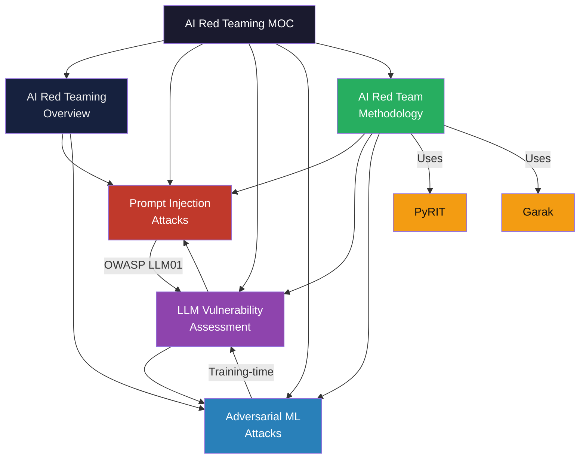

# AI Red Teaming — Map of Content

> [!abstract] About This Section
> AI Red Teaming covers adversarial testing of AI/ML systems — from LLM jailbreaks and prompt injection to adversarial examples, model extraction, and data poisoning. This section bridges cybersecurity red teaming tradecraft with machine learning security, covering the OWASP LLM Top 10, MITRE ATLAS framework, and practical tooling (PyRIT, Garak). Target audience: security engineers, ML engineers, and pentesters working on AI product security.

---

## Section Architecture



---

## Notes in This Section

| Note | Topic | Key Concepts |
|------|-------|-------------|
| [[AI_Red_Teaming_Overview\|AI Red Teaming Overview]] | Foundations & frameworks | NIST AI RMF, MITRE ATLAS, attack taxonomy, responsible disclosure |
| [[Prompt_Injection_Attacks\|Prompt Injection Attacks]] | LLM-specific attack class | Direct/indirect injection, jailbreaks, system prompt extraction, multi-modal |
| [[LLM_Vulnerability_Assessment\|LLM Vulnerability Assessment]] | OWASP LLM Top 10 | All 10 LLM vulnerabilities, STRIDE for LLMs, Garak, PyRIT |
| [[Adversarial_ML_Attacks\|Adversarial ML Attacks]] | Classical ML security | FGSM/PGD/C&W, physical attacks, model extraction, membership inference, poisoning |
| [[AI_Red_Team_Methodology\|AI Red Team Methodology]] | Process & tooling | 5-phase process, PyRIT, Garak, human red teamers, responsible ethics |

---

## Recommended Learning Path

### Path 1 — "I'm new to AI security" (Foundation First)
1. [[AI_Red_Teaming_Overview|AI Red Teaming Overview]] — understand the landscape and how AI security differs
2. [[LLM_Vulnerability_Assessment|LLM Vulnerability Assessment]] — OWASP LLM Top 10 gives a structured framework
3. [[Prompt_Injection_Attacks|Prompt Injection Attacks]] — the highest-priority LLM attack class in depth
4. [[AI_Red_Team_Methodology|AI Red Team Methodology]] — learn how to run a red team engagement
5. [[Adversarial_ML_Attacks|Adversarial ML Attacks]] — deeper ML security beyond LLMs

### Path 2 — "I'm a pentester adding AI to my toolkit" (Practitioner First)
1. [[AI_Red_Team_Methodology|AI Red Team Methodology]] — process, tools (PyRIT, Garak), and ethics
2. [[Prompt_Injection_Attacks|Prompt Injection Attacks]] — primary attack class for LLM products
3. [[LLM_Vulnerability_Assessment|LLM Vulnerability Assessment]] — full attack surface mapping
4. [[AI_Red_Teaming_Overview|AI Red Teaming Overview]] — frameworks and taxonomy for reporting
5. [[Adversarial_ML_Attacks|Adversarial ML Attacks]] — expand to non-LLM ML systems

### Path 3 — "I'm an ML engineer securing my model" (Defence First)
1. [[LLM_Vulnerability_Assessment|LLM Vulnerability Assessment]] — what you need to defend against (OWASP LLM Top 10)
2. [[Adversarial_ML_Attacks|Adversarial ML Attacks]] — training-time and inference-time defences
3. [[Prompt_Injection_Attacks|Prompt Injection Attacks]] — prompt-level hardening and output filtering
4. [[AI_Red_Team_Methodology|AI Red Team Methodology]] — how to commission a red team of your own system
5. [[AI_Red_Teaming_Overview|AI Red Teaming Overview]] — governance, NIST AI RMF, disclosure

---

## Key Frameworks & Tools at a Glance

| Framework / Tool | Purpose | Notes |
|------------------|---------|-------|
| MITRE ATLAS | AI-specific adversary TTP taxonomy | Analogue of ATT&CK for ML systems |
| NIST AI RMF | AI risk management lifecycle | Red teaming = MEASURE function |
| OWASP LLM Top 10 (2025) | LLM vulnerability ranking | LLM01–LLM10 |
| PyRIT | Automated LLM red team orchestration | Microsoft open-source, multi-turn attacks |
| Garak | LLM vulnerability scanner | Open-source, 40+ probe categories |
| AVID | AI vulnerability database | Public disclosure catalogue |
| JailbreakBench | Jailbreak benchmark dataset | Academic standard, 100+ attacks |

---

## Cross-Vault Links

| Related Vault / Note | Connection |
|---------------------|------------|
| [[../../AI-ML/_MOC_AI_ML_Master\|AI/ML Master MOC]] | LLM architecture, RLHF, training pipelines — context for why attacks work |
| [[../../AI-ML/07_LLMs/LLM_Fundamentals\|LLM Fundamentals]] | Tokenisation, attention, instruction tuning — model internals attacked |
| [[../01_Security_Foundations/Threat_Modeling\|Threat Modeling]] | STRIDE framework applied to AI systems |
| [[../01_Security_Foundations/MITRE_ATT_CK\|MITRE ATT&CK]] | ATLAS builds on ATT&CK methodology |
| [[../05_Penetration_Testing/_MOC_Penetration_Testing\|Penetration Testing MOC]] | Classical red team tradecraft extended to AI |
| [[../03_Web_Security/OWASP_Top_10\|OWASP Top 10]] | Web OWASP parallels LLM OWASP; shared injection themes |
| [[../10_Threat_Intelligence/Threat_Intelligence_Overview\|Threat Intelligence Overview]] | AI-assisted threat detection; adversarial disinformation |

---

## Quick Reference: Attack Classes

```
Inference-time attacks (deployed model):
  ├── Prompt Injection (direct)       → system prompt override
  ├── Prompt Injection (indirect)     → malicious content in RAG/tool outputs  
  ├── Jailbreaking                    → bypass content policy
  ├── System prompt extraction        → leak confidential instructions
  ├── Adversarial examples            → imperceptible perturbations → misclassification
  └── Model extraction                → clone model via API queries

Training-time attacks (model development):
  ├── Data poisoning                  → corrupt training data
  ├── Backdoor / trojan               → trigger-activated misbehaviour
  └── Supply chain                    → compromised pre-trained weights

Privacy attacks:
  ├── Membership inference            → was this in training data?
  ├── Model inversion                 → reconstruct training samples
  └── Training data extraction        → verbatim memorised data leakage
```

#Cybersecurity #AI #RedTeaming #MOC
