# 🛡️ Cybersecurity Master Map of Content

> [!abstract] Vault Overview
> A 37-note comprehensive cybersecurity knowledge vault spanning security foundations, network defence, web application security, applied cryptography, penetration testing, and digital forensics/incident response. Designed for security engineers, pentesters, and defenders from intermediate to advanced level.

---

## Vault Architecture

```mermaid
graph TD
    MASTER["🛡️ Cybersecurity Master MOC"]

    MASTER --> F01["01 Security Foundations"]
    MASTER --> F02["02 Network Security"]
    MASTER --> F03["03 Web Security"]
    MASTER --> F04["04 Applied Cryptography"]
    MASTER --> F05["05 Penetration Testing"]
    MASTER --> F06["06 DFIR"]

    F01 --> CIA["CIA Triad & Models"]
    F01 --> TM["Threat Modeling"]
    F01 --> MITRE["MITRE ATT&CK"]
    F01 --> GRC["Risk & GRC"]
    F01 --> ASA["Attack Surface Analysis"]

    F02 --> FW["Firewalls & IDS/IPS"]
    F02 --> VPN["VPN & Zero Trust"]
    F02 --> TLS["TLS & SSL"]
    F02 --> DNS["DNS Security"]
    F02 --> NF["Network Forensics"]

    F03 --> OWASP["OWASP Top 10"]
    F03 --> XSS["XSS & CSRF"]
    F03 --> SQLI["SQL/NoSQL Injection"]
    F03 --> JWT["JWT & OAuth"]
    F03 --> API["API Security"]

    F04 --> SYM["Symmetric Encryption"]
    F04 --> ASYM["Asymmetric & PKI"]
    F04 --> HASH["Hashes & MACs"]
    F04 --> TLSP["TLS Protocol Deep Dive"]
    F04 --> PQC["Post-Quantum Crypto"]

    F05 --> RECON["Recon & OSINT"]
    F05 --> EXPLOIT["Exploitation"]
    F05 --> PRIVESC["Privilege Escalation"]
    F05 --> POSTEX["Post-Exploitation"]
    F05 --> REPORT["Report Writing"]

    F06 --> DFIR["DFIR Methodology"]
    F06 --> MEM["Memory Forensics"]
    F06 --> LOG["Log Analysis & SIEM"]
    F06 --> MAL["Malware Analysis"]
    F06 --> IRP["IR Playbooks"]

    style MASTER fill:#1a1a2e,color:#fff
    style F01 fill:#16213e,color:#eee
    style F02 fill:#0f3460,color:#eee
    style F03 fill:#533483,color:#eee
    style F04 fill:#e94560,color:#fff
    style F05 fill:#f5a623,color:#111
    style F06 fill:#2ecc71,color:#111
```

---

## Sections Overview

| # | Section | Notes | Key Topics | Difficulty |
|---|---------|-------|------------|------------|
| 01 | [[01_Security_Foundations/_MOC_Security_Foundations\|Security Foundations]] | 5 | CIA, STRIDE, ATT&CK, GRC, CVE | Beginner–Intermediate |
| 02 | [[02_Network_Security/_MOC_Network_Security\|Network Security]] | 5 | Firewalls, VPN, TLS, DNS, NetForensics | Intermediate |
| 03 | [[03_Web_Security/_MOC_Web_Security\|Web Security]] | 5 | OWASP Top 10, XSS, SQLi, JWT, APIs | Intermediate |
| 04 | [[04_Applied_Cryptography/_MOC_Applied_Cryptography\|Applied Cryptography]] | 5 | AES, RSA/ECC, MACs, TLS 1.3, PQC | Advanced |
| 05 | [[05_Penetration_Testing/_MOC_Penetration_Testing\|Penetration Testing]] | 5 | OSINT, Exploitation, PrivEsc, C2, Reports | Advanced |
| 06 | [[06_Digital_Forensics_IR/_MOC_DFIR\|Digital Forensics & IR]] | 5 | NIST IR, Memory, SIEM, Malware, Playbooks | Advanced |

---

## Learning Paths

### Path A — Security Analyst (Blue Team)
1. [[01_Security_Foundations/CIA_Triad_and_Security_Models|CIA Triad]] → [[01_Security_Foundations/Threat_Modeling|Threat Modeling]] → [[01_Security_Foundations/MITRE_ATT_CK|MITRE ATT&CK]]
2. [[02_Network_Security/Firewalls_and_IDS_IPS|Firewalls & IDS/IPS]] → [[02_Network_Security/TLS_and_SSL|TLS]] → [[02_Network_Security/DNS_Security|DNS Security]]
3. [[06_Digital_Forensics_IR/DFIR_Methodology|DFIR Methodology]] → [[06_Digital_Forensics_IR/Log_Analysis_and_SIEM|Log Analysis & SIEM]] → [[06_Digital_Forensics_IR/IR_Playbooks|IR Playbooks]]

### Path B — Penetration Tester (Red Team)
1. [[01_Security_Foundations/Attack_Surface_Analysis|Attack Surface]] → [[05_Penetration_Testing/Reconnaissance_and_OSINT|Recon & OSINT]]
2. [[05_Penetration_Testing/Exploitation_Techniques|Exploitation]] → [[05_Penetration_Testing/Privilege_Escalation|Privilege Escalation]] → [[05_Penetration_Testing/Post_Exploitation_and_Lateral_Movement|Post-Exploitation]]
3. [[03_Web_Security/OWASP_Top_10|OWASP Top 10]] → [[03_Web_Security/SQL_and_NoSQL_Injection|SQLi]] → [[03_Web_Security/JWT_and_OAuth|JWT/OAuth]]

### Path C — Security Engineer (Cryptography Focus)
1. [[04_Applied_Cryptography/Symmetric_Encryption|Symmetric Encryption]] → [[04_Applied_Cryptography/Asymmetric_Cryptography_and_PKI|Asymmetric & PKI]]
2. [[04_Applied_Cryptography/Hash_Functions_and_MACs|Hashes & MACs]] → [[04_Applied_Cryptography/TLS_Protocol_Deep_Dive|TLS Deep Dive]]
3. [[02_Network_Security/TLS_and_SSL|TLS Handshake]] → [[04_Applied_Cryptography/Post_Quantum_Cryptography|Post-Quantum Crypto]]

### Path D — Full-Spectrum (12 weeks)
Foundations (2w) → Network Security (2w) → Web Security (2w) → Cryptography (2w) → Pentest (2w) → DFIR (2w)

---

## Cross-Vault Links

| Related Vault | Connection |
|---------------|------------|
| [[../System Design/_MOC_SystemDesign_Master|System Design]] | Zero Trust architecture, secure API design patterns |
| [[../Database/_MOC_Database_Master|Database]] | SQL injection context, encryption at rest, access controls |
| [[../AI-ML/_MOC_AI_ML_Master|AI/ML]] | Adversarial ML, LLM security, AI-assisted threat detection |

---

## Section MOC Index

- [[01_Security_Foundations/_MOC_Security_Foundations|01 Security Foundations MOC]]
- [[02_Network_Security/_MOC_Network_Security|02 Network Security MOC]]
- [[03_Web_Security/_MOC_Web_Security|03 Web Security MOC]]
- [[04_Applied_Cryptography/_MOC_Applied_Cryptography|04 Applied Cryptography MOC]]
- [[05_Penetration_Testing/_MOC_Penetration_Testing|05 Penetration Testing MOC]]
- [[06_Digital_Forensics_IR/_MOC_DFIR|06 DFIR MOC]]

---

## Key Frameworks at a Glance

| Framework | Purpose | Notes |
|-----------|---------|-------|
| MITRE ATT&CK | Adversary TTP taxonomy | TA0001–TA0011 tactics |
| NIST CSF | Risk management lifecycle | Identify/Protect/Detect/Respond/Recover |
| OWASP Top 10 | Web vuln ranking | Updated 2021 |
| CVSS v3.1 | Vulnerability scoring | Base/Temporal/Environmental |
| NIST SP800-61 | IR lifecycle | Prep→Detect→Contain→Eradicate→Recover |
| PTES | Pentest standard | 7 phases |

#Cybersecurity #MOC #Master
