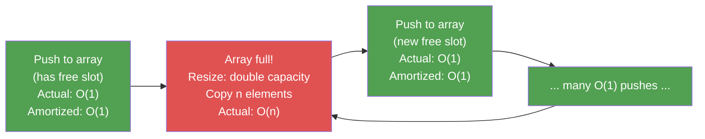

---
title: Amortized Analysis
aliases: [Amortized Complexity, Amortized Cost]
tags: [DSA, complexity, amortized-analysis]
domain: DSA
difficulty: Intermediate
created: 2026-07-26
related: [Big_O_Notation, Dynamic_Arrays, Union_Find]
status: complete
---

# Amortized Analysis

> [!abstract] TL;DR
> Amortized analysis gives the **average cost per operation over a sequence** — not the worst-case cost of a single operation — and reveals that occasionally expensive operations are cheap "on average" when spread across many operations.

## Intuition

Imagine a **gym membership**:

- Most days you go to the gym, and the cost that day is "well used."
- Occasionally you travel for a week and don't go — those days feel "wasted."
- But when you calculate the **annual fee ÷ total visits**, the per-visit cost is still reasonable.

The occasional bad day doesn't ruin the average.

**Dynamic array (Python list) is the canonical example:**
- Most `append()` calls are O(1) — just write to the next slot.
- Occasionally, when the array is full, it doubles in size — an O(n) copy.
- But this expensive resize happens rarely enough that **each append costs O(1) amortized**.

> [!important] Key insight
> Amortized analysis ≠ average case analysis.
> - **Average case**: averages over random inputs (probabilistic assumption).
> - **Amortized**: averages over a *sequence of operations* on the *same data structure* (no probability assumed — it works for any sequence).

## How It Works

### Three Methods of Amortized Analysis

#### 1. Aggregate Method
Compute the **total cost** of n operations, then divide by n.

**Dynamic array example:**
- n push operations on an initially empty array (capacity doubles when full)
- Direct cost: n pushes × O(1) each = O(n)
- Resize cost: copies at sizes 1, 2, 4, 8, ..., n/2 → total = 1+2+4+...+n/2 = n-1 ≈ n
- Total cost = O(n) + O(n) = O(n)
- Amortized cost per operation = O(n)/n = **O(1)**

#### 2. Accounting Method (Banker's Method)
Assign an **amortized charge** to each operation. "Cheap" operations pay extra into a credit bank; "expensive" operations spend from the bank.

**Dynamic array example:**
- Charge each push $3 (amortized cost)
  - $1 to do the actual push
  - $2 deposited in the "credit bank" for future resize
- When resize doubles array from n to 2n:
  - n elements must be copied → costs $n
  - Each of those n elements previously deposited $2 → bank has $2n available
  - Resize is fully paid → total bank never goes negative
- Therefore $3 amortized charge per push suffices → **O(1) amortized**

#### 3. Potential Method (Physics Method)
Define a **potential function** Φ(state) representing "stored work." Amortized cost = actual cost + ΔΦ.

**Dynamic array:** Φ = 2 × (size - capacity/2) when size > capacity/2, else 0.
- Empty slots "lower" the potential; full array "raises" it.
- When resize happens, potential drops enough to cover the actual cost.



## Complexity Analysis

### Dynamic Array Doubling — Formal Proof

**Setup:** Start with capacity 1. Push n elements.

**Resize events** occur at sizes 1, 2, 4, 8, ..., 2^k where 2^k ≥ n.

**Cost of each resize:** copying all existing elements.

$$\text{Total resize cost} = 1 + 2 + 4 + \cdots + \frac{n}{2} = \sum_{i=0}^{\log_2 n - 1} 2^i = 2^{\log_2 n} - 1 = n - 1$$

**Total cost for n pushes:**
$$\text{Total} = \underbrace{n}_{\text{push ops}} + \underbrace{n-1}_{\text{resize copies}} = 2n - 1 = O(n)$$

**Amortized cost per push:**
$$\frac{O(n)}{n} = O(1)$$

### Common Amortized Results

| Data Structure / Operation | Worst Single Op | Amortized per Op | Method |
|---------------------------|-----------------|------------------|--------|
| Dynamic array append | O(n) resize | O(1) | Aggregate |
| Dynamic array pop | O(1) | O(1) | Trivial |
| Stack push/pop | O(1) | O(1) | Trivial |
| Union-Find (path compression + union by rank) | O(log n) | O(α(n)) ≈ O(1) | Potential |
| Splay tree operations | O(n) | O(log n) | Potential |
| Fibonacci heap decrease-key | O(1) | O(1) | Potential |
| Fibonacci heap extract-min | O(n) | O(log n) | Potential |

*α(n) = inverse Ackermann function, grows so slowly it's effectively constant for all practical n.*

| Operation | Time | Space |
|-----------|------|-------|
| Dynamic array append (amortized) | O(1) | O(1) |
| Dynamic array append (worst) | O(n) | O(n) |
| Union-Find union (amortized) | O(α(n)) | O(1) |
| Union-Find find (amortized) | O(α(n)) | O(1) |

## Implementation

```python
class DynamicArray:
    """
    Dynamic array with doubling strategy.
    Demonstrates O(1) amortized append via doubling.
    """
    def __init__(self):
        self._capacity = 1
        self._size = 0
        self._data = [None] * self._capacity
        self._total_copies = 0  # track for demonstration

    def append(self, val):
        if self._size == self._capacity:
            self._resize()  # expensive, but rare
        self._data[self._size] = val
        self._size += 1

    def _resize(self):
        """Double capacity and copy all elements."""
        new_capacity = self._capacity * 2
        new_data = [None] * new_capacity
        for i in range(self._size):
            new_data[i] = self._data[i]  # O(n) copies
            self._total_copies += 1
        self._data = new_data
        self._capacity = new_capacity

    def __len__(self):
        return self._size

    def __getitem__(self, idx):
        if 0 <= idx < self._size:
            return self._data[idx]
        raise IndexError("index out of range")


def demonstrate_amortized_cost():
    """Show that total copies ≈ 2n even after n appends."""
    arr = DynamicArray()
    n = 1000
    for i in range(n):
        arr.append(i)

    print(f"n = {n}")
    print(f"Total copy operations: {arr._total_copies}")  # ≈ 999 = n-1
    print(f"Amortized copies per append: {arr._total_copies / n:.3f}")  # ≈ 1.0
    # Total work = n (appends) + n-1 (copies) = 2n-1 → O(1) amortized


# --- Union-Find with path compression + union by rank ---
class UnionFind:
    """
    Nearly O(1) amortized per operation (O(α(n)) to be precise).
    Two optimizations make it nearly constant:
    1. Union by rank: attach smaller tree under taller one
    2. Path compression: flatten tree during find
    """
    def __init__(self, n):
        self.parent = list(range(n))
        self.rank = [0] * n

    def find(self, x):
        if self.parent[x] != x:
            self.parent[x] = self.find(self.parent[x])  # path compression
        return self.parent[x]

    def union(self, x, y):
        rx, ry = self.find(x), self.find(y)
        if rx == ry:
            return False  # already connected
        # Union by rank: smaller rank tree goes under larger rank tree
        if self.rank[rx] < self.rank[ry]:
            rx, ry = ry, rx
        self.parent[ry] = rx
        if self.rank[rx] == self.rank[ry]:
            self.rank[rx] += 1
        return True

    def connected(self, x, y):
        return self.find(x) == self.find(y)
```

## Dry Run / Example Trace

**DynamicArray appending 8 elements:**

```
Op  | Val | Size | Cap | Action
----|-----|------|-----|-------------------
1   |  A  |  1   |  1  | Just write (O(1))
2   |  B  |  2   |  2  | Resize 1→2, copy 1, write (cost: 2)
3   |  C  |  3   |  4  | Resize 2→4, copy 2, write (cost: 3)
4   |  D  |  4   |  4  | Just write (O(1))
5   |  E  |  5   |  8  | Resize 4→8, copy 4, write (cost: 5)
6   |  F  |  6   |  8  | Just write (O(1))
7   |  G  |  7   |  8  | Just write (O(1))
8   |  H  |  8   |  8  | Just write (O(1))

Total cost = 1 + 2 + 3 + 1 + 5 + 1 + 1 + 1 = 15
Amortized  = 15 / 8 ≈ 1.875 per op → O(1)
Total copies = 1 + 2 + 4 = 7 = n - 1 ✓
```

**Union-Find path compression trace:**

```
Initial: parent = [0, 1, 2, 3, 4]

union(0, 1): parent[1] = 0  → tree: 0←1
union(0, 2): parent[2] = 0  → tree: 0←1, 0←2
union(0, 3): parent[3] = 0  → tree: 0←1, 0←2, 0←3
union(0, 4): parent[4] = 0  → tree: 0←1, 0←2, 0←3, 0←4

find(4): parent[4] = 0 already → O(1)  [flat tree, path compression works]
```

## Patterns & Applications

**When amortized analysis is critical:**
- **Dynamic arrays / Python lists:** `list.append()` is O(1) amortized, not O(1) worst-case.
- **Union-Find:** used in Kruskal's MST, network connectivity, image segmentation.
- **Hash tables with rehashing:** similar to dynamic arrays — rehash is O(n) but O(1) amortized insert.
- **Splay trees:** self-adjusting BSTs with O(log n) amortized per op.
- **Fibonacci heaps:** power Dijkstra's theoretical O(E + V log V) — decrease-key is O(1) amortized.

**Interview context:** When asked "what is the time complexity of `list.append()` in Python?" the correct answer is "O(1) amortized" — not just "O(1)." Interviewers who know algorithms expect this distinction.

## Common Pitfalls

- **Confusing amortized with average case:** Amortized is a worst-case guarantee over a sequence; average case assumes random inputs.
- **Applying amortized per-operation thinking to single operations:** If you need one single append to always be O(1), dynamic arrays don't guarantee it. Use a linked list or pre-sized array.
- **Forgetting that amortized analysis requires the data structure to be used from scratch:** If you inherit a half-full dynamic array in a "bad state," the next resize cost is still real.
- **Assuming all doubling strategies give O(1) amortized:** They do only if the growth factor is > 1 (e.g., ×1.5, ×2). Growing by 1 each time gives O(n²) total → O(n) amortized.

## Related Concepts

- [[_MOC_Complexity_Analysis|↑ Section MOC]]
- [[Big_O_Notation]]
- [[Time_Complexity_Classes]]
- [[Complexity_Cheat_Sheet]]

## Review Questions

1. What is the key difference between amortized O(1) and average-case O(1)?
2. Prove using the aggregate method that a dynamic array with doubling strategy achieves O(1) amortized append.
3. If a dynamic array grows by +10 elements (instead of doubling) when full, what is the amortized cost of append? Show your reasoning.
4. Explain intuitively why path compression in Union-Find makes future `find()` operations faster.
5. A stack supports push, pop, and "multi-pop" (pop k elements at once). If a sequence of n operations includes multi-pops, argue that the total cost is still O(n) using the accounting method.

## Sources

- Cormen, T. H., et al. *Introduction to Algorithms* (CLRS), Chapter 17
- Sedgewick, R. & Wayne, K. *Algorithms* (4th ed.), Section 1.4
- [Amortized Analysis — MIT OpenCourseWare](https://ocw.mit.edu/courses/6-006-introduction-to-algorithms-fall-2011/)
- [Union-Find — Princeton Algorithms Part I](https://www.coursera.org/learn/algorithms-part1)

#DSA #complexity #amortized #dynamic-array #union-find #algorithms
