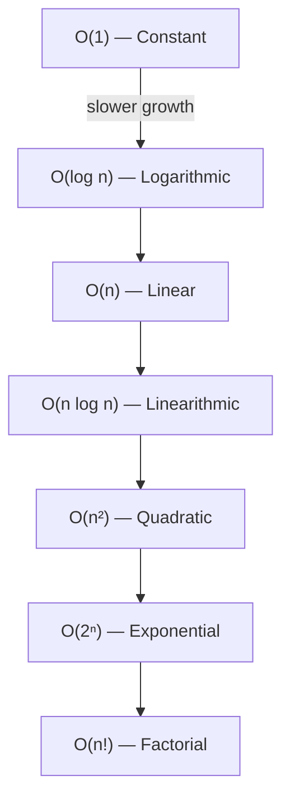

---
title: Big O Notation
aliases: [Big-O, Asymptotic Notation, Order of Growth]
tags: [DSA, complexity, asymptotic-analysis]
domain: DSA
difficulty: Beginner
created: 2026-07-26
related: [Space_Complexity, Time_Complexity_Classes, Amortized_Analysis]
status: complete
---

# Big O Notation

> [!abstract] TL;DR
> Big O notation describes the **upper bound** on how an algorithm's resource usage (time or space) grows as input size n approaches infinity — ignoring constants and lower-order terms.

## Intuition

Imagine you are measuring how a concert crowd grows when you double the venue capacity:

- **O(1)** — The number of security guards at the door stays the same regardless of venue size (constant).
- **O(log n)** — A binary search through the guest list: double the list, add just one more step.
- **O(n)** — One usher per seat: double the seats, double the ushers.
- **O(n log n)** — Organizing guests by name: slightly worse than linear due to sorting overhead.
- **O(n²)** — Every usher shakes hands with every other usher: double the crowd, quadruple the handshakes.
- **O(2ⁿ)** — The number of possible seating arrangements: adding one seat doubles all possibilities.
- **O(n!)** — Trying every possible seating arrangement: grows catastrophically fast.

**Formal definition:** f(n) is O(g(n)) if there exist constants c > 0 and n₀ > 0 such that:

$$f(n) \leq c \cdot g(n) \quad \forall \, n > n_0$$

In other words, g(n) is an upper bound on f(n)'s growth rate beyond some threshold n₀.

**Why we drop constants and lower-order terms:** At large scale, the dominant term drowns out everything else. `3n² + 100n + 5000` is still O(n²) because as n → ∞, the n² term determines the shape of growth. The constant factor 3 is absorbed into the c in the formal definition.

## How It Works

To find Big O for a piece of code:
1. Count the number of "operations" as a function of input size n.
2. Keep only the fastest-growing term.
3. Drop all constants.

**Key rules:**
- **Sequential steps add:** O(n) + O(n²) = O(n²)
- **Nested steps multiply:** an O(n) loop inside an O(n) loop = O(n²)
- **Drop constants:** O(3n) = O(n), O(n/2) = O(n)
- **Log base doesn't matter:** O(log₂ n) = O(log₁₀ n) = O(log n)



## Complexity Analysis

### Common Complexity Classes

| Class | Name | Example Algorithms | n=10 | n=100 | n=1000 |
|-------|------|--------------------|------|-------|--------|
| O(1) | Constant | Array index, hash lookup | 1 | 1 | 1 |
| O(log n) | Logarithmic | Binary search, balanced BST ops | ~3 | ~7 | ~10 |
| O(n) | Linear | Linear scan, single loop | 10 | 100 | 1,000 |
| O(n log n) | Linearithmic | Merge sort, heap sort | ~33 | ~664 | ~9,966 |
| O(n²) | Quadratic | Bubble sort, nested loops | 100 | 10,000 | 1,000,000 |
| O(2ⁿ) | Exponential | Fibonacci naive, all subsets | 1,024 | ~10³⁰ | ~10³⁰⁰ |
| O(n!) | Factorial | Permutations, TSP brute force | 3.6M | ~10¹⁵⁷ | ~10²⁵⁶⁷ |

### Time and Space

| Aspect | What It Measures |
|--------|-----------------|
| Time complexity | Operations executed as a function of n |
| Space complexity | Memory allocated as a function of n |

## Implementation

```python
# O(1) — constant: index into array
def get_first(arr):
    return arr[0]  # always one operation

# O(log n) — logarithmic: binary search
def binary_search(arr, target):
    lo, hi = 0, len(arr) - 1
    while lo <= hi:
        mid = (lo + hi) // 2
        if arr[mid] == target:
            return mid
        elif arr[mid] < target:
            lo = mid + 1
        else:
            hi = mid - 1
    return -1

# O(n) — linear: single pass
def linear_scan(arr, target):
    for i, val in enumerate(arr):
        if val == target:
            return i
    return -1

# O(n log n) — linearithmic: merge sort
def merge_sort(arr):
    if len(arr) <= 1:
        return arr
    mid = len(arr) // 2
    left = merge_sort(arr[:mid])
    right = merge_sort(arr[mid:])
    return merge(left, right)

def merge(left, right):
    result, i, j = [], 0, 0
    while i < len(left) and j < len(right):
        if left[i] <= right[j]:
            result.append(left[i]); i += 1
        else:
            result.append(right[j]); j += 1
    return result + left[i:] + right[j:]

# O(n²) — quadratic: nested loops
def find_pair_sum(arr, target):
    for i in range(len(arr)):
        for j in range(i + 1, len(arr)):  # nested loop → n²
            if arr[i] + arr[j] == target:
                return (arr[i], arr[j])
    return None

# O(2^n) — exponential: all subsets
def all_subsets(arr):
    if not arr:
        return [[]]
    first, rest = arr[0], arr[1:]
    subsets_without = all_subsets(rest)
    subsets_with = [[first] + s for s in subsets_without]
    return subsets_without + subsets_with

# O(n!) — factorial: all permutations
def permutations(arr):
    if len(arr) <= 1:
        return [arr]
    result = []
    for i, val in enumerate(arr):
        rest = arr[:i] + arr[i+1:]
        for perm in permutations(rest):
            result.append([val] + perm)
    return result
```

## Dry Run / Example Trace

**Binary search on [1, 3, 5, 7, 9, 11, 13], target = 7:**

```
Step 1: lo=0, hi=6, mid=3 → arr[3]=7 → FOUND at index 3
```

Only 1 step for 7 elements. For 1,000,000 elements, binary search takes at most ~20 steps — this is the power of O(log n).

**Nested loop pair sum on [1, 2, 3, 4], target = 5:**

```
i=0 (val=1): j=1 (2), j=2 (3), j=3 (4→ 1+4=5 FOUND)
Total comparisons: 3+2+1 = 6 for n=4 → n(n-1)/2 → O(n²)
```

## Patterns & Applications

- **O(1):** Hash map lookups in caching, dictionary operations, stack push/pop.
- **O(log n):** Binary search, balanced BST (AVL, Red-Black), heap operations, finding kth element.
- **O(n):** Array traversal, counting elements, finding max/min, checking all nodes in a linked list.
- **O(n log n):** Any comparison-based sorting (theoretical lower bound), building a heap.
- **O(n²):** Naive string matching, all-pairs similarity, 2D grid traversal without shortcuts.
- **O(2ⁿ):** Dynamic programming problems with exponential state space (before memoization), subset enumeration.
- **O(n!):** Brute-force permutation problems — almost always means you need DP or pruning.

## Common Pitfalls

- **Forgetting hidden inner loops:** String concatenation in a loop is O(n²) in many languages (each concat copies the string).
- **Assuming log base matters:** It doesn't — log₂ n and log₁₀ n differ only by a constant factor.
- **Confusing worst case with average case:** Quick sort is O(n²) worst case but O(n log n) average. Be explicit about which case you mean.
- **Ignoring input constraints:** O(n²) with n ≤ 1000 is fine (10⁶ ops); O(n²) with n ≤ 10⁵ is not (10¹⁰ ops).
- **Multi-variable complexity:** Graph algorithms are often O(V + E), not just O(n). Both variables matter.
- **Recursive call counting:** Each recursive call isn't always O(1) — count total calls across the recursion tree.

## Related Concepts

- [[_MOC_Complexity_Analysis|↑ Section MOC]]
- [[Space_Complexity]]
- [[Time_Complexity_Classes]]
- [[Amortized_Analysis]]
- [[Master_Theorem]]
- [[Complexity_Cheat_Sheet]]

## Review Questions

1. What does the formal definition `f(n) ≤ c·g(n) for all n > n₀` actually mean in plain English?
2. An algorithm does n² + 100n + log n operations. What is its Big O complexity and why?
3. Why is O(n log n) considered "nearly linear" rather than "nearly quadratic"? At n = 1,000,000, how much does this matter?
4. Can an O(n²) algorithm ever run faster in practice than an O(n) algorithm? Under what conditions?
5. What is the Big O of: a loop from 1 to n/2, nested inside a loop from 1 to n?

## Sources

- Cormen, T. H., et al. *Introduction to Algorithms* (CLRS), Chapter 3
- Skiena, S. *The Algorithm Design Manual*, Chapter 2
- [Big-O Cheat Sheet](https://www.bigocheatsheet.com/)
- Khan Academy: Asymptotic notation

#DSA #complexity #BigO #asymptotic-analysis #algorithms
