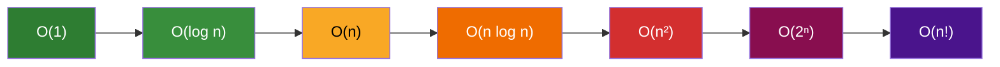

---
title: Complexity Cheat Sheet
aliases: [Algorithm Complexity Reference, Big O Reference, DSA Complexity Table]
tags: [DSA, complexity, reference, cheat-sheet]
domain: DSA
difficulty: Beginner
created: 2026-07-26
related: [Big_O_Notation, Data_Structures_Overview, Graph_Algorithms_Overview]
status: complete
---

# Complexity Cheat Sheet

> [!abstract] TL;DR
> One-stop reference for time and space complexity of all major complexity classes, data structures, sorting algorithms, and graph algorithms.

## Intuition

This is a **reference note** — not a tutorial. Use this when you need to quickly verify the complexity of a data structure operation, sorting algorithm, or graph algorithm. For deep explanations of why these complexities hold, see the linked notes.

## How It Works

> [!tip] Reading the tables
> - **Best** = most favorable input (e.g., already sorted array)
> - **Avg** = expected over random inputs
> - **Worst** = most adversarial input
> - **Aux Space** = extra memory beyond input
> - n = input size, V = vertices, E = edges

---

## 1. Big O Complexity Classes

| Class | Name | Example Algorithms | n=10 | n=100 | n=1,000 | n=1,000,000 |
|-------|------|--------------------|------|-------|---------|-------------|
| O(1) | Constant | Hash lookup, array index | 1 | 1 | 1 | 1 |
| O(log n) | Logarithmic | Binary search, BST ops | 3 | 7 | 10 | 20 |
| O(n) | Linear | Linear scan, BFS/DFS | 10 | 100 | 1,000 | 1,000,000 |
| O(n log n) | Linearithmic | Merge sort, Heap sort | 33 | 664 | 9,966 | ~2×10⁷ |
| O(n²) | Quadratic | Bubble sort, Insertion sort | 100 | 10,000 | 10⁶ | 10¹² |
| O(n³) | Cubic | Naive matrix mult | 1,000 | 10⁶ | 10⁹ | 10¹⁸ |
| O(2ⁿ) | Exponential | All subsets, naive Fib | 1,024 | ~10³⁰ | ~10³⁰⁰ | — |
| O(n!) | Factorial | All permutations, TSP brute | 3.6M | ~10¹⁵⁷ | — | — |

**Practical upper bounds (10⁸ operations/second, 1-second limit):**

| Acceptable complexity | Max n |
|-----------------------|-------|
| O(log n) | Any |
| O(n) | ~10⁸ |
| O(n log n) | ~3×10⁶ |
| O(n²) | ~10⁴ |
| O(n³) | ~450 |
| O(2ⁿ) | ~26 |
| O(n!) | ~12 |

---

## 2. Data Structure Operations

### Array & List Structures

| Data Structure | Access | Search | Insert (head) | Insert (tail) | Delete (head) | Delete (tail) | Space |
|----------------|--------|--------|---------------|---------------|---------------|---------------|-------|
| Array (static) | O(1) | O(n) | O(n) | O(n) | O(n) | O(n) | O(n) |
| Dynamic Array | O(1) | O(n) | O(n) | O(1)* | O(n) | O(1) | O(n) |
| Singly Linked List | O(n) | O(n) | O(1) | O(n)† | O(1) | O(n) | O(n) |
| Doubly Linked List | O(n) | O(n) | O(1) | O(1)† | O(1) | O(1) | O(n) |

*O(1) amortized — occasional O(n) resize
†O(1) if tail pointer maintained

### Stack & Queue

| Data Structure | Push/Enqueue | Pop/Dequeue | Peek | Search | Space |
|----------------|--------------|-------------|------|--------|-------|
| Stack (array) | O(1)* | O(1) | O(1) | O(n) | O(n) |
| Stack (linked list) | O(1) | O(1) | O(1) | O(n) | O(n) |
| Queue (array, circular) | O(1) | O(1) | O(1) | O(n) | O(n) |
| Queue (linked list) | O(1) | O(1) | O(1) | O(n) | O(n) |
| Deque (double-ended) | O(1) | O(1) | O(1) | O(n) | O(n) |

*O(1) amortized for dynamic array

### Hash-Based

| Data Structure | Search | Insert | Delete | Space | Notes |
|----------------|--------|--------|--------|-------|-------|
| Hash Table | O(1) avg / O(n) worst | O(1) avg / O(n) worst | O(1) avg / O(n) worst | O(n) | Worst case on hash collision |
| Hash Set | O(1) avg / O(n) worst | O(1) avg / O(n) worst | O(1) avg / O(n) worst | O(n) | Same as hash table |

### Tree Structures

| Data Structure | Access | Search | Insert | Delete | Space | Notes |
|----------------|--------|--------|--------|--------|-------|-------|
| Binary Search Tree | O(log n) avg / O(n) worst | O(log n) avg / O(n) worst | O(log n) avg / O(n) worst | O(log n) avg / O(n) worst | O(n) | Worst: degenerate (sorted input) |
| AVL Tree | O(log n) | O(log n) | O(log n) | O(log n) | O(n) | Height ≤ 1.44 log₂ n |
| Red-Black Tree | O(log n) | O(log n) | O(log n) | O(log n) | O(n) | Height ≤ 2 log₂(n+1) |
| B-Tree (order m) | O(log n) | O(log n) | O(log n) | O(log n) | O(n) | Used in databases |
| Trie | — | O(k) | O(k) | O(k) | O(n×k) | k = key/string length |

### Heap & Priority Queue

| Data Structure | Find Min/Max | Insert | Extract Min/Max | Delete | Build | Space |
|----------------|--------------|--------|-----------------|--------|-------|-------|
| Binary Heap | O(1) | O(log n) | O(log n) | O(log n) | O(n) | O(n) |
| Fibonacci Heap | O(1) | O(1) amort | O(log n) amort | O(log n) amort | O(n) | O(n) |

---

## 3. Sorting Algorithms

| Algorithm | Best Time | Avg Time | Worst Time | Aux Space | Stable? | In-Place? | Notes |
|-----------|-----------|----------|------------|-----------|---------|-----------|-------|
| Bubble Sort | O(n) | O(n²) | O(n²) | O(1) | Yes | Yes | Best with early-exit flag |
| Selection Sort | O(n²) | O(n²) | O(n²) | O(1) | No | Yes | Always n² swaps |
| Insertion Sort | O(n) | O(n²) | O(n²) | O(1) | Yes | Yes | Fast for nearly sorted |
| Shell Sort | O(n log n) | O(n^1.3) | O(n²) | O(1) | No | Yes | Gap sequence dependent |
| Merge Sort | O(n log n) | O(n log n) | O(n log n) | O(n) | Yes | No | Preferred for linked lists |
| Quick Sort | O(n log n) | O(n log n) | O(n²) | O(log n) | No | Yes | Worst on sorted/reverse input |
| Heap Sort | O(n log n) | O(n log n) | O(n log n) | O(1) | No | Yes | Guaranteed O(n log n) |
| Tim Sort | O(n) | O(n log n) | O(n log n) | O(n) | Yes | No | Python/Java default |
| Counting Sort | O(n+k) | O(n+k) | O(n+k) | O(k) | Yes | No | k = value range |
| Radix Sort | O(d·n) | O(d·n) | O(d·n) | O(n+k) | Yes | No | d = digits, k = base |
| Bucket Sort | O(n+k) | O(n) | O(n²) | O(n+k) | Yes | No | Uniform distribution |

**Lower bound:** Any comparison-based sort requires Ω(n log n) in the worst case. Counting/Radix/Bucket bypass this by not comparing.

---

## 4. Graph Algorithms

### Traversal

| Algorithm | Time | Space | Use Case |
|-----------|------|-------|----------|
| BFS | O(V + E) | O(V) | Shortest path (unweighted), level-order |
| DFS | O(V + E) | O(V) | Cycle detection, topological sort, connected components |
| Topological Sort (Kahn's) | O(V + E) | O(V) | DAG ordering (BFS-based) |
| Topological Sort (DFS) | O(V + E) | O(V) | DAG ordering |

### Shortest Path

| Algorithm | Time | Space | Works on | Constraint |
|-----------|------|-------|----------|------------|
| BFS | O(V + E) | O(V) | Unweighted graphs | No negative weights |
| Dijkstra (binary heap) | O((V + E) log V) | O(V) | Weighted, non-negative | No negative weights |
| Dijkstra (Fibonacci heap) | O(E + V log V) | O(V) | Weighted, non-negative | No negative weights |
| Bellman-Ford | O(V × E) | O(V) | Any weighted graph | Detects negative cycles |
| Floyd-Warshall | O(V³) | O(V²) | All-pairs shortest path | No negative cycles |
| A* Search | O(E log V) | O(V) | Weighted with heuristic | Admissible heuristic needed |

### Minimum Spanning Tree

| Algorithm | Time | Space | Best for |
|-----------|------|-------|----------|
| Kruskal's | O(E log E) = O(E log V) | O(V + E) | Sparse graphs |
| Prim's (binary heap) | O((V + E) log V) | O(V) | Dense graphs |
| Prim's (Fibonacci heap) | O(E + V log V) | O(V) | Dense graphs (theoretical) |

### Connectivity & Other

| Algorithm | Time | Space | Use Case |
|-----------|------|-------|----------|
| Union-Find | O(α(n)) per op amort | O(V) | Connected components, Kruskal's |
| Tarjan's SCC | O(V + E) | O(V) | Strongly connected components |
| Kosaraju's SCC | O(V + E) | O(V) | Strongly connected components |
| Articulation Points | O(V + E) | O(V) | Bridge/cut vertex finding |
| Eulerian Circuit | O(V + E) | O(V) | Visit all edges exactly once |

---

## 5. Advanced Data Structure Reference

| Data Structure | Key Operations | Time | Space | Use Case |
|----------------|---------------|------|-------|----------|
| Segment Tree | Range query, point update | O(log n) | O(n) | Range min/max/sum |
| Fenwick Tree (BIT) | Prefix sum, point update | O(log n) | O(n) | Prefix sums, inversion count |
| Sparse Table | Range min/max query (static) | O(1) query, O(n log n) build | O(n log n) | Immutable range queries |
| Disjoint Set (Union-Find) | Find, Union | O(α(n)) amort | O(n) | Connectivity, MST |
| Trie | Insert, Search, Prefix | O(k) | O(n×k) | String prefix problems |
| Suffix Array | Build, LCP | O(n log n) build | O(n) | String matching |

---

## Complexity Analysis

| Property | Best | Space |
|----------|------|-------|
| Lookup (hash table) | O(1) avg | O(n) |
| Lookup (balanced BST) | O(log n) | O(n) |
| Sort comparison-based | O(n log n) | O(1)–O(n) |
| Graph traversal | O(V+E) | O(V) |

---

## Patterns & Applications

**Choosing the right data structure:**

| Need | Use | Complexity |
|------|-----|------------|
| Fast key-value lookup | Hash table | O(1) avg |
| Ordered iteration | BST / sorted array | O(n) / O(log n) search |
| Priority queue | Heap | O(log n) insert/extract |
| LIFO | Stack | O(1) push/pop |
| FIFO | Queue | O(1) enqueue/dequeue |
| Prefix search | Trie | O(k) per op |
| Range queries | Segment tree / Fenwick | O(log n) |

**Algorithm selection by constraint:**

| Constraint | Algorithm choice |
|-----------|-----------------|
| Need guaranteed sort | Merge sort or Heap sort (not Quick) |
| Small integer range | Counting sort |
| Nearly sorted data | Insertion sort or Timsort |
| Shortest path, no weights | BFS |
| Shortest path, non-negative weights | Dijkstra |
| Shortest path, negative weights | Bellman-Ford |
| All-pairs shortest path | Floyd-Warshall |
| MST, sparse graph | Kruskal |
| MST, dense graph | Prim |

## Common Pitfalls

- **BST vs Balanced BST:** An unbalanced BST degrades to O(n) for all operations (degenerate linked list on sorted input). Always assume balanced BST (AVL/Red-Black) for O(log n) guarantees.
- **Hash table worst case:** O(n) with pathological hash collisions. Randomized hash or cryptographic hash avoids this.
- **Quick sort worst case:** O(n²) on sorted input with naive pivot (first element). Randomized pivot gives O(n log n) expected.
- **Stable sort matters:** When sorting objects by one key while preserving order of equal elements (e.g., sorting database rows by column). Merge sort and Timsort are stable; Heap sort and Quick sort are not.
- **Counting/Radix only for integers:** These linear-time sorts require bounded integer keys. They don't generalize to arbitrary comparison.
- **Dijkstra with negative weights:** Silently gives wrong answers. Use Bellman-Ford instead.
- **Floyd-Warshall space:** O(V²) — infeasible for large sparse graphs. Use Dijkstra from each vertex instead.

## Related Concepts

- [[_MOC_Complexity_Analysis|↑ Section MOC]]
- [[Big_O_Notation]]
- [[Time_Complexity_Classes]]
- [[Space_Complexity]]
- [[Amortized_Analysis]]
- [[Master_Theorem]]

## Review Questions

1. What is the worst-case time complexity of searching in an unbalanced BST? Why?
2. You need to find the k-th largest element in a stream of integers. Which data structure gives you O(log n) insert and O(1) access to the answer?
3. Why is Merge sort preferred over Quick sort for linked lists?
4. What is the time complexity of building a heap from an unsorted array? (Hint: it's not O(n log n).)
5. You have a graph with 10,000 vertices and 100,000 edges with non-negative weights. Which shortest-path algorithm should you use?

## Sources

- [Big-O Cheat Sheet](https://www.bigocheatsheet.com/)
- Cormen, T. H., et al. *Introduction to Algorithms* (CLRS)
- Skiena, S. *The Algorithm Design Manual*
- [CP-Algorithms](https://cp-algorithms.com/)
- [Visualgo](https://visualgo.net)

#DSA #complexity #reference #cheat-sheet #algorithms #data-structures #sorting #graphs
