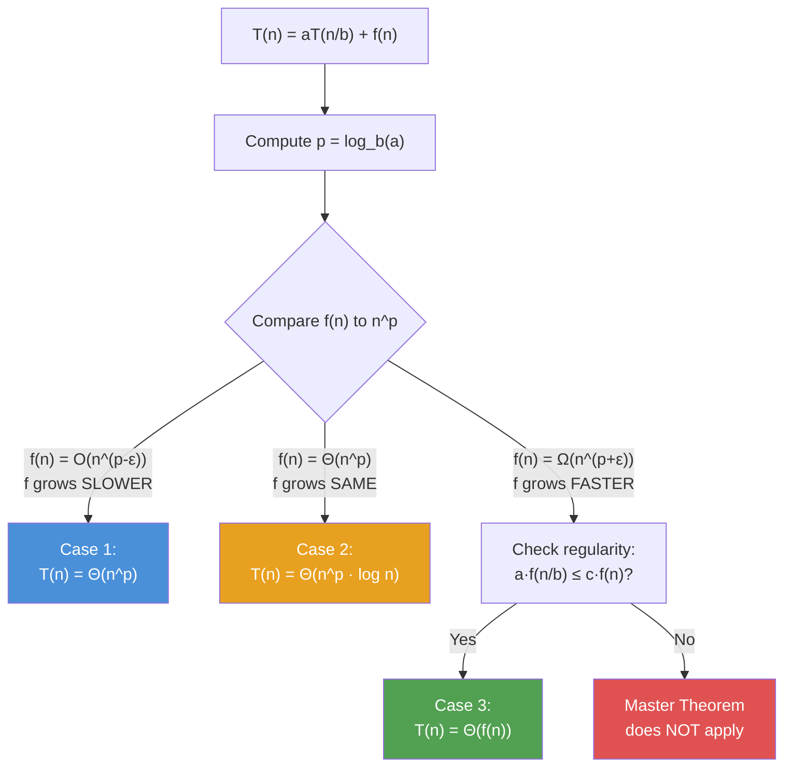

---
title: Master Theorem
aliases: [Master Method, Recurrence Relations, Divide and Conquer Analysis]
tags: [DSA, complexity, master-theorem, divide-and-conquer]
domain: DSA
difficulty: Intermediate
created: 2026-07-26
related: [Big_O_Notation, Time_Complexity_Classes, Divide_and_Conquer, Merge_Sort]
status: complete
---

# Master Theorem

> [!abstract] TL;DR
> The Master Theorem gives a closed-form solution for recurrences of the form T(n) = aT(n/b) + f(n) by comparing the "work at each level" f(n) to the "total subproblem work" n^(log_b a).

## Intuition

Think of the Master Theorem as **reading a recipe** — you just need to identify three ingredients and look up which case applies:

- **a** = how many subproblems you split into (number of recursive calls)
- **b** = by what factor you shrink the problem (divisor)
- **f(n)** = the work done at the current level before/after recursion

The theorem asks: **who dominates — the recursive work or the work at each level?**

Imagine building a pyramid of tasks:
- **Level 0 (root):** 1 call doing f(n) work
- **Level 1:** a calls each doing f(n/b) work → a × f(n/b) total
- **Level 2:** a² calls each doing f(n/b²) work
- ...
- **Leaf level:** aᵏ calls (where bᵏ = n, so k = log_b n) each doing O(1)

The **number of leaves** = a^(log_b n) = n^(log_b a). This is the "recursive" work.

Three outcomes:
1. **Leaves dominate** (recursive > level work): answer is n^(log_b a)
2. **Tie** (equal work at each level): multiply by log n
3. **Root dominates** (level work > recursive): answer is f(n)

## How It Works

### Formal Statement

For recurrences of the form:

$$T(n) = aT\!\left(\frac{n}{b}\right) + f(n), \quad a \geq 1,\ b > 1$$

Let $p = \log_b a$ (the "critical exponent").

**Case 1 — Leaves dominate:** If $f(n) = O(n^{p-\varepsilon})$ for some ε > 0:
$$T(n) = \Theta(n^p) = \Theta(n^{\log_b a})$$

**Case 2 — Tie (balanced):** If $f(n) = \Theta(n^p \log^k n)$ for some k ≥ 0:
$$T(n) = \Theta(n^p \log^{k+1} n)$$

Most common subcase (k=0): if $f(n) = \Theta(n^p)$, then $T(n) = \Theta(n^p \log n)$.

**Case 3 — Root dominates:** If $f(n) = \Omega(n^{p+\varepsilon})$ for some ε > 0, AND $af(n/b) \leq cf(n)$ for some c < 1 (regularity condition):
$$T(n) = \Theta(f(n))$$

### Memorization Trick

Compare f(n) to n^p where p = log_b(a):

```
f(n) vs n^(log_b a)

f(n) grows SLOWER  → Case 1: T(n) = Θ(n^(log_b a))    [leaves win]
f(n) grows SAME    → Case 2: T(n) = Θ(n^(log_b a) · log n)  [tie → log factor]
f(n) grows FASTER  → Case 3: T(n) = Θ(f(n))             [root wins]
```



### Recursion Tree for Merge Sort

**T(n) = 2T(n/2) + O(n):** a=2, b=2, f(n)=n, p = log₂ 2 = 1

```
Level 0:    [n elements]                  n work
             /          \
Level 1:  [n/2]        [n/2]              n/2 + n/2 = n work
          /    \        /    \
Level 2: [n/4][n/4] [n/4][n/4]            4 × n/4 = n work
         ...                               ...
Level k: [1][1][1]...[1]                  n × 1 = n work
         (n leaves)

Total levels = log₂ n
Work per level = n
Total = n × log₂ n = O(n log n)  ← Case 2
```

## Complexity Analysis

### 10 Common Recurrences Solved

| Recurrence | a | b | f(n) | p=log_b(a) | Case | Result |
|-----------|---|---|------|------------|------|--------|
| T(n) = T(n/2) + O(1) | 1 | 2 | 1 | 0 | 2 | O(log n) |
| T(n) = 2T(n/2) + O(n) | 2 | 2 | n | 1 | 2 | O(n log n) |
| T(n) = 4T(n/2) + O(n) | 4 | 2 | n | 2 | 1 | O(n²) |
| T(n) = 2T(n/2) + O(n²) | 2 | 2 | n² | 1 | 3 | O(n²) |
| T(n) = 3T(n/3) + O(n) | 3 | 3 | n | 1 | 2 | O(n log n) |
| T(n) = T(n/2) + O(n) | 1 | 2 | n | 0 | 3 | O(n) |
| T(n) = 2T(n/2) + O(1) | 2 | 2 | 1 | 1 | 1 | O(n) |
| T(n) = 4T(n/2) + O(n²) | 4 | 2 | n² | 2 | 2 | O(n² log n) |
| T(n) = 8T(n/2) + O(n²) | 8 | 2 | n² | 3 | 1 | O(n³) |
| T(n) = 2T(n/2) + O(n log n) | 2 | 2 | n log n | 1 | 2 (k=1) | O(n log² n) |

### Key Results to Memorize

| Algorithm | Recurrence | Result |
|-----------|------------|--------|
| Binary search | T(n) = T(n/2) + O(1) | O(log n) |
| Merge sort | T(n) = 2T(n/2) + O(n) | O(n log n) |
| Heap sort build | T(n) = 2T(n/2) + O(log n) | O(n) |
| Quicksort (avg) | T(n) = 2T(n/2) + O(n) | O(n log n) |
| Strassen matrix mult | T(n) = 7T(n/2) + O(n²) | O(n^2.807) |
| Naive matrix mult | T(n) = 8T(n/2) + O(n²) | O(n³) |
| Karatsuba multiplication | T(n) = 3T(n/2) + O(n) | O(n^1.585) |

| Analysis step | Complexity |
|---------------|------------|
| Identify a, b, f(n) | O(1) |
| Compute log_b(a) | O(1) |
| Determine which case | O(1) |

## Implementation

```python
import time
import math

def verify_master_theorem(algorithm, recurrence_str, n_values):
    """
    Decorator + runner to empirically verify master theorem predictions.
    Measures actual runtime and checks if growth matches predicted complexity.
    """
    results = {}
    for n in n_values:
        start = time.perf_counter()
        algorithm(n)
        elapsed = time.perf_counter() - start
        results[n] = elapsed
    return results


# --- Merge sort: T(n) = 2T(n/2) + O(n) → O(n log n) ---
def merge_sort(arr):
    if len(arr) <= 1:
        return arr
    mid = len(arr) // 2
    left = merge_sort(arr[:mid])   # T(n/2) — left subproblem
    right = merge_sort(arr[mid:])  # T(n/2) — right subproblem
    return _merge(left, right)     # O(n) — merge step (the f(n))

def _merge(left, right):
    result, i, j = [], 0, 0
    while i < len(left) and j < len(right):
        if left[i] <= right[j]:
            result.append(left[i]); i += 1
        else:
            result.append(right[j]); j += 1
    return result + left[i:] + right[j:]


# --- Binary search: T(n) = T(n/2) + O(1) → O(log n) ---
def binary_search(arr, target, lo=None, hi=None):
    if lo is None: lo = 0
    if hi is None: hi = len(arr) - 1
    if lo > hi:
        return -1
    mid = (lo + hi) // 2          # O(1) work at this level
    if arr[mid] == target:
        return mid
    elif arr[mid] < target:
        return binary_search(arr, target, mid + 1, hi)  # T(n/2)
    else:
        return binary_search(arr, target, lo, mid - 1)  # T(n/2)


# --- Demonstrating Case 1: T(n) = 2T(n/2) + O(1) → O(n) ---
def count_nodes(n):
    """Count nodes in perfect binary tree of depth log(n). T(n) = 2T(n/2) + O(1)"""
    if n <= 1:
        return 1
    left_count = count_nodes(n // 2)   # T(n/2)
    right_count = count_nodes(n // 2)  # T(n/2)
    return left_count + right_count + 1  # O(1) combine step


# --- Demonstrating Case 3: T(n) = T(n/2) + O(n) → O(n) ---
def linear_with_halving(arr):
    """Scan whole array, then recurse on half. T(n) = T(n/2) + O(n)"""
    if len(arr) <= 1:
        return
    for x in arr:                     # O(n) work at this level
        pass
    linear_with_halving(arr[:len(arr)//2])  # T(n/2)


def apply_master_theorem(a, b, f_description, f_of_n_func=None):
    """
    Helper to identify which case of the master theorem applies.
    a: number of subproblems
    b: size reduction factor
    f_description: string like "O(n)", "O(n^2)", "O(1)"
    """
    p = math.log(a, b)
    print(f"T(n) = {a}T(n/{b}) + {f_description}")
    print(f"p = log_{b}({a}) = {p:.4f}")
    print(f"n^p = n^{p:.4f}")
    print("Compare f(n) to n^p to determine the case.")
    return p
```

## Dry Run / Example Trace

**Applying Master Theorem to merge sort step by step:**

```
Recurrence: T(n) = 2T(n/2) + n

Step 1: Identify a=2, b=2, f(n)=n

Step 2: Compute p = log_b(a) = log_2(2) = 1
        → n^p = n^1 = n

Step 3: Compare f(n)=n to n^p=n
        f(n) = Θ(n^1) = Θ(n^p) → SAME growth rate → Case 2

Step 4: Apply Case 2 formula:
        T(n) = Θ(n^p · log n) = Θ(n^1 · log n) = Θ(n log n)

Answer: Merge sort is O(n log n) ✓
```

**Applying Master Theorem to binary search:**

```
Recurrence: T(n) = T(n/2) + 1

Step 1: a=1, b=2, f(n)=1

Step 2: p = log_2(1) = 0
        → n^p = n^0 = 1

Step 3: f(n) = 1 = Θ(n^0) = Θ(n^p) → Case 2

Step 4: T(n) = Θ(n^0 · log n) = Θ(log n)

Answer: Binary search is O(log n) ✓
```

## Patterns & Applications

**When to use the Master Theorem:**
- Any divide-and-conquer algorithm that splits into equal-sized subproblems
- Recursive algorithms on balanced trees
- Fast matrix multiplication analysis (Strassen)
- Integer multiplication algorithms (Karatsuba)

**When NOT to use:**
- Subproblems of unequal size: T(n) = T(n/3) + T(2n/3) + O(n) — use recursion tree directly
- T(n) = T(n-1) + O(1) — subtractive recurrences, not divisive → T(n) = O(n)
- T(n) = 2T(n/2) + O(n log n) — technically Case 2 with k=1, but confirm carefully
- Non-polynomial f(n) differences (e.g., f(n) = n / log n) — regularity condition may fail

## Common Pitfalls

- **Forgetting the regularity condition in Case 3:** Just because f(n) grows faster than n^p doesn't automatically mean Case 3 applies. You must verify a·f(n/b) ≤ c·f(n) for some c < 1.
- **Applying to non-divisive recurrences:** T(n) = T(n-1) + O(1) is NOT covered — this gives O(n), not O(log n).
- **Rounding errors in log_b(a):** log₂(3) ≈ 1.585, not 1.5. Use exact values.
- **Confusing which case means what:** Case 1 means leaves dominate (most subproblems), Case 3 means the top-level work dominates. The counterintuitive name order trips people up.
- **Subproblems of different sizes:** T(n) = T(n/3) + T(2n/3) + n cannot use the Master Theorem directly — draw the recursion tree instead.

## Related Concepts

- [[_MOC_Complexity_Analysis|↑ Section MOC]]
- [[Big_O_Notation]]
- [[Time_Complexity_Classes]]
- [[Amortized_Analysis]]
- [[Complexity_Cheat_Sheet]]

## Review Questions

1. For T(n) = 3T(n/9) + O(√n), what is p = log_b(a)? Which case applies? What is T(n)?
2. Why can't you apply the Master Theorem to T(n) = T(n-1) + O(n)?
3. Strassen's algorithm gives T(n) = 7T(n/2) + O(n²). Compute its complexity. How does it compare to naive matrix multiplication O(n³)?
4. What recurrence describes binary search? Walk through all steps to solve it with the Master Theorem.
5. If you change merge sort to split into 3 equal parts instead of 2 — T(n) = 3T(n/3) + O(n) — does it become faster than O(n log n)? Why or why not?

## Sources

- Cormen, T. H., et al. *Introduction to Algorithms* (CLRS), Chapter 4
- Skiena, S. *The Algorithm Design Manual*, Chapter 2
- [MIT 6.006 — Recurrences](https://ocw.mit.edu/courses/6-006-introduction-to-algorithms-fall-2011/pages/lecture-notes/)
- Akra, M. & Bazzi, L. "On the solution of linear recurrence equations" — generalization of Master Theorem

#DSA #complexity #master-theorem #divide-and-conquer #recurrences #algorithms
