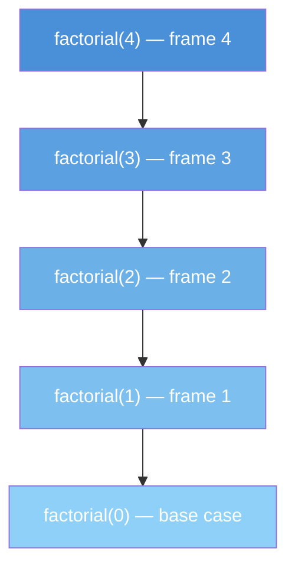

---
title: Space Complexity
aliases: [Memory Complexity, Auxiliary Space, Space Analysis]
tags: [DSA, complexity, space-complexity]
domain: DSA
difficulty: Beginner
created: 2026-07-26
related: [Big_O_Notation, Time_Complexity_Classes, Recursion_Fundamentals]
status: complete
---

# Space Complexity

> [!abstract] TL;DR
> Space complexity measures how much **additional memory** an algorithm needs as a function of input size n — with a critical distinction between the input itself and the **auxiliary space** the algorithm creates.

## Intuition

Think of space complexity as **packing for a trip**:

- The clothes you start with are the **input** — you brought them, they don't count as "extra packing".
- The **extra suitcase** you buy for souvenirs is the **auxiliary space** — that's what space complexity measures.
- **O(1) auxiliary** = you pack everything into your existing bag (in-place).
- **O(n) auxiliary** = you need a whole new bag proportional to what you're already carrying.
- **O(n) recursion** = you hire n porters, each carrying a copy of the state — the call stack.

**Input space vs auxiliary space:**
- **Input space:** The memory the input data itself occupies. Often excluded from space complexity analysis.
- **Auxiliary space:** The *extra* memory an algorithm uses beyond the input. This is what we usually optimize.
- **Total space = Input space + Auxiliary space**

> [!tip] Convention
> In most interviews and textbooks, "space complexity" refers to **auxiliary space** unless stated otherwise.

## How It Works

### What Counts as Space?

| Source | Counts? | Example |
|--------|---------|---------|
| Input array/string | Usually excluded | The array you're sorting |
| Output array | Included | New sorted array you return |
| Extra variables | Yes | Loop counters, temp vars |
| Data structures created | Yes | Hash maps, queues, new arrays |
| Call stack frames | Yes | Each recursive call adds a frame |
| System/language overhead | Usually excluded | Python object metadata |

### Recursion and the Call Stack

Each recursive call creates a new **stack frame** containing local variables and the return address. The maximum depth of recursion determines the call stack space.



**Stack grows to depth n → O(n) call stack space for linear recursion.**

### Space Usage of Common Data Structures

| Data Structure | Space | Notes |
|----------------|-------|-------|
| Array (size n) | O(n) | Fixed-size, contiguous |
| Dynamic Array | O(n) | May have up to 2n allocated |
| Singly Linked List | O(n) | n nodes + n next pointers |
| Doubly Linked List | O(n) | n nodes + 2n pointers |
| Stack (n elements) | O(n) | Array or linked list backed |
| Queue (n elements) | O(n) | Array or linked list backed |
| Hash Table (n entries) | O(n) | Plus load factor overhead |
| Binary Tree (n nodes) | O(n) | n nodes |
| Balanced BST (n nodes) | O(n) | n nodes |
| Heap (n elements) | O(n) | Usually array-backed |
| Graph (V vertices, E edges) | O(V + E) | Adjacency list |
| Graph (V vertices) | O(V²) | Adjacency matrix |

### Space-Time Tradeoff

You can often trade space for time or vice versa:

| Approach | Time | Space | Example |
|----------|------|-------|---------|
| Brute force | O(n²) | O(1) | Check all pairs |
| Precompute hash set | O(n) | O(n) | Two-sum with hash map |
| Memoization | O(n) | O(n) | Fibonacci with cache |
| Tabulation | O(n) | O(n) or O(1) | DP bottom-up |
| In-place sort | O(n log n) | O(1) | Heapsort |
| Non-in-place sort | O(n log n) | O(n) | Merge sort |

## Complexity Analysis

| Operation/Algorithm | Time | Auxiliary Space | Notes |
|---------------------|------|-----------------|-------|
| Array index | O(1) | O(1) | No extra memory |
| Linear search | O(n) | O(1) | Just a loop counter |
| Binary search (iterative) | O(log n) | O(1) | Just lo/hi/mid |
| Binary search (recursive) | O(log n) | O(log n) | Call stack depth |
| Bubble sort | O(n²) | O(1) | In-place |
| Merge sort | O(n log n) | O(n) | Needs temp array |
| Quicksort (avg) | O(n log n) | O(log n) | Call stack for recursion |
| Heapsort | O(n log n) | O(1) | In-place |
| DFS (graph) | O(V+E) | O(V) | Call stack / visited set |
| BFS (graph) | O(V+E) | O(V) | Queue |
| Fibonacci (recursive) | O(2ⁿ) | O(n) | Call stack depth n |
| Fibonacci (iterative) | O(n) | O(1) | Just two variables |
| Fibonacci (memoized) | O(n) | O(n) | Cache dictionary |

## Implementation

```python
# --- Iterative vs Recursive Fibonacci ---
# Recursive: O(2^n) time, O(n) space (call stack depth = n)
def fib_recursive(n):
    if n <= 1:
        return n
    return fib_recursive(n - 1) + fib_recursive(n - 2)
    # Call stack grows to depth n before returning

# Iterative: O(n) time, O(1) auxiliary space
def fib_iterative(n):
    if n <= 1:
        return n
    a, b = 0, 1           # only 2 variables regardless of n
    for _ in range(2, n + 1):
        a, b = b, a + b   # in-place update
    return b

# Memoized: O(n) time, O(n) space (cache dictionary)
def fib_memoized(n, memo={}):
    if n in memo:
        return memo[n]
    if n <= 1:
        return n
    memo[n] = fib_memoized(n - 1, memo) + fib_memoized(n - 2, memo)
    return memo[n]


# --- In-place vs Out-of-place sort ---
# In-place (O(1) auxiliary): modifies input directly
def reverse_in_place(arr):
    lo, hi = 0, len(arr) - 1
    while lo < hi:
        arr[lo], arr[hi] = arr[hi], arr[lo]  # swap in-place
        lo += 1
        hi -= 1
    return arr  # same list, no extra memory used

# Out-of-place (O(n) auxiliary): creates new list
def reverse_out_of_place(arr):
    return arr[::-1]  # creates a NEW list of size n


# --- Demonstrating call stack depth ---
import sys

def recursive_depth(n, current=0):
    """Shows how call stack grows with n"""
    if n == 0:
        return current
    return recursive_depth(n - 1, current + 1)
    # Maximum recursion depth in Python: sys.getrecursionlimit() ≈ 1000
    # For n > 1000, use iterative approach to avoid stack overflow


# --- Space optimization: reduce O(n) DP to O(1) ---
# Naive DP table: O(n) space
def count_ways_On(n):
    dp = [0] * (n + 1)   # O(n) space
    dp[0] = 1
    for i in range(1, n + 1):
        dp[i] = dp[i-1] + (dp[i-2] if i >= 2 else 0)
    return dp[n]

# Optimized: O(1) space — only need last 2 values
def count_ways_O1(n):
    if n <= 1:
        return 1
    prev2, prev1 = 1, 1
    for _ in range(2, n + 1):
        prev2, prev1 = prev1, prev1 + prev2
    return prev1
```

## Dry Run / Example Trace

**Tracing call stack space for `fib_recursive(4)`:**

```
fib(4) calls fib(3) and fib(2)
  fib(3) calls fib(2) and fib(1)
    fib(2) calls fib(1) and fib(0)
      fib(1) → returns 1  [deepest: 4 frames on stack]
      fib(0) → returns 0
    fib(2) returns 1
    fib(1) → returns 1
  fib(3) returns 2
  [back to fib(4)'s second call]
  fib(2) → computes again (redundant! O(2^n) time)
fib(4) returns 3

Maximum stack depth = 4 = n → O(n) space
```

**For n=40, the call stack is only 40 frames deep (manageable), but the total calls are 2^40 ≈ 10^12 (catastrophic time).**

## Patterns & Applications

**When O(1) space matters:**
- Embedded systems with limited RAM
- Large-scale streaming data (can't store everything)
- Competitive programming with tight memory limits

**Common space-reducing patterns:**
- Replace recursion with iteration + explicit stack
- Use two-pointer technique instead of extra array
- Compress DP table from 2D to 1D or from O(n) to O(1)
- Use bit manipulation instead of boolean arrays

**When spending O(n) space is worth it:**
- Memoization converts exponential time to linear
- Hash maps enable O(1) lookup instead of O(n) scan
- Prefix sum arrays enable O(1) range queries instead of O(n)

## Common Pitfalls

- **Forgetting recursion stack space:** A "simple" recursive function has O(depth) hidden space usage. Deep recursion on large input causes stack overflow.
- **In Python, slicing creates copies:** `arr[lo:hi]` creates a new list — O(k) space where k = hi - lo. This is why naive merge sort uses O(n) space.
- **Hash map space:** When you add a hash map to solve a problem in O(n) time, you've added O(n) space. Always note this tradeoff.
- **Global vs local scope:** A hash map defined outside a function persists across calls. Can cause memory leaks in recursive solutions.
- **Mutable default arguments in Python:** `def f(n, memo={})` — the memo dict is shared across all calls. Usually intentional for memoization, but a bug if not expected.
- **Confusing total space and auxiliary space:** Sorting an n-element array in-place uses O(n) total space (input) but O(1) auxiliary space. Both statements are correct.

## Related Concepts

- [[_MOC_Complexity_Analysis|↑ Section MOC]]
- [[Big_O_Notation]]
- [[Time_Complexity_Classes]]
- [[Amortized_Analysis]]
- [[Complexity_Cheat_Sheet]]

## Review Questions

1. What is the difference between auxiliary space and total space complexity? Give an example where they differ.
2. Merge sort is O(n log n) time but O(n) space. Heapsort is O(n log n) time and O(1) space. Why might you still choose merge sort?
3. A recursive function calls itself n times before hitting the base case. What is its space complexity, regardless of what the function body does?
4. You solve a two-sum problem using a hash map (O(n) space) instead of nested loops (O(1) space). Describe the space-time tradeoff you made.
5. How would you convert a recursive Fibonacci with O(n) space to O(1) space? Write the approach in pseudocode.

## Sources

- Cormen, T. H., et al. *Introduction to Algorithms* (CLRS), Chapter 2
- Skiena, S. *The Algorithm Design Manual*, Chapter 2
- [Space Complexity — GeeksForGeeks](https://www.geeksforgeeks.org/g-fact-86/)
- McDowell, G. *Cracking the Coding Interview*, Chapter VI

#DSA #complexity #space-complexity #memory #auxiliary-space #algorithms
