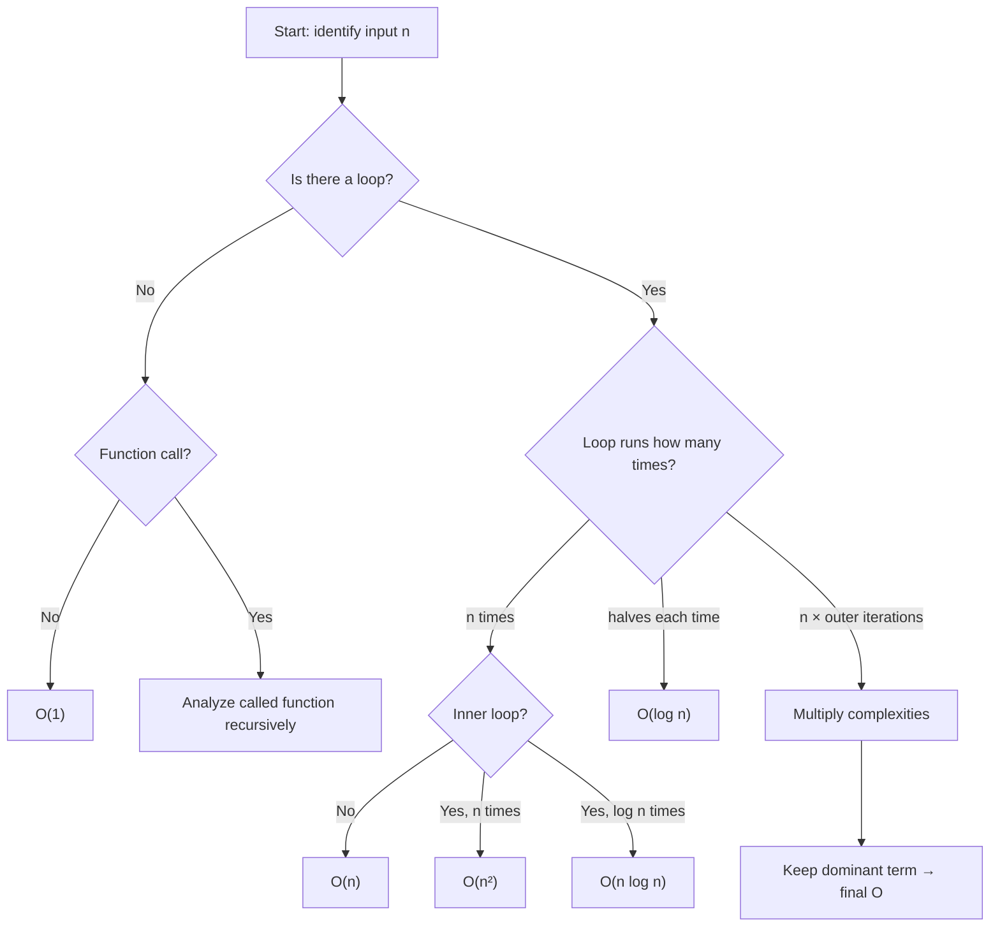

---
title: Time Complexity Classes
aliases: [Time Complexity, Complexity Classes, Algorithm Analysis]
tags: [DSA, complexity, time-complexity]
domain: DSA
difficulty: Beginner
created: 2026-07-26
related: [Big_O_Notation, Space_Complexity, Master_Theorem]
status: complete
---

# Time Complexity Classes

> [!abstract] TL;DR
> Time complexity classes categorize algorithms by how their run time grows with input size n — and knowing which class an algorithm falls into tells you immediately whether it will scale.

## Intuition

Think of an algorithm as a **restaurant** serving n customers:

- **O(1)** — Reading the menu price: takes the same time regardless of how many customers are seated.
- **O(log n)** — Looking up a wine in a sorted wine list by flipping to the middle: double the wines, add one extra flip.
- **O(n)** — A manager walking every table to check on customers: double the tables, double the walk.
- **O(n log n)** — Sorting all orders by table number before delivering: slightly worse than just one pass.
- **O(n²)** — Every waiter greets every other waiter before service: 10 waiters → 100 greetings; 100 waiters → 10,000 greetings.
- **O(2ⁿ)** — Trying every possible seating arrangement: one extra table doubles the possibilities.

**Why n matters more than machine speed at scale:**
A machine 1000× faster still loses to a better algorithm. If algorithm A runs in O(n²) and algorithm B in O(n log n):
- At n = 10⁶: A does 10¹² ops, B does ~2×10⁷ ops. Even at 10⁹ ops/second, A takes 1000 seconds; B takes 0.02 seconds.

## How It Works

### How to Analyze Code



### Rules for Combining Complexities

| Pattern | Result | Example |
|---------|--------|---------|
| Sequential blocks | Add, keep dominant | O(n) + O(n²) = O(n²) |
| Nested loops | Multiply | O(n) × O(n) = O(n²) |
| Loop that halves | O(log n) | Binary search |
| Recursion | Use recurrence or Master Theorem | Merge sort → O(n log n) |
| Drop constants | Remove coefficient | O(3n) = O(n) |
| Drop low-order terms | Keep dominant only | O(n² + n) = O(n²) |

### Multi-Variable Complexity

Not all algorithms depend on a single variable. In graph algorithms, both V (vertices) and E (edges) matter:

| Algorithm | Complexity | Why Both Variables |
|-----------|------------|--------------------|
| BFS / DFS | O(V + E) | Visit each vertex once + traverse each edge once |
| Dijkstra (min-heap) | O((V + E) log V) | Each vertex/edge processed with heap ops |
| Floyd-Warshall | O(V³) | Triple nested loop over all vertex pairs |

### Best / Worst / Average Case

| Case | Meaning | When it matters |
|------|---------|-----------------|
| **Best case** Ω | Minimum operations (most favorable input) | Rarely used — too optimistic |
| **Worst case** O | Maximum operations (most adversarial input) | Default for guarantees |
| **Average case** Θ | Expected operations over all inputs | Quicksort O(n log n) avg vs O(n²) worst |

> [!tip] Convention
> When someone says "an algorithm is O(n²)" without qualification, they almost always mean the **worst case**.

## Complexity Analysis

### Comprehensive Complexity Class Table

| Class | Name | Example Algorithm | Example Problem | n=10 | n=100 | n=1,000 |
|-------|------|------------------|-----------------|------|-------|---------|
| O(1) | Constant | Hash table lookup | Dictionary get | 1 | 1 | 1 |
| O(log n) | Logarithmic | Binary search | Search sorted array | 3 | 7 | 10 |
| O(n) | Linear | Linear scan | Find max element | 10 | 100 | 1,000 |
| O(n log n) | Linearithmic | Merge sort | Sort array | 33 | 664 | 9,966 |
| O(n²) | Quadratic | Bubble sort | Find all pairs | 100 | 10,000 | 1,000,000 |
| O(n³) | Cubic | Naive matrix multiply | Matrix × Matrix | 1,000 | 10⁶ | 10⁹ |
| O(2ⁿ) | Exponential | Recursive Fibonacci | All subsets | 1,024 | ~10³⁰ | ~10³⁰⁰ |
| O(n!) | Factorial | Permutation generation | Travelling salesman brute | 3.6M | ~10¹⁵⁷ | ~10²⁵⁶⁷ |

### Practical Feasibility at n = 10⁸ ops/sec

| Complexity | Max n solvable in 1 second |
|------------|---------------------------|
| O(log n) | ~10³⁰ |
| O(n) | ~10⁸ |
| O(n log n) | ~10⁷ |
| O(n²) | ~10⁴ |
| O(n³) | ~500 |
| O(2ⁿ) | ~26 |
| O(n!) | ~12 |

## Implementation

```python
# O(1): dictionary lookup — same time regardless of dict size
def get_value(d, key):
    return d.get(key)  # hash computed in O(1)

# O(log n): binary search — search space halved each iteration
def binary_search(arr, target):
    lo, hi = 0, len(arr) - 1
    while lo <= hi:           # runs at most log₂(n) times
        mid = (lo + hi) // 2
        if arr[mid] == target:
            return mid
        elif arr[mid] < target:
            lo = mid + 1
        else:
            hi = mid - 1
    return -1

# O(n): single pass — each element visited once
def find_max(arr):
    max_val = arr[0]
    for val in arr:           # n iterations
        if val > max_val:
            max_val = val
    return max_val

# O(n log n): merge sort — n elements × log n levels of merging
def merge_sort(arr):
    if len(arr) <= 1:
        return arr
    mid = len(arr) // 2
    left = merge_sort(arr[:mid])   # T(n/2)
    right = merge_sort(arr[mid:])  # T(n/2)
    return _merge(left, right)     # O(n) merge step

def _merge(left, right):
    result, i, j = [], 0, 0
    while i < len(left) and j < len(right):
        if left[i] <= right[j]:
            result.append(left[i]); i += 1
        else:
            result.append(right[j]); j += 1
    return result + left[i:] + right[j:]

# O(n²): all-pairs check — two nested loops each of size n
def has_duplicate_pair(arr, target_sum):
    for i in range(len(arr)):          # n iterations
        for j in range(i+1, len(arr)): # ~n iterations
            if arr[i] + arr[j] == target_sum:
                return True
    return False

# Demonstrating the difference between best/worst/average:
def linear_search_analysis(arr, target):
    """
    Best case:  O(1) — target is arr[0]
    Worst case: O(n) — target is arr[-1] or not present
    Average:    O(n/2) = O(n) — target at random position
    """
    for i, val in enumerate(arr):
        if val == target:
            return i
    return -1
```

## Dry Run / Example Trace

**How to analyze this code snippet:**

```python
def mystery(n):
    result = 0                    # O(1)
    for i in range(n):            # n iterations
        for j in range(i, n):     # n-i iterations (not always n!)
            result += 1           # O(1)
    return result
```

Counting iterations:
```
i=0: j runs from 0 to n-1 → n iterations
i=1: j runs from 1 to n-1 → n-1 iterations
...
i=n-1: j runs from n-1 to n-1 → 1 iteration

Total = n + (n-1) + ... + 1 = n(n+1)/2 ≈ n²/2 → O(n²)
```

Even though the inner loop doesn't always run n times, the total is still O(n²).

## Patterns & Applications

**Recognizing complexity class from code structure:**

| Code Pattern | Complexity |
|-------------|------------|
| Single statement / indexing | O(1) |
| Loop dividing by 2 each time | O(log n) |
| Single loop 0..n | O(n) |
| Two nested loops 0..n | O(n²) |
| Loop 0..n + binary search inside | O(n log n) |
| Recursion splitting into 2 halves, O(n) merge | O(n log n) |
| Recursion with 2 calls each size n-1 | O(2ⁿ) |
| Generating all permutations | O(n!) |

**Where complexity analysis matters most:**
- Competitive programming: tight time limits, must choose the right algorithm
- Database query optimization: O(n²) join is catastrophic on millions of rows
- Choosing sorting algorithm: O(n log n) vs O(n²) for large datasets
- API design: O(1) amortized access patterns in data structures

## Common Pitfalls

- **String operations in loops:** `s += char` in Python creates a new string each time → O(n²) total. Use `"".join(list)` instead.
- **Not considering all variables:** `for i in range(n): for j in range(m)` is O(n×m), not O(n²), unless m = n.
- **Assuming built-in = O(1):** Python `in` operator on a list is O(n); on a set it's O(1). Know your data structures.
- **Confusing worst case and Big O:** Big O is an upper bound, not always tight. An algorithm can be O(n²) and still run in O(n) for specific inputs.
- **Ignoring constant factors in practice:** O(n log n) with constant 100 may be slower than O(n²) with constant 1 for small n. Big O is an asymptotic tool.
- **Recursive space:** Recursive algorithms have O(depth) call stack overhead. A recursive O(n) algorithm uses O(n) space even if the logic seems O(1).

## Related Concepts

- [[_MOC_Complexity_Analysis|↑ Section MOC]]
- [[Big_O_Notation]]
- [[Space_Complexity]]
- [[Master_Theorem]]
- [[Amortized_Analysis]]
- [[Complexity_Cheat_Sheet]]

## Review Questions

1. An algorithm has two sequential parts: a sort (O(n log n)) followed by a linear scan (O(n)). What is the overall complexity?
2. The inner loop of a nested loop runs from j=i to j=n (not j=0 to j=n). Is the overall complexity still O(n²)?
3. Why is O(n) + O(n²) simplified to O(n²) rather than O(n² + n)?
4. A graph has V=1000 vertices and E=500,000 edges. Which would be faster: an O(V²) algorithm or an O(E log V) algorithm? Show your math.
5. You have a sorted array of 1 million elements. You need to find if a target value exists. What complexity algorithm should you use, and why?

## Sources

- Cormen, T. H., et al. *Introduction to Algorithms* (CLRS), Chapters 2–3
- Skiena, S. *The Algorithm Design Manual*, Chapter 2
- [Visualgo — Algorithm Visualization](https://visualgo.net)
- [Big-O Cheat Sheet](https://www.bigocheatsheet.com/)

#DSA #complexity #time-complexity #algorithms #analysis
