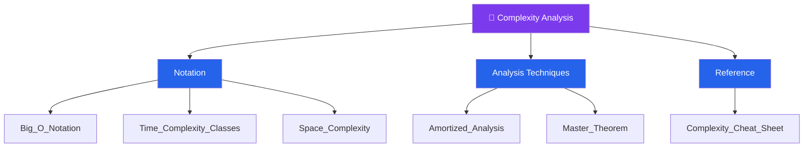

# 📐 Complexity Analysis — Map of Content

> [!abstract] What This Section Covers
> Complexity analysis is the foundation of every algorithmic decision. This section covers how to measure and reason about the efficiency of algorithms using asymptotic notation (Big-O, Omega, Theta), the major complexity classes you will encounter in practice, how memory usage grows with input, techniques for analyzing non-obvious cases like amortized operations, and the Master Theorem for solving recurrences that arise in divide-and-conquer algorithms. Master this section before diving into any data structure or algorithm.

## Concept Map

## Learning Path

Recommended order to study the notes in this section.

1. [[Big_O_Notation]] — Understand asymptotic notation (O, Ω, Θ) and how to read complexity expressions
2. [[Time_Complexity_Classes]] — Survey all major classes from O(1) to O(n!) and what they mean in practice
3. [[Space_Complexity]] — Measure auxiliary and total memory usage; understand recursion stack cost
4. [[Amortized_Analysis]] — Analyze sequences of operations when occasional costly ops are amortized across many cheap ones
5. [[Master_Theorem]] — Solve divide-and-conquer recurrences of the form T(n) = aT(n/b) + f(n)
6. [[Complexity_Cheat_Sheet]] — Quick-reference for common data structure and algorithm complexities

## All Notes at a Glance

| Note | Summary | Difficulty |
|------|---------|------------|
| [[Big_O_Notation]] | Asymptotic upper bound notation; drop constants and lower-order terms | Beginner |
| [[Time_Complexity_Classes]] | O(1), O(log n), O(n), O(n log n), O(n²), O(2ⁿ), O(n!) explained | Beginner |
| [[Space_Complexity]] | Auxiliary space vs. total space; in-place algorithms; stack frame cost | Beginner |
| [[Amortized_Analysis]] | Aggregate, accounting, and potential methods for amortized complexity | Intermediate |
| [[Master_Theorem]] | Three-case theorem for recurrences arising from divide-and-conquer | Intermediate |
| [[Complexity_Cheat_Sheet]] | At-a-glance table of common DS/algo time and space complexities | Beginner |

## Key Questions This Section Answers

- How do you determine whether an algorithm is feasible for a given input size?
- When is O(n log n) acceptable but O(n²) is not — and where is the practical cutoff?
- What is the difference between amortized cost and worst-case cost per operation?
- How do you analyze the time complexity of recursive algorithms using recurrences?
- When two algorithms have the same Big-O, how do you choose between them?
- What does O(log n) really mean and why does it appear so often in tree and binary-search problems?

## Related Sections

- [[_MOC_DSA_Master|↑ DSA Master MOC]]

#MOC #DSA #complexity-analysis
