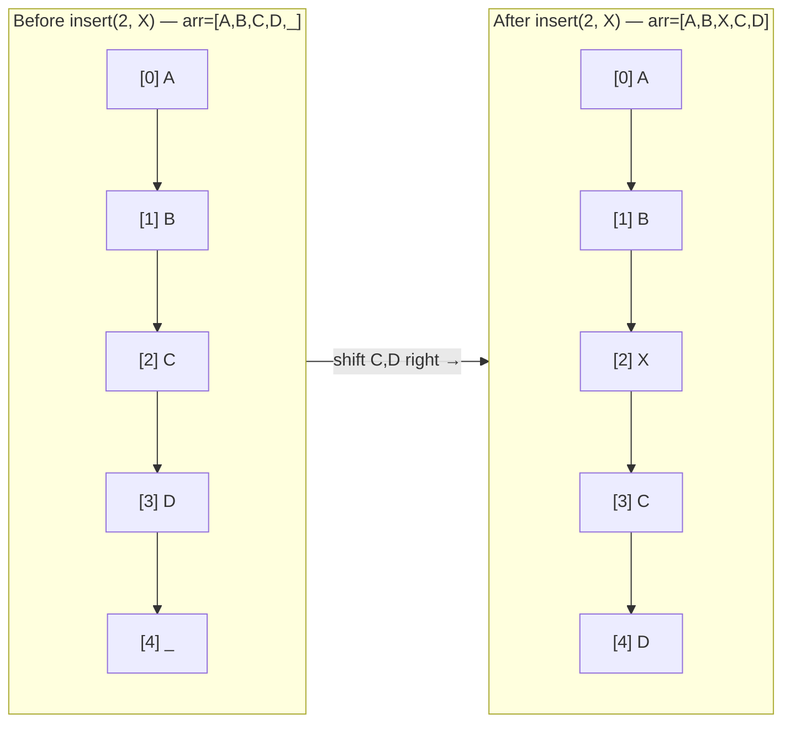

---
title: Array Operations
aliases: [array methods, list operations, array complexity]
tags: [DSA, arrays, complexity, python]
domain: DSA
difficulty: Beginner
created: 2026-07-26
related: [Static_vs_Dynamic_Arrays, Binary_Search, Two_Pointers]
status: complete
---

# 🔢 Array Operations

> [!abstract] TL;DR
> Arrays support O(1) access, O(n) unsorted search / O(log n) sorted, O(1) amortized append, and O(n) insert/delete at arbitrary positions due to shifting. Python's `list` provides rich built-ins; `bisect` enables sorted insertion in O(log n) find + O(n) shift.

## Intuition

Think of a **numbered row of mailboxes in an apartment building**.

- **Access** — you know the number, walk straight there: O(1).
- **Search** — if boxes are unsorted, check each one: O(n). If sorted alphabetically, open the middle box and halve the search: O(log n).
- **Insert at end** — add a new box at the end of the row: O(1).
- **Insert in the middle** — every box to the right must slide one position: O(n).
- **Delete in the middle** — same sliding left: O(n).

## How It Works

### Insert at Middle — Shift Operation



### Sorted Search (Binary Search Overview)
When an array is sorted, binary search repeatedly halves the search space:
- Compare `arr[mid]` with target.
- If equal → found. If target < `arr[mid]` → search left half. Else right half.
- Each step eliminates half the remaining elements → O(log n).

### The `bisect` Module
Python's `bisect` module performs binary search without sorting the array again:
- `bisect.bisect_left(arr, x)` → leftmost index where `x` can be inserted to keep order.
- `bisect.insort(arr, x)` → insert `x` in sorted position (O(log n) find + O(n) shift).

## Complexity Analysis

| Operation | Time Complexity | Space | Notes |
|-----------|----------------|-------|-------|
| Access `arr[i]` | O(1) | O(1) | Direct address calculation |
| Search (unsorted) | O(n) | O(1) | Linear scan |
| Search (sorted) | O(log n) | O(1) | Binary search |
| Append `arr.append(x)` | O(1) amortized | O(1) | Occasional O(n) resize |
| Insert at index `arr.insert(i, x)` | O(n) | O(1) | Shifts n-i elements |
| Delete by index `del arr[i]` | O(n) | O(1) | Shifts n-i elements |
| Delete by value `arr.remove(x)` | O(n) | O(1) | Linear search + shift |
| Slice `arr[l:r]` | O(k) where k=r-l | O(k) | Creates new list |
| Sort `arr.sort()` | O(n log n) | O(log n) | Timsort, in-place |
| Sorted copy `sorted(arr)` | O(n log n) | O(n) | Returns new list |
| `arr.reverse()` | O(n) | O(1) | In-place |
| `arr.index(x)` | O(n) | O(1) | Linear scan |
| `x in arr` | O(n) | O(1) | Linear scan |
| `len(arr)` | O(1) | O(1) | Stored as attribute |
| `bisect.bisect_left` | O(log n) | O(1) | Requires sorted array |
| `bisect.insort` | O(n) | O(1) | O(log n) find + O(n) shift |

## Implementation

```python
import bisect
import time
import random

# ── 1. Core operations with timing ────────────────────────────────────────────
def demo_operations():
    arr = list(range(10_000))

    # Access — O(1)
    _ = arr[4999]

    # Search unsorted — O(n)
    arr_unsorted = random.sample(range(100_000), 10_000)
    t0 = time.perf_counter()
    found = 99999 in arr_unsorted
    print(f"Linear search: {time.perf_counter()-t0:.6f}s  found={found}")

    # Search sorted — O(log n) via bisect
    arr_sorted = sorted(arr_unsorted)
    t0 = time.perf_counter()
    idx = bisect.bisect_left(arr_sorted, 99999)
    found = idx < len(arr_sorted) and arr_sorted[idx] == 99999
    print(f"Binary search: {time.perf_counter()-t0:.6f}s  found={found}")

    # Insert at end — O(1) amortized
    arr.append(10_000)

    # Insert at beginning — O(n) (worst case shift)
    t0 = time.perf_counter()
    arr.insert(0, -1)
    print(f"Insert at [0]: {time.perf_counter()-t0:.6f}s")

    # Delete at beginning — O(n)
    t0 = time.perf_counter()
    del arr[0]
    print(f"Delete at [0]: {time.perf_counter()-t0:.6f}s")


# ── 2. Python-specific conveniences ───────────────────────────────────────────
def python_array_idioms():
    nums = [3, 1, 4, 1, 5, 9, 2, 6, 5, 3]

    # List comprehension — O(n)
    squares = [x * x for x in nums]
    evens = [x for x in nums if x % 2 == 0]

    # enumerate — access index and value together
    for idx, val in enumerate(nums):
        pass  # idx and val both available

    # zip — pair two arrays element-wise
    labels = ['a', 'b', 'c']
    values = [10, 20, 30]
    paired = list(zip(labels, values))   # [('a',10), ('b',20), ('c',30)]

    # sorted vs sort
    copy_sorted = sorted(nums)            # new list, original unchanged
    nums.sort()                           # in-place, returns None
    nums.sort(reverse=True)              # descending

    # sort with key
    words = ["banana", "fig", "apple", "kiwi"]
    words.sort(key=len)                  # sort by length
    words.sort(key=lambda w: w[-1])      # sort by last character

    # Two-pointer-friendly: reverse in-place
    arr = [1, 2, 3, 4, 5]
    arr.reverse()                         # [5, 4, 3, 2, 1]
    arr_rev = arr[::-1]                   # new reversed copy

    return squares, evens, paired


# ── 3. bisect module for sorted insertion ─────────────────────────────────────
def sorted_insertion_demo():
    """Maintain a sorted list with O(log n) search for insert position."""
    sorted_arr: list[int] = []

    # bisect.insort keeps the list sorted after each insert
    for val in [5, 2, 8, 1, 9, 3]:
        bisect.insort(sorted_arr, val)
        print(sorted_arr)
    # [5] → [2,5] → [2,5,8] → [1,2,5,8] → [1,2,5,8,9] → [1,2,3,5,8,9]

    # Find leftmost position where 4 could go (without inserting)
    pos = bisect.bisect_left(sorted_arr, 4)
    print(f"Insert position for 4: {pos}")  # 2 (between 3 and 5)

    # Range query: how many elements in [3, 8]?
    lo = bisect.bisect_left(sorted_arr, 3)
    hi = bisect.bisect_right(sorted_arr, 8)
    print(f"Elements in [3, 8]: {sorted_arr[lo:hi]}")  # [3, 5, 8]
    print(f"Count: {hi - lo}")                          # 3


# ── 4. All slice patterns ──────────────────────────────────────────────────────
def slicing_reference():
    arr = [0, 1, 2, 3, 4, 5, 6, 7, 8, 9]
    print(arr[2:5])     # [2, 3, 4]       — indices 2,3,4
    print(arr[:3])      # [0, 1, 2]       — first 3
    print(arr[-3:])     # [7, 8, 9]       — last 3
    print(arr[::2])     # [0, 2, 4, 6, 8] — every other
    print(arr[::-1])    # [9, 8, ..., 0]  — reversed copy
    print(arr[1:8:2])   # [1, 3, 5, 7]   — start=1, stop=8, step=2


if __name__ == "__main__":
    demo_operations()
    python_array_idioms()
    sorted_insertion_demo()
    slicing_reference()
```

## Dry Run / Example Trace

**`bisect.insort` into `[1, 3, 5, 7, 9]` with value `4`:**

| Step | lo | hi | mid | `arr[mid]` | Decision |
|------|----|----|-----|-----------|----------|
| Init | 0 | 5 | — | — | Start binary search |
| 1 | 0 | 5 | 2 | 5 | 4 < 5 → go left: hi=2 |
| 2 | 0 | 2 | 1 | 3 | 4 > 3 → go right: lo=2 |
| 3 | lo==hi==2 | — | — | — | Insert at index 2 |

Result: `[1, 3, 4, 5, 7, 9]`. Elements at indices 2-4 shifted right by 1 (O(n) shift).

## Patterns & LeetCode Applications

| LeetCode Problem | Operation(s) Used | Complexity |
|-----------------|-------------------|-----------|
| Two Sum (sorted) | Binary search / two pointers | O(n log n) |
| Remove Duplicates from Sorted Array | In-place overwrite, two pointers | O(n) |
| Rotate Array | Slice + concatenate or triple reverse | O(n) |
| Find Minimum in Rotated Sorted Array | Binary search variant | O(log n) |
| Count of Smaller Numbers After Self | bisect + sorted insert | O(n log n) |
| Merge Sorted Array | Backwards two-pointer merge | O(n+m) |

## Common Pitfalls

1. **`arr.sort()` returns `None`** — writing `arr = arr.sort()` loses the list. Use `arr.sort()` (in-place) or `arr = sorted(arr)` (new list).
2. **Slice creates a copy** — `arr[l:r]` is O(k) time AND space. Don't slice inside a tight loop expecting O(1).
3. **`bisect` requires sorted input** — calling `bisect` on an unsorted array gives undefined results with no error.
4. **Confusing `bisect_left` vs `bisect_right`** — if duplicates exist, `bisect_left` returns the leftmost valid index, `bisect_right` the rightmost+1.
5. **`del arr[i]` vs `arr.pop(i)`** — both are O(n); `pop(i)` returns the value, `del arr[i]` doesn't.
6. **Modifying a list while iterating over it** — use a copy or iterate in reverse when removing elements.

## Related Concepts

- [[_MOC_Arrays|↑ Section MOC]]
- [[Static_vs_Dynamic_Arrays]] — why O(1) access and amortized O(1) append are possible
- [[Binary_Search]] — O(log n) search in depth
- [[Two_Pointers]] — technique built on O(1) array access
- [[Sliding_Window]] — contiguous subarray traversal patterns
- [[Sorting_Algorithms]] — Timsort internals behind Python's `list.sort()`

## Review Questions (3)

1. **Why is `arr.insert(0, x)` O(n) but `arr.append(x)` amortized O(1)? What physical operation causes the difference?**
2. **`bisect.insort` finds the position in O(log n) but the full operation is O(n). What operation dominates and why can't we avoid it for a standard Python list?**
3. **You have a sorted array of 1 million integers and need to answer 500,000 range-count queries (how many elements fall in [l, r]?). Design an O(log n) per query solution using `bisect`.**

## Sources

- [Python Docs — bisect module](https://docs.python.org/3/library/bisect.html)
- [Python Time Complexity wiki](https://wiki.python.org/moin/TimeComplexity)
- Cormen et al. — *Introduction to Algorithms (CLRS)*, Chapter 2

#arrays #operations #bisect #time-complexity #python-list
