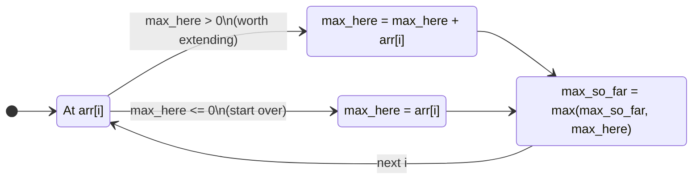

---
title: Kadane's Algorithm
aliases: [maximum subarray, Kadane, max subarray sum, kadanes]
tags: [DSA, arrays, dynamic-programming, kadane]
domain: DSA
difficulty: Intermediate
created: 2026-07-26
related: [Dynamic_Programming_Fundamentals, Prefix_Sum, Two_Pointers]
status: complete
---

# 📈 Kadane's Algorithm

> [!abstract] TL;DR
> Kadane's algorithm finds the **maximum sum contiguous subarray** in O(n) time and O(1) space. At each position, decide: extend the current subarray or start a new one from here. Track the running max and the global max separately.

## Intuition

Imagine you're a **street food vendor** tracking your best consecutive run of profitable days.

Each morning you check: "Is my total revenue from this current streak still positive?" If yes, keep going — today's sales are adding to a winning streak. If the streak has gone negative, **start fresh today** — carrying that dead weight only hurts.

The key decision at each element `arr[i]`:
- **Extend**: `max_here + arr[i]` — continue the current subarray
- **Start fresh**: `arr[i]` — begin a new subarray from here

Take whichever is larger. A fresh start makes sense exactly when `max_here` is negative (i.e., previous history is net harmful).

## How It Works

### State Machine



### Recurrence
```
dp[i] = max(arr[i], dp[i-1] + arr[i])
      = arr[i] + max(0, dp[i-1])

answer = max(dp[0], dp[1], ..., dp[n-1])
```

`dp[i]` = maximum subarray sum **ending at index i**.

Since `dp[i]` depends only on `dp[i-1]`, we don't need an array — just one variable `max_here`.

### Why It Works (Correctness Intuition)
At each index `i`, the maximum subarray ending at `i` is either:
1. Just `arr[i]` alone (if the best-ending-at-i-1 subarray was negative, it drags us down)
2. The best subarray ending at `i-1` extended by `arr[i]`

We never need to consider subarrays ending before `i-1` because those are captured by what we already computed for `dp[i-1]`.

## Complexity Analysis

| Variant | Time | Space | Notes |
|---------|------|-------|-------|
| Basic Kadane | O(n) | O(1) | Single pass |
| With index tracking | O(n) | O(1) | Track start/end of best window |
| Maximum product subarray | O(n) | O(1) | Track max AND min (negatives flip sign) |
| Circular subarray max | O(n) | O(1) | max(Kadane, total_sum - Kadane_on_inverted) |
| Brute force (for comparison) | O(n²) | O(1) | Try all O(n²) subarrays |
| DP with array | O(n) | O(n) | Store all dp[i]; equivalent but unnecessary |

## Implementation

```python
from typing import List, Tuple

# ── 1. Basic Kadane's Algorithm (LeetCode 53) ─────────────────────────────────
def max_subarray(nums: List[int]) -> int:
    """
    Find the maximum sum of any contiguous subarray.
    Time: O(n)  Space: O(1)
    Handles all-negative arrays correctly (answer = max single element).
    """
    max_here = nums[0]     # max sum of subarray ending at current index
    max_so_far = nums[0]   # global maximum seen so far

    for i in range(1, len(nums)):
        # Extend or start fresh
        max_here = max(nums[i], max_here + nums[i])
        max_so_far = max(max_so_far, max_here)

    return max_so_far


# ── 2. Kadane with Index Tracking ────────────────────────────────────────────
def max_subarray_with_indices(nums: List[int]) -> Tuple[int, int, int]:
    """
    Returns (max_sum, start_index, end_index) of the best subarray.
    Time: O(n)  Space: O(1)
    """
    max_here = nums[0]
    max_so_far = nums[0]
    start = end = 0
    temp_start = 0         # candidate start for current window

    for i in range(1, len(nums)):
        if nums[i] > max_here + nums[i]:
            # Starting fresh: new candidate start
            max_here = nums[i]
            temp_start = i
        else:
            max_here = max_here + nums[i]

        if max_here > max_so_far:
            max_so_far = max_here
            start = temp_start
            end = i

    return max_so_far, start, end


# ── 3. Maximum Product Subarray (LeetCode 152) ────────────────────────────────
def max_product(nums: List[int]) -> int:
    """
    Kadane's adapted for products: track both max and min at each step.
    Negative * negative = positive, so a big negative can flip to a big positive.
    Time: O(n)  Space: O(1)
    """
    max_prod = min_prod = result = nums[0]

    for num in nums[1:]:
        candidates = (num, max_prod * num, min_prod * num)
        max_prod = max(candidates)
        min_prod = min(candidates)
        result = max(result, max_prod)

    return result


# ── 4. Maximum Sum Circular Subarray (LeetCode 918) ──────────────────────────
def max_subarray_circular(nums: List[int]) -> int:
    """
    The maximum subarray can either:
    - NOT wrap around: answer = standard Kadane's on nums
    - Wrap around:    answer = total_sum - (minimum subarray sum)
                      because wrapping = keeping everything except the minimum middle.
    Take the max of both cases.
    Edge case: if all elements are negative, Kadane gives the least negative,
    but the circular formula gives 0 (total - total). So only use circular
    case when it's > 0.
    Time: O(n)  Space: O(1)
    """
    total_sum = sum(nums)

    # Case 1: Standard Kadane
    max_here = max_kadane = nums[0]
    for num in nums[1:]:
        max_here = max(num, max_here + num)
        max_kadane = max(max_kadane, max_here)

    # Case 2: Circular — minimize the middle subarray
    min_here = min_kadane = nums[0]
    for num in nums[1:]:
        min_here = min(num, min_here + num)
        min_kadane = min(min_kadane, min_here)

    max_circular = total_sum - min_kadane

    # If all elements negative, max_circular would be 0 (wrong)
    if max_circular == 0:
        return max_kadane

    return max(max_kadane, max_circular)


# ── Demo ──────────────────────────────────────────────────────────────────────
if __name__ == "__main__":
    nums = [-2, 1, -3, 4, -1, 2, 1, -5, 4]
    print(max_subarray(nums))                    # 6  (subarray [4,-1,2,1])
    print(max_subarray_with_indices(nums))       # (6, 3, 6)
    print(max_product([2, 3, -2, 4]))            # 6
    print(max_product([-2, 0, -1]))              # 0
    print(max_subarray_circular([1, -2, 3, -2])) # 3
    print(max_subarray_circular([5, -3, 5]))      # 10 (circular: 5+5)
```

## Dry Run / Example Trace

**`max_subarray([-2, 1, -3, 4, -1, 2, 1, -5, 4])` → `6`**

| i | arr[i] | max_here (before) | Decision | max_here (after) | max_so_far |
|---|--------|------------------|----------|-----------------|-----------|
| 0 | -2 | — | init | -2 | -2 |
| 1 | 1 | -2 | max(1, -2+1=-1) → fresh | 1 | 1 |
| 2 | -3 | 1 | max(-3, 1-3=-2) → extend | -2 | 1 |
| 3 | 4 | -2 | max(4, -2+4=2) → fresh | 4 | 4 |
| 4 | -1 | 4 | max(-1, 4-1=3) → extend | 3 | 4 |
| 5 | 2 | 3 | max(2, 3+2=5) → extend | 5 | 5 |
| 6 | 1 | 5 | max(1, 5+1=6) → extend | 6 | **6** |
| 7 | -5 | 6 | max(-5, 6-5=1) → extend | 1 | 6 |
| 8 | 4 | 1 | max(4, 1+4=5) → extend | 5 | 6 |

Answer: **6** from subarray `[4, -1, 2, 1]` (indices 3–6).

**Why did we not start fresh at index 3?** Because `max(-2+4, 4) = 4 = 4` — both give 4, so either choice is equivalent. The "start fresh" condition triggers when arr[i] > max_here + arr[i], i.e., max_here < 0.

## Patterns & LeetCode Applications

| Problem | Variant | Key Modification | LeetCode |
|---------|---------|-----------------|---------|
| Maximum Subarray | Basic Kadane | None | 53 |
| Maximum Product Subarray | Product Kadane | Track min AND max | 152 |
| Maximum Sum Circular Subarray | Circular | total - min_subarray | 918 |
| Best Time to Buy and Sell Stock | Kadane on differences | arr[i] = price[i]-price[i-1] | 121 |
| Maximum Subarray Sum After K Concatenations | Circular + growth | Kadane on doubled array | 1191 |

**Stock problem connection**: `max_profit = max_subarray(daily_diffs)` where `daily_diffs[i] = prices[i] - prices[i-1]`. Kadane on the difference array = Kadane for stocks.

## Common Pitfalls

1. **Initializing `max_here = max_so_far = 0`** — this fails for all-negative arrays (e.g., `[-5, -1, -3]` would return 0, not -1). Always initialize to `nums[0]` and start the loop at index 1.
2. **Confusing `max_here` and `max_so_far`** — `max_here` resets when starting fresh; `max_so_far` never decreases. Updating only `max_here` and returning it misses the global best.
3. **Maximum product: forgetting to track minimum** — a negative minimum multiplied by a negative current element can become the maximum. Tracking only the max-so-far misses this.
4. **Circular variant: edge case of all-negative** — `total_sum - min_kadane = 0` when all elements are negative. Must fall back to `max_kadane` in this case.
5. **Using Kadane when the subarray must be non-empty but forgetting the constraint** — Kadane as written always returns at least one element, but variants that allow empty subarrays (some DP problems) need adjustment.

## Related Concepts

- [[_MOC_Arrays|↑ Section MOC]]
- [[Dynamic_Programming_Fundamentals]] — Kadane is the canonical 1D DP optimization
- [[Prefix_Sum]] — alternative framing: max_subarray = max over all (i,j) of prefix[j] - prefix[i]
- [[Two_Pointers]] — for non-negative arrays, sliding window achieves the same result
- [[Divide_and_Conquer]] — O(n log n) alternative proof of maximum subarray via merge

## Review Questions (3)

1. **Kadane's runs in O(n) while a brute force checking all subarrays is O(n²). What mathematical property of the optimal subarray allows us to discard all sub-optimal suffixes at each step?**
2. **Adapt Kadane's for the "maximum product subarray" problem. Why must you track both the maximum and minimum product ending at each index, and not just the maximum?**
3. **The circular subarray problem uses `total_sum - min_kadane`. Prove that this equals the maximum sum of a "wrapped" subarray (one that uses a suffix of the array concatenated with a prefix).**

## Sources

- [Original Kadane paper — Aho, Hopcroft, Ullman 1974 (via Bentley's "Programming Pearls")](https://dl.acm.org/doi/10.1145/358234.358279)
- Cormen et al. — *CLRS*, Section 4.1 (maximum-subarray problem)
- [LeetCode 53 — Maximum Subarray](https://leetcode.com/problems/maximum-subarray/)

#kadane #maximum-subarray #dynamic-programming #arrays #O-n
