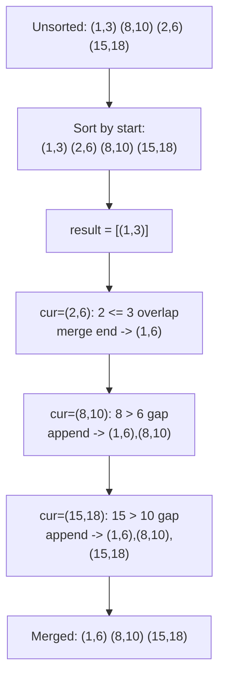
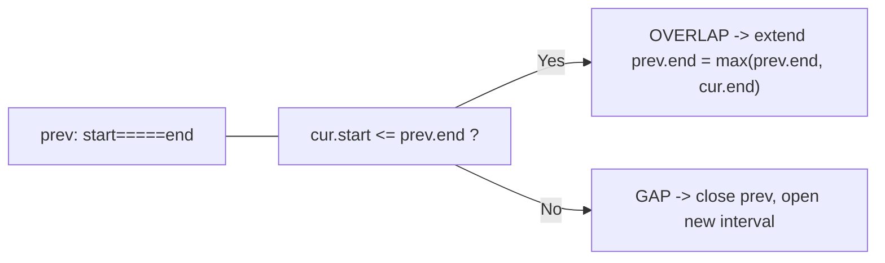

# 📊 Merge Intervals

> [!abstract] TL;DR
> The Merge Intervals pattern handles problems about **ranges that may overlap** — calendar events, booked rooms, numeric spans. The universal first move is **sort intervals by start time**. Once sorted, overlaps are always *adjacent*, so a single linear pass can merge them: if the current interval starts at or before the previous interval's end (`cur.start <= prev.end`), they overlap and you extend the previous end to `max(prev.end, cur.end)`; otherwise you close the previous interval and open a new one. This `O(n log n)` sort + `O(n)` sweep unlocks a whole family: merging, inserting, intersecting, counting non-overlaps, and the min-heap "meeting rooms" variant.

---

## Intuition — Analogy First

Think of a **highlighter passing over a calendar**. You have a stack of meeting invites, each a start–end block. You shuffle them into **chronological order by start time** and lay them left to right. Now you drag a highlighter across the timeline: as long as the next meeting begins *before or exactly when your current highlighted block ends*, the highlighter keeps going without lifting — the blocks are one continuous busy stretch. The moment a meeting starts *after* a gap, you lift the pen, record the busy stretch you just painted, and start a fresh one.

That "sort, then sweep left to right, only lifting the pen on a gap" motion is the entire pattern. The one non-obvious guarantee sorting buys you: **after sorting by start, any interval that overlaps a given one must be adjacent to it in the sorted order** — so you never have to look backward more than one step.

---

## How It Works + Mermaid

**Merge (the base case):**
1. Sort intervals by `start`.
2. Initialize `result` with the first interval.
3. For each subsequent interval `cur`:
   - If `cur.start <= result[-1].end` → **overlap** → `result[-1].end = max(result[-1].end, cur.end)`.
   - Else → **disjoint** → append `cur` as a new block.



**The overlap test, visualized on a number line:**



**Meeting Rooms II** flips the question from "merge" to "what is the peak concurrency?" — solved with a **min-heap of end times**: for each interval (sorted by start), if the earliest-ending room is free (`heap[0] <= cur.start`) reuse it, else allocate a new room. The heap size's maximum is the answer.

---

## When to Recognize This Pattern (signal keywords)

- The words **"intervals," "ranges," "spans," "[start, end]"** appear in the input.
- **"Overlapping"**, "merge," "combine," "consolidate" ranges.
- **"Meeting rooms," "conference," "calendar," "bookings," "schedule"** — classic disguise.
- "Minimum number of **rooms / platforms / machines / CPUs**" to handle concurrent tasks → min-heap variant.
- "**Insert** a new interval and re-merge."
- "**Intersection** of two interval lists."
- "Minimum intervals to **remove** so the rest don't overlap" → greedy sort by *end*.
- Anytime you catch yourself wanting to compare every pair of ranges (O(n²)) — sorting collapses it to O(n log n).

---

## Python Implementation / Template

```python
from typing import List
import heapq

# ── 1. Merge Intervals (LeetCode 56) ──────────────────────────────────────────
def merge(intervals: List[List[int]]) -> List[List[int]]:
    """
    Merge all overlapping intervals.
    Time: O(n log n) for the sort  Space: O(n) for output
    """
    intervals.sort(key=lambda iv: iv[0])          # sort by start
    result = [intervals[0]]
    for start, end in intervals[1:]:
        if start <= result[-1][1]:                # overlap with last merged block
            result[-1][1] = max(result[-1][1], end)
        else:
            result.append([start, end])           # disjoint -> new block
    return result


# ── 2. Insert Interval (LeetCode 57) — input already sorted, no overlaps ──────
def insert(intervals: List[List[int]], new: List[int]) -> List[List[int]]:
    """Insert `new` and merge. Time: O(n)  Space: O(n)."""
    result, i, n = [], 0, len(intervals)
    # 2a. Add all intervals ending before `new` starts (strictly left, no overlap)
    while i < n and intervals[i][1] < new[0]:
        result.append(intervals[i]); i += 1
    # 2b. Merge everything overlapping `new`
    while i < n and intervals[i][0] <= new[1]:
        new[0] = min(new[0], intervals[i][0])
        new[1] = max(new[1], intervals[i][1])
        i += 1
    result.append(new)
    # 2c. Add the rest (strictly right)
    while i < n:
        result.append(intervals[i]); i += 1
    return result


# ── 3. Meeting Rooms II (LeetCode 253) — min heap of end times ────────────────
def min_meeting_rooms(intervals: List[List[int]]) -> int:
    """
    Minimum rooms so no two meetings collide in one room.
    Time: O(n log n)  Space: O(n)
    """
    if not intervals:
        return 0
    intervals.sort(key=lambda iv: iv[0])          # by start time
    end_heap = []                                 # min-heap of end times
    for start, end in intervals:
        if end_heap and end_heap[0] <= start:     # earliest room already freed
            heapq.heapreplace(end_heap, end)      # reuse it (pop min, push new end)
        else:
            heapq.heappush(end_heap, end)         # need a new room
    return len(end_heap)                          # peak concurrency


# ── 4. Non-overlapping Intervals (LeetCode 435) — greedy by END ───────────────
def erase_overlap_intervals(intervals: List[List[int]]) -> int:
    """
    Min intervals to remove so the rest are non-overlapping.
    Greedy: always keep the interval that ends earliest. Time: O(n log n).
    """
    intervals.sort(key=lambda iv: iv[1])          # sort by END, not start
    removed, prev_end = 0, float('-inf')
    for start, end in intervals:
        if start >= prev_end:                     # no clash -> keep it
            prev_end = end
        else:
            removed += 1                          # clashes -> drop this one
    return removed


# ── 5. Interval List Intersections (LeetCode 986) — two pointers ──────────────
def interval_intersection(A: List[List[int]], B: List[List[int]]) -> List[List[int]]:
    """Both lists sorted & internally disjoint. Time: O(m + n)."""
    i = j = 0
    result = []
    while i < len(A) and j < len(B):
        lo = max(A[i][0], B[j][0])                # overlap start
        hi = min(A[i][1], B[j][1])                # overlap end
        if lo <= hi:
            result.append([lo, hi])               # non-empty intersection
        # advance whichever interval ends first
        if A[i][1] < B[j][1]:
            i += 1
        else:
            j += 1
    return result
```

---

## Dry Run / Trace

**`min_meeting_rooms([[0,30],[5,10],[15,20]])` → `2`**

Sorted by start: `[[0,30],[5,10],[15,20]]`

| Meeting | heap[0] (earliest end) | Test `heap[0] <= start` | Action | Heap after |
|---------|------------------------|--------------------------|--------|------------|
| [0,30] | (empty) | — | push 30 | [30] |
| [5,10] | 30 | 30 <= 5? No | push 10 (new room) | [10, 30] |
| [15,20] | 10 | 10 <= 15? Yes | heapreplace → reuse room, push 20 | [20, 30] |

Peak heap size reached = **2 rooms**. The [5,10] meeting forced a second room; [15,20] reused the freed one.

---

## Patterns & LeetCode Applications

| Variant | Sort Key | Core Trick | LeetCode |
|---------|----------|-----------|----------|
| Merge overlapping | start | extend `prev.end = max(...)` on overlap | 56 |
| Insert interval | (pre-sorted) | 3 phases: left / merge / right | 57 |
| Meeting Rooms (can attend all?) | start | any `cur.start < prev.end` → false | 252 |
| Meeting Rooms II (min rooms) | start | min-heap of end times = concurrency | 253 |
| Non-overlapping (min removals) | **end** | greedy keep earliest-ending | 435 |
| Interval intersections | (pre-sorted) | two pointers, `max(lo)`..`min(hi)` | 986 |
| Employee Free Time | start | merge all, report gaps | 759 |
| Car Pooling / Meeting attendance | — | difference array / sweep line | 1094 |

---

## Common Pitfalls

1. **Forgetting to sort first.** Every result here relies on overlaps being adjacent. On unsorted input the linear sweep silently produces wrong merges.
2. **Sorting by the wrong key.** Merge/rooms sort by **start**; "minimum removals to make non-overlapping" (435) sorts by **end** (the classic greedy interval-scheduling proof). Using start for 435 gives suboptimal removals.
3. **`<` vs `<=` at the boundary.** Decide whether touching endpoints (e.g., `[1,2]` and `[2,3]`) count as overlapping. For merging they usually do (`start <= prev.end`); for "can attend all meetings" a meeting ending exactly when another starts usually does **not** conflict. State your assumption.
4. **Mutating the previous interval in place vs appending copies.** When you `max` the end, be sure you're updating the interval already in `result`, not a stale local copy.
5. **Meeting Rooms II with the wrong heap.** The heap must hold **end times** and you compare its minimum against the **current start**. A max-heap or heaping start times breaks the "earliest room to free up" logic.
6. **Empty input.** All these should guard `if not intervals: return ...` before indexing `intervals[0]`.
7. **Assuming intervals are inclusive vs exclusive without checking.** `[start, end)` half-open ranges change the overlap comparison; confirm from the problem statement.

---

## Related Concepts

- [[_MOC_Arrays|↑ Section MOC]]
- [[Sorting_Overview]] — the O(n log n) sort that makes overlaps adjacent
- [[Greedy_Fundamentals]] — the "keep earliest end" removal variant is a greedy proof
- [[Priority_Queue]] — powers the Meeting Rooms II min-heap of end times
- [[Two_Pointers]] — used for the two-list interval intersection variant
- [[Prefix_Sum]] — difference-array / sweep-line alternative for concurrency counting

---

## Review Questions (3)

1. Prove that after sorting intervals by start time, any interval overlapping a given interval `X` must appear immediately adjacent to `X`'s merge group — i.e., you never need to look back more than one already-merged block.
2. "Non-overlapping Intervals" (435) is solved greedily by sorting on **end** and keeping the earliest-ending interval. Explain with an exchange argument why sorting on **start** and greedily keeping the earliest-*starting* interval can be suboptimal.
3. Meeting Rooms II runs in O(n log n) with a min-heap. There is an alternative O(n log n) "chronological sweep" using two separately sorted arrays of start and end times. Describe how that two-pointer sweep computes the same peak concurrency without a heap.

---

## Sources

- LeetCode 56 — [Merge Intervals](https://leetcode.com/problems/merge-intervals/)
- LeetCode 57 — [Insert Interval](https://leetcode.com/problems/insert-interval/)
- LeetCode 253 — [Meeting Rooms II](https://leetcode.com/problems/meeting-rooms-ii/)
- LeetCode 435 — [Non-overlapping Intervals](https://leetcode.com/problems/non-overlapping-intervals/)
- LeetCode 986 — [Interval List Intersections](https://leetcode.com/problems/interval-list-intersections/)
- Grokking the Coding Interview — Merge Intervals pattern

#DSA #Patterns #intervals #merge-intervals #sorting #greedy #meeting-rooms
